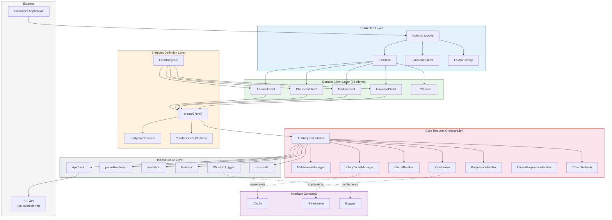
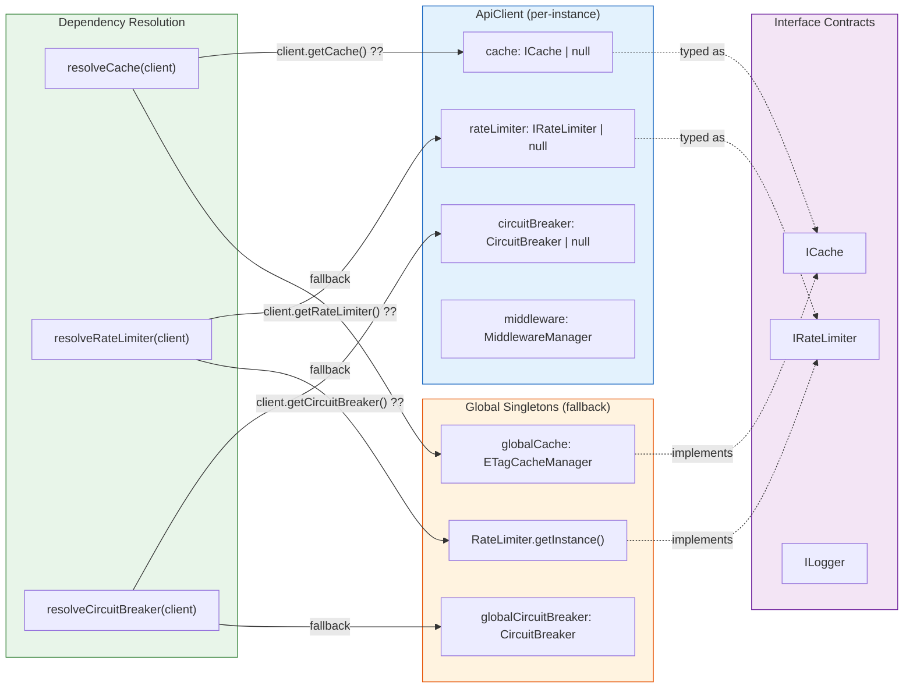
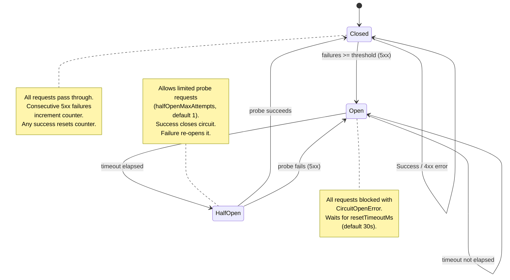
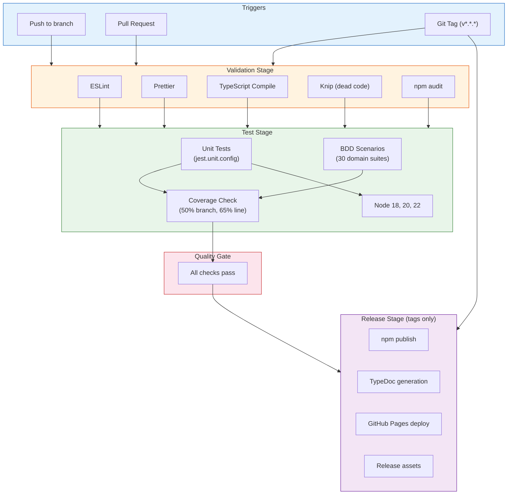
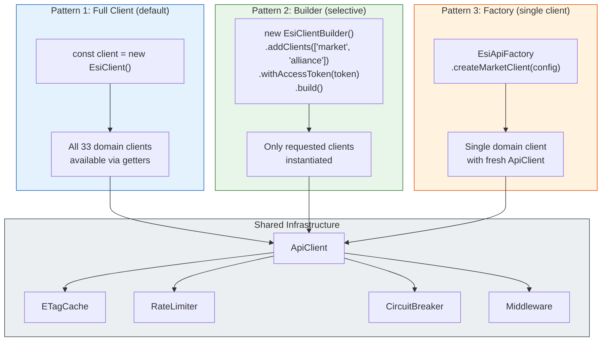
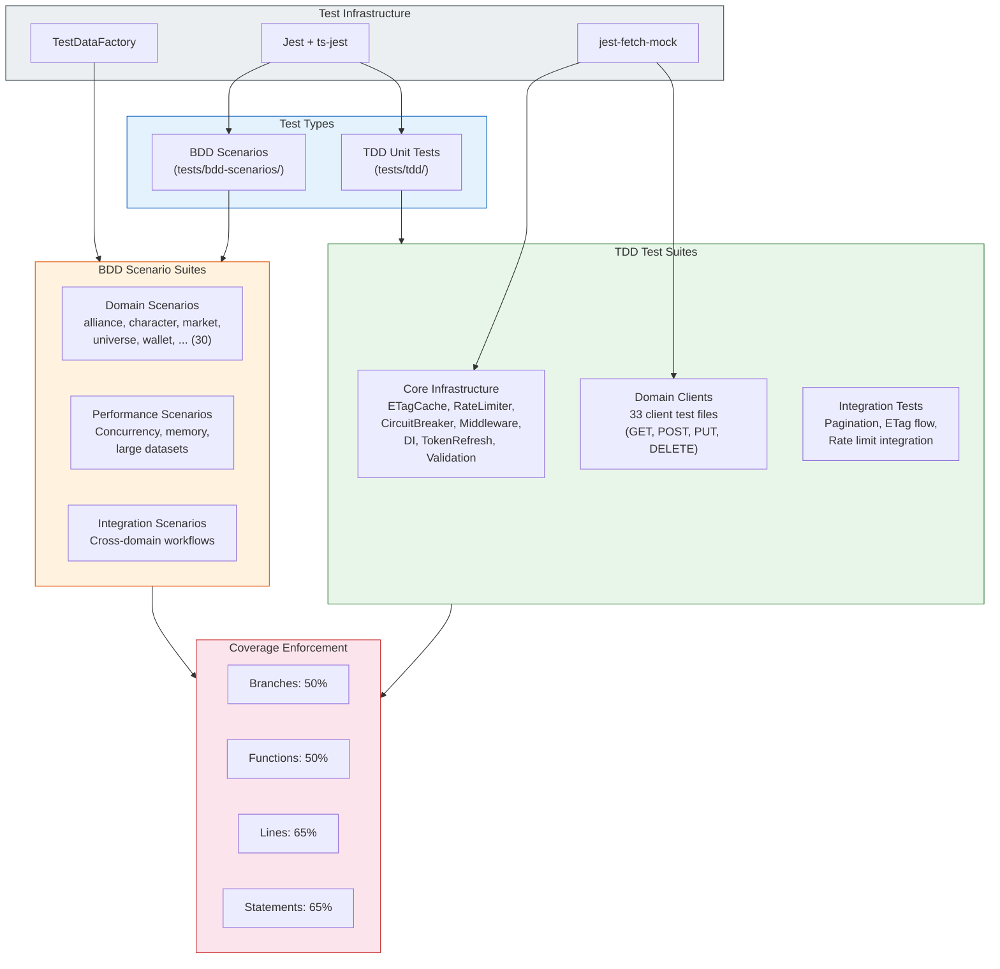
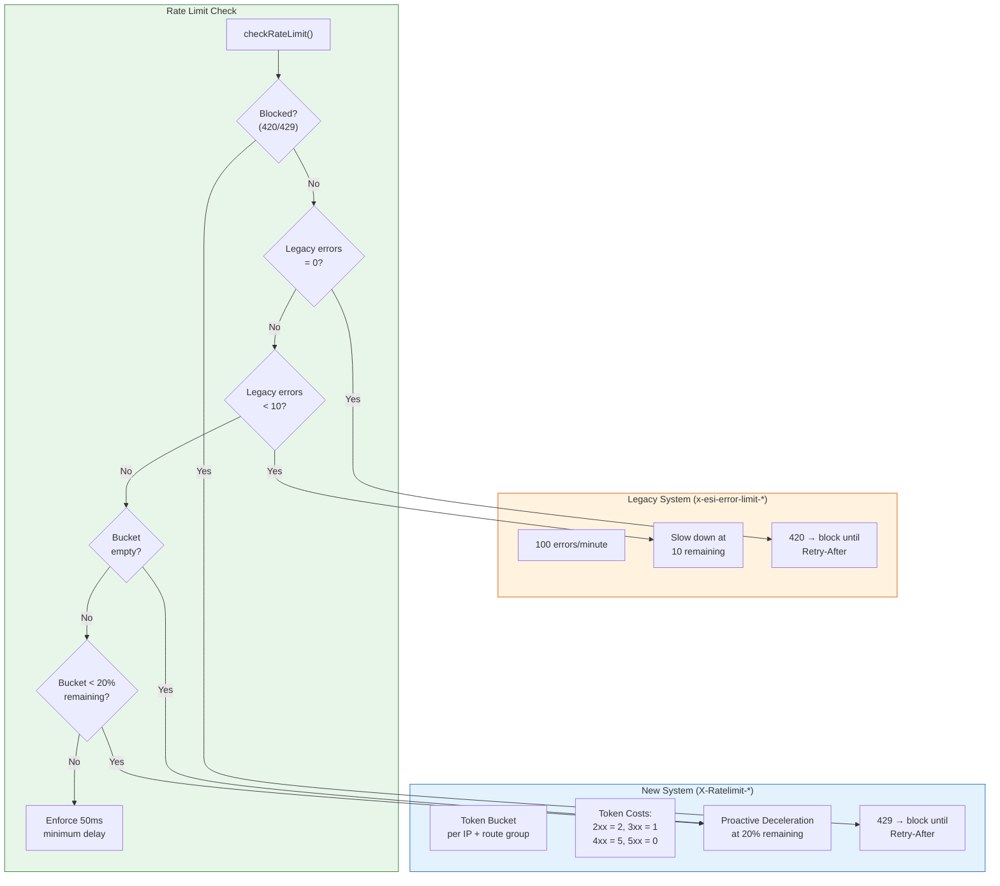

# ESI.ts Architecture

## 1. Clean Architecture Layers

Dependency direction flows inward. Outer layers depend on inner layers, never the reverse.



## 2. Request Lifecycle

Complete flow from consumer call to ESI response.

```mermaid
sequenceDiagram
    participant App as Consumer
    participant Client as EsiClient
    participant Domain as DomainClient
    participant Create as createClient()
    participant Handler as handleRequest()
    participant MW as MiddlewareManager
    participant CB as CircuitBreaker
    participant RL as RateLimiter
    participant Cache as ETagCache
    participant Fetch as fetch()
    participant ESI as ESI API

    App->>Client: client.market.getMarketPrices()
    Client->>Domain: MarketClient.getMarketPrices()
    Domain->>Create: validate params, build path
    Create->>Handler: handleRequest(client, endpoint, method)

    Note over Handler: executeRequest begins

    Handler->>Handler: buildRequestHeaders()
    Handler->>Cache: getETag(url)
    Cache-->>Handler: If-None-Match header

    Handler->>MW: applyRequestInterceptors(context)
    MW-->>Handler: modified headers/url/body

    Handler->>CB: checkCircuit(endpoint)
    alt Circuit Open
        CB-->>Handler: throw CircuitOpenError
    end

    Handler->>RL: checkRateLimit()
    alt Rate Limited
        RL-->>RL: sleep(waitTime)
    end

    Handler->>Fetch: fetch(url, options)
    Fetch->>ESI: HTTP request
    ESI-->>Fetch: HTTP response

    Handler->>Handler: parseHeaders(response)
    Handler->>RL: updateFromResponse(headers, status)

    Handler->>CB: recordSuccess/Failure(endpoint)

    alt Status 304
        Handler->>Cache: get(url)
        Cache-->>Handler: cached data + headers
    else Status 2xx
        Handler->>Handler: parseJsonBody()
        Handler->>Cache: set(url, etag, data)
        alt Multi-page (x-pages > 1)
            Handler->>Handler: handleOffsetPagination()
        else Cursor pagination
            Handler->>Handler: handleCursorPagination()
        end
    else Status 401 + TokenProvider
        Handler->>Handler: refreshToken()
        Handler->>Handler: retry executeRequest
    else Status 5xx + Cache
        Handler->>Cache: get(url) stale
        Cache-->>Handler: stale cached data
    else Status 4xx/5xx
        Handler-->>App: throw EsiError
    end

    Handler->>MW: applyResponseInterceptors(context)
    MW-->>Handler: modified body/headers

    Handler-->>App: { headers, body, fromCache?, cursors? }
```

## 3. Dependency Injection

How dependencies are resolved: client-level first, then global fallback.



## 4. Circuit Breaker State Machine



## 5. CI/CD Pipeline



## 6. Client Creation Patterns

Three ways consumers can create clients, from simple to selective.



## 7. Middleware Pipeline

How request and response interceptors are applied.

```mermaid
graph LR
    subgraph Request["Request Phase"]
        R1["Build Headers<br/>(auth, ETag, UA)"]
        R2["Interceptor 1<br/>(e.g., add trace ID)"]
        R3["Interceptor 2<br/>(e.g., add custom auth)"]
        R4["Interceptor N"]
    end

    subgraph Execution["Execution"]
        CB["Circuit Breaker<br/>check"]
        RL["Rate Limiter<br/>check"]
        Fetch["fetch()"]
    end

    subgraph Response["Response Phase"]
        Parse["Parse headers<br/>& body"]
        Cache["Cache response"]
        Paginate["Handle pagination"]
        I1["Interceptor 1<br/>(e.g., log timing)"]
        I2["Interceptor 2<br/>(e.g., transform)"]
        IN["Interceptor N"]
    end

    R1 --> R2 --> R3 --> R4
    R4 --> CB --> RL --> Fetch
    Fetch --> Parse --> Cache --> Paginate
    Paginate --> I1 --> I2 --> IN

    style Request fill:#e3f2fd,stroke:#1565c0
    style Execution fill:#fce4ec,stroke:#c62828
    style Response fill:#e8f5e9,stroke:#2e7d32
```



## 8. Test Architecture



## 9. Rate Limiting Strategy


