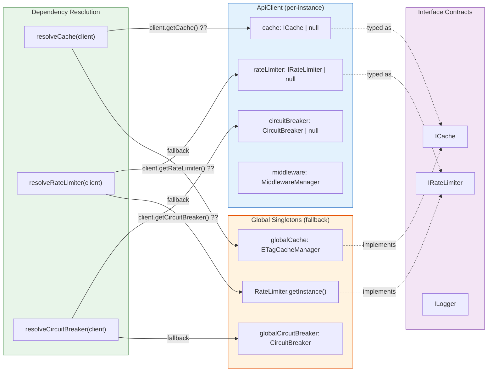
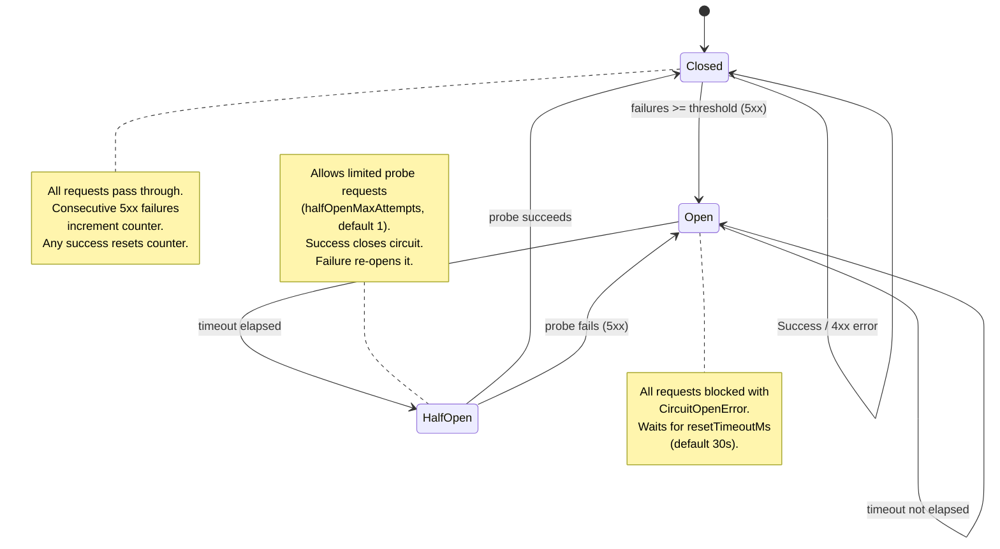
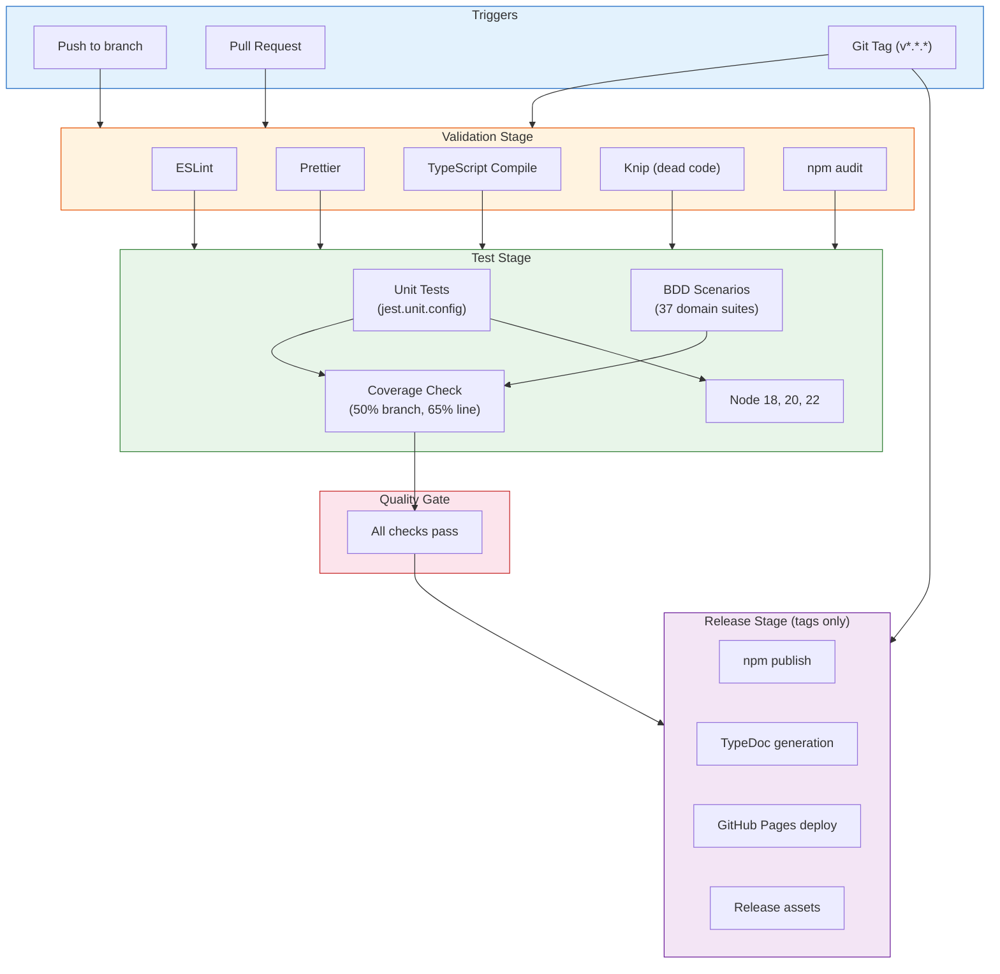
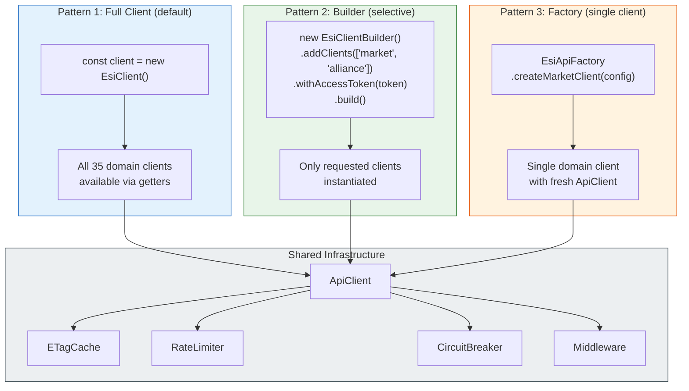
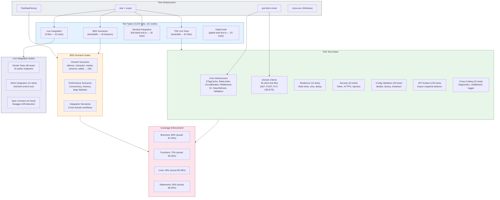
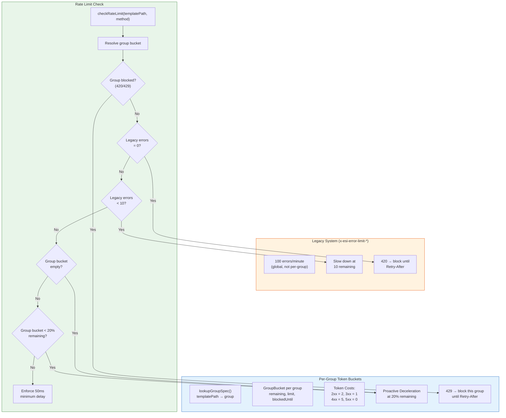
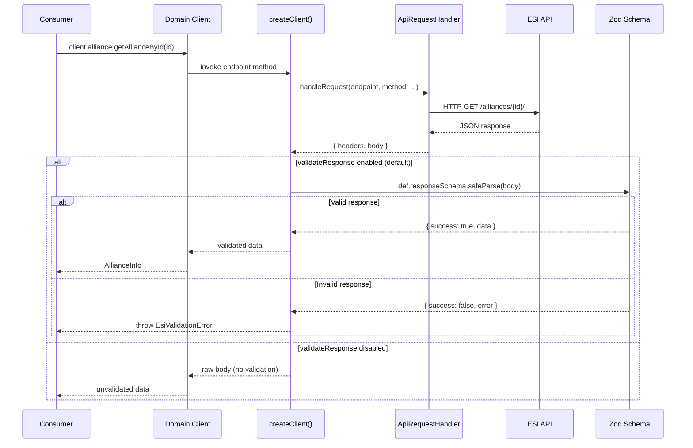

# ESI.ts Architecture

## 1. Clean Architecture Layers

Dependency direction flows inward. Outer layers depend on inner layers, never the reverse.

```mermaid
graph TB
    subgraph External["External"]
        ESI["ESI API<br/>(esi.evetech.net)"]
        Consumer["Consumer Application"]
    end

    subgraph PublicAPI["Public API Layer"]
        EsiClient["EsiClient"]
        EsiClientBuilder["EsiClientBuilder"]
        EsiApiFactory["EsiApiFactory"]
        Index["index.ts exports"]
    end

    subgraph DomainClients["Domain Client Layer (35 domain clients)"]
        Alliance["AllianceClient"]
        Character["CharacterClient"]
        Market["MarketClient"]
        Universe["UniverseClient"]
        More["... 28 more"]
    end

    subgraph EndpointLayer["Endpoint Definition Layer"]
        EndpointDef["EndpointDefinition"]
        EndpointFiles["*Endpoints.ts (35 files)"]
        CreateClient["createClient()"]
        Registry["ClientRegistry"]
    end

    subgraph SchemaLayer["Schema Validation Layer (Zod)"]
        Schemas["src/schemas/ (32 files)"]
        SchemaIndex["schemas/index.ts barrel"]
        SchemaValidation["Runtime Validation"]
    end

    subgraph CoreLayer["Core Request Orchestration"]
        Handler["ApiRequestHandler"]
        SpecTtlCache["Spec-Aware Cache (TTL bypass)"]
        BatchHandler["BatchRequestHandler"]
        Middleware["MiddlewareManager"]
        RateLimiter["RateLimiter"]
        CircuitBreaker["CircuitBreaker"]
        Cache["ETagCacheManager"]
        Pagination["PaginationHandler"]
        CursorPagination["CursorPaginationHandler"]
        TokenRefresh["Token Refresh"]
    end

    subgraph GeneratedLayer["Generated (from ESI Swagger Spec)"]
        GenTypes["esi-spec.generated.ts (147 interfaces)"]
        GenTtls["esi-cache-ttls.generated.ts (119 TTLs)"]
    end

    subgraph Interfaces["Interface Contracts"]
        ICache["ICache"]
        IRateLimiter["IRateLimiter"]
        ILogger["ILogger"]
    end

    subgraph Infrastructure["Infrastructure Layer"]
        ApiClient["ApiClient"]
        HeadersUtil["parseHeaders()"]
        Validation["validation"]
        ErrorUtil["EsiError, EsiValidationError"]
        Logger["Winston Logger"]
        Constants["constants"]
    end

    Consumer --> Index
    Index --> EsiClient
    Index --> EsiClientBuilder
    Index --> EsiApiFactory

    EsiClient --> Alliance
    EsiClient --> Character
    EsiClient --> Market
    EsiClient --> Universe
    EsiClient --> More

    Alliance --> CreateClient
    Character --> CreateClient
    Market --> CreateClient
    Universe --> CreateClient

    CreateClient --> EndpointDef
    CreateClient --> EndpointFiles
    CreateClient --> SchemaValidation
    CreateClient --> Handler

    SchemaValidation --> Schemas
    SchemaIndex --> Schemas
    Schemas -->|"z.infer<> derives"| GenTypes

    Registry --> Alliance
    Registry --> Character
    Registry --> Market
    Registry --> Universe

    Handler --> SpecTtlCache
    SpecTtlCache --> Cache
    SpecTtlCache --> GenTtls
    Handler --> Middleware
    Handler --> RateLimiter
    Handler --> CircuitBreaker
    Handler --> Cache
    Handler --> Pagination
    Handler --> TokenRefresh
    EsiClient --> BatchHandler
    BatchHandler --> Handler

    Cache -.->|implements| ICache
    RateLimiter -.->|implements| IRateLimiter
    Logger -.->|implements| ILogger

    Handler --> ApiClient
    Handler --> HeadersUtil
    Handler --> Validation
    Handler --> ErrorUtil
    Handler --> Constants

    ApiClient --> ESI

    style External fill:#f5f5f5,stroke:#999
    style PublicAPI fill:#e3f2fd,stroke:#1565c0
    style DomainClients fill:#e8f5e9,stroke:#2e7d32
    style EndpointLayer fill:#fff3e0,stroke:#e65100
    style SchemaLayer fill:#e0f7fa,stroke:#00838f
    style CoreLayer fill:#fce4ec,stroke:#c62828
    style Interfaces fill:#f3e5f5,stroke:#6a1b9a
    style Infrastructure fill:#eceff1,stroke:#37474f
    style GeneratedLayer fill:#e8eaf6,stroke:#283593
```



## 2. Request Lifecycle

Complete flow from consumer call to ESI response.

```mermaid
sequenceDiagram
    participant App as Consumer
    participant Client as EsiClient
    participant Domain as DomainClient
    participant Create as createClient()
    participant Handler as handleRequest()
    participant MW as MiddlewareManager
    participant CB as CircuitBreaker
    participant RL as RateLimiter
    participant Cache as ETagCache
    participant Fetch as fetch()
    participant ESI as ESI API

    App->>Client: client.market.getMarketPrices()
    Client->>Domain: MarketClient.getMarketPrices()
    Domain->>Create: validate params, build path
    Create->>Handler: handleRequest(client, endpoint, method, templatePath)

    Note over Handler: Spec-aware cache check (before any HTTP)
    Handler->>Cache: trySpecAwareCacheHit(url, method, templatePath)
    alt Within spec TTL
        Cache-->>Handler: cached data (zero HTTP calls)
        Handler-->>App: { body, fromCache: true }
    end

    Note over Handler: Retry loop (if retryConfig set)

    Note over Handler: executeRequest begins

    Handler->>Handler: buildRequestHeaders()
    Handler->>Cache: getETag(url)
    Cache-->>Handler: If-None-Match header

    Handler->>MW: applyRequestInterceptors(context)
    MW-->>Handler: modified headers/url/body

    Handler->>CB: checkCircuit(endpoint)
    alt Circuit Open
        CB-->>Handler: throw CircuitOpenError
    end

    Handler->>RL: checkRateLimit()
    alt Rate Limited
        RL-->>RL: sleep(waitTime)
    end

    Handler->>Fetch: fetch(url, options)
    Fetch->>ESI: HTTP request
    ESI-->>Fetch: HTTP response

    Handler->>Handler: parseHeaders(response)
    Handler->>RL: updateFromResponse(headers, status)

    Handler->>CB: recordSuccess/Failure(endpoint)

    alt Status 304
        Handler->>Cache: get(url)
        Cache-->>Handler: cached data + headers
    else Status 2xx
        Handler->>Handler: parseJsonBody()
        Handler->>Cache: set(url, etag, data)
        alt Multi-page (x-pages > 1)
            Handler->>Handler: handleOffsetPagination()
        else Cursor pagination
            Handler->>Handler: handleCursorPagination()
        end
    else Status 401 + TokenProvider
        Handler->>Handler: refreshToken()
        Handler->>Handler: retry executeRequest
    else Status 5xx + Cache
        Handler->>Cache: get(url) stale
        Cache-->>Handler: stale cached data
    else Status 4xx/5xx
        Handler-->>App: throw EsiError
    end

    alt Retryable error (5xx/timeout/429) + retries remaining
        Handler->>Handler: retryDelay(attempt, baseMs, maxMs)
        Handler->>Handler: sleep(delay with jitter)
        Handler->>Handler: retry executeRequest
    end

    Handler->>MW: applyResponseInterceptors(context)
    MW-->>Handler: modified body/headers

    Handler-->>App: { headers, body, fromCache?, cursors? }
```

## 3. Dependency Injection

How dependencies are resolved: client-level first, then global fallback.



## 4. Circuit Breaker State Machine



## 5. CI/CD Pipeline



## 6. Client Creation Patterns

Three ways consumers can create clients, from simple to selective.



## 7. Middleware Pipeline

How request and response interceptors are applied.

```mermaid
graph LR
    subgraph Request["Request Phase"]
        R1["Build Headers<br/>(auth, ETag, UA)"]
        R2["Interceptor 1<br/>(e.g., add trace ID)"]
        R3["Interceptor 2<br/>(e.g., add custom auth)"]
        R4["Interceptor N"]
    end

    subgraph Execution["Execution"]
        CB["Circuit Breaker<br/>check"]
        RL["Rate Limiter<br/>check"]
        Fetch["fetch()"]
    end

    subgraph Response["Response Phase"]
        Parse["Parse headers<br/>& body"]
        Cache["Cache response"]
        Paginate["Handle pagination"]
        I1["Interceptor 1<br/>(e.g., log timing)"]
        I2["Interceptor 2<br/>(e.g., transform)"]
        IN["Interceptor N"]
    end

    R1 --> R2 --> R3 --> R4
    R4 --> CB --> RL --> Fetch
    Fetch --> Parse --> Cache --> Paginate
    Paginate --> I1 --> I2 --> IN

    style Request fill:#e3f2fd,stroke:#1565c0
    style Execution fill:#fce4ec,stroke:#c62828
    style Response fill:#e8f5e9,stroke:#2e7d32
```



## 8. Test Architecture

3,224 tests across 121 suites in 7 tiers. Coverage: 96.35% statements, 87.40% branches, 93.20% functions, 96.38% lines.



## 9. Rate Limiting Strategy

ESI enforces 36 independent rate limit groups (e.g., `market-order: 12000 tokens/15m`, `char-notification: 15 tokens/15m`). The rate limiter maintains a separate token bucket per group, extracted from the ESI OpenAPI meta spec at build time (`esi-rate-limit-groups.generated.ts`).

**Per-group bucketing**: Each endpoint maps to a rate limit group via the generated spec. When `checkRateLimit(templatePath, method)` is called, the limiter resolves the group and checks/decelerates only that group's bucket. A 429 on one group blocks only that group.

**Per-user bucketing** (opt-in): When `userKeyExtractor` is configured, each user key gets its own set of group buckets, preventing one user's rate limit exhaustion from affecting others in multi-character apps.

**Server sync**: Response headers (`x-ratelimit-remaining`, `x-ratelimit-group`) are authoritative — they override spec-derived initial values.



## 10. Response Validation Pipeline

Runtime response validation is powered by Zod schemas in `src/schemas/`. Validation is enabled by default and runs inside `createClient()` after the HTTP response is received but before the data is returned to the domain client.



**Key design points:**

- **Validation location**: Validation happens in `createClient()` (in `src/core/endpoints/createClient.ts`), after the HTTP response from `ApiRequestHandler`, before returning data to the domain client. This keeps validation centralized rather than scattered across 35 domain clients.
- **Loose object mode**: All Zod schemas use `z.looseObject()` so extra fields returned by ESI that are not yet in the schema are preserved in the output. This prevents breakage when CCP adds new fields to ESI responses.
- **Type derivation**: Types in `src/types/` are derived from schemas via `z.infer<>`, ensuring that compile-time types and runtime validation always agree.
- **Generated spec file**: The generated spec file (`esi-spec.generated.ts` with 147 interfaces) is NOT validated through Zod at runtime. It remains a CI contract-check tool for detecting ESI schema drift, separate from the runtime validation pipeline.
