# ESI.ts Architecture

## C4 Model

### C4 Level 1 — System Context

System context showing ESI.ts in its operating environment.

| Element                  | Description                                                                             |
| ------------------------ | --------------------------------------------------------------------------------------- |
| **Consumer Application** | Node.js or browser app that needs EVE Online data                                       |
| **ESI.ts**               | TypeScript SDK — auth, caching, rate limiting, circuit breaking, pagination, validation |
| **EVE Online ESI API**   | CCP's public REST API at esi.evetech.net (35 domains, OAuth2)                           |
| **EVE SSO**              | OAuth2 authorization server — issues and refreshes access tokens                        |
| **ESI OpenAPI Spec**     | Machine-readable API spec used at build time for code generation                        |

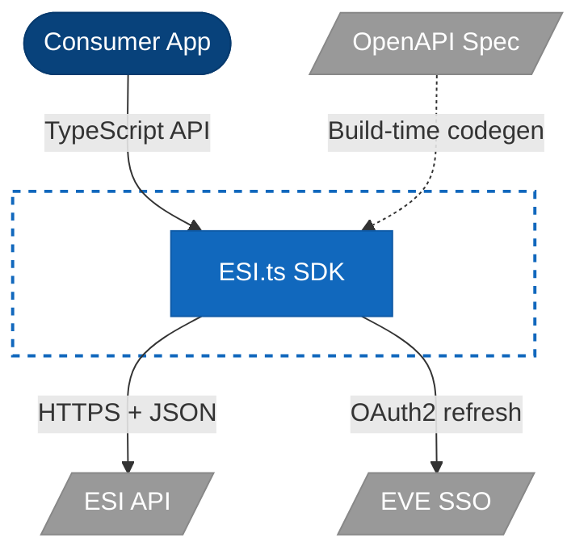
```mermaid
flowchart TB
    consumer(["Consumer App"])

    subgraph boundary [" "]
        esits["ESI.ts SDK"]
    end

    esi[/"ESI API"/]
    sso[/"EVE SSO"/]
    spec[/"OpenAPI Spec"/]

    consumer -- "TypeScript API" --> esits
    esits -- "HTTPS + JSON" --> esi
    esits -- "OAuth2 refresh" --> sso
    spec -. "Build-time codegen" .-> esits

    style consumer fill:#08427b,color:#fff,stroke:#073b6f
    style esits fill:#1168bd,color:#fff,stroke:#0e5aa7
    style esi fill:#999,color:#fff,stroke:#888
    style sso fill:#999,color:#fff,stroke:#888
    style spec fill:#999,color:#fff,stroke:#888
    style boundary fill:none,stroke:#1168bd,stroke-width:2px,stroke-dasharray:5
```

### C4 Level 2 — Container Diagram

Major containers (layers) within ESI.ts and their relationships.

| Container          | Technology                                               | Purpose                                                                               |
| ------------------ | -------------------------------------------------------- | ------------------------------------------------------------------------------------- |
| **Public API**     | EsiClient, EsiClientBuilder, EsiApiFactory               | Three entry points, all wired via `configureApiClient()`                              |
| **Domain Clients** | 35 hand-written clients                                  | AllianceClient, CharacterClient, MarketClient, etc. Typed methods + `stream*` methods |
| **Endpoint Defs**  | EndpointDefinition + `createClient()`                    | Path, method, auth, schemas. Returns typed `InferEndpointResult<D>`                   |
| **Schemas**        | 33 hand-written + 33 generated Zod schemas               | Runtime validation (hand-written) and drift detection (generated, internal-only)      |
| **Pipeline**       | ApiRequestHandler + 7 modules                            | Headers, caching, status handling, fetch, pagination, middleware                      |
| **Resilience**     | CircuitBreaker, RateLimiter, RetryStrategy, Deduplicator | Per-endpoint CB, per-group rate limits, exponential backoff, GET coalescing           |
| **Infrastructure** | ApiClient, pino Logger, error utilities                  | HTTP client, logging, error types                                                     |
| **Generated**      | Types, TTLs, rate limits, scopes                         | Auto-generated from ESI OpenAPI spec, CI-verified freshness                           |

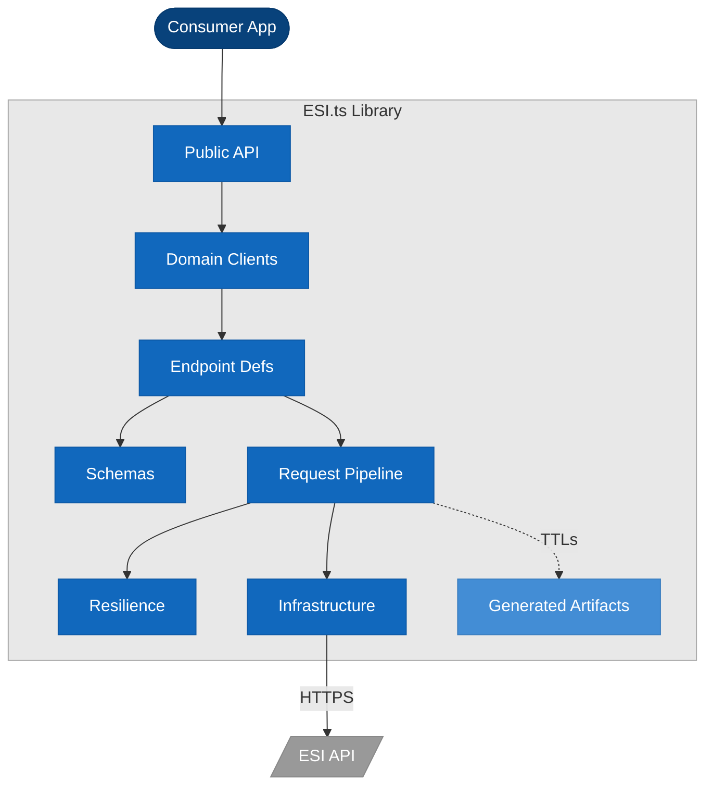
```mermaid
flowchart TB
    consumer(["Consumer App"])

    subgraph esits ["ESI.ts Library"]
        direction TB
        publicApi["Public API"]
        domainClients["Domain Clients"]
        endpointDefs["Endpoint Defs"]
        schemas["Schemas"]
        pipeline["Request Pipeline"]
        resilience["Resilience"]
        infra["Infrastructure"]
        generated["Generated Artifacts"]
    end

    esi[/"ESI API"/]

    consumer --> publicApi
    publicApi --> domainClients
    domainClients --> endpointDefs
    endpointDefs --> schemas
    endpointDefs --> pipeline
    pipeline --> resilience
    pipeline --> infra
    pipeline -. "TTLs" .-> generated
    infra -- "HTTPS" --> esi

    style consumer fill:#08427b,color:#fff,stroke:#073b6f
    style publicApi fill:#1168bd,color:#fff,stroke:#0e5aa7
    style domainClients fill:#1168bd,color:#fff,stroke:#0e5aa7
    style endpointDefs fill:#1168bd,color:#fff,stroke:#0e5aa7
    style schemas fill:#1168bd,color:#fff,stroke:#0e5aa7
    style pipeline fill:#1168bd,color:#fff,stroke:#0e5aa7
    style resilience fill:#1168bd,color:#fff,stroke:#0e5aa7
    style infra fill:#1168bd,color:#fff,stroke:#0e5aa7
    style generated fill:#438dd5,color:#fff,stroke:#3c7fc0
    style esi fill:#999,color:#fff,stroke:#888
    style esits fill:#e8e8e8,stroke:#aaa
```

### C4 Level 3 — Component: Core Request Pipeline

Components within the `src/core/requestPipeline/` module and the coordinator.

| Component                   | File                       | Exports                                                                               |
| --------------------------- | -------------------------- | ------------------------------------------------------------------------------------- |
| **handleRequest**           | ApiRequestHandler.ts       | Spec-cache check, deduplication, retry wrapping, delegates to executeRequest          |
| **handleSinglePageRequest** | ApiRequestHandler.ts       | Per-page fetches with retry (used by AsyncPaginationIterator)                         |
| **executeRequest**          | ApiRequestHandler.ts       | Full fetch-parse-cache-paginate cycle                                                 |
| **dependencies**            | dependencies.ts            | `resolveCache`, `resolveRateLimiter`, `resolveCircuitBreaker`, `resolveRetryStrategy` |
| **headers**                 | headers.ts                 | `buildRequestHeaders`, `parseCacheControlTtl`                                         |
| **cachePolicy**             | cachePolicy.ts             | `lookupSpecTtl`, `trySpecAwareCacheHit`, `cacheResponse`                              |
| **statusHandling**          | statusHandling.ts          | `handleEarlyStatus` (304/201), `handleErrorResponse` (4xx/5xx), `wrapError`           |
| **middlewareBridge**        | middlewareBridge.ts        | `applyRequestMiddleware`, `applyResponseInterceptors`                                 |
| **fetchExecution**          | fetchExecution.ts          | `executeSingleFetch`, `fetchOnePage`, `parseJsonBody`                                 |
| **pagination**              | paginationOrchestration.ts | `handleCursorPagination`, `handleOffsetPagination`                                    |

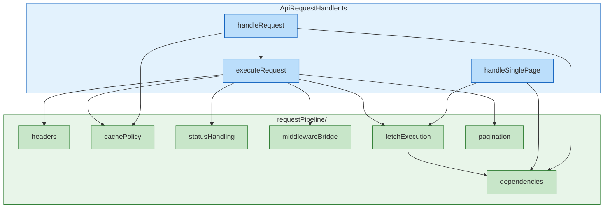
```mermaid
flowchart TB
    subgraph coordinator ["ApiRequestHandler.ts"]
        direction LR
        handleReq["handleRequest"]
        handleSingle["handleSinglePage"]
        execReq["executeRequest"]
    end

    subgraph pipelineMods ["requestPipeline/"]
        deps["dependencies"]
        headers["headers"]
        cache["cachePolicy"]
        status["statusHandling"]
        mwBridge["middlewareBridge"]
        fetchExec["fetchExecution"]
        pagOrch["pagination"]
    end

    handleReq --> cache
    handleReq --> deps
    handleReq --> execReq
    handleSingle --> fetchExec
    handleSingle --> deps
    execReq --> headers
    execReq --> mwBridge
    execReq --> fetchExec
    execReq --> status
    execReq --> cache
    execReq --> pagOrch
    fetchExec --> deps

    style coordinator fill:#e3f2fd,stroke:#1565c0
    style pipelineMods fill:#e8f5e9,stroke:#2e7d32
    style handleReq fill:#bbdefb,stroke:#1565c0
    style handleSingle fill:#bbdefb,stroke:#1565c0
    style execReq fill:#bbdefb,stroke:#1565c0
    style deps fill:#c8e6c9,stroke:#2e7d32
    style headers fill:#c8e6c9,stroke:#2e7d32
    style cache fill:#c8e6c9,stroke:#2e7d32
    style status fill:#c8e6c9,stroke:#2e7d32
    style mwBridge fill:#c8e6c9,stroke:#2e7d32
    style fetchExec fill:#c8e6c9,stroke:#2e7d32
    style pagOrch fill:#c8e6c9,stroke:#2e7d32
```

### C4 Level 3 — Component: Resilience

How the resilience components compose in the request path.

| Component               | Interface         | Purpose                                                                                    |
| ----------------------- | ----------------- | ------------------------------------------------------------------------------------------ |
| **RetryStrategy**       | `IRetryStrategy`  | Exponential backoff + jitter. Retries 5xx, 429, timeouts. 401 token refresh callback.      |
| **CircuitBreaker**      | `ICircuitBreaker` | Per-endpoint state machine (closed/open/half-open). keyStrategy: `resolved` or `template`. |
| **RateLimiter**         | `IRateLimiter`    | 36 per-group token buckets from spec. Per-user opt-in. Decelerate at 20% remaining.        |
| **RequestDeduplicator** | `IDeduplicator`   | In-flight coalescing for identical GET requests.                                           |
| **ETagCacheManager**    | `ICache`          | Spec-aware TTL cache + If-None-Match conditionals. Stale fallback on 5xx.                  |

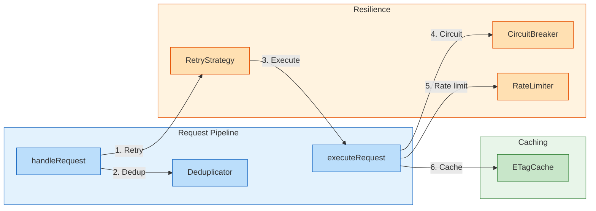
```mermaid
flowchart LR
    subgraph pipeline ["Request Pipeline"]
        handler["handleRequest"]
        dedup["Deduplicator"]
        execReq["executeRequest"]
    end

    subgraph resilienceLayer ["Resilience"]
        retry["RetryStrategy"]
        cb["CircuitBreaker"]
        rl["RateLimiter"]
    end

    subgraph caching ["Caching"]
        etag["ETagCache"]
    end

    handler -- "1. Retry" --> retry
    handler -- "2. Dedup" --> dedup
    retry -- "3. Execute" --> execReq
    execReq -- "4. Circuit" --> cb
    execReq -- "5. Rate limit" --> rl
    execReq -- "6. Cache" --> etag

    style pipeline fill:#e3f2fd,stroke:#1565c0
    style resilienceLayer fill:#fff3e0,stroke:#e65100
    style caching fill:#e8f5e9,stroke:#2e7d32
    style handler fill:#bbdefb,stroke:#1565c0
    style dedup fill:#bbdefb,stroke:#1565c0
    style execReq fill:#bbdefb,stroke:#1565c0
    style retry fill:#ffe0b2,stroke:#e65100
    style cb fill:#ffe0b2,stroke:#e65100
    style rl fill:#ffe0b2,stroke:#e65100
    style etag fill:#c8e6c9,stroke:#2e7d32
```

---

## 1. Clean Architecture Layers

Dependency direction flows inward. Outer layers depend on inner layers, never the reverse.


```mermaid
graph TB
    subgraph External["External"]
        ESI["ESI API<br/>(esi.evetech.net)"]
        Consumer["Consumer Application"]
    end

    subgraph PublicAPI["Public API Layer"]
        EsiClient["EsiClient"]
        EsiClientBuilder["EsiClientBuilder"]
        EsiApiFactory["EsiApiFactory"]
        Index["index.ts exports"]
    end

    subgraph DomainClients["Domain Client Layer (35 domain clients)"]
        Alliance["AllianceClient"]
        Character["CharacterClient"]
        Market["MarketClient"]
        Universe["UniverseClient"]
        More["... 28 more"]
    end

    subgraph EndpointLayer["Endpoint Definition Layer"]
        EndpointDef["EndpointDefinition<br/>(responseSchema + requestSchema)"]
        EndpointFiles["*Endpoints.ts (35 files)"]
        CreateClient["createClient()<br/>→ InferEndpointResult&lt;D&gt;"]
        Registry["ClientRegistry"]
    end

    subgraph SchemaLayer["Schema Validation Layer (Zod)"]
        Schemas["src/schemas/ (33 hand-written)"]
        GenSchemas["src/schemas/generated/<br/>(33 files, internal-only)"]
        SchemaValidation["Runtime Validation"]
    end

    subgraph CoreLayer["Core Request Orchestration"]
        ConfigureClient["configureApiClient()"]
        Pipeline["src/core/requestPipeline/<br/>(7 modules)"]
        Handler["ApiRequestHandler<br/>(~250 line coordinator)"]
        SpecTtlCache["Spec-Aware Cache (TTL bypass)"]
        BatchHandler["BatchRequestHandler"]
        Middleware["MiddlewareManager"]
        RateLimiter["RateLimiter"]
        CircuitBreaker["CircuitBreaker"]
        Cache["ETagCacheManager"]
        Pagination["PaginationHandler"]
        CursorPagination["CursorPaginationHandler"]
        AsyncPaginator["AsyncPaginationIterator"]
        TokenRefresh["Token Refresh"]
    end

    subgraph GeneratedLayer["Generated (from ESI OpenAPI Spec)"]
        GenTypes["esi-spec.generated.ts (161 interfaces)"]
        GenTtls["esi-cache-ttls.generated.ts (126 TTLs)"]
        GenRateLimits["esi-rate-limit-groups.generated.ts"]
        GenScopes["esi-scopes.generated.ts"]
    end

    subgraph Interfaces["Interface Contracts"]
        ICache["ICache"]
        IRateLimiter["IRateLimiter"]
        ICB["ICircuitBreaker"]
        IRetry["IRetryStrategy"]
        IDedup["IDeduplicator"]
        ILogger["ILogger"]
    end

    subgraph Infrastructure["Infrastructure Layer"]
        ApiClient["ApiClient"]
        HeadersUtil["parseHeaders()"]
        Validation["validation"]
        ErrorUtil["EsiError, EsiValidationError"]
        Logger["pino Logger"]
        Constants["constants"]
    end

    Consumer --> Index
    Index --> EsiClient
    Index --> EsiClientBuilder
    Index --> EsiApiFactory

    EsiClient --> Alliance
    EsiClient --> Character
    EsiClient --> Market
    EsiClient --> Universe
    EsiClient --> More

    Alliance --> CreateClient
    Character --> CreateClient
    Market --> CreateClient
    Universe --> CreateClient

    CreateClient --> EndpointDef
    CreateClient --> EndpointFiles
    CreateClient --> SchemaValidation
    CreateClient --> Handler

    SchemaValidation --> Schemas
    GenSchemas -.->|"drift detection only"| Schemas

    Registry --> Alliance
    Registry --> Character
    Registry --> Market
    Registry --> Universe

    EsiClient --> ConfigureClient
    EsiApiFactory --> ConfigureClient
    ConfigureClient --> ApiClient

    Handler --> Pipeline
    Pipeline --> SpecTtlCache
    SpecTtlCache --> Cache
    SpecTtlCache --> GenTtls
    Pipeline --> Middleware
    Pipeline --> RateLimiter
    Pipeline --> CircuitBreaker
    Pipeline --> Cache
    Pipeline --> Pagination
    Pipeline --> TokenRefresh
    EsiClient --> BatchHandler
    BatchHandler --> Handler

    Cache -.->|implements| ICache
    RateLimiter -.->|implements| IRateLimiter
    CircuitBreaker -.->|implements| ICB
    Logger -.->|implements| ILogger

    Handler --> ApiClient
    Handler --> HeadersUtil
    Handler --> Validation
    Handler --> ErrorUtil
    Handler --> Constants

    ApiClient --> ESI

    style External fill:#f5f5f5,stroke:#999
    style PublicAPI fill:#e3f2fd,stroke:#1565c0
    style DomainClients fill:#e8f5e9,stroke:#2e7d32
    style EndpointLayer fill:#fff3e0,stroke:#e65100
    style SchemaLayer fill:#e0f7fa,stroke:#00838f
    style CoreLayer fill:#fce4ec,stroke:#c62828
    style Interfaces fill:#f3e5f5,stroke:#6a1b9a
    style Infrastructure fill:#eceff1,stroke:#37474f
    style GeneratedLayer fill:#e8eaf6,stroke:#283593
```

**Key changes from previous iteration:**

- **Request pipeline decomposed**: `ApiRequestHandler` is now a thin ~250-line coordinator. Seven focused modules in `src/core/requestPipeline/` handle headers, caching, status, pagination, middleware, fetch execution, and dependency resolution.
- **`configureApiClient()`**: Single factory function (`src/core/configureApiClient.ts`) that wires middleware for all three client creation surfaces (EsiClient, CustomEsiClient, EsiApiFactory). Eliminates silent middleware gaps between construction paths.
- **`IRetryStrategy` interface**: Retry logic is now behind `IRetryStrategy`, joinining ICache, IRateLimiter, ICircuitBreaker, and IDeduplicator as swappable strategy contracts.
- **Typed `createClient()` returns**: `InferEndpointResult<D>` uses `z.infer<>` on the endpoint's `responseSchema` to produce typed return values. No more `Promise<unknown>` or `as Promise<X>` casts.
- **Request body validation**: `EndpointDefinition` now supports `requestSchema` (Zod). When `validateRequest` is enabled on the client, request bodies are validated before HTTP calls.
- **Generated schemas internal-only**: `src/schemas/generated/` (33 per-domain files auto-generated from OpenAPI spec) are not exported from the public API. They are used exclusively for schema drift detection (`npm run schema:drift`).

## 2. Request Lifecycle

Every ESI call traverses the same pipeline: validation, caching, resilience, fetch, and response processing. The lifecycle is split into two diagrams for readability — the **happy path** (cache miss → fetch → respond) and the **error/edge-case handling** (304, 401, 5xx, pagination).

**Entry path**: Consumer calls a domain client method (e.g. `client.market.getMarketPrices()`). The domain client validates parameters, builds the URL path, and delegates to `createClient()`. If `validateRequest` is enabled and the endpoint defines a `requestSchema`, the request body is validated via Zod before any HTTP call — invalid bodies throw `EsiValidationError` with `direction: 'request'`.

**Spec-aware cache**: Before touching the network, `handleRequest()` checks the spec-aware cache. If the endpoint has a known TTL from the generated `esi-cache-ttls.generated.ts` and the cached entry is within that TTL, the response is returned immediately with zero HTTP calls. This is the fastest path through the system.

**Retry wrapping**: The entire operation (from `executeRequest()` through the HTTP call) is wrapped in `RetryStrategy.execute()`, which provides exponential backoff with jitter on 5xx, 429, and timeout errors. On 401 errors with a configured token provider, it triggers a token refresh and retries once.

#### Happy Path

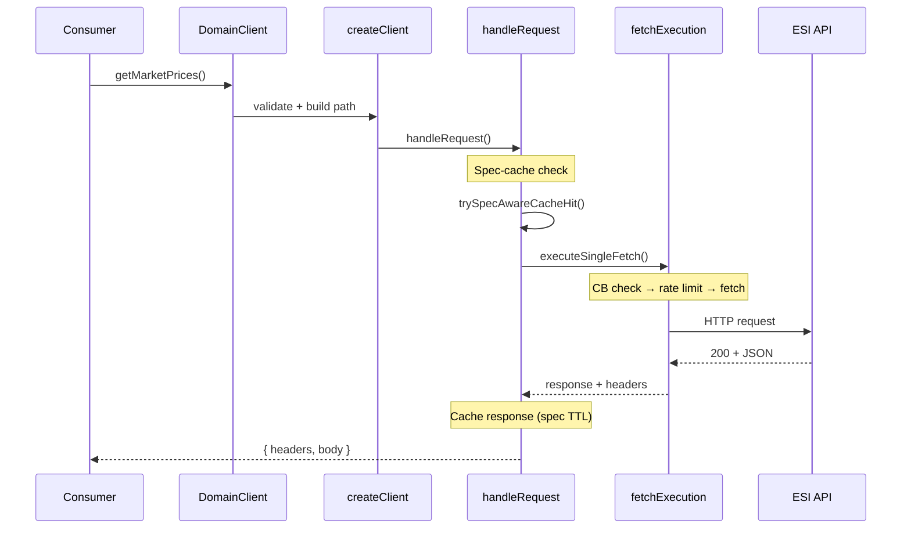
```mermaid
sequenceDiagram
    participant App as Consumer
    participant DC as DomainClient
    participant CC as createClient
    participant HR as handleRequest
    participant FE as fetchExecution
    participant ESI as ESI API

    App->>DC: getMarketPrices()
    DC->>CC: validate + build path
    CC->>HR: handleRequest()
    Note over HR: Spec-cache check
    HR->>HR: trySpecAwareCacheHit()
    HR->>FE: executeSingleFetch()
    Note over FE: CB check → rate limit → fetch
    FE->>ESI: HTTP request
    ESI-->>FE: 200 + JSON
    FE-->>HR: response + headers
    Note over HR: Cache response (spec TTL)
    HR-->>App: { headers, body }
```

#### Error and Edge-Case Handling

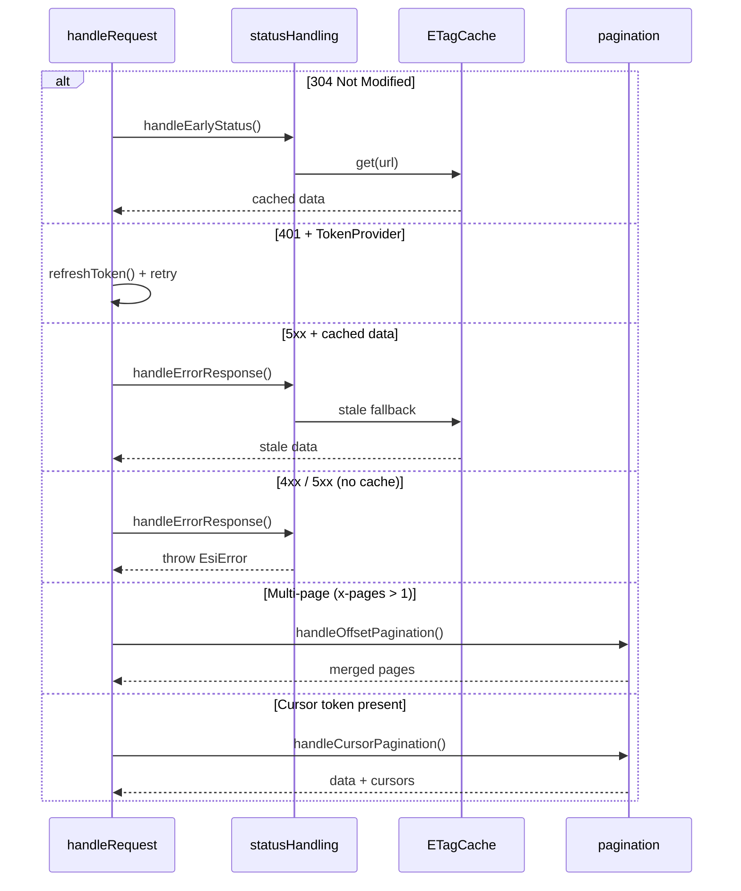
```mermaid
sequenceDiagram
    participant HR as handleRequest
    participant SH as statusHandling
    participant Cache as ETagCache
    participant PO as pagination

    alt 304 Not Modified
        HR->>SH: handleEarlyStatus()
        SH->>Cache: get(url)
        Cache-->>HR: cached data
    else 401 + TokenProvider
        HR->>HR: refreshToken() + retry
    else 5xx + cached data
        HR->>SH: handleErrorResponse()
        SH->>Cache: stale fallback
        Cache-->>HR: stale data
    else 4xx / 5xx (no cache)
        HR->>SH: handleErrorResponse()
        SH-->>HR: throw EsiError
    else Multi-page (x-pages > 1)
        HR->>PO: handleOffsetPagination()
        PO-->>HR: merged pages
    else Cursor token present
        HR->>PO: handleCursorPagination()
        PO-->>HR: data + cursors
    end
```

**Response interceptors**: After the response is assembled (whether from cache, a single fetch, or paginated fetches), `applyResponseInterceptors()` runs any registered response middleware — useful for logging, metrics, or response transformation.

**Circuit breaker keying**: The `fetchExecution` module resolves the circuit breaker key based on `keyStrategy`. With `'resolved'` (default), each unique URL gets its own circuit. With `'template'`, all URLs matching the same endpoint template (e.g. `/characters/{character_id}/assets/`) share a circuit, which is better for detecting systemic ESI failures.

## 3. Dependency Injection

Every resilience feature in ESI.ts is behind an interface contract, making each component independently swappable. Dependencies are scoped to each `ApiClient` instance — there are no global singletons. When a dependency is `null`, that feature is simply disabled for that client (e.g., no circuit breaker means all requests pass through unchecked).

`configureApiClient()` (`src/core/configureApiClient.ts`) is the single wiring point used by all three client creation surfaces (EsiClient, CustomEsiClient, EsiApiFactory). This eliminates a previous class of bugs where different construction paths could silently produce clients with different middleware configurations.

At request time, `requestPipeline/dependencies.ts` resolves each dependency from the `ApiClient` instance. The resolution semantics differ per dependency:

| Dependency        | Resolution                                        | When null                                                  |
| ----------------- | ------------------------------------------------- | ---------------------------------------------------------- |
| `ICache`          | `resolveCache()` → returns or `null`              | No ETag caching, no spec-TTL bypass                        |
| `IRateLimiter`    | `resolveRateLimiter()` → returns or **throws**    | Rate limiter is required — constructor always provides one |
| `ICircuitBreaker` | `resolveCircuitBreaker()` → returns or `null`     | No circuit breaking (opt-in feature)                       |
| `IRetryStrategy`  | `resolveRetryStrategy()` → returns or **default** | Falls back to built-in `RetryStrategy`                     |
| `IDeduplicator`   | Read directly from client                         | No in-flight GET coalescing                                |
| `ILogger`         | pino behind `ILogger`                             | Always present (level controlled by `ESI_LOG_LEVEL`)       |

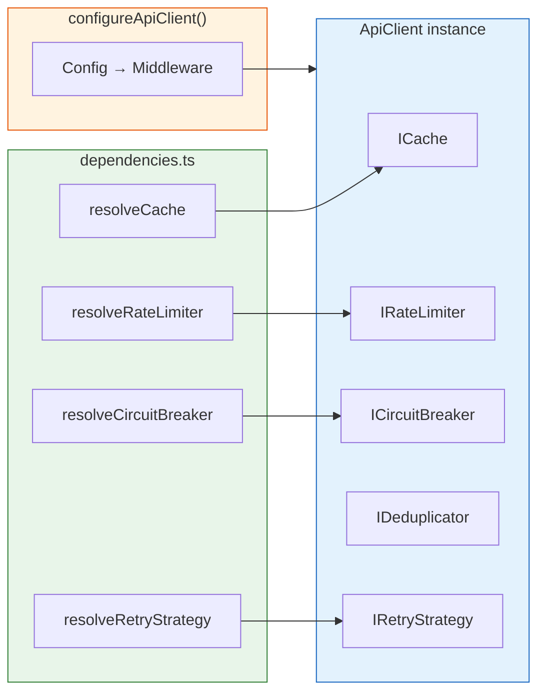
```mermaid
flowchart LR
    subgraph ConfigFactory ["configureApiClient()"]
        Wire["Config → Middleware"]
    end

    subgraph Client ["ApiClient instance"]
        cache["ICache"]
        rl["IRateLimiter"]
        cb["ICircuitBreaker"]
        dedup["IDeduplicator"]
        retry["IRetryStrategy"]
    end

    subgraph Resolution ["dependencies.ts"]
        rc["resolveCache"]
        rr["resolveRateLimiter"]
        rcb["resolveCircuitBreaker"]
        rrt["resolveRetryStrategy"]
    end

    Wire --> Client
    rc --> cache
    rr --> rl
    rcb --> cb
    rrt --> retry

    style ConfigFactory fill:#fff3e0,stroke:#e65100
    style Client fill:#e3f2fd,stroke:#1565c0
    style Resolution fill:#e8f5e9,stroke:#2e7d32
```

## 4. Circuit Breaker State Machine

The circuit breaker prevents cascading failures by tracking consecutive error responses per endpoint. When failures exceed the threshold, the circuit "opens" and all subsequent requests to that endpoint fail immediately with `CircuitOpenError` — no HTTP call is made. After a cooldown period, the circuit enters "half-open" state and allows a limited number of probe requests through. If the probe succeeds, the circuit closes and normal traffic resumes. If it fails, the circuit re-opens.

The half-open state uses a `try/finally` pattern with a `cbRecorded` flag in `fetchExecution.ts` to ensure the probe slot is always released, even on early exceptions before the HTTP response is received.

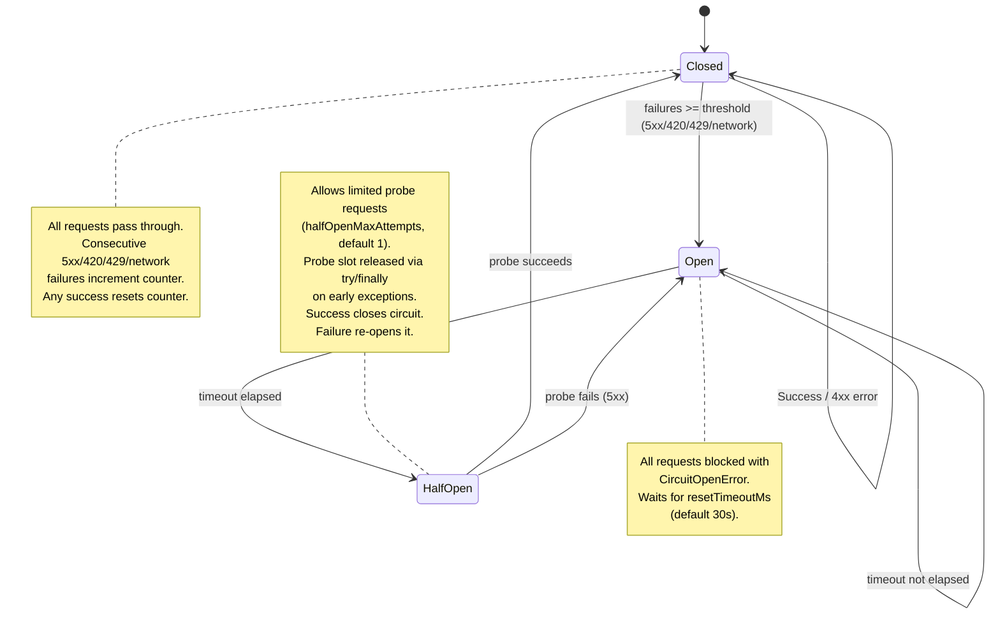
```mermaid
stateDiagram-v2
    [*] --> Closed

    Closed --> Closed: Success / 4xx error
    Closed --> Open: failures >= threshold (5xx/420/429/network)

    Open --> Open: timeout not elapsed
    Open --> HalfOpen: timeout elapsed

    HalfOpen --> Closed: probe succeeds
    HalfOpen --> Open: probe fails (5xx)

    note right of Closed
        All requests pass through.
        Consecutive 5xx/420/429/network
        failures increment counter.
        Any success resets counter.
    end note

    note right of Open
        All requests blocked with
        CircuitOpenError.
        Waits for resetTimeoutMs
        (default 30s).
    end note

    note left of HalfOpen
        Allows limited probe requests
        (halfOpenMaxAttempts, default 1).
        Probe slot released via try/finally
        on early exceptions.
        Success closes circuit.
        Failure re-opens it.
    end note
```

**Configuration options:**

| Option                | Default      | Description                                                                                                       |
| --------------------- | ------------ | ----------------------------------------------------------------------------------------------------------------- |
| `failureThreshold`    | 5            | Consecutive failures before opening                                                                               |
| `resetTimeoutMs`      | 30000        | Time before transition to half-open                                                                               |
| `halfOpenMaxAttempts` | 1            | Probes allowed in half-open                                                                                       |
| `staleThresholdMs`    | 3600000      | Age before a closed circuit is eligible for cleanup                                                               |
| `keyStrategy`         | `'resolved'` | `'resolved'` uses full resolved URL (per-resource); `'template'` uses endpoint template path (per-endpoint-group) |
| `cleanupIntervalMs`   | disabled     | Opt-in scheduled cleanup interval for stale circuits                                                              |

**`destroy()` method**: Clears the cleanup timer and all circuit records. Call on shutdown to prevent leaked timers.

## 5. CI/CD Pipeline

CI runs in two tiers. **ci-fast.yml** triggers on every push and runs lint, format, build, typecheck, and unit tests on Node 20 — this gives developers sub-5-minute feedback. **ci.yml** triggers on PRs to master and runs the full matrix: Node 18/20/22, BDD scenarios, contract tests against live ESI, fuzz testing (fast-check), mutation testing (Stryker), and the quality gate.

The quality gate blocks merge unless all checks pass, including coverage thresholds (80% branches, 75% functions, 90% lines, 90% statements) and spec freshness (generated files must match `git diff --exit-code`).

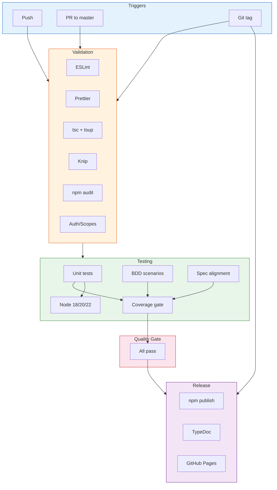
```mermaid
flowchart TB
    subgraph Trigger ["Triggers"]
        Push["Push"]
        PR["PR to master"]
        Tag["Git tag"]
    end

    subgraph Validation ["Validation"]
        Lint["ESLint"]
        Format["Prettier"]
        Build["tsc + tsup"]
        Knip["Knip"]
        Audit["npm audit"]
        Auth["Auth/Scopes"]
    end

    subgraph Testing ["Testing"]
        Unit["Unit tests"]
        BDD["BDD scenarios"]
        Spec["Spec alignment"]
        Cov["Coverage gate"]
        Matrix["Node 18/20/22"]
    end

    subgraph QG ["Quality Gate"]
        Gate["All pass"]
    end

    subgraph Release ["Release"]
        NPM["npm publish"]
        Docs["TypeDoc"]
        Pages["GitHub Pages"]
    end

    Push --> Validation
    PR --> Validation
    Tag --> Validation
    Validation --> Testing
    Unit --> Cov
    BDD --> Cov
    Spec --> Cov
    Unit --> Matrix
    Cov --> Gate
    Tag --> Release
    Gate --> Release

    style Trigger fill:#e3f2fd,stroke:#1565c0
    style Validation fill:#fff3e0,stroke:#e65100
    style Testing fill:#e8f5e9,stroke:#2e7d32
    style QG fill:#fce4ec,stroke:#c62828
    style Release fill:#f3e5f5,stroke:#6a1b9a
```

## 6. Client Creation Patterns

ESI.ts offers three construction patterns, from "give me everything" to "give me one client." All three flow through `configureApiClient()`, so middleware wiring is identical regardless of which pattern is used. This was a deliberate design choice after discovering that the previous architecture had silent middleware gaps between construction paths.

| Pattern              | Use case                 | What you get                                                                                    |
| -------------------- | ------------------------ | ----------------------------------------------------------------------------------------------- |
| **EsiClient**        | Most consumers           | All 35 domain clients via property getters (`client.market`, `client.alliance`, etc.)           |
| **EsiClientBuilder** | Tree-shaking / selective | Only the clients you request, with fluent configuration (`.addClients()`, `.withAccessToken()`) |
| **EsiApiFactory**    | Single-domain scripts    | One domain client with a fresh `ApiClient` — lightest footprint                                 |


```mermaid
flowchart TB
    subgraph P1 ["EsiClient (full)"]
        p1["new EsiClient()"]
    end
    subgraph P2 ["Builder (selective)"]
        p2["EsiClientBuilder\n.addClients().build()"]
    end
    subgraph P3 ["Factory (single)"]
        p3["EsiApiFactory\n.createMarketClient()"]
    end

    subgraph CW ["configureApiClient()"]
        cw["Unified wiring"]
    end

    subgraph Infra ["Shared Infrastructure"]
        ac["ApiClient"]
        cache["ETagCache"]
        rl["RateLimiter"]
        cb["CircuitBreaker"]
        retry["RetryStrategy"]
        dedup["Deduplicator"]
    end

    p1 --> cw
    p2 --> cw
    p3 --> cw
    cw --> ac
    ac --> cache
    ac --> rl
    ac --> cb
    ac --> retry
    ac --> dedup

    style P1 fill:#e3f2fd,stroke:#1565c0
    style P2 fill:#e8f5e9,stroke:#2e7d32
    style P3 fill:#fff3e0,stroke:#e65100
    style CW fill:#fce4ec,stroke:#c62828
    style Infra fill:#eceff1,stroke:#37474f
```

## 7. Middleware Pipeline

The request pipeline is split into three phases, each handled by dedicated modules in `src/core/requestPipeline/`. Request interceptors run before the HTTP call and can modify headers, URLs, or bodies — useful for trace IDs, custom auth headers, or request logging. Response interceptors run after the response is assembled and can transform the body or add metadata.

The middleware system is pluggable via `MiddlewareManager`, which maintains ordered lists of request and response interceptors. Interceptors are registered through the `ApiClient` and are applied by `middlewareBridge.ts`.

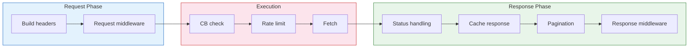
```mermaid
flowchart LR
    subgraph Request ["Request Phase"]
        R1["Build headers"]
        R2["Request middleware"]
    end

    subgraph Execution ["Execution"]
        CB["CB check"]
        RL["Rate limit"]
        Fetch["Fetch"]
    end

    subgraph Response ["Response Phase"]
        Status["Status handling"]
        Cache["Cache response"]
        Page["Pagination"]
        Intercept["Response middleware"]
    end

    R1 --> R2
    R2 --> CB --> RL --> Fetch
    Fetch --> Status --> Cache --> Page --> Intercept

    style Request fill:#e3f2fd,stroke:#1565c0
    style Execution fill:#fce4ec,stroke:#c62828
    style Response fill:#e8f5e9,stroke:#2e7d32
```

## 8. Test Architecture

The test suite is organized into tiers, each serving a different purpose in the confidence pyramid. The project currently has 3,900+ tests across 136+ suites, all runnable via `npm test`.

**TDD unit tests** (`tests/tdd/`) form the base — fast, isolated, mocked at the HTTP boundary via `jest-fetch-mock`. These cover all 35 domain clients, core infrastructure (cache, rate limiter, circuit breaker, middleware), the decomposed request pipeline modules, construction parity between the three client creation surfaces, and request body validation.

**BDD scenario tests** (`tests/bdd/`) use jest-cucumber with Gherkin-style `.feature` files. They cover 37 domain scenarios, performance scenarios (concurrency, memory, large datasets), and integration scenarios (cross-domain workflows). BDD tests use `TestDataFactory` for consistent fixture generation.

**Integration tests** (`tests/integration/`) run against live ESI when `ESI_LIVE_TESTS=true`. Smoke tests cover 42 public endpoints, and gated auth tests require an access token.

**Compile-time alignment** (`spec-alignment.check.ts`) uses 104 `AssertTrue<HasAllSpecKeys<>>` assertions across 24 domains to ensure hand-written Zod schemas don't drift from the OpenAPI spec at the type level.

| Tier        | Location             | Count          | What it validates                                                                     |
| ----------- | -------------------- | -------------- | ------------------------------------------------------------------------------------- |
| Unit (TDD)  | `tests/tdd/`         | ~3,500         | Domain clients, core infra, pipeline modules, construction parity, request validation |
| BDD         | `tests/bdd/`         | ~400           | Domain scenarios, resilience, cross-domain workflows                                  |
| Integration | `tests/integration/` | ~50            | Live ESI smoke tests, end-to-end client flows                                         |
| Contract    | `tests/contract/`    | varies         | OpenAPI spec drift detection against live spec                                        |
| Fuzz        | `tests/fuzz/`        | property-based | Edge cases via fast-check random generation                                           |
| Type        | `tests/typetests/`   | compile-time   | tsd type-level assertions                                                             |
| Mutation    | Stryker              | `src/core/**`  | Mutation score threshold (65% break, 80% high)                                        |

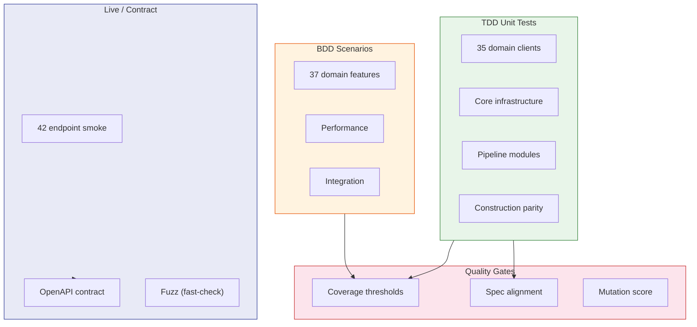
```mermaid
flowchart TB
    subgraph Unit ["TDD Unit Tests"]
        clients["35 domain clients"]
        core["Core infrastructure"]
        pipeline["Pipeline modules"]
        parity["Construction parity"]
    end

    subgraph BDD ["BDD Scenarios"]
        domain["37 domain features"]
        perf["Performance"]
        integ["Integration"]
    end

    subgraph Live ["Live / Contract"]
        smoke["42 endpoint smoke"]
        contract["OpenAPI contract"]
        fuzz["Fuzz (fast-check)"]
    end

    subgraph Gates ["Quality Gates"]
        cov["Coverage thresholds"]
        spec["Spec alignment"]
        mutation["Mutation score"]
    end

    Unit --> cov
    BDD --> cov
    Live --> contract
    Unit --> spec

    style Unit fill:#e8f5e9,stroke:#2e7d32
    style BDD fill:#fff3e0,stroke:#e65100
    style Live fill:#e8eaf6,stroke:#283593
    style Gates fill:#fce4ec,stroke:#c62828
```

## 9. Rate Limiting Strategy

ESI enforces 36 independent rate limit groups (e.g., `market-order: 12000 tokens/15m`, `char-notification: 15 tokens/15m`). The rate limiter maintains a separate token bucket per group, extracted from the ESI OpenAPI meta spec at build time (`esi-rate-limit-groups.generated.ts`).

**Per-group bucketing**: Each endpoint maps to a rate limit group via the generated spec. When `checkRateLimit(templatePath, method)` is called, the limiter resolves the group and checks/decelerates only that group's bucket. A 429 on one group blocks only that group.

**Per-user bucketing** (opt-in): When `userKeyExtractor` is configured, each user key gets its own set of group buckets, preventing one user's rate limit exhaustion from affecting others in multi-character apps.

**Server sync**: Response headers (`x-ratelimit-remaining`, `x-ratelimit-group`) are authoritative -- they override spec-derived initial values.

**Token costs** vary by response status to account for the different impact each has on ESI's rate limit budget:

| Status | Cost     | Rationale                                           |
| ------ | -------- | --------------------------------------------------- |
| 2xx    | 2 tokens | Normal successful request                           |
| 3xx    | 1 token  | Cache hit (304) — low server cost                   |
| 4xx    | 5 tokens | Client error — penalized to discourage bad requests |
| 5xx    | 0 tokens | Server error — not the client's fault               |

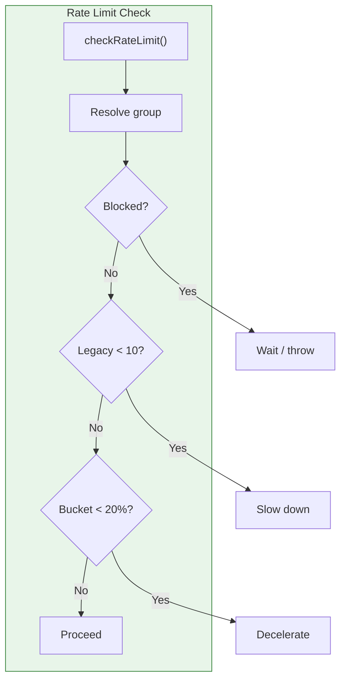
```mermaid
flowchart TB
    subgraph Check ["Rate Limit Check"]
        start["checkRateLimit()"]
        resolve["Resolve group"]
        blocked{"Blocked?"}
        legacy{"Legacy < 10?"}
        bucket{"Bucket < 20%?"}
        pass["Proceed"]
    end

    start --> resolve --> blocked
    blocked -->|Yes| stop["Wait / throw"]
    blocked -->|No| legacy
    legacy -->|Yes| slow["Slow down"]
    legacy -->|No| bucket
    bucket -->|Yes| decel["Decelerate"]
    bucket -->|No| pass

    style Check fill:#e8f5e9,stroke:#2e7d32
```

## 10. Response and Request Validation Pipeline

Bidirectional validation powered by Zod schemas. Response validation runs by default; request validation is opt-in.

```mermaid
sequenceDiagram
    participant Consumer
    participant Client as Domain Client
    participant CreateClient as createClient()
    participant Handler as ApiRequestHandler
    participant ESI as ESI API
    participant ReqSchema as Request Zod Schema
    participant RespSchema as Response Zod Schema

    Consumer->>Client: client.alliance.getAllianceById(id)
    Client->>CreateClient: invoke endpoint method

    alt validateRequest enabled + requestSchema defined
        CreateClient->>ReqSchema: def.requestSchema.safeParse(body)
        alt Invalid request body
            ReqSchema-->>Consumer: throw EsiValidationError(direction: 'request')
        end
    end

    CreateClient->>Handler: handleRequest(endpoint, method, ...)
    Handler->>ESI: HTTP GET /alliances/{id}/
    ESI-->>Handler: JSON response
    Handler-->>CreateClient: { headers, body }

    alt validateResponse enabled (default)
        CreateClient->>RespSchema: def.responseSchema.safeParse(body)
        alt Valid response
            RespSchema-->>CreateClient: { success: true, data }
            Note over CreateClient: Return type: InferEndpointResult&lt;D&gt;<br/>(z.infer on responseSchema)
            CreateClient-->>Client: validated, typed data
            Client-->>Consumer: AllianceInfo
        else Invalid response
            RespSchema-->>CreateClient: { success: false, error }
            CreateClient-->>Consumer: throw EsiValidationError
        end
    else validateResponse disabled
        CreateClient-->>Client: raw body (no validation)
        Client-->>Consumer: unvalidated data
    end
```

**Key design points:**

- **Bidirectional validation**: Request bodies can be validated before HTTP calls (`requestSchema` + `validateRequest: true`), and response bodies are validated after (`responseSchema`, on by default). Both use `EsiValidationError` with a `direction` field.
- **Validation location**: Validation happens in `createClient()` (in `src/core/endpoints/createClient.ts`), keeping validation centralized rather than scattered across 35 domain clients.
- **Typed returns via `InferEndpointResult<D>`**: The return type of each endpoint method is inferred from `z.infer<responseSchema>`. For cursor-paginated endpoints, the type is wrapped in `CursorResult<ElementType>`. This eliminates `as Promise<X>` casts.
- **Loose object mode**: All Zod schemas use `z.looseObject()` so extra fields returned by ESI that are not yet in the schema are preserved in the output.
- **Type derivation**: Types in `src/types/` are derived from schemas via `z.infer<>`, ensuring compile-time types and runtime validation always agree.
- **Generated schemas are internal**: The 33 auto-generated schemas in `src/schemas/generated/` are not publicly exported. They serve as baselines for `npm run schema:drift`, which compares hand-written schemas against the generated ones.

## 11. Request Pipeline Decomposition

Prior to v8.0.0, `ApiRequestHandler.ts` was an 815-line monolith handling headers, caching, status codes, pagination, middleware, fetch execution, and dependency resolution in a single file. It was the most-changed file in the codebase and the primary source of merge conflicts.

The decomposition extracted seven focused modules into `src/core/requestPipeline/`, each with a single responsibility. The coordinator shrank to ~250 lines and now only orchestrates the call sequence — no business logic lives in the coordinator itself.

**Why this structure**: Each module is independently testable (see `tests/tdd/core/requestPipeline/`), and changes to caching policy don't risk breaking pagination or status handling. The barrel export (`index.ts`) preserves the existing import paths for consumers within the codebase.

| Module                       | Responsibility             | Key exports                                                                           |
| ---------------------------- | -------------------------- | ------------------------------------------------------------------------------------- |
| `dependencies.ts`            | DI resolution              | `resolveCache`, `resolveRateLimiter`, `resolveCircuitBreaker`, `resolveRetryStrategy` |
| `headers.ts`                 | HTTP header construction   | `buildRequestHeaders`, `parseCacheControlTtl`                                         |
| `cachePolicy.ts`             | Spec-aware caching         | `lookupSpecTtl`, `trySpecAwareCacheHit`, `cacheResponse`                              |
| `statusHandling.ts`          | HTTP status interpretation | `handleEarlyStatus`, `handleErrorResponse`, `wrapError`                               |
| `middlewareBridge.ts`        | Interceptor execution      | `applyRequestMiddleware`, `applyResponseInterceptors`                                 |
| `fetchExecution.ts`          | HTTP fetch + CB/RL         | `executeSingleFetch`, `fetchOnePage`, `parseJsonBody`                                 |
| `paginationOrchestration.ts` | Multi-page assembly        | `handleCursorPagination`, `handleOffsetPagination`                                    |

This diagram is identical to the C4 Level 3 Pipeline component diagram above, repeated here for navigability:

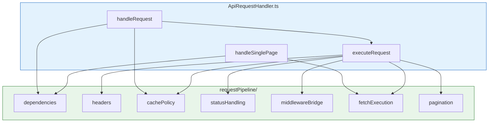
```mermaid
flowchart TB
    subgraph Coord ["ApiRequestHandler.ts"]
        direction LR
        HR["handleRequest"]
        HSPR["handleSinglePage"]
        ER["executeRequest"]
    end

    subgraph Mods ["requestPipeline/"]
        Deps["dependencies"]
        Hdrs["headers"]
        CP["cachePolicy"]
        SH["statusHandling"]
        MB["middlewareBridge"]
        FE["fetchExecution"]
        PO["pagination"]
    end

    HR --> CP
    HR --> Deps
    HR --> ER
    HSPR --> FE
    HSPR --> Deps
    ER --> Hdrs
    ER --> MB
    ER --> FE
    ER --> SH
    ER --> CP
    ER --> PO

    style Coord fill:#e3f2fd,stroke:#1565c0
    style Mods fill:#e8f5e9,stroke:#2e7d32
```

## 12. Streaming Architecture

Many ESI endpoints return paginated data — market orders, corporation members, industry jobs. Rather than forcing consumers to manually loop over pages, ESI.ts provides `stream*` methods that return `AsyncGenerator<PageResult<T>>`. Consumers iterate with `for await...of` and get typed, validated data one page at a time.

`BaseEsiClient.streamEndpoint()` is public and handles the mechanics: it calls `AsyncPaginationIterator.fetchPages()`, which fetches page 1 to discover `totalPages`, yields it, then fetches pages 2..N sequentially, yielding each. Each page goes through `handleSinglePageRequest()` with full retry strategy support. The iteration stops early if a page returns empty data.

21 domain clients expose 73 `stream*` methods, each a thin one-liner delegation:

```typescript
streamMarketOrders(regionId: number, ...): AsyncGenerator<PageResult<MarketOrder>> {
  return this.streamEndpoint('getRegionMarketOrders', regionId, ...);
}
```

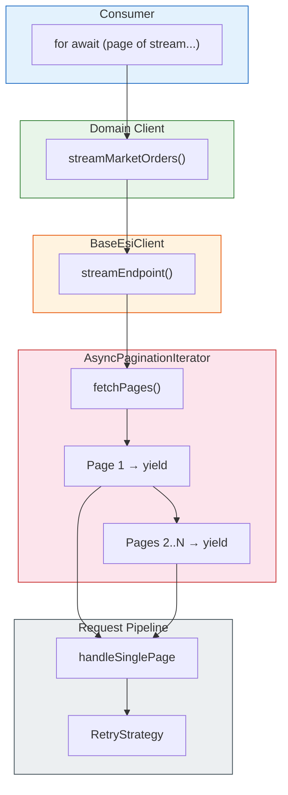
```mermaid
flowchart TB
    subgraph Consumer ["Consumer"]
        fa["for await (page of stream...)"]
    end

    subgraph Domain ["Domain Client"]
        sm["streamMarketOrders()"]
    end

    subgraph Base ["BaseEsiClient"]
        se["streamEndpoint()"]
    end

    subgraph Iterator ["AsyncPaginationIterator"]
        fp["fetchPages()"]
        p1["Page 1 → yield"]
        pn["Pages 2..N → yield"]
    end

    subgraph Pipeline ["Request Pipeline"]
        sp["handleSinglePage"]
        retry["RetryStrategy"]
    end

    fa --> sm --> se --> fp
    fp --> p1 --> pn
    p1 --> sp --> retry
    pn --> sp

    style Consumer fill:#e3f2fd,stroke:#1565c0
    style Domain fill:#e8f5e9,stroke:#2e7d32
    style Base fill:#fff3e0,stroke:#e65100
    style Iterator fill:#fce4ec,stroke:#c62828
    style Pipeline fill:#eceff1,stroke:#37474f
```

**Pattern**: Each `stream*` method is a thin one-liner that delegates to `this.streamEndpoint(endpointName, ...args)`:

```typescript
streamMarketOrders(regionId: number, ...): AsyncGenerator<PageResult<MarketOrder>> {
  return this.streamEndpoint('getRegionMarketOrders', regionId, ...);
}
```

**Return type**: `AsyncGenerator<PageResult<T>, void, undefined>` where `PageResult<T>` contains `{ data: T[], page: number, totalPages: number }`.

**Cursor pagination**: Cursor-paginated endpoints use a separate path through `CursorPaginationHandler` and are accessed via `createClient()` rather than the streaming interface.

## 13. Code Generation and CI Gates

ESI.ts bridges the gap between CCP's OpenAPI spec and TypeScript by auto-generating five artifact categories from the live spec. This ensures the SDK stays aligned with upstream API changes without manual intervention. The generation pipeline runs via `npm run generate:types` and produces:

- **161 TypeScript interfaces** (`esi-spec.generated.ts`) — one per ESI response shape
- **33 Zod schemas** (`src/schemas/generated/`) — per-domain runtime validators used only for drift detection
- **126 cache TTLs** (`esi-cache-ttls.generated.ts`) — per-endpoint TTLs for spec-aware caching
- **36 rate limit groups** (`esi-rate-limit-groups.generated.ts`) — per-group token bucket configuration
- **OAuth scope mappings** (`esi-scopes.generated.ts`) — per-endpoint required scopes

CI enforces that generated files are fresh via `git diff --exit-code` — if the spec changes and someone forgets to regenerate, the build fails.

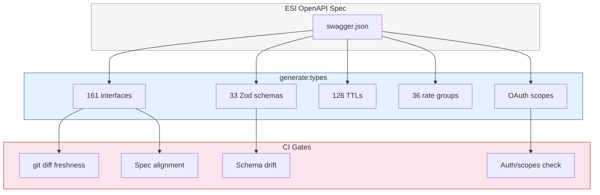
```mermaid
flowchart TB
    subgraph Source ["ESI OpenAPI Spec"]
        spec["swagger.json"]
    end

    subgraph Gen ["generate:types"]
        types["161 interfaces"]
        schemas["33 Zod schemas"]
        ttls["126 TTLs"]
        rates["36 rate groups"]
        scopes["OAuth scopes"]
    end

    subgraph Gates ["CI Gates"]
        fresh["git diff freshness"]
        auth["Auth/scopes check"]
        align["Spec alignment"]
        drift["Schema drift"]
    end

    spec --> types & schemas & ttls & rates & scopes
    types --> fresh
    scopes --> auth
    types --> align
    schemas --> drift

    style Source fill:#f5f5f5,stroke:#999
    style Gen fill:#e3f2fd,stroke:#1565c0
    style Gates fill:#fce4ec,stroke:#c62828
```

| Gate                               | Mechanism                                                      | What it catches                                                                                              |
| ---------------------------------- | -------------------------------------------------------------- | ------------------------------------------------------------------------------------------------------------ |
| **Generated freshness**            | `git diff --exit-code` on generated files                      | Stale types after ESI spec updates                                                                           |
| **Auth/scopes cross-validation**   | `scripts/validate-auth-scopes.ts`                              | `requiresAuth=false` on authenticated endpoints (would 401), or missing scope entries (breaks OAuth consent) |
| **Spec-alignment type assertions** | `AssertTrue<HasAllSpecKeys<SpecType, ZodType>>` (compile-time) | Zod schema missing a field the spec defines (104 pairs, 24 domains)                                          |
| **Schema drift detection**         | `npm run schema:drift`                                         | Hand-written schemas diverging from OpenAPI spec baselines                                                   |

**Generated schemas are internal-only**: The 33 auto-generated Zod schemas in `src/schemas/generated/` are not exported from the public API surface (`src/index.ts`). They serve exclusively as baselines for drift detection. The 33 hand-written schemas in `src/schemas/` remain the source of truth for runtime validation.
