# ESI.ts Architecture

**Implements:** `ARCH-01` · `ARCH-02` · `ARCH-03` · `ARCH-04` · `ARCH-05` · `ARCH-06` · `ARCH-07` · `ARCH-08` · `ARCH-09` — see [CHARTER.md](CHARTER.md) Part 2.

How ESI.ts is layered, the route every request takes, and how each piece of middleware behaves. The charter states the requirements; this guide explains how the code meets them. Where the two disagree, the code is the fact and the difference is called out.

Topics with their own guide are summarised here and linked:

| Topic                                                | Canonical guide                                |
| ---------------------------------------------------- | ---------------------------------------------- |
| Naming, endpoint definitions, adding a client        | [DESIGN-RULES.md](DESIGN-RULES.md)             |
| Error classes, guards, retryability, safe mode       | [ERRORS.md](ERRORS.md)                         |
| `ILogger`, per-client loggers, levels                | [LOGGING.md](LOGGING.md)                       |
| Offset and cursor pagination, `stream*`, `fetchAll*` | [PAGINATION.md](PAGINATION.md)                 |
| Zod schemas and validation options                   | [RUNTIME-VALIDATION.md](RUNTIME-VALIDATION.md) |
| Runtime defences and supply chain                    | [SECURITY.md](SECURITY.md)                     |
| Test tiers                                           | [TESTING.md](TESTING.md)                       |
| CI workflows and gates                               | [QUALITY-GATES.md](QUALITY-GATES.md)           |
| Releases                                             | [RELEASE.md](RELEASE.md)                       |
| Major, minor or patch; breaking-change markers       | [SEMVER.md](SEMVER.md)                         |

---

## C4 Model

### C4 Level 1 — System Context

System context showing ESI.ts in its operating environment.

| Element                  | Description                                                                             |
| ------------------------ | --------------------------------------------------------------------------------------- |
| **Consumer Application** | Node.js (18 or newer) application that needs EVE Online data                            |
| **ESI.ts**               | TypeScript SDK — auth, caching, rate limiting, circuit breaking, pagination, validation |
| **EVE Online ESI API**   | CCP's REST API at `esi.evetech.net`, secured by EVE SSO (OAuth2)                        |
| **EVE SSO**              | OAuth2 authorisation server — issues and refreshes access tokens                        |
| **ESI OpenAPI Spec**     | Machine-readable API spec used at build time for code generation                        |


```mermaid
flowchart TB
    consumer(["Consumer App"])

    subgraph boundary [" "]
        esits["ESI.ts SDK"]
    end

    esi[/"ESI API"/]
    sso[/"EVE SSO"/]
    spec[/"OpenAPI Spec"/]

    consumer -- "TypeScript API" --> esits
    esits -- "HTTPS + JSON" --> esi
    esits -- "OAuth2 refresh" --> sso
    spec -. "Build-time codegen" .-> esits

    style consumer fill:#08427b,color:#fff,stroke:#073b6f
    style esits fill:#1168bd,color:#fff,stroke:#0e5aa7
    style esi fill:#999,color:#fff,stroke:#888
    style sso fill:#999,color:#fff,stroke:#888
    style spec fill:#999,color:#fff,stroke:#888
    style boundary fill:none,stroke:#1168bd,stroke-width:2px,stroke-dasharray:5
```

### C4 Level 2 — Container Diagram

Five layers on one request path, plus side modules that share nothing with the HTTP pipeline.

| Container                | Where                                                                                                     | Purpose                                                                                                                           |
| ------------------------ | --------------------------------------------------------------------------------------------------------- | --------------------------------------------------------------------------------------------------------------------------------- |
| **Construction**         | `src/EsiClient.ts`, `src/EsiClientBuilder.ts`                                                             | `EsiClient`, `EsiClientBuilder` → `CustomEsiClient`, `EsiApiFactory`. All three call `configureApiClient()`                       |
| **Domain clients**       | `src/clients/` (one class per ESI domain + `BaseEsiClient`)                                               | Named methods, `stream*` and `fetchAll*` wrappers, `withMetadata()` and `withSafeMode()` views. No HTTP knowledge                 |
| **Endpoint definitions** | `src/core/endpoints/*Endpoints.ts`                                                                        | Declarative maps of path, method, auth, pagination kind and schemas. `createClient()` turns a map into typed methods              |
| **Schemas**              | `src/schemas/`                                                                                            | Hand-written Zod schemas for runtime validation; return types are inferred from them                                              |
| **Request pipeline**     | `src/core/ApiRequestHandler.ts`, `src/core/requestPipeline/`                                              | Pure functions: cache policy, headers, fetch execution, status handling, pagination, middleware bridge, dependency resolution     |
| **Resilience**           | `src/core/` (`RetryStrategy`, `RateLimiter`, `CircuitBreaker`, `RequestDeduplicator`, `ETagCacheManager`) | Each behind an interface with a setter on `ApiClient`                                                                             |
| **Transport**            | `ApiClient.getFetch()`                                                                                    | `globalThis.fetch` unless replaced with `setFetch()`. Timeout by `AbortController`                                                |
| **Generated**            | `src/types/generated/`, `src/core/endpoints/*.generated.ts`                                               | Types, cache TTLs, rate-limit groups and scopes generated from the ESI OpenAPI spec; CI verifies freshness                        |
| **Side modules**         | `./schemas`, `./errors`, `./testing`, `./sde`, `./sde/memory`                                             | Subpath entry points. The SDE module is an offline lookup layer with its own error hierarchy and shares no code with the pipeline |

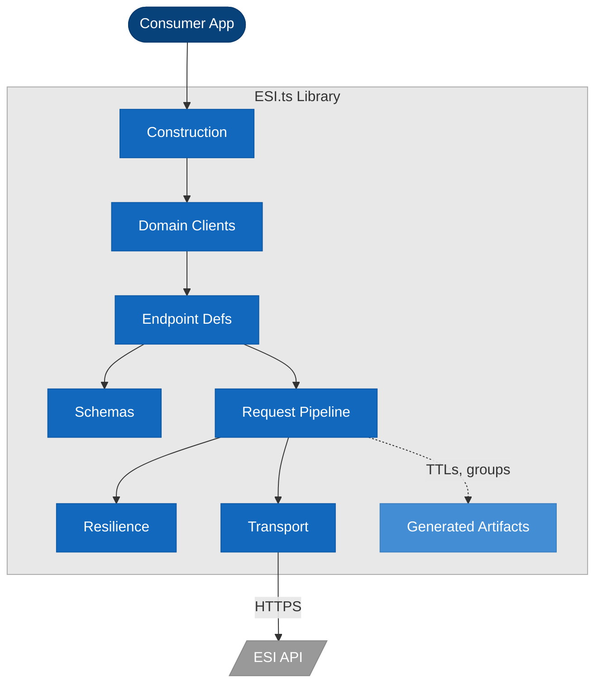
```mermaid
flowchart TB
    consumer(["Consumer App"])

    subgraph esits ["ESI.ts Library"]
        direction TB
        publicApi["Construction"]
        domainClients["Domain Clients"]
        endpointDefs["Endpoint Defs"]
        schemas["Schemas"]
        pipeline["Request Pipeline"]
        resilience["Resilience"]
        transport["Transport"]
        generated["Generated Artifacts"]
    end

    esi[/"ESI API"/]

    consumer --> publicApi
    publicApi --> domainClients
    domainClients --> endpointDefs
    endpointDefs --> schemas
    endpointDefs --> pipeline
    pipeline --> resilience
    pipeline --> transport
    pipeline -. "TTLs, groups" .-> generated
    transport -- "HTTPS" --> esi

    style consumer fill:#08427b,color:#fff,stroke:#073b6f
    style publicApi fill:#1168bd,color:#fff,stroke:#0e5aa7
    style domainClients fill:#1168bd,color:#fff,stroke:#0e5aa7
    style endpointDefs fill:#1168bd,color:#fff,stroke:#0e5aa7
    style schemas fill:#1168bd,color:#fff,stroke:#0e5aa7
    style pipeline fill:#1168bd,color:#fff,stroke:#0e5aa7
    style resilience fill:#1168bd,color:#fff,stroke:#0e5aa7
    style transport fill:#1168bd,color:#fff,stroke:#0e5aa7
    style generated fill:#438dd5,color:#fff,stroke:#3c7fc0
    style esi fill:#999,color:#fff,stroke:#888
    style esits fill:#e8e8e8,stroke:#aaa
```

### C4 Level 3 — Component: Core Request Pipeline

`ApiRequestHandler.ts` coordinates; each module in `src/core/requestPipeline/` has one responsibility and receives its dependencies as parameters (`ARCH-03`). `dependencies.ts` is the only place a dependency is resolved from the `ApiClient`.

| Component                   | File                       | Exports                                                                                     |
| --------------------------- | -------------------------- | ------------------------------------------------------------------------------------------- |
| **handleRequest**           | ApiRequestHandler.ts       | Spec-cache check, deduplication, retry wrapping; delegates to `executeRequest`              |
| **handleSinglePageRequest** | ApiRequestHandler.ts       | One page with retry, used by `stream*` and `fetchAll*` (see [PAGINATION.md](PAGINATION.md)) |
| **executeRequest**          | ApiRequestHandler.ts       | Fetch, status handling, cache write, pagination, response interceptors                      |
| **dependencies**            | dependencies.ts            | `resolveCache`, `resolveRateLimiter`, `resolveCircuitBreaker`, `resolveRetryStrategy`       |
| **headers**                 | headers.ts                 | `buildRequestHeaders`, `parseCacheControlTtl`                                               |
| **cachePolicy**             | cachePolicy.ts             | `lookupSpecTtl`, `trySpecAwareCacheHit`, `tryStaleCacheResponse`, `cacheResponse`           |
| **statusHandling**          | statusHandling.ts          | `handleEarlyStatus` (201/204/304), `handleErrorResponse` (4xx/5xx), `wrapError`             |
| **middlewareBridge**        | middlewareBridge.ts        | `applyRequestMiddleware`, `applyResponseInterceptors`                                       |
| **fetchExecution**          | fetchExecution.ts          | `executeSingleFetch`, `fetchOnePage`, `parseJsonBody`                                       |
| **pagination**              | paginationOrchestration.ts | `handleCursorPagination`, `handleOffsetPagination`                                          |

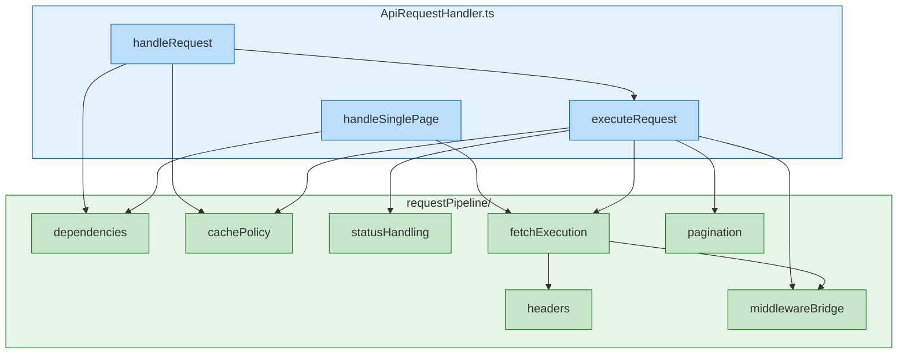
```mermaid
flowchart TB
    subgraph coordinator ["ApiRequestHandler.ts"]
        direction LR
        handleReq["handleRequest"]
        handleSingle["handleSinglePage"]
        execReq["executeRequest"]
    end

    subgraph pipelineMods ["requestPipeline/"]
        deps["dependencies"]
        headers["headers"]
        cache["cachePolicy"]
        status["statusHandling"]
        mwBridge["middlewareBridge"]
        fetchExec["fetchExecution"]
        pagOrch["pagination"]
    end

    handleReq --> cache
    handleReq --> deps
    handleReq --> execReq
    handleSingle --> fetchExec
    handleSingle --> deps
    execReq --> fetchExec
    execReq --> status
    execReq --> cache
    execReq --> pagOrch
    execReq --> mwBridge
    fetchExec --> headers
    fetchExec --> mwBridge

    style coordinator fill:#e3f2fd,stroke:#1565c0
    style pipelineMods fill:#e8f5e9,stroke:#2e7d32
    style handleReq fill:#bbdefb,stroke:#1565c0
    style handleSingle fill:#bbdefb,stroke:#1565c0
    style execReq fill:#bbdefb,stroke:#1565c0
    style deps fill:#c8e6c9,stroke:#2e7d32
    style headers fill:#c8e6c9,stroke:#2e7d32
    style cache fill:#c8e6c9,stroke:#2e7d32
    style status fill:#c8e6c9,stroke:#2e7d32
    style mwBridge fill:#c8e6c9,stroke:#2e7d32
    style fetchExec fill:#c8e6c9,stroke:#2e7d32
    style pagOrch fill:#c8e6c9,stroke:#2e7d32
```

### C4 Level 3 — Component: Resilience

How the resilience components nest around one call. Retry is outermost; deduplication sits inside each attempt; the circuit breaker and rate limiter run inside the fetch.

| Component               | Interface         | Purpose                                                                                            |
| ----------------------- | ----------------- | -------------------------------------------------------------------------------------------------- |
| **RetryStrategy**       | `IRetryStrategy`  | Exponential backoff with jitter on retryable `EsiError`s; one 401 token refresh per call           |
| **RequestDeduplicator** | `IDeduplicator`   | Coalesces identical in-flight GETs without a body                                                  |
| **CircuitBreaker**      | `ICircuitBreaker` | Opt-in per-key state machine (closed / open / half-open); key by resolved path or template         |
| **RateLimiter**         | `IRateLimiter`    | Per-group buckets from the generated spec, learns from response headers, blocks a group on 420/429 |
| **ETagCacheManager**    | `ICache`          | Spec-TTL hits, `If-None-Match` conditionals, stale fallback on 5xx                                 |

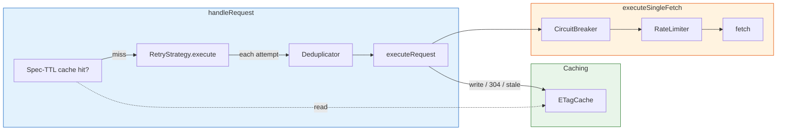
```mermaid
flowchart LR
    subgraph pipeline ["handleRequest"]
        spec["Spec-TTL cache hit?"]
        retry["RetryStrategy.execute"]
        dedup["Deduplicator"]
        execReq["executeRequest"]
    end

    subgraph fetch ["executeSingleFetch"]
        cb["CircuitBreaker"]
        rl["RateLimiter"]
        net["fetch"]
    end

    subgraph caching ["Caching"]
        etag["ETagCache"]
    end

    spec -- "miss" --> retry
    retry -- "each attempt" --> dedup
    dedup --> execReq
    execReq --> cb --> rl --> net
    execReq -- "write / 304 / stale" --> etag
    spec -. "read" .-> etag

    style pipeline fill:#e3f2fd,stroke:#1565c0
    style fetch fill:#fff3e0,stroke:#e65100
    style caching fill:#e8f5e9,stroke:#2e7d32
```

---

## 1. Layers

Dependency direction flows inward. Outer layers depend on inner layers, never the reverse.


```mermaid
graph TB
    subgraph External["External"]
        ESI["ESI API<br/>(esi.evetech.net)"]
        Consumer["Consumer Application"]
    end

    subgraph PublicAPI["Construction Layer"]
        EsiClient["EsiClient"]
        EsiClientBuilder["EsiClientBuilder"]
        EsiApiFactory["EsiApiFactory"]
        Index["index.ts exports"]
    end

    subgraph DomainClients["Domain Client Layer"]
        Alliance["AllianceClient"]
        Character["CharacterClient"]
        Market["MarketClient"]
        Universe["UniverseClient"]
        More["... one per ESI domain"]
    end

    subgraph EndpointLayer["Endpoint Definition Layer"]
        EndpointDef["EndpointDefinition<br/>(responseSchema + requestSchema)"]
        EndpointFiles["*Endpoints.ts (one per domain)"]
        CreateClient["createClient()<br/>→ InferEndpointResult&lt;D&gt;"]
        Registry["ClientRegistry"]
    end

    subgraph SchemaLayer["Schema Validation Layer (Zod)"]
        Schemas["src/schemas/ (hand-written)"]
        SchemaValidation["Runtime Validation"]
    end

    subgraph CoreLayer["Core Request Orchestration"]
        ConfigureClient["configureApiClient()"]
        Pipeline["src/core/requestPipeline/"]
        Handler["ApiRequestHandler<br/>(coordinator)"]
        SpecTtlCache["Spec-Aware Cache (TTL bypass)"]
        BatchHandler["BatchRequestHandler"]
        Middleware["MiddlewareManager"]
        RateLimiter["RateLimiter"]
        CircuitBreaker["CircuitBreaker"]
        Cache["ETagCacheManager"]
        Pagination["Offset pagination"]
        CursorPagination["CursorPaginationHandler"]
        AsyncPaginator["AsyncPaginationIterator"]
        TokenRefresh["Token Refresh"]
    end

    subgraph GeneratedLayer["Generated (from ESI OpenAPI Spec)"]
        GenTypes["esi-spec.generated.ts"]
        GenTtls["esi-cache-ttls.generated.ts"]
        GenRateLimits["esi-rate-limit-groups.generated.ts"]
        GenScopes["esi-scopes.generated.ts"]
    end

    subgraph Interfaces["Interface Contracts"]
        ICache["ICache"]
        IRateLimiter["IRateLimiter"]
        ICB["ICircuitBreaker"]
        IRetry["IRetryStrategy"]
        IDedup["IDeduplicator"]
        ILogger["ILogger"]
    end

    subgraph Infrastructure["Infrastructure Layer"]
        ApiClient["ApiClient"]
        HeadersUtil["parseHeaders()"]
        Validation["validation"]
        ErrorUtil["EsiError, EsiValidationError"]
        Logger["pino Logger"]
        Constants["constants"]
    end

    Consumer --> Index
    Index --> EsiClient
    Index --> EsiClientBuilder
    Index --> EsiApiFactory

    EsiClient --> Alliance
    EsiClient --> Character
    EsiClient --> Market
    EsiClient --> Universe
    EsiClient --> More

    Alliance --> CreateClient
    Character --> CreateClient
    Market --> CreateClient
    Universe --> CreateClient

    CreateClient --> EndpointDef
    CreateClient --> EndpointFiles
    CreateClient --> SchemaValidation
    CreateClient --> Handler

    SchemaValidation --> Schemas

    Registry --> Alliance
    Registry --> Character
    Registry --> Market
    Registry --> Universe

    EsiClient --> ConfigureClient
    EsiClientBuilder --> ConfigureClient
    EsiApiFactory --> ConfigureClient
    ConfigureClient --> ApiClient

    Handler --> Pipeline
    Pipeline --> SpecTtlCache
    SpecTtlCache --> Cache
    SpecTtlCache --> GenTtls
    Pipeline --> Middleware
    Pipeline --> RateLimiter
    RateLimiter --> GenRateLimits
    Pipeline --> CircuitBreaker
    Pipeline --> Cache
    Pipeline --> Pagination
    Pipeline --> CursorPagination
    Pipeline --> TokenRefresh
    AsyncPaginator --> Handler
    EsiClient --> BatchHandler

    Cache -.->|implements| ICache
    RateLimiter -.->|implements| IRateLimiter
    CircuitBreaker -.->|implements| ICB
    Logger -.->|implements| ILogger

    Handler --> ApiClient
    Handler --> HeadersUtil
    Handler --> Validation
    Handler --> ErrorUtil
    Handler --> Constants

    ApiClient --> ESI

    style External fill:#f5f5f5,stroke:#999
    style PublicAPI fill:#e3f2fd,stroke:#1565c0
    style DomainClients fill:#e8f5e9,stroke:#2e7d32
    style EndpointLayer fill:#fff3e0,stroke:#e65100
    style SchemaLayer fill:#e0f7fa,stroke:#00838f
    style CoreLayer fill:#fce4ec,stroke:#c62828
    style Interfaces fill:#f3e5f5,stroke:#6a1b9a
    style Infrastructure fill:#eceff1,stroke:#37474f
    style GeneratedLayer fill:#e8eaf6,stroke:#283593
```

**Design points:**

- **One wiring function.** `configureApiClient()` (`src/core/configureApiClient.ts`) is the single place configuration becomes middleware, for all three construction surfaces.
- **Typed returns from schemas.** `InferEndpointResult<D>` applies `z.infer<>` to the endpoint's `responseSchema`. An endpoint without a schema returns `unknown` (`DES-02`).
- **Strategies, not imports.** Cache, rate limiter, circuit breaker, deduplicator, retry strategy, transport and logger are all interfaces with a setter on `ApiClient` (`ARCH-04`).
- **Generated metadata, hand-written judgement.** Cache TTLs, rate-limit groups and scopes are generated; clients, endpoint maps and schemas are written by hand and diffed against the spec (`ARCH-01`).

---

## 2. Request Lifecycle

Every domain method takes the same route. Order matters: a stage cannot see the effect of a later one.

1. **Domain method → `createClient` closure** (`src/core/endpoints/createClient.ts`). Logs a deprecation warning if the definition carries `deprecated`. `buildEndpointPath` assembles the path, query and body, and appends `datasource` when one is set. The request body is validated against `requestSchema` only when `validateRequest` is on; failure throws `EsiValidationError` with `direction: 'request'`.
2. **Spec-aware cache check** (`trySpecAwareCacheHit`). For a GET whose template has a generated TTL, a cached entry younger than that TTL is returned with no network call.
3. **Retry** (`RetryStrategy.execute`). Wraps everything below. See [§5](#5-retry-and-deduplication).
4. **Deduplication.** Inside each attempt, an identical in-flight GET without a body joins the existing promise.
5. **`executeSingleFetch`.** Build headers (`Accept`, `User-Agent`, `X-Compatibility-Date`, `Accept-Language` if set, `Authorization` only when `requiresAuth`, `If-None-Match` when an ETag is cached) → request interceptors → circuit breaker check → rate limiter check → fetch with timeout → parse headers → rate limiter learns from the response → circuit breaker records the outcome.
6. **Status handling.** 201 parses the body if there is one and returns. 204 returns `undefined`. 304 serves the cached body and stores it again, restarting its TTL, or throws `EsiError(304)` if there is none. A 5xx with a cached copy serves it stale. Any other non-2xx throws `EsiError`; 401 and 403 carry remediation text.
7. **Cache write and pagination.** A successful GET with an ETag is cached. A non-GET that reaches this step invalidates cached entries whose key contains the path. Cursor pagination reads `x-cursor-before` / `x-cursor-after`; offset pagination follows `x-pages` and merges the pages.
8. **Response interceptors → Zod validation → envelope.** Interceptors see the assembled response. When `validateResponse` is on (the default) the body is replaced by `safeParse().data`, or `EsiValidationError` is thrown. `withMetadata()` and `withSafeMode()` wrap the result last.

#### Happy Path

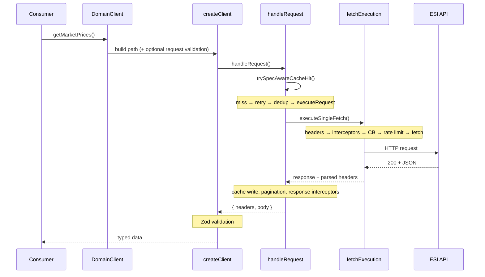
```mermaid
sequenceDiagram
    participant App as Consumer
    participant DC as DomainClient
    participant CC as createClient
    participant HR as handleRequest
    participant FE as fetchExecution
    participant ESI as ESI API

    App->>DC: getMarketPrices()
    DC->>CC: build path (+ optional request validation)
    CC->>HR: handleRequest()
    HR->>HR: trySpecAwareCacheHit()
    Note over HR: miss → retry → dedup → executeRequest
    HR->>FE: executeSingleFetch()
    Note over FE: headers → interceptors → CB → rate limit → fetch
    FE->>ESI: HTTP request
    ESI-->>FE: 200 + JSON
    FE-->>HR: response + parsed headers
    Note over HR: cache write, pagination, response interceptors
    HR-->>CC: { headers, body }
    Note over CC: Zod validation
    CC-->>App: typed data
```

#### Error and Edge-Case Handling

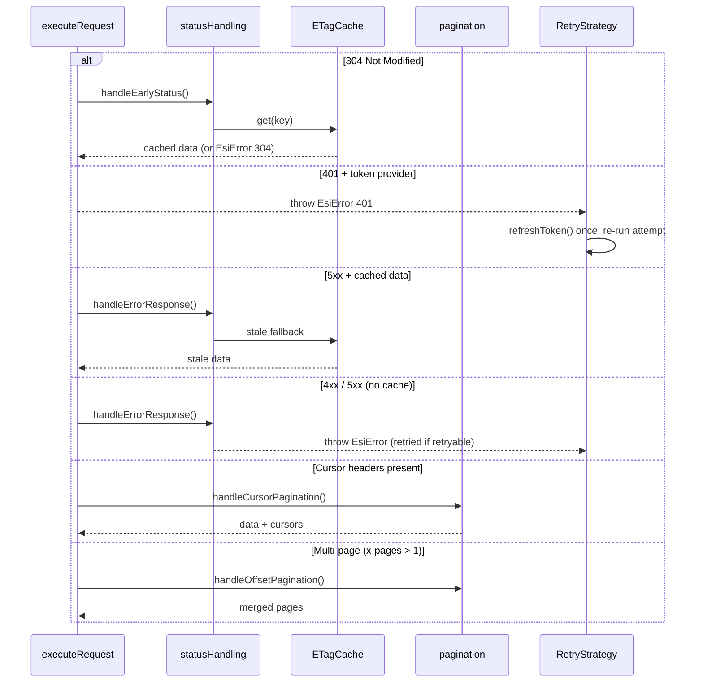
```mermaid
sequenceDiagram
    participant HR as executeRequest
    participant SH as statusHandling
    participant Cache as ETagCache
    participant PO as pagination
    participant RS as RetryStrategy

    alt 304 Not Modified
        HR->>SH: handleEarlyStatus()
        SH->>Cache: get(key)
        Cache-->>HR: cached data (or EsiError 304)
    else 401 + token provider
        HR-->>RS: throw EsiError 401
        RS->>RS: refreshToken() once, re-run attempt
    else 5xx + cached data
        HR->>SH: handleErrorResponse()
        SH->>Cache: stale fallback
        Cache-->>HR: stale data
    else 4xx / 5xx (no cache)
        HR->>SH: handleErrorResponse()
        SH-->>RS: throw EsiError (retried if retryable)
    else Cursor headers present
        HR->>PO: handleCursorPagination()
        PO-->>HR: data + cursors
    else Multi-page (x-pages > 1)
        HR->>PO: handleOffsetPagination()
        PO-->>HR: merged pages
    end
```

---

## 3. Dependency Injection

Every resilience feature is behind an interface and scoped to one `ApiClient` instance; there are no shared singletons in the pipeline. A `null` dependency disables that feature for that client.

`configureApiClient()` builds the defaults from `EsiClientConfig`. At request time `requestPipeline/dependencies.ts` resolves each one:

| Dependency        | Setter on `ApiClient` | Default from `configureApiClient`                  | Resolution when absent                                              |
| ----------------- | --------------------- | -------------------------------------------------- | ------------------------------------------------------------------- |
| `ICache`          | `setCache()`          | `ETagCacheManager` unless `enableETagCache: false` | `resolveCache()` → `null`: no ETag, spec-TTL or stale caching       |
| `IRateLimiter`    | `setRateLimiter()`    | `RateLimiter`, always                              | `resolveRateLimiter()` **throws** `CONFIGURATION_ERROR`             |
| `ICircuitBreaker` | `setCircuitBreaker()` | `CircuitBreaker` only if `enableCircuitBreaker`    | `resolveCircuitBreaker()` → `null`: no circuit breaking             |
| `IRetryStrategy`  | `setRetryStrategy()`  | none; `retryConfig` of 3 retries, 1 s, 30 s        | `resolveRetryStrategy()` → `new RetryStrategy(retryConfig)`         |
| `IDeduplicator`   | `setDeduplicator()`   | `RequestDeduplicator` unless disabled              | read directly; `null` means no coalescing                           |
| `FetchLike`       | `setFetch()`          | none                                               | `globalThis.fetch`                                                  |
| `ILogger`         | `setLogger()`         | only when `logger` or `logLevel` is configured     | global logger, then the pino default (see [LOGGING.md](LOGGING.md)) |

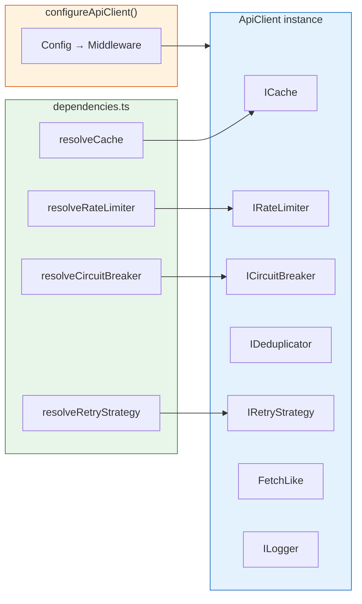
```mermaid
flowchart LR
    subgraph ConfigFactory ["configureApiClient()"]
        Wire["Config → Middleware"]
    end

    subgraph Client ["ApiClient instance"]
        cache["ICache"]
        rl["IRateLimiter"]
        cb["ICircuitBreaker"]
        dedup["IDeduplicator"]
        retry["IRetryStrategy"]
        fetch["FetchLike"]
        logger["ILogger"]
    end

    subgraph Resolution ["dependencies.ts"]
        rc["resolveCache"]
        rr["resolveRateLimiter"]
        rcb["resolveCircuitBreaker"]
        rrt["resolveRetryStrategy"]
    end

    Wire --> Client
    rc --> cache
    rr --> rl
    rcb --> cb
    rrt --> retry

    style ConfigFactory fill:#fff3e0,stroke:#e65100
    style Client fill:#e3f2fd,stroke:#1565c0
    style Resolution fill:#e8f5e9,stroke:#2e7d32
```

### Middleware inventory

| Concern         | Interface                                    | Default            | Key defaults                                                               |
| --------------- | -------------------------------------------- | ------------------ | -------------------------------------------------------------------------- |
| Rate limiter    | `IRateLimiter`                               | on, mandatory      | Buckets from generated groups; 420/429 → 60 s block; 50 ms minimum spacing |
| Circuit breaker | `ICircuitBreaker`                            | off, opt-in        | 5 failures, 30 s reset, 1 half-open probe, key by resolved path            |
| Deduplicator    | `IDeduplicator`                              | on                 | GET without body only                                                      |
| Retry           | `IRetryStrategy`                             | on                 | 3 retries, 1 s base, 30 s cap, GET only                                    |
| ETag cache      | `ICache`                                     | on                 | 1000 entries, 5 min default TTL, 60 s sweep                                |
| Interceptors    | `RequestInterceptor` / `ResponseInterceptor` | none               | Sequential, unsubscribe closure returned                                   |
| Transport       | `FetchLike`                                  | global fetch       | 30 s timeout                                                               |
| Logger          | `ILogger`                                    | pino, level `warn` | Per-client, falls back to global, then default                             |

---

## 4. Caching

Caching is on by default and has three tiers, checked in order.

```
Request (GET)
  │
  ▼
Tier 1  Spec TTL        entry younger than the generated TTL → return it, no HTTP call
  │ miss or expired
  ▼
Tier 2  ETag            send If-None-Match → 304 returns the cached body
  │ changed or no entry
  ▼
Tier 3  Full request    200 → cache it (if ESI sent an ETag)
```

**Spec TTL.** `esi-cache-ttls.generated.ts` maps `METHOD:template` to the `x-cache-age` value from the OpenAPI spec. Only GETs whose template has an entry are eligible. Within that window the stored body is returned with `cacheHitType: 'spec-ttl'`.

**Lifetime of a stored entry.** The freshness TTL is the generated spec TTL, else `Cache-Control: max-age`. An entry is kept for its freshness TTL plus one hour (`STALE_RETENTION_MS` in `cachePolicy.ts`), so after the spec-TTL window closes the entry still supplies `If-None-Match` and a stale body. An entry whose response gave no freshness TTL is kept for the cache's `defaultTtl` (5 minutes). Only responses that carry an `ETag` are stored. A 304 stores the entry again, which restarts both windows.

**Stale on error.** When ESI returns a 5xx and a cached entry exists, that entry is returned with `stale: true` and `cacheHitType: 'stale-on-error'` instead of throwing. Because nothing is thrown, the retry strategy does not retry that call. For a spec-TTL endpoint this applies from the end of the spec TTL until the retention hour runs out.

**Write invalidation.** A non-GET response that reaches the cache-write step deletes every entry whose key contains the request path. 201 and 204 responses return before that step, so they do not invalidate today.

**Keys and isolation.** Public endpoints are keyed by URL and shared across callers of the same client. Authenticated endpoints prefix the key with the first 16 hex characters of a SHA-256 hash of the `Authorization` header (`src/core/cache/cacheKey.ts`), so two characters never share a cached body. See [SECURITY.md](SECURITY.md).

**Eviction.** When `maxEntries` is reached, storing a new key evicts the oldest entry; replacing a stored key evicts nothing. Retention past the freshness TTL does not raise this bound. A timer removes expired entries every `cleanupInterval`; `shutdown()` stops it.

```typescript
const client = new EsiClient({
  enableETagCache: true, // default
  etagCacheConfig: {
    maxEntries: 1000, // default
    defaultTtl: 300_000, // ms, entry lifetime when neither spec nor Cache-Control gives a TTL
    cleanupInterval: 60_000, // ms
  },
});

const stats = client.getCacheStats(); // { totalEntries, maxEntries, hits, misses, hitRate, oldestEntry, newestEntry } or null
client.updateCacheConfig({ maxEntries: 2000 });
client.clearCache();

// See where a response came from
const result = await client.alliance.withMetadata().getAllianceById(99000001);
result.meta.fromCache; // boolean
result.meta.cacheHitType; // 'spec-ttl' | 'etag-304' | 'stale-on-error' | undefined
```

Set `enableETagCache: false` to disable all three tiers.

---

## 5. Retry and Deduplication

**Retry** (`src/core/RetryStrategy.ts`) wraps each call from `handleRequest` and each page from `handleSinglePageRequest`.

| Rule            | Behaviour                                                                                                                     |
| --------------- | ----------------------------------------------------------------------------------------------------------------------------- |
| What is retried | An `EsiError` whose `retryable` is true: status 0 (network or timeout), 420, 429, 502, 503, 504                               |
| Which methods   | GET only, unless `retryMutations: true`                                                                                       |
| Delay           | `baseDelayMs × 2^attempt × jitter(0.75–1.25)`, capped at `maxDelayMs`                                                         |
| Defaults        | `configureApiClient` sets `maxRetries: 3`, `baseDelayMs: 1000`, `maxDelayMs: 30000`; `retryAttempts` overrides only the count |
| Token refresh   | One refresh per call on a 401 when the endpoint requires auth and a token provider is set; the attempt is then re-run         |
| Refresh failure | Rethrown as-is if it is an `EsiError` or `CircuitOpenError`, otherwise a `TOKEN_REFRESH_FAILED` error                         |
| Circuit open    | `CircuitOpenError` is rethrown immediately and never retried                                                                  |

Concurrent refreshes on one `ApiClient` share one in-flight provider call. Supply a custom `IRetryStrategy` through `retryStrategy` in the config or `ApiClient.setRetryStrategy()`.

**Deduplication** (`src/core/RequestDeduplicator.ts`) keys by the resolved endpoint path and applies only to GETs without a body. Callers that arrive while a request is in flight receive the same promise, including its rejection. Because it sits inside the retry loop, each retry attempt re-enters the deduplicator. Disable it with `enableRequestDeduplication: false`.

---

## 6. Rate Limiting

ESI assigns most endpoints to a named rate-limit group with its own token bucket. The groups are extracted from the OpenAPI spec into `esi-rate-limit-groups.generated.ts`, so a burst against `market-order` does not throttle `char-notification`. Rate limiting is always on and needs no configuration.

**What the limiter does before each fetch** (`RateLimiter.checkRateLimit`):

1. **Blocked group.** If the group is blocked, sleep until the block ends and check again, up to ten times. If it is still blocked, throw a retryable `EsiError(429)` rather than send the request.
2. **Legacy error limit.** If `x-esi-error-limit-remain` is 10 or fewer, wait up to 5 s; if it is exhausted, wait for `x-esi-error-limit-reset`.
3. **Bucket pressure.** If the group's bucket is empty, wait 1 s. If remaining tokens are at or below `decelerationThreshold` (20%) of the limit, add a delay that grows to 1 s as the bucket drains.
4. **Minimum spacing.** Serialise requests so they are at least `minDelayMs` (50 ms) apart.

**What it learns after each fetch** (`updateFromResponse`): `x-ratelimit-remaining`, `-limit` and `-used` overwrite the bucket, and `x-ratelimit-group` selects the bucket when ESI names one. `Retry-After` blocks the group for that many seconds, or until that date when it is an HTTP date (an unreadable value is ignored); a 420 or 429 blocks it for 60 s if nothing longer is set. The limiter does not decrement tokens locally; ESI's headers are the source of truth. ESI's own charging table (2xx = 2, 3xx = 1, 4xx = 5, 5xx = 0) is exposed as `RateLimiter.getTokenCost(status)` for callers that want to budget.

**Endpoints without a group** share one fallback bucket that is only ever blocked by a 420/429.

```typescript
const client = new EsiClient({
  rateLimiterConfig: {
    minDelayMs: 50, // default
    decelerationThreshold: 0.2, // default
    // Multi-character apps: one set of group buckets and one error limit per key
    userKeyExtractor: (headers) => headers['Authorization'] ?? 'anon',
    // Tighter local budget for one endpoint (key uses snake_case params, no trailing slash)
    endpointOverrides: {
      'GET:markets/{region_id}/orders': {
        maxTokens: 100,
        windowSizeMs: 60_000,
      },
    },
  },
});
```

`userKeyExtractor` receives the outgoing request headers, after request interceptors have run. Idle user bucket sets are dropped after 15 minutes.

**Monitoring.** Per-response rate-limit state is available on `withMetadata()` results as `meta.rateLimit`. The `IRateLimiter` instance exposes `getStatus()` (worst bucket across all groups), `getGroupStatus(group)`, `getAllGroupStatuses()` and `isBlocked(group?)`; the last three read the shared buckets, not per-user ones. `EsiClient` does not expose the limiter directly; hold a reference by constructing an `ApiClient` yourself or by passing your own `IRateLimiter` to `ApiClient.setRateLimiter()`.

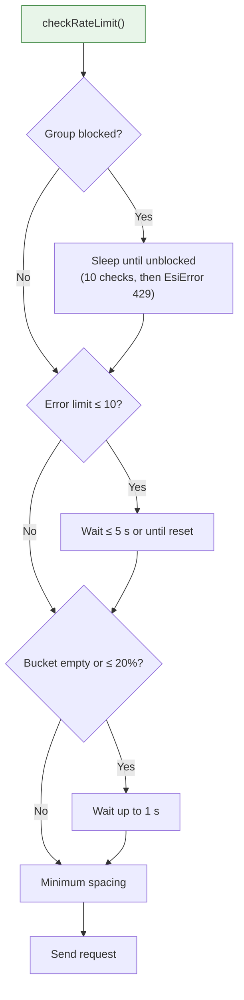
```mermaid
flowchart TB
    start["checkRateLimit()"] --> blocked{"Group blocked?"}
    blocked -->|Yes| wait["Sleep until unblocked<br/>(10 checks, then EsiError 429)"]
    blocked -->|No| legacy{"Error limit ≤ 10?"}
    wait --> legacy
    legacy -->|Yes| slow["Wait ≤ 5 s or until reset"]
    legacy -->|No| bucket{"Bucket empty or ≤ 20%?"}
    slow --> bucket
    bucket -->|Yes| decel["Wait up to 1 s"]
    bucket -->|No| spacing["Minimum spacing"]
    decel --> spacing
    spacing --> pass["Send request"]

    style start fill:#e8f5e9,stroke:#2e7d32
```

---

## 7. Circuit Breaker

The circuit breaker stops sending requests to a key that keeps failing. It is **off by default**; turn it on with `enableCircuitBreaker: true`. `circuitBreakerConfig` on its own does nothing.

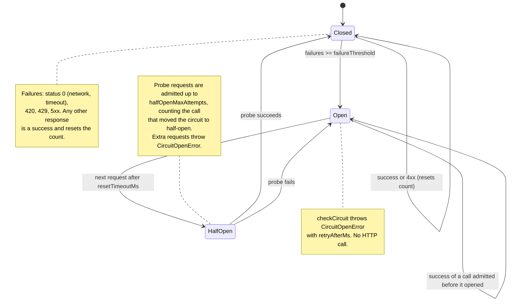
```mermaid
stateDiagram-v2
    [*] --> Closed

    Closed --> Closed: success or 4xx (resets count)
    Closed --> Open: failures >= failureThreshold

    Open --> Open: resetTimeoutMs not elapsed
    Open --> Open: success of a call admitted before it opened
    Open --> HalfOpen: next request after resetTimeoutMs

    HalfOpen --> Closed: probe succeeds
    HalfOpen --> Open: probe fails

    note right of Closed
        Failures: status 0 (network, timeout),
        420, 429, 5xx. Any other response
        is a success and resets the count.
    end note

    note right of Open
        checkCircuit throws CircuitOpenError
        with retryAfterMs. No HTTP call.
    end note

    note left of HalfOpen
        Probe requests are admitted up to
        halfOpenMaxAttempts, counting the call
        that moved the circuit to half-open.
        Extra requests throw CircuitOpenError.
    end note
```

**Where it runs.** In `executeSingleFetch`, after request interceptors and before the rate limiter. A `try/finally` with a `cbRecorded` flag records a failure if anything between the check and the response throws, including a rate-limiter abort, so a half-open probe slot is never leaked. The retry strategy rethrows `CircuitOpenError` without retrying.

**Configuration** (`CircuitBreakerConfig`):

| Option                | Default      | Description                                                                                   |
| --------------------- | ------------ | --------------------------------------------------------------------------------------------- |
| `failureThreshold`    | 5            | Consecutive failures before opening                                                           |
| `resetTimeoutMs`      | 30000        | Time after the last failure before a request may probe                                        |
| `halfOpenMaxAttempts` | 1            | Probe admissions counted in half-open                                                         |
| `keyStrategy`         | `'resolved'` | How requests map to circuits; see below                                                       |
| `staleThresholdMs`    | 3600000      | Age after which a closed, zero-failure circuit is removed by `cleanup()`                      |
| `cleanupIntervalMs`   | disabled     | Runs `cleanup()` on an unref'd timer when set above 0; `staleThresholdMs` is a sensible value |

**Keying.**

| Strategy     | Key                                                        | Effect                                                             |
| ------------ | ---------------------------------------------------------- | ------------------------------------------------------------------ |
| `'resolved'` | Resolved path without query, e.g. `characters/12345/`      | One failing character does not open the circuit for others         |
| `'template'` | Endpoint definition path, e.g. `characters/{characterId}/` | One circuit for the whole endpoint; detects a systemic ESI failure |

**Handling and diagnostics.**

```typescript
import { EsiClient, isCircuitOpen } from '@lgriffin/esi.ts';

const client = new EsiClient({
  enableCircuitBreaker: true,
  circuitBreakerConfig: { keyStrategy: 'template' },
});

try {
  await client.characters.getCharacterPublicInfo(12345);
} catch (err) {
  if (isCircuitOpen(err)) {
    console.log(`${err.endpoint} open, retry in ${err.retryAfterMs} ms`);
  }
}

const stats = client.getCircuitBreakerStats();
// { totalCircuits, openCircuits, circuits: { [key]: { state, failures } } } or null when disabled

client.resetCircuitBreaker('characters/{characterId}/'); // one key, in the format of the active strategy
client.resetCircuitBreaker(); // all circuits

client.shutdown(); // stops the cleanup timer and clears circuits
```

`CircuitOpenError` is not a subclass of `EsiError`. See [ERRORS.md](ERRORS.md).

---

## 8. Interceptors

Interceptors hook into the pipeline for logging, metrics, tracing headers or response transformation. `MiddlewareManager` (`src/core/middleware/Middleware.ts`) holds two ordered lists; `middlewareBridge.ts` applies them.

```typescript
interface RequestContext {
  url: string; // full URL
  endpoint: string; // resolved path
  method: string;
  headers: Record<string, string>; // a copy; return it to apply changes
  body?: unknown;
}

interface ResponseContext {
  url: string;
  endpoint: string;
  method: string;
  status: number;
  headers: Record<string, string>;
  body: unknown;
  durationMs: number;
  fromCache: boolean;
}

type RequestInterceptor = (
  ctx: RequestContext,
) => RequestContext | Promise<RequestContext>;
type ResponseInterceptor = (
  ctx: ResponseContext,
) => ResponseContext | Promise<ResponseContext>;
```

**Registration and removal.** Pass arrays as `requestInterceptors` / `responseInterceptors` in the config, or add them at runtime. Each `add*` returns an unsubscribe function that removes that interceptor.

```typescript
const client = new EsiClient({
  requestInterceptors: [
    (ctx) => ({
      ...ctx,
      headers: { ...ctx.headers, 'X-Trace-Id': crypto.randomUUID() },
    }),
  ],
});

const unsubscribe = client.addResponseInterceptor((ctx) => {
  metrics.histogram('esi.response_ms', ctx.durationMs, {
    status: ctx.status,
    cached: ctx.fromCache,
  });
  return ctx;
});
unsubscribe();
```

**Ordering and scope.**

| Rule                      | Behaviour                                                                                                                     |
| ------------------------- | ----------------------------------------------------------------------------------------------------------------------------- |
| Order                     | Registration order. Each interceptor is awaited and receives the previous one's return value                                  |
| Request interceptors run  | On every HTTP attempt: each retry and each page. After header construction, before the circuit breaker and rate limiter       |
| Request changes applied   | `url`, `headers` and `body`. `method` and `endpoint` are informational                                                        |
| Response interceptors run | Once per `handleRequest` call on the assembled result, including spec-TTL and stale cache hits, after offset pages are merged |
| Response changes applied  | `headers` and `body`. Zod validation runs after, on the modified body                                                         |
| Not run                   | Response interceptors do not run when the call throws, or on the per-page path used by `stream*` and `fetchAll*`              |
| Cost when unused          | Both bridges return immediately when no interceptor is registered                                                             |

An interceptor that throws fails the request with that error. Because request interceptors see the `Authorization` header, treat them as trusted code.

---

## 9. Client Creation Patterns

Three construction surfaces, all wired by `configureApiClient()`, so middleware is identical whichever one is used.

| Pattern              | Use case              | What you get                                                                 |
| -------------------- | --------------------- | ---------------------------------------------------------------------------- |
| **EsiClient**        | Most consumers        | Every domain client as a lazy getter (`client.market`, `client.alliance`, …) |
| **EsiClientBuilder** | Selective             | A `CustomEsiClient` with only the clients you add, and fluent configuration  |
| **EsiApiFactory**    | Single-domain scripts | One domain client on its own `ApiClient`                                     |

`ClientRegistry` maps each client name to its class. `ARCH-08` requires every surface to expose the same set; `CustomEsiClient` has a getter for every registered client, checked at compile time by `tests/tdd/core/customClientGetters.test.ts`; `EsiApiFactory` covers only 10 clients.

Timers are owned by the client: call `shutdown()` to stop the cache sweep and circuit-breaker cleanup and clear the deduplicator.

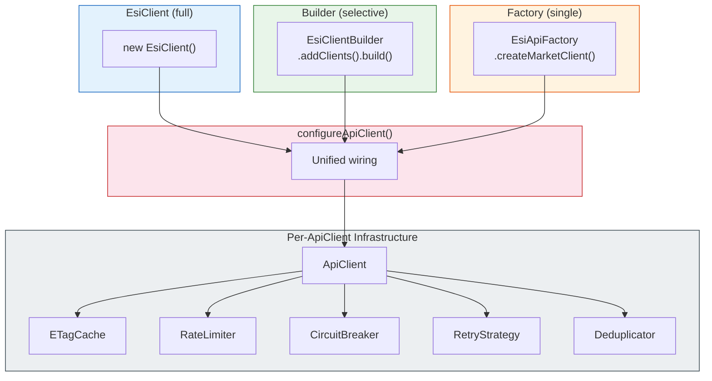
```mermaid
flowchart TB
    subgraph P1 ["EsiClient (full)"]
        p1["new EsiClient()"]
    end
    subgraph P2 ["Builder (selective)"]
        p2["EsiClientBuilder\n.addClients().build()"]
    end
    subgraph P3 ["Factory (single)"]
        p3["EsiApiFactory\n.createMarketClient()"]
    end

    subgraph CW ["configureApiClient()"]
        cw["Unified wiring"]
    end

    subgraph Infra ["Per-ApiClient Infrastructure"]
        ac["ApiClient"]
        cache["ETagCache"]
        rl["RateLimiter"]
        cb["CircuitBreaker"]
        retry["RetryStrategy"]
        dedup["Deduplicator"]
    end

    p1 --> cw
    p2 --> cw
    p3 --> cw
    cw --> ac
    ac --> cache
    ac --> rl
    ac --> cb
    ac --> retry
    ac --> dedup

    style P1 fill:#e3f2fd,stroke:#1565c0
    style P2 fill:#e8f5e9,stroke:#2e7d32
    style P3 fill:#fff3e0,stroke:#e65100
    style CW fill:#fce4ec,stroke:#c62828
    style Infra fill:#eceff1,stroke:#37474f
```

---

## 10. Response and Request Validation

Validation lives in `createClient()`, so it is centralised rather than repeated in each domain client. Response validation is on by default; request validation is opt-in. The full guide, including schema conventions and how to extend a schema, is [RUNTIME-VALIDATION.md](RUNTIME-VALIDATION.md).

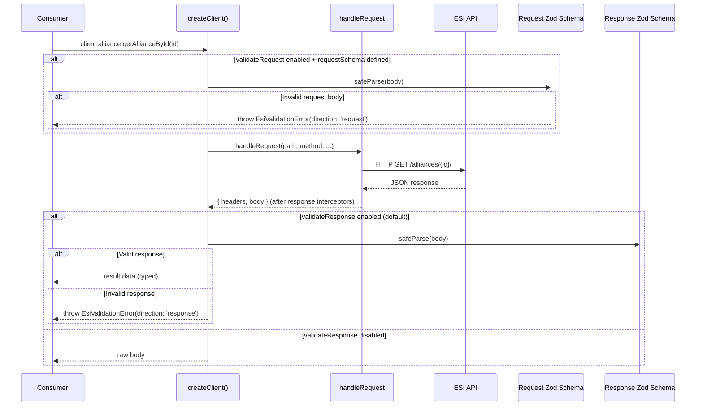
```mermaid
sequenceDiagram
    participant Consumer
    participant CreateClient as createClient()
    participant Handler as handleRequest
    participant ESI as ESI API
    participant ReqSchema as Request Zod Schema
    participant RespSchema as Response Zod Schema

    Consumer->>CreateClient: client.alliance.getAllianceById(id)

    alt validateRequest enabled + requestSchema defined
        CreateClient->>ReqSchema: safeParse(body)
        alt Invalid request body
            ReqSchema-->>Consumer: throw EsiValidationError(direction: 'request')
        end
    end

    CreateClient->>Handler: handleRequest(path, method, ...)
    Handler->>ESI: HTTP GET /alliances/{id}/
    ESI-->>Handler: JSON response
    Handler-->>CreateClient: { headers, body } (after response interceptors)

    alt validateResponse enabled (default)
        CreateClient->>RespSchema: safeParse(body)
        alt Valid response
            CreateClient-->>Consumer: result.data (typed)
        else Invalid response
            CreateClient-->>Consumer: throw EsiValidationError(direction: 'response')
        end
    else validateResponse disabled
        CreateClient-->>Consumer: raw body
    end
```

- **Loose objects.** Schemas use `z.looseObject()`, so fields ESI adds later survive `safeParse().data` (`DES-01`).
- **Typed returns.** `InferEndpointResult<D>` is `z.infer` of the response schema; cursor endpoints return `CursorResult<Element>`.
- **Drift.** `npm run schema:drift` compares the hand-written schemas with the live OpenAPI spec.

---

## 11. Pagination and Streaming

ESI pages data two ways, and the library exposes three styles on top. The full guide, with concurrency defaults and failure semantics, is [PAGINATION.md](PAGINATION.md).

| Style             | Entry point                                             | Path through the pipeline                                                                                |
| ----------------- | ------------------------------------------------------- | -------------------------------------------------------------------------------------------------------- |
| Eager offset      | Any paginated domain method                             | `executeRequest` reads `x-pages`, fetches the rest and returns one merged array                          |
| Streaming offset  | `stream*` methods, `BaseEsiClient.streamEndpoint()`     | `AsyncPaginationIterator.fetchPages()` yields one validated page at a time via `handleSinglePageRequest` |
| Concurrent offset | `fetchAll*` methods, `BaseEsiClient.fetchAllEndpoint()` | `fetchAllPages()` fetches page 1, then the rest in batches, via `handleSinglePageRequest`                |
| Cursor            | Endpoints with `cursorPagination`                       | `createClient` appends `before` / `after`; result is `CursorResult` with `cursors`                       |

`handleSinglePageRequest` applies retry, the circuit breaker, the rate limiter and request interceptors, but not the spec-TTL cache, deduplication, cache writes or response interceptors.

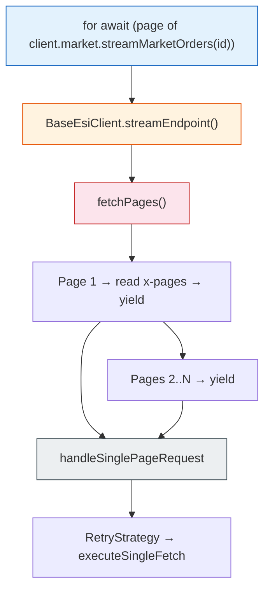
```mermaid
flowchart TB
    fa["for await (page of client.market.streamMarketOrders(id))"] --> se["BaseEsiClient.streamEndpoint()"]
    se --> fp["fetchPages()"]
    fp --> p1["Page 1 → read x-pages → yield"]
    p1 --> pn["Pages 2..N → yield"]
    p1 --> sp["handleSinglePageRequest"]
    pn --> sp
    sp --> retry["RetryStrategy → executeSingleFetch"]

    style fa fill:#e3f2fd,stroke:#1565c0
    style se fill:#fff3e0,stroke:#e65100
    style fp fill:#fce4ec,stroke:#c62828
    style sp fill:#eceff1,stroke:#37474f
```

---

## 12. Errors

```
Error
├── EsiError (statusCode, sanitised url, requestId)      .retryable ⇐ {0, 420, 429, 502, 503, 504}
│   ├── TimeoutError (+ timeoutMs)
│   └── EsiValidationError (+ ZodError, direction: request | response)
├── CircuitOpenError (endpoint, failures, retryAfterMs)   not an EsiError
└── SdeError → SdeDatabaseError | SdeValidationError | SdeVersionMismatchError
```

Configuration and plumbing faults (`NO_AUTH_TOKEN`, `CONFIGURATION_ERROR`, `JSON_PARSE_ERROR`, `TOKEN_REFRESH_FAILED`, …) are still plain `Error`s with a type prefix; `ARCH-07` records that as a gap. Guards, safe mode and the full retryability rules are in [ERRORS.md](ERRORS.md).

---

## 13. Logging

Pipeline code logs through `logInfo` / `logWarn` / … in `src/core/logger/clientLog.ts`, which resolve the logger per call: the client's own logger, then the global logger from `setLogger()`, then the pino default at `ESI_LOG_LEVEL` (default `warn`). `ARCH-09` requires all pipeline logging to take the per-client route; the rate limiter still logs with no client handle and so reaches the global logger. See [LOGGING.md](LOGGING.md).

---

## 14. Code Generation

`npm run generate:types` reads the live ESI OpenAPI spec and writes four artefacts (`ARCH-01`):

| Artefact                                                | Consumed by                                                |
| ------------------------------------------------------- | ---------------------------------------------------------- |
| `src/types/generated/esi-spec.generated.ts`             | The `EsiSpec` type namespace and `spec-alignment.check.ts` |
| `src/core/endpoints/esi-cache-ttls.generated.ts`        | Spec-aware caching (`lookupSpecTtl`)                       |
| `src/core/endpoints/esi-rate-limit-groups.generated.ts` | `RateLimiter` group buckets                                |
| `src/core/endpoints/esi-scopes.generated.ts`            | `validate:auth-scopes`, scope lookups for consumers        |

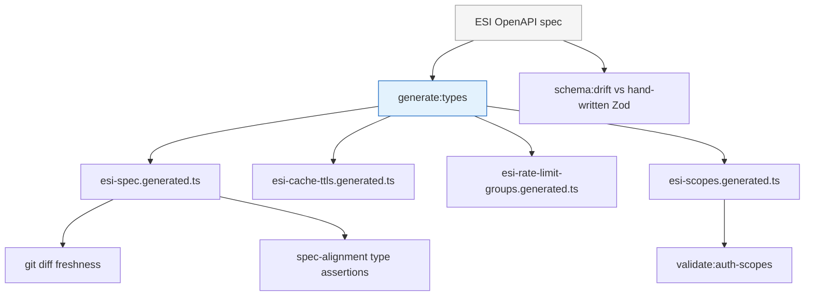
```mermaid
flowchart TB
    spec["ESI OpenAPI spec"] --> gen["generate:types"]
    gen --> types["esi-spec.generated.ts"]
    gen --> ttls["esi-cache-ttls.generated.ts"]
    gen --> rates["esi-rate-limit-groups.generated.ts"]
    gen --> scopes["esi-scopes.generated.ts"]

    types --> fresh["git diff freshness"]
    types --> align["spec-alignment type assertions"]
    scopes --> auth["validate:auth-scopes"]
    spec --> drift["schema:drift vs hand-written Zod"]

    style spec fill:#f5f5f5,stroke:#999
    style gen fill:#e3f2fd,stroke:#1565c0
```

| Check                         | Mechanism                                                       | What it catches                                                      |
| ----------------------------- | --------------------------------------------------------------- | -------------------------------------------------------------------- |
| Generated freshness           | `git diff --exit-code` after regeneration                       | Stale generated files after an ESI spec change                       |
| Auth / scope cross-validation | `scripts/validate-auth-scopes.ts`                               | `requiresAuth` disagreeing with the scope map (`DES-04`)             |
| Spec-alignment assertions     | `AssertTrue<HasAllSpecKeys<SpecType, ZodType>>` at compile time | A hand-written schema missing a field the spec defines               |
| Schema drift                  | `npm run schema:drift`                                          | Hand-written schemas diverging from the spec's field names and types |

Generated files are never edited by hand (`DES-03`). Where each check runs in CI is in [QUALITY-GATES.md](QUALITY-GATES.md); supply-chain controls such as SHA-pinned actions and npm provenance are in [SECURITY.md](SECURITY.md); the test tiers are in [TESTING.md](TESTING.md).
