# ESI.ts Architecture

## C4 Model

### C4 Context Diagram

System context showing ESI.ts in its operating environment.

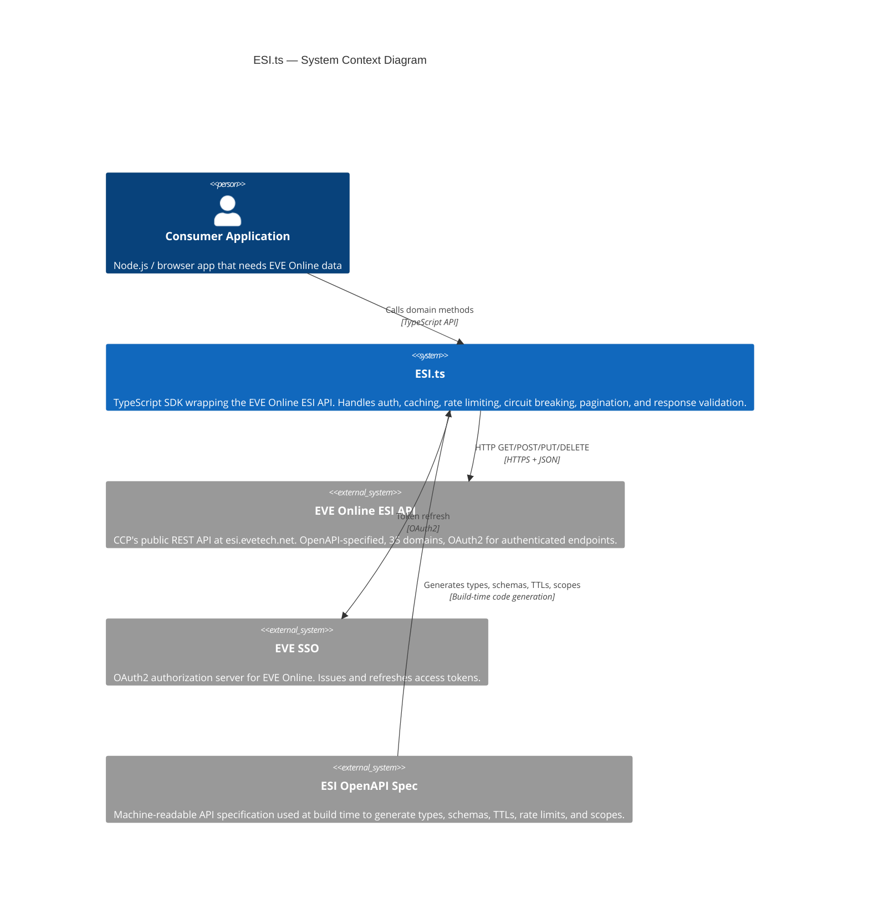
```mermaid
C4Context
    title ESI.ts — System Context Diagram

    Person(consumer, "Consumer Application", "Node.js / browser app that needs EVE Online data")

    System(esits, "ESI.ts", "TypeScript SDK wrapping the EVE Online ESI API. Handles auth, caching, rate limiting, circuit breaking, pagination, and response validation.")

    System_Ext(esi, "EVE Online ESI API", "CCP's public REST API at esi.evetech.net. OpenAPI-specified, 35 domains, OAuth2 for authenticated endpoints.")
    System_Ext(sso, "EVE SSO", "OAuth2 authorization server for EVE Online. Issues and refreshes access tokens.")
    System_Ext(spec, "ESI OpenAPI Spec", "Machine-readable API specification used at build time to generate types, schemas, TTLs, rate limits, and scopes.")

    Rel(consumer, esits, "Calls domain methods", "TypeScript API")
    Rel(esits, esi, "HTTP GET/POST/PUT/DELETE", "HTTPS + JSON")
    Rel(esits, sso, "Token refresh", "OAuth2")
    Rel(spec, esits, "Generates types, schemas, TTLs, scopes", "Build-time code generation")
```

### C4 Container Diagram

Major containers (layers) within ESI.ts and their relationships.

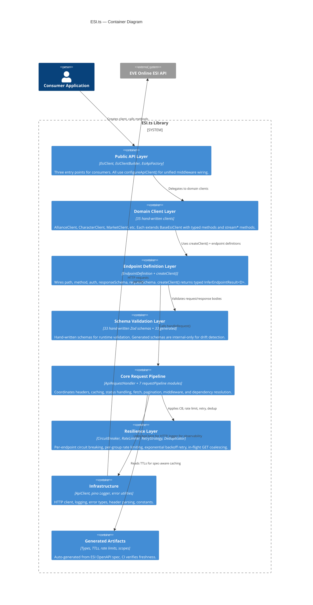
```mermaid
C4Container
    title ESI.ts — Container Diagram

    Person(consumer, "Consumer Application", "")

    System_Boundary(esits, "ESI.ts Library") {
        Container(publicApi, "Public API Layer", "EsiClient, EsiClientBuilder, EsiApiFactory", "Three entry points for consumers. All use configureApiClient() for unified middleware wiring.")
        Container(domainClients, "Domain Client Layer", "35 hand-written clients", "AllianceClient, CharacterClient, MarketClient, etc. Each extends BaseEsiClient with typed methods and stream* methods.")
        Container(endpointDefs, "Endpoint Definition Layer", "EndpointDefinition + createClient()", "Wires path, method, auth, responseSchema, requestSchema. createClient() returns typed InferEndpointResult<D>.")
        Container(schemas, "Schema Validation Layer", "33 hand-written Zod schemas + 33 generated", "Hand-written schemas for runtime validation. Generated schemas are internal-only for drift detection.")
        Container(pipeline, "Core Request Pipeline", "ApiRequestHandler + 7 requestPipeline modules", "Coordinates headers, caching, status handling, fetch, pagination, middleware, and dependency resolution.")
        Container(resilience, "Resilience Layer", "CircuitBreaker, RateLimiter, RetryStrategy, Deduplicator", "Per-endpoint circuit breaking, per-group rate limiting, exponential backoff retry, in-flight GET coalescing.")
        Container(infra, "Infrastructure", "ApiClient, pino Logger, error utilities", "HTTP client, logging, error types, header parsing, constants.")
        Container(generated, "Generated Artifacts", "Types, TTLs, rate limits, scopes", "Auto-generated from ESI OpenAPI spec. CI verifies freshness.")
    }

    System_Ext(esi, "EVE Online ESI API", "")

    Rel(consumer, publicApi, "Creates client, calls methods")
    Rel(publicApi, domainClients, "Delegates to domain clients")
    Rel(domainClients, endpointDefs, "Uses createClient() + endpoint definitions")
    Rel(endpointDefs, schemas, "Validates request/response bodies")
    Rel(endpointDefs, pipeline, "Calls handleRequest()")
    Rel(pipeline, resilience, "Applies CB, rate limit, retry, dedup")
    Rel(pipeline, infra, "Uses ApiClient for HTTP, logger for observability")
    Rel(pipeline, generated, "Reads TTLs for spec-aware caching")
    Rel(infra, esi, "HTTP requests", "HTTPS")
```

### C4 Component Diagram — Core Request Pipeline

Components within the `src/core/requestPipeline/` module and the coordinator.

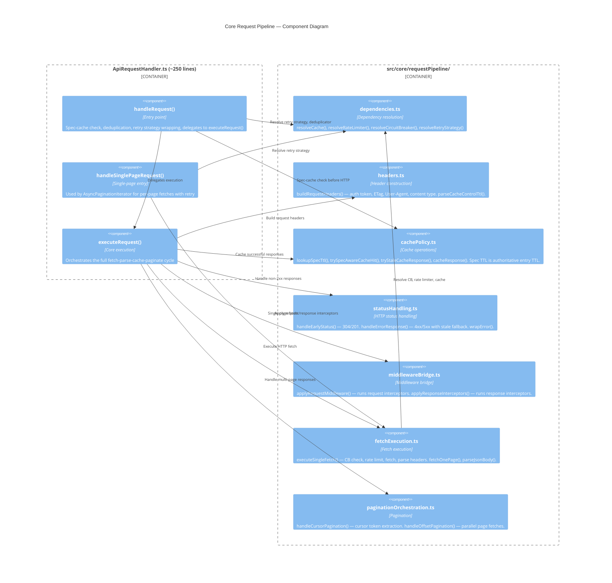
```mermaid
C4Component
    title Core Request Pipeline — Component Diagram

    Container_Boundary(coordinator, "ApiRequestHandler.ts (~250 lines)") {
        Component(handleReq, "handleRequest()", "Entry point", "Spec-cache check, deduplication, retry strategy wrapping, delegates to executeRequest()")
        Component(handleSingle, "handleSinglePageRequest()", "Single-page entry", "Used by AsyncPaginationIterator for per-page fetches with retry")
        Component(execReq, "executeRequest()", "Core execution", "Orchestrates the full fetch-parse-cache-paginate cycle")
    }

    Container_Boundary(pipelineMods, "src/core/requestPipeline/") {
        Component(deps, "dependencies.ts", "Dependency resolution", "resolveCache(), resolveRateLimiter(), resolveCircuitBreaker(), resolveRetryStrategy()")
        Component(headers, "headers.ts", "Header construction", "buildRequestHeaders() — auth token, ETag, User-Agent, content type. parseCacheControlTtl().")
        Component(cache, "cachePolicy.ts", "Cache operations", "lookupSpecTtl(), trySpecAwareCacheHit(), tryStaleCacheResponse(), cacheResponse(). Spec TTL is authoritative entry TTL.")
        Component(status, "statusHandling.ts", "HTTP status handling", "handleEarlyStatus() — 304/201. handleErrorResponse() — 4xx/5xx with stale fallback. wrapError().")
        Component(mwBridge, "middlewareBridge.ts", "Middleware bridge", "applyRequestMiddleware() — runs request interceptors. applyResponseInterceptors() — runs response interceptors.")
        Component(fetchExec, "fetchExecution.ts", "Fetch execution", "executeSingleFetch() — CB check, rate limit, fetch, parse headers. fetchOnePage(), parseJsonBody().")
        Component(pagOrch, "paginationOrchestration.ts", "Pagination", "handleCursorPagination() — cursor token extraction. handleOffsetPagination() — parallel page fetches.")
    }

    Rel(handleReq, cache, "Spec-cache check before HTTP")
    Rel(handleReq, deps, "Resolve retry strategy, deduplicator")
    Rel(handleReq, execReq, "Delegates execution")
    Rel(handleSingle, fetchExec, "Single page fetch")
    Rel(handleSingle, deps, "Resolve retry strategy")
    Rel(execReq, headers, "Build request headers")
    Rel(execReq, mwBridge, "Apply request/response interceptors")
    Rel(execReq, fetchExec, "Execute HTTP fetch")
    Rel(execReq, status, "Handle non-2xx responses")
    Rel(execReq, cache, "Cache successful responses")
    Rel(execReq, pagOrch, "Handle multi-page responses")
    Rel(fetchExec, deps, "Resolve CB, rate limiter, cache")
```

### C4 Component Diagram — Resilience Components

How the resilience components compose in the request path.

```mermaid
C4Component
    title Resilience Components — Component Diagram

    Container_Boundary(pipeline, "Request Pipeline") {
        Component(handler, "handleRequest()", "", "Entry point — wraps operation in RetryStrategy.execute()")
        Component(dedup, "RequestDeduplicator", "IDeduplicator", "In-flight coalescing for identical GET requests. Same URL+method → single fetch, shared promise.")
        Component(execReq, "executeRequest()", "", "Core execution — calls CB, rate limiter, then fetch")
    }

    Container_Boundary(resilienceLayer, "Resilience Components") {
        Component(retry, "RetryStrategy", "IRetryStrategy", "Exponential backoff with jitter. Retries 5xx, 429, timeouts. Skips non-retryable errors. Supports 401 token refresh callback.")
        Component(cb, "CircuitBreaker", "ICircuitBreaker", "Per-endpoint state machine (closed/open/half-open). keyStrategy: 'resolved' (per-URL) or 'template' (per-endpoint-group). Configurable cleanup timer + destroy().")
        Component(rl, "RateLimiter", "IRateLimiter", "Per-group token buckets (36 groups from spec). Per-user bucketing opt-in. Proactive deceleration at 20% remaining. Server-synced via response headers.")
    end

    Container_Boundary(caching, "Caching") {
        Component(etag, "ETagCacheManager", "ICache", "Spec-aware TTL cache + conditional requests via If-None-Match. Spec TTL is authoritative entry TTL. Stale fallback on 5xx.")
    }

    Rel(handler, retry, "1. Wraps operation in retry loop")
    Rel(handler, dedup, "2. Deduplicates GET requests")
    Rel(retry, execReq, "3. Executes operation (with retries)")
    Rel(execReq, cb, "4. Check circuit state")
    Rel(execReq, rl, "5. Check/decelerate rate limit")
    Rel(execReq, etag, "6. ETag cache lookup + store")

    UpdateRelStyle(handler, retry, $offsetX="-40", $offsetY="-10")
```

---

## 1. Clean Architecture Layers

Dependency direction flows inward. Outer layers depend on inner layers, never the reverse.


```mermaid
graph TB
    subgraph External["External"]
        ESI["ESI API<br/>(esi.evetech.net)"]
        Consumer["Consumer Application"]
    end

    subgraph PublicAPI["Public API Layer"]
        EsiClient["EsiClient"]
        EsiClientBuilder["EsiClientBuilder"]
        EsiApiFactory["EsiApiFactory"]
        Index["index.ts exports"]
    end

    subgraph DomainClients["Domain Client Layer (35 domain clients)"]
        Alliance["AllianceClient"]
        Character["CharacterClient"]
        Market["MarketClient"]
        Universe["UniverseClient"]
        More["... 28 more"]
    end

    subgraph EndpointLayer["Endpoint Definition Layer"]
        EndpointDef["EndpointDefinition<br/>(responseSchema + requestSchema)"]
        EndpointFiles["*Endpoints.ts (35 files)"]
        CreateClient["createClient()<br/>→ InferEndpointResult&lt;D&gt;"]
        Registry["ClientRegistry"]
    end

    subgraph SchemaLayer["Schema Validation Layer (Zod)"]
        Schemas["src/schemas/ (33 hand-written)"]
        GenSchemas["src/schemas/generated/<br/>(33 files, internal-only)"]
        SchemaValidation["Runtime Validation"]
    end

    subgraph CoreLayer["Core Request Orchestration"]
        ConfigureClient["configureApiClient()"]
        Pipeline["src/core/requestPipeline/<br/>(7 modules)"]
        Handler["ApiRequestHandler<br/>(~250 line coordinator)"]
        SpecTtlCache["Spec-Aware Cache (TTL bypass)"]
        BatchHandler["BatchRequestHandler"]
        Middleware["MiddlewareManager"]
        RateLimiter["RateLimiter"]
        CircuitBreaker["CircuitBreaker"]
        Cache["ETagCacheManager"]
        Pagination["PaginationHandler"]
        CursorPagination["CursorPaginationHandler"]
        AsyncPaginator["AsyncPaginationIterator"]
        TokenRefresh["Token Refresh"]
    end

    subgraph GeneratedLayer["Generated (from ESI OpenAPI Spec)"]
        GenTypes["esi-spec.generated.ts (161 interfaces)"]
        GenTtls["esi-cache-ttls.generated.ts (126 TTLs)"]
        GenRateLimits["esi-rate-limit-groups.generated.ts"]
        GenScopes["esi-scopes.generated.ts"]
    end

    subgraph Interfaces["Interface Contracts"]
        ICache["ICache"]
        IRateLimiter["IRateLimiter"]
        ICB["ICircuitBreaker"]
        IRetry["IRetryStrategy"]
        IDedup["IDeduplicator"]
        ILogger["ILogger"]
    end

    subgraph Infrastructure["Infrastructure Layer"]
        ApiClient["ApiClient"]
        HeadersUtil["parseHeaders()"]
        Validation["validation"]
        ErrorUtil["EsiError, EsiValidationError"]
        Logger["pino Logger"]
        Constants["constants"]
    end

    Consumer --> Index
    Index --> EsiClient
    Index --> EsiClientBuilder
    Index --> EsiApiFactory

    EsiClient --> Alliance
    EsiClient --> Character
    EsiClient --> Market
    EsiClient --> Universe
    EsiClient --> More

    Alliance --> CreateClient
    Character --> CreateClient
    Market --> CreateClient
    Universe --> CreateClient

    CreateClient --> EndpointDef
    CreateClient --> EndpointFiles
    CreateClient --> SchemaValidation
    CreateClient --> Handler

    SchemaValidation --> Schemas
    GenSchemas -.->|"drift detection only"| Schemas

    Registry --> Alliance
    Registry --> Character
    Registry --> Market
    Registry --> Universe

    EsiClient --> ConfigureClient
    EsiApiFactory --> ConfigureClient
    ConfigureClient --> ApiClient

    Handler --> Pipeline
    Pipeline --> SpecTtlCache
    SpecTtlCache --> Cache
    SpecTtlCache --> GenTtls
    Pipeline --> Middleware
    Pipeline --> RateLimiter
    Pipeline --> CircuitBreaker
    Pipeline --> Cache
    Pipeline --> Pagination
    Pipeline --> TokenRefresh
    EsiClient --> BatchHandler
    BatchHandler --> Handler

    Cache -.->|implements| ICache
    RateLimiter -.->|implements| IRateLimiter
    CircuitBreaker -.->|implements| ICB
    Logger -.->|implements| ILogger

    Handler --> ApiClient
    Handler --> HeadersUtil
    Handler --> Validation
    Handler --> ErrorUtil
    Handler --> Constants

    ApiClient --> ESI

    style External fill:#f5f5f5,stroke:#999
    style PublicAPI fill:#e3f2fd,stroke:#1565c0
    style DomainClients fill:#e8f5e9,stroke:#2e7d32
    style EndpointLayer fill:#fff3e0,stroke:#e65100
    style SchemaLayer fill:#e0f7fa,stroke:#00838f
    style CoreLayer fill:#fce4ec,stroke:#c62828
    style Interfaces fill:#f3e5f5,stroke:#6a1b9a
    style Infrastructure fill:#eceff1,stroke:#37474f
    style GeneratedLayer fill:#e8eaf6,stroke:#283593
```

**Key changes from previous iteration:**

- **Request pipeline decomposed**: `ApiRequestHandler` is now a thin ~250-line coordinator. Seven focused modules in `src/core/requestPipeline/` handle headers, caching, status, pagination, middleware, fetch execution, and dependency resolution.
- **`configureApiClient()`**: Single factory function (`src/core/configureApiClient.ts`) that wires middleware for all three client creation surfaces (EsiClient, CustomEsiClient, EsiApiFactory). Eliminates silent middleware gaps between construction paths.
- **`IRetryStrategy` interface**: Retry logic is now behind `IRetryStrategy`, joinining ICache, IRateLimiter, ICircuitBreaker, and IDeduplicator as swappable strategy contracts.
- **Typed `createClient()` returns**: `InferEndpointResult<D>` uses `z.infer<>` on the endpoint's `responseSchema` to produce typed return values. No more `Promise<unknown>` or `as Promise<X>` casts.
- **Request body validation**: `EndpointDefinition` now supports `requestSchema` (Zod). When `validateRequest` is enabled on the client, request bodies are validated before HTTP calls.
- **Generated schemas internal-only**: `src/schemas/generated/` (33 per-domain files auto-generated from OpenAPI spec) are not exported from the public API. They are used exclusively for schema drift detection (`npm run schema:drift`).

## 2. Request Lifecycle

Complete flow from consumer call to ESI response, showing the decomposed pipeline modules.

```mermaid
sequenceDiagram
    participant App as Consumer
    participant Client as EsiClient
    participant Domain as DomainClient
    participant Create as createClient()
    participant Handler as handleRequest()
    participant Headers as headers.ts
    participant MWBridge as middlewareBridge.ts
    participant FetchExec as fetchExecution.ts
    participant CacheP as cachePolicy.ts
    participant PagOrch as paginationOrchestration.ts
    participant StatusH as statusHandling.ts
    participant CB as CircuitBreaker
    participant RL as RateLimiter
    participant Cache as ETagCache
    participant ESI as ESI API

    App->>Client: client.market.getMarketPrices()
    Client->>Domain: MarketClient.getMarketPrices()
    Domain->>Create: validate params, build path

    Note over Create: Opt-in request body validation
    alt validateRequest enabled + requestSchema defined
        Create->>Create: def.requestSchema.safeParse(body)
        alt Invalid request
            Create-->>App: throw EsiValidationError(direction: 'request')
        end
    end

    Create->>Handler: handleRequest(client, endpoint, method, templatePath)

    Note over Handler: Spec-aware cache check (before any HTTP)
    Handler->>CacheP: trySpecAwareCacheHit(url, method, templatePath)
    alt Within spec TTL
        CacheP-->>Handler: cached data (zero HTTP calls)
        Handler-->>App: { body, fromCache: true }
    end

    Note over Handler: RetryStrategy.execute() wraps the operation

    Note over Handler: executeRequest begins

    Handler->>Headers: buildRequestHeaders(auth, ETag, UA)
    Handler->>Cache: getETag(url)
    Cache-->>Handler: If-None-Match header

    Handler->>MWBridge: applyRequestMiddleware(context)
    MWBridge-->>Handler: modified headers/url/body

    Handler->>CB: checkCircuit(cbKey)
    Note over CB: cbKey from keyStrategy:<br/>'resolved' (default) or 'template'
    alt Circuit Open
        CB-->>Handler: throw CircuitOpenError
    end

    Handler->>RL: checkRateLimit()
    alt Rate Limited
        RL-->>RL: sleep(waitTime)
    end

    Handler->>FetchExec: executeSingleFetch(client, endpoint, ...)
    FetchExec->>ESI: HTTP request
    ESI-->>FetchExec: HTTP response

    FetchExec->>FetchExec: parseHeaders(response)
    FetchExec->>RL: updateFromResponse(headers, status)

    FetchExec->>CB: recordSuccess/Failure(cbKey)

    alt Status 304
        Handler->>StatusH: handleEarlyStatus()
        StatusH->>Cache: get(url)
        Cache-->>Handler: cached data + headers
    else Status 2xx
        Handler->>FetchExec: parseJsonBody()
        Handler->>CacheP: cacheResponse(url, method, endpoint, ...)
        Note over CacheP: Spec TTL is authoritative entry TTL
        alt Multi-page (x-pages > 1)
            Handler->>PagOrch: handleOffsetPagination()
        else Cursor pagination
            Handler->>PagOrch: handleCursorPagination()
        end
    else Status 401 + TokenProvider
        Handler->>Handler: refreshToken()
        Handler->>Handler: retry executeRequest
    else Status 5xx + Cache
        Handler->>StatusH: handleErrorResponse()
        StatusH->>Cache: get(url) stale
        Cache-->>Handler: stale cached data
    else Status 4xx/5xx
        Handler->>StatusH: handleErrorResponse()
        StatusH-->>App: throw EsiError
    end

    Handler->>MWBridge: applyResponseInterceptors(context)
    MWBridge-->>Handler: modified body/headers

    Handler-->>App: { headers, body, fromCache?, cursors? }
```

## 3. Dependency Injection

Dependencies are scoped to each `ApiClient` instance. There are no global singletons or fallbacks -- when a dependency is `null`, that feature is simply disabled for that client.

`configureApiClient()` (`src/core/configureApiClient.ts`) is the single wiring point used by all three client construction surfaces (EsiClient, CustomEsiClient, EsiApiFactory).

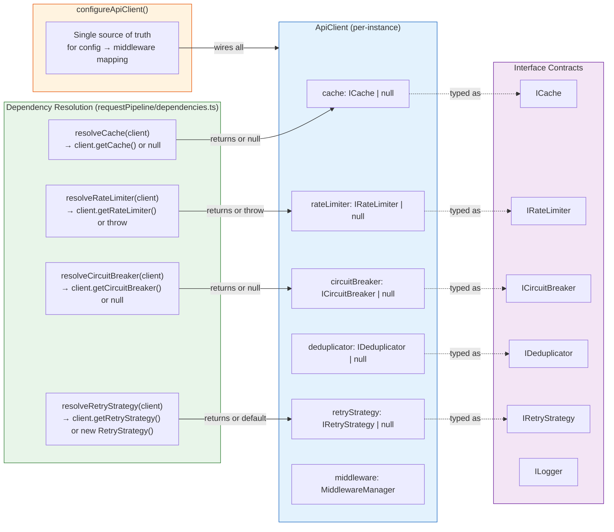
```mermaid
graph LR
    subgraph ConfigFactory["configureApiClient()"]
        Wire["Single source of truth<br/>for config → middleware mapping"]
    end

    subgraph ApiClient["ApiClient (per-instance)"]
        ClientCache["cache: ICache | null"]
        ClientRL["rateLimiter: IRateLimiter | null"]
        ClientCB["circuitBreaker: ICircuitBreaker | null"]
        ClientDedup["deduplicator: IDeduplicator | null"]
        ClientRetry["retryStrategy: IRetryStrategy | null"]
        ClientMW["middleware: MiddlewareManager"]
    end

    subgraph Resolution["Dependency Resolution (requestPipeline/dependencies.ts)"]
        ResolveCache["resolveCache(client)<br/>→ client.getCache() or null"]
        ResolveRL["resolveRateLimiter(client)<br/>→ client.getRateLimiter() or throw"]
        ResolveCB["resolveCircuitBreaker(client)<br/>→ client.getCircuitBreaker() or null"]
        ResolveRetry["resolveRetryStrategy(client)<br/>→ client.getRetryStrategy() or new RetryStrategy()"]
    end

    subgraph Interfaces["Interface Contracts"]
        ICache["ICache"]
        IRateLimiter["IRateLimiter"]
        ICB["ICircuitBreaker"]
        IDedup["IDeduplicator"]
        IRetry["IRetryStrategy"]
        ILogger["ILogger"]
    end

    Wire -->|"wires all"| ApiClient

    ResolveCache -->|"returns or null"| ClientCache
    ResolveRL -->|"returns or throw"| ClientRL
    ResolveCB -->|"returns or null"| ClientCB
    ResolveRetry -->|"returns or default"| ClientRetry

    ClientCache -.->|typed as| ICache
    ClientRL -.->|typed as| IRateLimiter
    ClientCB -.->|typed as| ICB
    ClientDedup -.->|typed as| IDedup
    ClientRetry -.->|typed as| IRetry

    style Interfaces fill:#f3e5f5,stroke:#6a1b9a
    style Resolution fill:#e8f5e9,stroke:#2e7d32
    style ApiClient fill:#e3f2fd,stroke:#1565c0
    style ConfigFactory fill:#fff3e0,stroke:#e65100
```

## 4. Circuit Breaker State Machine

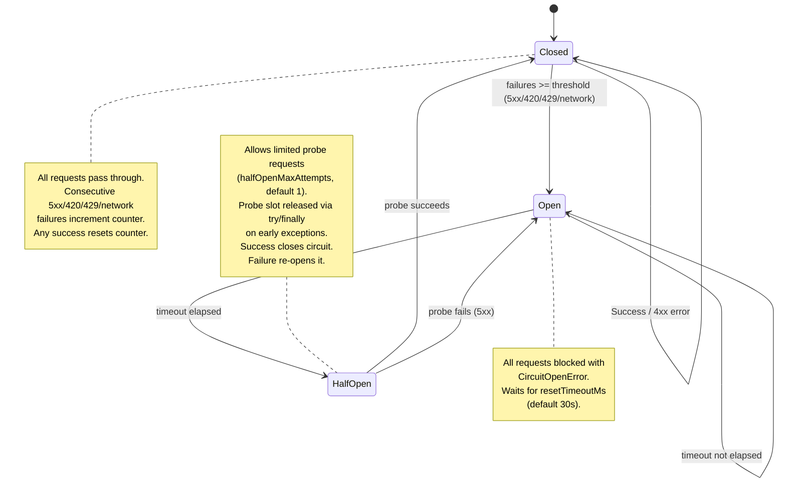
```mermaid
stateDiagram-v2
    [*] --> Closed

    Closed --> Closed: Success / 4xx error
    Closed --> Open: failures >= threshold (5xx/420/429/network)

    Open --> Open: timeout not elapsed
    Open --> HalfOpen: timeout elapsed

    HalfOpen --> Closed: probe succeeds
    HalfOpen --> Open: probe fails (5xx)

    note right of Closed
        All requests pass through.
        Consecutive 5xx/420/429/network
        failures increment counter.
        Any success resets counter.
    end note

    note right of Open
        All requests blocked with
        CircuitOpenError.
        Waits for resetTimeoutMs
        (default 30s).
    end note

    note left of HalfOpen
        Allows limited probe requests
        (halfOpenMaxAttempts, default 1).
        Probe slot released via try/finally
        on early exceptions.
        Success closes circuit.
        Failure re-opens it.
    end note
```

**Configuration options:**

| Option                | Default      | Description                                                                                                       |
| --------------------- | ------------ | ----------------------------------------------------------------------------------------------------------------- |
| `failureThreshold`    | 5            | Consecutive failures before opening                                                                               |
| `resetTimeoutMs`      | 30000        | Time before transition to half-open                                                                               |
| `halfOpenMaxAttempts` | 1            | Probes allowed in half-open                                                                                       |
| `staleThresholdMs`    | 3600000      | Age before a closed circuit is eligible for cleanup                                                               |
| `keyStrategy`         | `'resolved'` | `'resolved'` uses full resolved URL (per-resource); `'template'` uses endpoint template path (per-endpoint-group) |
| `cleanupIntervalMs`   | disabled     | Opt-in scheduled cleanup interval for stale circuits                                                              |

**`destroy()` method**: Clears the cleanup timer and all circuit records. Call on shutdown to prevent leaked timers.

## 5. CI/CD Pipeline

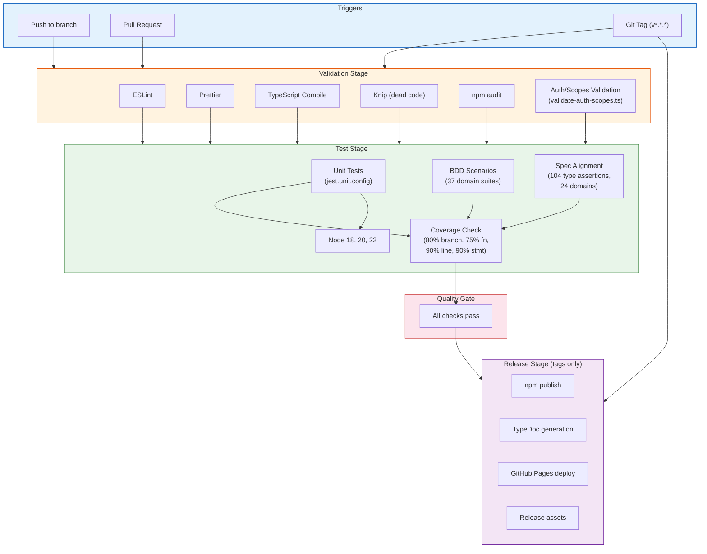
```mermaid
graph TB
    subgraph Trigger["Triggers"]
        Push["Push to branch"]
        PR["Pull Request"]
        Tag["Git Tag (v*.*.*)"]
    end

    subgraph Validation["Validation Stage"]
        Lint["ESLint"]
        Format["Prettier"]
        Build["TypeScript Compile"]
        Knip["Knip (dead code)"]
        Audit["npm audit"]
        AuthScopes["Auth/Scopes Validation<br/>(validate-auth-scopes.ts)"]
    end

    subgraph Testing["Test Stage"]
        Unit["Unit Tests<br/>(jest.unit.config)"]
        BDD["BDD Scenarios<br/>(37 domain suites)"]
        SpecAlign["Spec Alignment<br/>(104 type assertions,<br/>24 domains)"]
        Coverage["Coverage Check<br/>(80% branch, 75% fn,<br/>90% line, 90% stmt)"]
        Matrix["Node 18, 20, 22"]
    end

    subgraph Quality["Quality Gate"]
        Gate["All checks pass"]
    end

    subgraph Release["Release Stage (tags only)"]
        NPM["npm publish"]
        Docs["TypeDoc generation"]
        Pages["GitHub Pages deploy"]
        Assets["Release assets"]
    end

    Push --> Validation
    PR --> Validation
    Tag --> Validation

    Lint --> Testing
    Format --> Testing
    Build --> Testing
    Knip --> Testing
    Audit --> Testing
    AuthScopes --> Testing

    Unit --> Coverage
    BDD --> Coverage
    SpecAlign --> Coverage
    Unit --> Matrix

    Coverage --> Gate

    Tag --> Release
    Gate --> Release

    style Trigger fill:#e3f2fd,stroke:#1565c0
    style Validation fill:#fff3e0,stroke:#e65100
    style Testing fill:#e8f5e9,stroke:#2e7d32
    style Quality fill:#fce4ec,stroke:#c62828
    style Release fill:#f3e5f5,stroke:#6a1b9a
```

## 6. Client Creation Patterns

Three ways consumers can create clients, from simple to selective. All three use `configureApiClient()` as the single middleware wiring point, ensuring identical defaults.

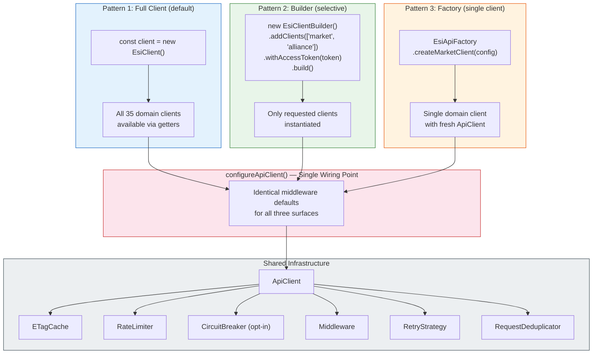
```mermaid
graph TB
    subgraph Pattern1["Pattern 1: Full Client (default)"]
        P1Code["const client = new EsiClient()"]
        P1Result["All 35 domain clients<br/>available via getters"]
        P1Code --> P1Result
    end

    subgraph Pattern2["Pattern 2: Builder (selective)"]
        P2Code["new EsiClientBuilder()<br/>.addClients(['market', 'alliance'])<br/>.withAccessToken(token)<br/>.build()"]
        P2Result["Only requested clients<br/>instantiated"]
        P2Code --> P2Result
    end

    subgraph Pattern3["Pattern 3: Factory (single client)"]
        P3Code["EsiApiFactory<br/>.createMarketClient(config)"]
        P3Result["Single domain client<br/>with fresh ApiClient"]
        P3Code --> P3Result
    end

    subgraph ConfigWiring["configureApiClient() — Single Wiring Point"]
        Configure["Identical middleware defaults<br/>for all three surfaces"]
    end

    subgraph Shared["Shared Infrastructure"]
        ApiClient["ApiClient"]
        Cache["ETagCache"]
        RL["RateLimiter"]
        CB["CircuitBreaker (opt-in)"]
        MW["Middleware"]
        Retry["RetryStrategy"]
        Dedup["RequestDeduplicator"]
    end

    P1Result --> Configure
    P2Result --> Configure
    P3Result --> Configure

    Configure --> ApiClient

    ApiClient --> Cache
    ApiClient --> RL
    ApiClient --> CB
    ApiClient --> MW
    ApiClient --> Retry
    ApiClient --> Dedup

    style Pattern1 fill:#e3f2fd,stroke:#1565c0
    style Pattern2 fill:#e8f5e9,stroke:#2e7d32
    style Pattern3 fill:#fff3e0,stroke:#e65100
    style ConfigWiring fill:#fce4ec,stroke:#c62828
    style Shared fill:#eceff1,stroke:#37474f
```

## 7. Middleware Pipeline

How request and response processing flows through the decomposed pipeline modules.


```mermaid
graph LR
    subgraph Request["Request Phase (headers.ts + middlewareBridge.ts)"]
        R1["buildRequestHeaders()<br/>(auth, ETag, UA)"]
        R2["applyRequestMiddleware()<br/>(interceptors: trace ID,<br/>custom auth, etc.)"]
    end

    subgraph Execution["Execution (fetchExecution.ts)"]
        CB["Circuit Breaker<br/>check"]
        RL["Rate Limiter<br/>check"]
        Fetch["executeSingleFetch()"]
    end

    subgraph Response["Response Phase (cachePolicy.ts + statusHandling.ts + paginationOrchestration.ts)"]
        Status["handleEarlyStatus()<br/>(304, errors)"]
        CacheResp["cacheResponse()<br/>(spec TTL authoritative)"]
        Paginate["handleOffsetPagination()<br/>handleCursorPagination()"]
        Intercept["applyResponseInterceptors()<br/>(middlewareBridge.ts)"]
    end

    R1 --> R2
    R2 --> CB --> RL --> Fetch
    Fetch --> Status --> CacheResp --> Paginate --> Intercept

    style Request fill:#e3f2fd,stroke:#1565c0
    style Execution fill:#fce4ec,stroke:#c62828
    style Response fill:#e8f5e9,stroke:#2e7d32
```

## 8. Test Architecture

3,600+ tests across 95+ suites in multiple tiers. Coverage: branches 80%+, functions 75%+, lines 90%+, statements 90%+.

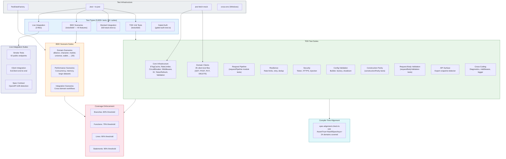
```mermaid
graph TB
    subgraph TestTypes["Test Types (3,600+ tests, 95+ suites)"]
        TDD["TDD Unit Tests<br/>(tests/tdd/)"]
        BDD["BDD Scenarios<br/>(tests/bdd/ — 40 features)"]
        IntMocked["Mocked Integration<br/>(full-stack.test.ts)"]
        IntLive["Live Integration<br/>(3 files)"]
        IntGated["Gated Auth<br/>(gated-auth.test.ts)"]
    end

    subgraph TDDTests["TDD Test Suites"]
        Core["Core Infrastructure<br/>ETagCache, RateLimiter,<br/>CircuitBreaker, Middleware,<br/>DI, TokenRefresh, Validation"]
        Clients["Domain Clients<br/>35 client test files<br/>(GET, POST, PUT, DELETE)"]
        Pipeline["Request Pipeline<br/>(requestPipeline module tests)"]
        Resilience["Resilience<br/>Rate limits, retry, dedup"]
        Security["Security<br/>Token, HTTPS, injection"]
        Config["Config Validation<br/>Builder, factory, shutdown"]
        Parity["Construction Parity<br/>(constructionParity tests)"]
        ReqValidation["Request Body Validation<br/>(requestBodyValidation tests)"]
        APISurface["API Surface<br/>Export snapshot detector"]
        CrossCut["Cross-Cutting<br/>Diagnostics, middleware, logger"]
    end

    subgraph BDDTests["BDD Scenario Suites"]
        DomainBDD["Domain Scenarios<br/>alliance, character, market,<br/>universe, wallet, ... (35)"]
        PerfBDD["Performance Scenarios<br/>Concurrency, memory,<br/>large datasets"]
        IntBDD["Integration Scenarios<br/>Cross-domain workflows"]
    end

    subgraph LiveTests["Live Integration Suites"]
        Smoke["Smoke Tests<br/>42 public endpoints"]
        ClientInt["Client Integration<br/>EsiClient end-to-end"]
        SpecContract["Spec Contract<br/>OpenAPI drift detection"]
    end

    subgraph SpecAlignment["Compile-Time Alignment"]
        SpecAssert["spec-alignment.check.ts<br/>104 AssertTrue&lt;HasAllSpecKeys&gt;<br/>24 domains covered"]
    end

    subgraph Coverage["Coverage Enforcement"]
        Branches["Branches: 80% threshold"]
        Functions["Functions: 75% threshold"]
        Lines["Lines: 90% threshold"]
        Statements["Statements: 90% threshold"]
    end

    subgraph Tools["Test Infrastructure"]
        Jest["Jest + ts-jest"]
        FetchMock["jest-fetch-mock"]
        Factory["TestDataFactory"]
        CrossEnv["cross-env (Windows)"]
    end

    TDD --> TDDTests
    BDD --> BDDTests
    IntLive --> LiveTests
    TDDTests --> Coverage
    BDDTests --> Coverage
    TDDTests --> SpecAlignment

    Jest --> TDD
    Jest --> BDD
    Jest --> IntMocked
    Jest --> IntLive
    FetchMock --> Core
    FetchMock --> Clients
    Factory --> BDDTests

    style TestTypes fill:#e3f2fd,stroke:#1565c0
    style TDDTests fill:#e8f5e9,stroke:#2e7d32
    style BDDTests fill:#fff3e0,stroke:#e65100
    style LiveTests fill:#e8eaf6,stroke:#283593
    style SpecAlignment fill:#e0f7fa,stroke:#00838f
    style Coverage fill:#fce4ec,stroke:#c62828
    style Tools fill:#eceff1,stroke:#37474f
```

## 9. Rate Limiting Strategy

ESI enforces 36 independent rate limit groups (e.g., `market-order: 12000 tokens/15m`, `char-notification: 15 tokens/15m`). The rate limiter maintains a separate token bucket per group, extracted from the ESI OpenAPI meta spec at build time (`esi-rate-limit-groups.generated.ts`).

**Per-group bucketing**: Each endpoint maps to a rate limit group via the generated spec. When `checkRateLimit(templatePath, method)` is called, the limiter resolves the group and checks/decelerates only that group's bucket. A 429 on one group blocks only that group.

**Per-user bucketing** (opt-in): When `userKeyExtractor` is configured, each user key gets its own set of group buckets, preventing one user's rate limit exhaustion from affecting others in multi-character apps.

**Server sync**: Response headers (`x-ratelimit-remaining`, `x-ratelimit-group`) are authoritative -- they override spec-derived initial values.

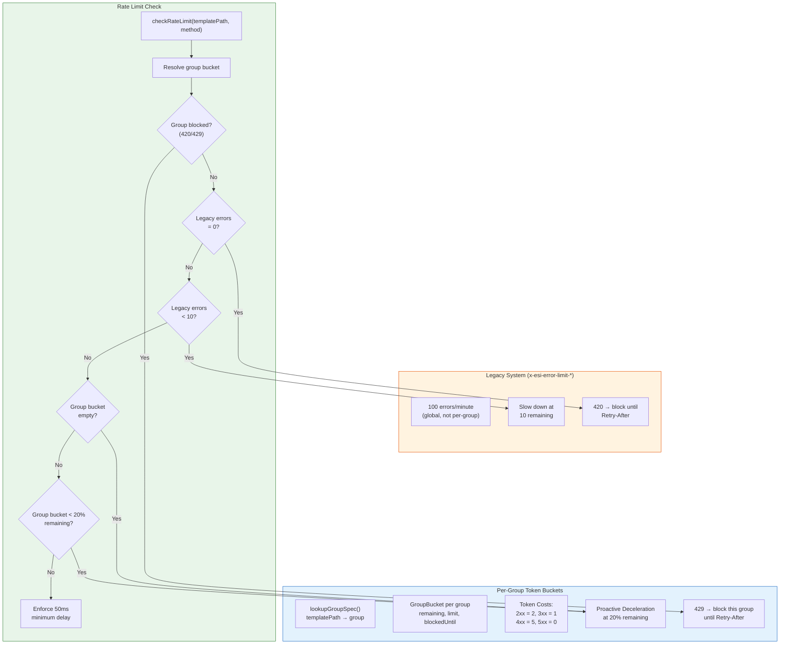
```mermaid
graph TB
    subgraph PerGroup["Per-Group Token Buckets"]
        Lookup["lookupGroupSpec()<br/>templatePath → group"]
        Bucket["GroupBucket per group<br/>remaining, limit, blockedUntil"]
        Costs["Token Costs:<br/>2xx = 2, 3xx = 1<br/>4xx = 5, 5xx = 0"]
        Decel["Proactive Deceleration<br/>at 20% remaining"]
        Block429["429 → block this group<br/>until Retry-After"]
    end

    subgraph LegacySystem["Legacy System (x-esi-error-limit-*)"]
        ErrorBudget["100 errors/minute<br/>(global, not per-group)"]
        SlowDown["Slow down at<br/>10 remaining"]
        Block420["420 → block until<br/>Retry-After"]
    end

    subgraph Decision["Rate Limit Check"]
        Start["checkRateLimit(templatePath, method)"]
        ResolveGroup["Resolve group bucket"]
        IsBlocked{"Group blocked?<br/>(420/429)"}
        LegacyLow{"Legacy errors<br/>< 10?"}
        LegacyZero{"Legacy errors<br/>= 0?"}
        BucketLow{"Group bucket < 20%<br/>remaining?"}
        BucketEmpty{"Group bucket<br/>empty?"}
        MinDelay["Enforce 50ms<br/>minimum delay"]
    end

    Start --> ResolveGroup
    ResolveGroup --> IsBlocked
    IsBlocked -->|Yes| Block429
    IsBlocked -->|No| LegacyZero
    LegacyZero -->|Yes| Block420
    LegacyZero -->|No| LegacyLow
    LegacyLow -->|Yes| SlowDown
    LegacyLow -->|No| BucketEmpty
    BucketEmpty -->|Yes| Decel
    BucketEmpty -->|No| BucketLow
    BucketLow -->|Yes| Decel
    BucketLow -->|No| MinDelay

    style PerGroup fill:#e3f2fd,stroke:#1565c0
    style LegacySystem fill:#fff3e0,stroke:#e65100
    style Decision fill:#e8f5e9,stroke:#2e7d32
```

## 10. Response and Request Validation Pipeline

Bidirectional validation powered by Zod schemas. Response validation runs by default; request validation is opt-in.

```mermaid
sequenceDiagram
    participant Consumer
    participant Client as Domain Client
    participant CreateClient as createClient()
    participant Handler as ApiRequestHandler
    participant ESI as ESI API
    participant ReqSchema as Request Zod Schema
    participant RespSchema as Response Zod Schema

    Consumer->>Client: client.alliance.getAllianceById(id)
    Client->>CreateClient: invoke endpoint method

    alt validateRequest enabled + requestSchema defined
        CreateClient->>ReqSchema: def.requestSchema.safeParse(body)
        alt Invalid request body
            ReqSchema-->>Consumer: throw EsiValidationError(direction: 'request')
        end
    end

    CreateClient->>Handler: handleRequest(endpoint, method, ...)
    Handler->>ESI: HTTP GET /alliances/{id}/
    ESI-->>Handler: JSON response
    Handler-->>CreateClient: { headers, body }

    alt validateResponse enabled (default)
        CreateClient->>RespSchema: def.responseSchema.safeParse(body)
        alt Valid response
            RespSchema-->>CreateClient: { success: true, data }
            Note over CreateClient: Return type: InferEndpointResult&lt;D&gt;<br/>(z.infer on responseSchema)
            CreateClient-->>Client: validated, typed data
            Client-->>Consumer: AllianceInfo
        else Invalid response
            RespSchema-->>CreateClient: { success: false, error }
            CreateClient-->>Consumer: throw EsiValidationError
        end
    else validateResponse disabled
        CreateClient-->>Client: raw body (no validation)
        Client-->>Consumer: unvalidated data
    end
```

**Key design points:**

- **Bidirectional validation**: Request bodies can be validated before HTTP calls (`requestSchema` + `validateRequest: true`), and response bodies are validated after (`responseSchema`, on by default). Both use `EsiValidationError` with a `direction` field.
- **Validation location**: Validation happens in `createClient()` (in `src/core/endpoints/createClient.ts`), keeping validation centralized rather than scattered across 35 domain clients.
- **Typed returns via `InferEndpointResult<D>`**: The return type of each endpoint method is inferred from `z.infer<responseSchema>`. For cursor-paginated endpoints, the type is wrapped in `CursorResult<ElementType>`. This eliminates `as Promise<X>` casts.
- **Loose object mode**: All Zod schemas use `z.looseObject()` so extra fields returned by ESI that are not yet in the schema are preserved in the output.
- **Type derivation**: Types in `src/types/` are derived from schemas via `z.infer<>`, ensuring compile-time types and runtime validation always agree.
- **Generated schemas are internal**: The 33 auto-generated schemas in `src/schemas/generated/` are not publicly exported. They serve as baselines for `npm run schema:drift`, which compares hand-written schemas against the generated ones.

## 11. Request Pipeline Decomposition

`ApiRequestHandler.ts` (~250 lines) is a thin coordinator that delegates to seven focused modules in `src/core/requestPipeline/`.

```
src/core/requestPipeline/
  index.ts                      — barrel re-export
  dependencies.ts               — resolveCache, resolveRateLimiter,
                                  resolveCircuitBreaker, resolveRetryStrategy
  headers.ts                    — buildRequestHeaders, parseCacheControlTtl
  cachePolicy.ts                — lookupSpecTtl, trySpecAwareCacheHit,
                                  tryStaleCacheResponse, cacheResponse
  statusHandling.ts             — handleEarlyStatus, handleErrorResponse, wrapError
  middlewareBridge.ts            — applyRequestMiddleware, applyResponseInterceptors
  fetchExecution.ts             — executeSingleFetch, fetchOnePage, parseJsonBody
  paginationOrchestration.ts    — handleCursorPagination, handleOffsetPagination
```

The coordinator (`ApiRequestHandler.ts`) exposes three public functions:

| Function                    | Purpose                                                                                 |
| --------------------------- | --------------------------------------------------------------------------------------- |
| `handleRequest()`           | Full request lifecycle: spec-cache check, deduplication, retry strategy, executeRequest |
| `handleSinglePageRequest()` | Single-page fetch with retry strategy (used by `AsyncPaginationIterator`)               |
| `executeRequest()`          | Core request execution: headers, middleware, CB, rate limit, fetch, cache, pagination   |

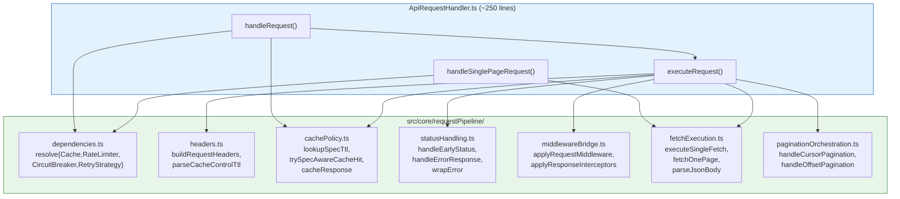
```mermaid
graph TB
    subgraph Coordinator["ApiRequestHandler.ts (~250 lines)"]
        HR["handleRequest()"]
        HSPR["handleSinglePageRequest()"]
        ER["executeRequest()"]
    end

    subgraph Modules["src/core/requestPipeline/"]
        Deps["dependencies.ts<br/>resolve{Cache,RateLimiter,<br/>CircuitBreaker,RetryStrategy}"]
        Hdrs["headers.ts<br/>buildRequestHeaders,<br/>parseCacheControlTtl"]
        CP["cachePolicy.ts<br/>lookupSpecTtl,<br/>trySpecAwareCacheHit,<br/>cacheResponse"]
        SH["statusHandling.ts<br/>handleEarlyStatus,<br/>handleErrorResponse,<br/>wrapError"]
        MB["middlewareBridge.ts<br/>applyRequestMiddleware,<br/>applyResponseInterceptors"]
        FE["fetchExecution.ts<br/>executeSingleFetch,<br/>fetchOnePage,<br/>parseJsonBody"]
        PO["paginationOrchestration.ts<br/>handleCursorPagination,<br/>handleOffsetPagination"]
    end

    HR --> CP
    HR --> Deps
    HR --> ER
    HSPR --> FE
    HSPR --> Deps
    ER --> Hdrs
    ER --> MB
    ER --> FE
    ER --> SH
    ER --> CP
    ER --> PO

    style Coordinator fill:#e3f2fd,stroke:#1565c0
    style Modules fill:#e8f5e9,stroke:#2e7d32
```

## 12. Streaming Architecture

`BaseEsiClient.streamEndpoint()` provides async iteration over paginated ESI endpoints. 19 domain clients expose 73 `stream*` methods as thin one-liner delegations.

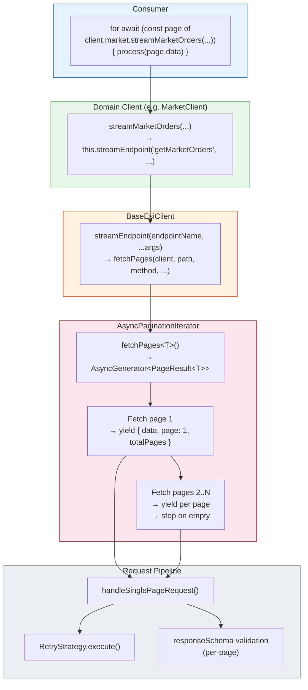
```mermaid
graph TB
    subgraph Consumer["Consumer"]
        ForAwait["for await (const page of<br/>client.market.streamMarketOrders(...))<br/>{ process(page.data) }"]
    end

    subgraph DomainClient["Domain Client (e.g. MarketClient)"]
        StreamMethod["streamMarketOrders(...)<br/>→ this.streamEndpoint('getMarketOrders', ...)"]
    end

    subgraph BaseClient["BaseEsiClient"]
        StreamEndpoint["streamEndpoint(endpointName, ...args)<br/>→ fetchPages(client, path, method, ...)"]
    end

    subgraph AsyncIterator["AsyncPaginationIterator"]
        FetchPages["fetchPages&lt;T&gt;()<br/>→ AsyncGenerator&lt;PageResult&lt;T&gt;&gt;"]
        FirstPage["Fetch page 1<br/>→ yield { data, page: 1, totalPages }"]
        NextPages["Fetch pages 2..N<br/>→ yield per page<br/>→ stop on empty"]
    end

    subgraph Pipeline["Request Pipeline"]
        SinglePage["handleSinglePageRequest()"]
        Retry["RetryStrategy.execute()"]
        Validate["responseSchema validation<br/>(per-page)"]
    end

    ForAwait --> StreamMethod
    StreamMethod --> StreamEndpoint
    StreamEndpoint --> FetchPages
    FetchPages --> FirstPage
    FirstPage --> NextPages
    FirstPage --> SinglePage
    NextPages --> SinglePage
    SinglePage --> Retry
    SinglePage --> Validate

    style Consumer fill:#e3f2fd,stroke:#1565c0
    style DomainClient fill:#e8f5e9,stroke:#2e7d32
    style BaseClient fill:#fff3e0,stroke:#e65100
    style AsyncIterator fill:#fce4ec,stroke:#c62828
    style Pipeline fill:#eceff1,stroke:#37474f
```

**Pattern**: Each `stream*` method is a thin one-liner that delegates to `this.streamEndpoint(endpointName, ...args)`:

```typescript
streamMarketOrders(regionId: number, ...): AsyncGenerator<PageResult<MarketOrder>> {
  return this.streamEndpoint('getRegionMarketOrders', regionId, ...);
}
```

**Return type**: `AsyncGenerator<PageResult<T>, void, undefined>` where `PageResult<T>` contains `{ data: T[], page: number, totalPages: number }`.

**Cursor pagination**: Cursor-paginated endpoints use a separate path through `CursorPaginationHandler` and are accessed via `createClient()` rather than the streaming interface.

## 13. Code Generation and CI Gates

The project auto-generates several artifacts from the live ESI OpenAPI spec, with CI gates to prevent drift.

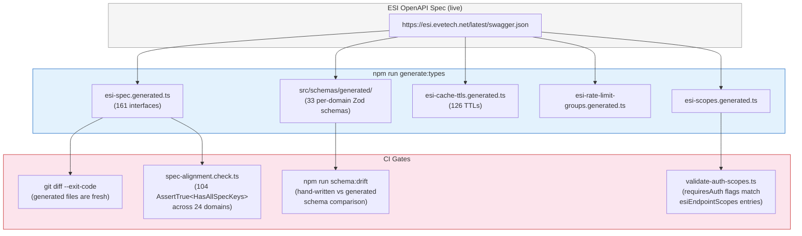
```mermaid
graph TB
    subgraph Source["ESI OpenAPI Spec (live)"]
        Spec["https://esi.evetech.net/latest/swagger.json"]
    end

    subgraph Generation["npm run generate:types"]
        GenTypes["esi-spec.generated.ts<br/>(161 interfaces)"]
        GenSchemas["src/schemas/generated/<br/>(33 per-domain Zod schemas)"]
        GenTTLs["esi-cache-ttls.generated.ts<br/>(126 TTLs)"]
        GenRateLimits["esi-rate-limit-groups.generated.ts"]
        GenScopes["esi-scopes.generated.ts"]
    end

    subgraph Gates["CI Gates"]
        FreshCheck["git diff --exit-code<br/>(generated files are fresh)"]
        AuthValidation["validate-auth-scopes.ts<br/>(requiresAuth flags match<br/>esiEndpointScopes entries)"]
        SpecAlign["spec-alignment.check.ts<br/>(104 AssertTrue&lt;HasAllSpecKeys&gt;<br/>across 24 domains)"]
        SchemaDrift["npm run schema:drift<br/>(hand-written vs generated<br/>schema comparison)"]
    end

    Spec --> GenTypes
    Spec --> GenSchemas
    Spec --> GenTTLs
    Spec --> GenRateLimits
    Spec --> GenScopes

    GenTypes --> FreshCheck
    GenScopes --> AuthValidation
    GenTypes --> SpecAlign
    GenSchemas --> SchemaDrift

    style Source fill:#f5f5f5,stroke:#999
    style Generation fill:#e3f2fd,stroke:#1565c0
    style Gates fill:#fce4ec,stroke:#c62828
```

| Gate                               | Mechanism                                                      | What it catches                                                                                              |
| ---------------------------------- | -------------------------------------------------------------- | ------------------------------------------------------------------------------------------------------------ |
| **Generated freshness**            | `git diff --exit-code` on generated files                      | Stale types after ESI spec updates                                                                           |
| **Auth/scopes cross-validation**   | `scripts/validate-auth-scopes.ts`                              | `requiresAuth=false` on authenticated endpoints (would 401), or missing scope entries (breaks OAuth consent) |
| **Spec-alignment type assertions** | `AssertTrue<HasAllSpecKeys<SpecType, ZodType>>` (compile-time) | Zod schema missing a field the spec defines (104 pairs, 24 domains)                                          |
| **Schema drift detection**         | `npm run schema:drift`                                         | Hand-written schemas diverging from OpenAPI spec baselines                                                   |

**Generated schemas are internal-only**: The 33 auto-generated Zod schemas in `src/schemas/generated/` are not exported from the public API surface (`src/index.ts`). They serve exclusively as baselines for drift detection. The 33 hand-written schemas in `src/schemas/` remain the source of truth for runtime validation.
