# ESI.ts Architecture

**Implements:** `ARCH-01` · `ARCH-02` · `ARCH-03` · `ARCH-04` · `ARCH-05` · `ARCH-06` · `ARCH-07` · `ARCH-08` · `ARCH-09` — see [CHARTER.md](CHARTER.md) Part 2.

How ESI.ts is layered, the route every request takes, and how each piece of middleware behaves. The charter states the requirements; this guide explains how the code meets them. Where the two disagree, the code is the fact and the difference is called out.

This guide describes the code on `master` at 10.2.3 with ROADMAP Phase 2 PRs 4 to 10 merged. The seams those PRs added (ports, `PipelineTransport`, the generated operations and the scope tree) exist and are tested but are not exported from any package entry. [§1a](#1a-ports-adapters-and-the-layer-rule) describes them and says what 11.0.0 will still change: Phase 2 PRs 10b, 11 and 12, the Phase 3 layer baseline and the Phase 4 logger work, as planned in [ROADMAP.md](ROADMAP.md).

Topics with their own guide are summarised here and linked:

| Topic                                                | Canonical guide                                |
| ---------------------------------------------------- | ---------------------------------------------- |
| Naming, endpoint definitions, adding a client        | [DESIGN-RULES.md](DESIGN-RULES.md)             |
| Error classes, guards, retryability, safe mode       | [ERRORS.md](ERRORS.md)                         |
| `ILogger`, per-client loggers, levels                | [LOGGING.md](LOGGING.md)                       |
| Offset and cursor pagination, `stream*`, `fetchAll*` | [PAGINATION.md](PAGINATION.md)                 |
| Zod schemas and validation options                   | [RUNTIME-VALIDATION.md](RUNTIME-VALIDATION.md) |
| Runtime defences and supply chain                    | [SECURITY.md](SECURITY.md)                     |
| Test tiers                                           | [TESTING.md](TESTING.md)                       |
| CI workflows and gates                               | [QUALITY-GATES.md](QUALITY-GATES.md)           |
| Releases                                             | [RELEASE.md](RELEASE.md)                       |
| The 11.0 plan, phase by phase                        | [ROADMAP.md](ROADMAP.md)                       |
| Major, minor or patch; breaking-change markers       | [SEMVER.md](SEMVER.md)                         |

---

## C4 Model

### C4 Level 1 — System Context

System context showing ESI.ts in its operating environment.

| Element                  | Description                                                                                                                                                                                                                                |
| ------------------------ | ------------------------------------------------------------------------------------------------------------------------------------------------------------------------------------------------------------------------------------------ |
| **Consumer Application** | Node.js application that needs EVE Online data: Node 18 or newer today (`engines`), 22 or newer from 11.0.0 (`REL-05`)                                                                                                                     |
| **ESI.ts**               | TypeScript SDK — auth, caching, rate limiting, circuit breaking, pagination, validation                                                                                                                                                    |
| **EVE Online ESI API**   | CCP's REST API at `esi.evetech.net`, secured by EVE SSO (OAuth2)                                                                                                                                                                           |
| **EVE SSO**              | OAuth2 authorisation server — issues and refreshes access tokens                                                                                                                                                                           |
| **ESI OpenAPI Spec**     | Machine-readable API spec used at build time for code generation. The generated operations read a copy vendored at the compatibility date (`tests/contract/snapshots/esi-openapi.snapshot.json`); `generate:types` reads the live document |

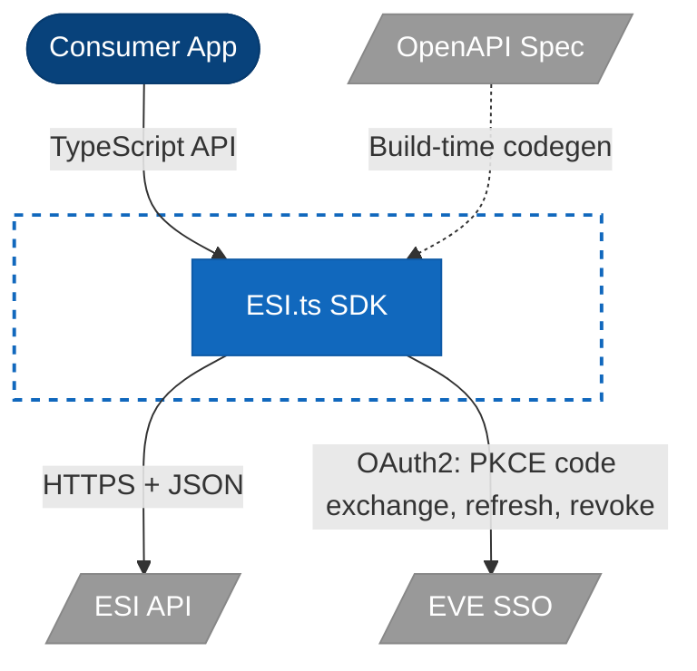
```mermaid
flowchart TB
    consumer(["Consumer App"])

    subgraph boundary [" "]
        esits["ESI.ts SDK"]
    end

    esi[/"ESI API"/]
    sso[/"EVE SSO"/]
    spec[/"OpenAPI Spec"/]

    consumer -- "TypeScript API" --> esits
    esits -- "HTTPS + JSON" --> esi
    esits -- "OAuth2: PKCE code exchange, refresh, revoke" --> sso
    spec -. "Build-time codegen" .-> esits

    style consumer fill:#08427b,color:#fff,stroke:#073b6f
    style esits fill:#1168bd,color:#fff,stroke:#0e5aa7
    style esi fill:#999,color:#fff,stroke:#888
    style sso fill:#999,color:#fff,stroke:#888
    style spec fill:#999,color:#fff,stroke:#888
    style boundary fill:none,stroke:#1168bd,stroke-width:2px,stroke-dasharray:5
```

### C4 Level 2 — Container Diagram

Five layers on one request path, auth beside them, the Phase 2 seams beneath them, and side modules that share nothing with the HTTP pipeline.

| Container                | Where                                                                                                     | Purpose                                                                                                                                                                                                                                                                           |
| ------------------------ | --------------------------------------------------------------------------------------------------------- | --------------------------------------------------------------------------------------------------------------------------------------------------------------------------------------------------------------------------------------------------------------------------------- |
| **Construction**         | `src/EsiClient.ts`, `src/EsiClientBuilder.ts`                                                             | `EsiClient`, `EsiClientBuilder` → `CustomEsiClient`, `EsiApiFactory`. All three call `configureApiClient()`. `ApiClientBuilder` (`src/core/ApiClientBuilder.ts`) builds a bare `ApiClient` and does not (§9)                                                                      |
| **Domain clients**       | `src/clients/` (one class per ESI domain + `BaseEsiClient`)                                               | Named methods, `stream*` and `fetchAll*` wrappers, `withMetadata()` and `withSafeMode()` views. No HTTP knowledge                                                                                                                                                                 |
| **Endpoint definitions** | `src/core/endpoints/*Endpoints.ts`                                                                        | Declarative maps of path, method, auth, pagination kind and schemas. `createClient()` turns a map into typed methods                                                                                                                                                              |
| **Schemas**              | `src/schemas/`                                                                                            | Hand-written Zod schemas for runtime validation; return types are inferred from them                                                                                                                                                                                              |
| **Request pipeline**     | `src/core/ApiRequestHandler.ts`, `src/core/requestPipeline/`                                              | Pure functions: cache policy, headers, fetch execution, status handling, pagination, middleware bridge, dependency resolution                                                                                                                                                     |
| **Resilience**           | `src/core/` (`RetryStrategy`, `RateLimiter`, `CircuitBreaker`, `RequestDeduplicator`, `ETagCacheManager`) | Each behind an interface with a setter on `ApiClient`                                                                                                                                                                                                                             |
| **Transport**            | `ApiClient.getFetch()`                                                                                    | `globalThis.fetch` unless replaced with `setFetch()`. Timeout by `AbortController`                                                                                                                                                                                                |
| **Generated metadata**   | `src/types/generated/`, `src/core/endpoints/esi-*.generated.ts`                                           | Types, cache TTLs, rate-limit groups and scopes generated from the ESI OpenAPI spec by `generate:types`; CI verifies freshness                                                                                                                                                    |
| **Generated operations** | `src/generated/operations.generated.ts`                                                                   | 233 typed operations (one `*Meta` and one function each), `ScopeTree`, `PublicScopeTree` and `createScopeTree(transport)`, generated from the vendored spec by `spec:generate`. Imports only the ports. Not exported yet (§1a)                                                    |
| **Ports**                | `src/core/ports/`                                                                                         | Six type-only interfaces: `CacheStore`, `Clock`, `HttpTransport`, `Logger`, `OperationTransport`, `TokenProvider`. They import nothing. Not exported yet (§1a)                                                                                                                    |
| **Adapters**             | `src/adapters/`                                                                                           | `PipelineTransport` implements `OperationTransport` over `handleRequest` and `fetchPages`, so a generated operation shares the `ApiClient`'s budgets and cache. Not exported yet (§1a)                                                                                            |
| **Auth**                 | `src/auth/`                                                                                               | `EveSsoClient` (authorisation URL with PKCE, code exchange, refresh, revoke), `EsiTokenManager` (per-character tokens, refresh, `tokenProviderFor`, `createClient`), `MemoryTokenStorage` and `FileTokenStorage`, the `AuthError` subtree. Exported from the root and `./errors`  |
| **Side modules**         | `./schemas`, `./errors`, `./testing`, `./sde`, `./sde/memory`                                             | Subpath entry points. The SDE module is an offline lookup layer with its own error hierarchy and shares no code with the pipeline; `lint:layers` enforces that in both directions and a bundle test keeps `./sde/memory` free of file-system, YAML, ZIP and SQLite code (ARCH-10) |

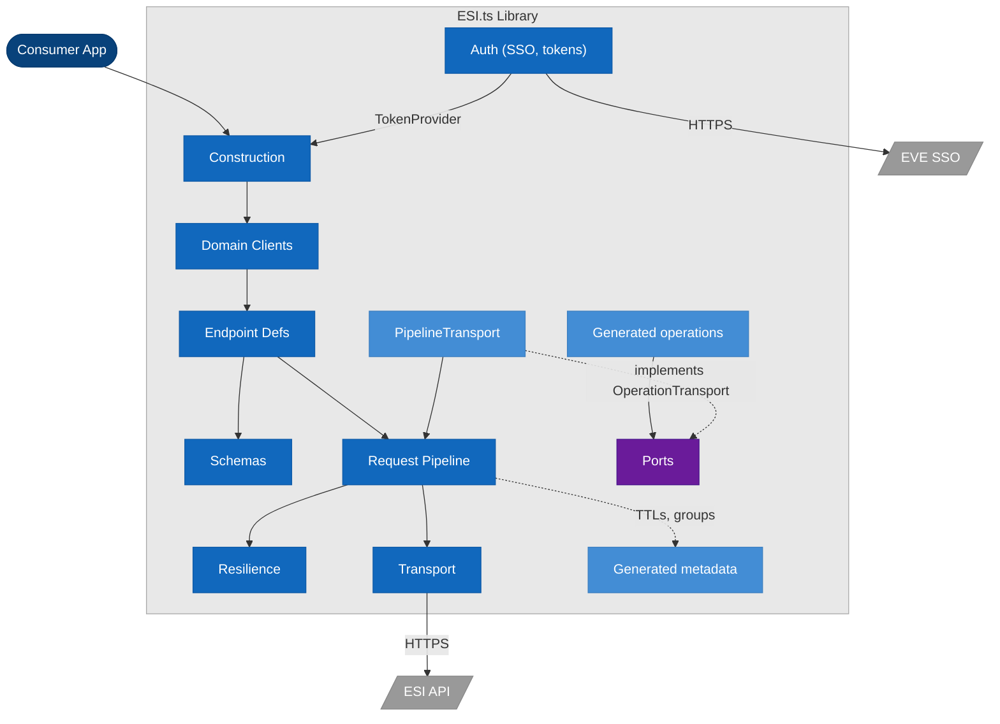
```mermaid
flowchart TB
    consumer(["Consumer App"])

    subgraph esits ["ESI.ts Library"]
        direction TB
        publicApi["Construction"]
        domainClients["Domain Clients"]
        endpointDefs["Endpoint Defs"]
        schemas["Schemas"]
        pipeline["Request Pipeline"]
        resilience["Resilience"]
        transport["Transport"]
        generated["Generated metadata"]
        auth["Auth (SSO, tokens)"]
        ports["Ports"]
        adapters["PipelineTransport"]
        genOps["Generated operations"]
    end

    esi[/"ESI API"/]

    consumer --> publicApi
    publicApi --> domainClients
    domainClients --> endpointDefs
    endpointDefs --> schemas
    endpointDefs --> pipeline
    pipeline --> resilience
    pipeline --> transport
    pipeline -. "TTLs, groups" .-> generated
    transport -- "HTTPS" --> esi
    auth -- "TokenProvider" --> publicApi
    auth -- "HTTPS" --> sso[/"EVE SSO"/]
    genOps --> ports
    adapters -. "implements OperationTransport" .-> ports
    adapters --> pipeline

    style consumer fill:#08427b,color:#fff,stroke:#073b6f
    style publicApi fill:#1168bd,color:#fff,stroke:#0e5aa7
    style domainClients fill:#1168bd,color:#fff,stroke:#0e5aa7
    style endpointDefs fill:#1168bd,color:#fff,stroke:#0e5aa7
    style schemas fill:#1168bd,color:#fff,stroke:#0e5aa7
    style pipeline fill:#1168bd,color:#fff,stroke:#0e5aa7
    style resilience fill:#1168bd,color:#fff,stroke:#0e5aa7
    style transport fill:#1168bd,color:#fff,stroke:#0e5aa7
    style generated fill:#438dd5,color:#fff,stroke:#3c7fc0
    style auth fill:#1168bd,color:#fff,stroke:#0e5aa7
    style ports fill:#6a1b9a,color:#fff,stroke:#4a148c
    style adapters fill:#438dd5,color:#fff,stroke:#3c7fc0
    style genOps fill:#438dd5,color:#fff,stroke:#3c7fc0
    style sso fill:#999,color:#fff,stroke:#888
    style esi fill:#999,color:#fff,stroke:#888
    style esits fill:#e8e8e8,stroke:#aaa
```

### C4 Level 3 — Component: Core Request Pipeline

`ApiRequestHandler.ts` coordinates; each module in `src/core/requestPipeline/` has one responsibility and receives its dependencies as parameters (`ARCH-03`). `dependencies.ts` resolves the cache, rate limiter, circuit breaker and retry strategy. Two sites read a dependency from the `ApiClient` directly: `handleRequest` and `invalidateAfterWrite` both call `client.getDeduplicator()`, because a `null` deduplicator already means "no coalescing" and needs no resolution rule.

| Component                   | File                         | Exports                                                                                                                                                                        |
| --------------------------- | ---------------------------- | ------------------------------------------------------------------------------------------------------------------------------------------------------------------------------ |
| **handleRequest**           | ApiRequestHandler.ts         | Spec-TTL cache check, retry wrapping, a spec-TTL re-check on each retry attempt, deduplication keyed by `buildDedupeKey`; delegates to `executeRequest`                        |
| **handleSinglePageRequest** | ApiRequestHandler.ts         | One page with retry and no `If-None-Match`, used by `stream*` and `fetchAll*` (see [PAGINATION.md](PAGINATION.md))                                                             |
| **executeRequest**          | ApiRequestHandler.ts         | Fetch; write invalidation on 201/204; the 201 body; `emptyWhenNoContent`; the 304 re-run; status handling; text or JSON body; cache write; pagination; response interceptors   |
| **dependencies**            | dependencies.ts              | `resolveCache`, `resolveRateLimiter`, `resolveCircuitBreaker`, `resolveRetryStrategy`                                                                                          |
| **headers**                 | headers.ts                   | `buildRequestHeaders`, `parseCacheControlTtl`                                                                                                                                  |
| **cachePolicy**             | cachePolicy.ts               | `lookupSpecTtl`, `trySpecAwareCacheHit`, `hasCachedEntry`, `tryStaleCacheResponse`, `cacheResponse`, `currentWriteGeneration`, `invalidateAfterWrite`, `evictRejectedResponse` |
| **statusHandling**          | statusHandling.ts            | `handleEarlyStatus` (201/204/304), `handleErrorResponse` (4xx/5xx), `readEsiErrorReason`, `statusMessage`, `STATUS_MESSAGES`, `wrapError`                                      |
| **middlewareBridge**        | middlewareBridge.ts          | `applyRequestMiddleware`, `applyResponseInterceptors`                                                                                                                          |
| **fetchExecution**          | fetchExecution.ts            | `executeSingleFetch`, `fetchOnePage`, `parseJsonBody`                                                                                                                          |
| **pagination**              | paginationOrchestration.ts   | `handleCursorPagination`, `handleOffsetPagination`                                                                                                                             |
| **cacheKey**                | `src/core/cache/cacheKey.ts` | `buildCacheKey` (URL) and `buildDedupeKey` (endpoint), both prefixed with a SHA-256 hash of the `Authorization` header when the endpoint requires auth                         |

`statusMessage` is exported from `statusHandling.ts` but not re-exported from `requestPipeline/index.ts`; everything else in the table is. `createClient` calls `evictRejectedResponse` when a body fails its schema, so a rejected body is not served again from the spec TTL or after a 304.

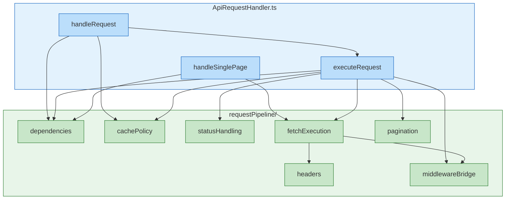
```mermaid
flowchart TB
    subgraph coordinator ["ApiRequestHandler.ts"]
        direction LR
        handleReq["handleRequest"]
        handleSingle["handleSinglePage"]
        execReq["executeRequest"]
    end

    subgraph pipelineMods ["requestPipeline/"]
        deps["dependencies"]
        headers["headers"]
        cache["cachePolicy"]
        status["statusHandling"]
        mwBridge["middlewareBridge"]
        fetchExec["fetchExecution"]
        pagOrch["pagination"]
    end

    handleReq --> cache
    handleReq --> deps
    execReq --> deps
    handleReq --> execReq
    handleSingle --> fetchExec
    handleSingle --> deps
    execReq --> fetchExec
    execReq --> status
    execReq --> cache
    execReq --> pagOrch
    execReq --> mwBridge
    fetchExec --> headers
    fetchExec --> mwBridge

    style coordinator fill:#e3f2fd,stroke:#1565c0
    style pipelineMods fill:#e8f5e9,stroke:#2e7d32
    style handleReq fill:#bbdefb,stroke:#1565c0
    style handleSingle fill:#bbdefb,stroke:#1565c0
    style execReq fill:#bbdefb,stroke:#1565c0
    style deps fill:#c8e6c9,stroke:#2e7d32
    style headers fill:#c8e6c9,stroke:#2e7d32
    style cache fill:#c8e6c9,stroke:#2e7d32
    style status fill:#c8e6c9,stroke:#2e7d32
    style mwBridge fill:#c8e6c9,stroke:#2e7d32
    style fetchExec fill:#c8e6c9,stroke:#2e7d32
    style pagOrch fill:#c8e6c9,stroke:#2e7d32
```

### C4 Level 3 — Component: Resilience

How the resilience components nest around one call. Retry is outermost; deduplication sits inside each attempt; the circuit breaker and rate limiter run inside the fetch.

| Component               | Interface         | Purpose                                                                                            |
| ----------------------- | ----------------- | -------------------------------------------------------------------------------------------------- |
| **RetryStrategy**       | `IRetryStrategy`  | Exponential backoff with jitter on retryable `EsiError`s; one 401 token refresh per call           |
| **RequestDeduplicator** | `IDeduplicator`   | Coalesces identical in-flight GETs without a body, keyed by endpoint and caller identity           |
| **CircuitBreaker**      | `ICircuitBreaker` | Opt-in per-key state machine (closed / open / half-open); key by resolved path or template         |
| **RateLimiter**         | `IRateLimiter`    | Per-group buckets from the generated spec, learns from response headers, blocks a group on 420/429 |
| **ETagCacheManager**    | `ICache`          | Spec-TTL hits, `If-None-Match` conditionals, stale fallback on 5xx                                 |

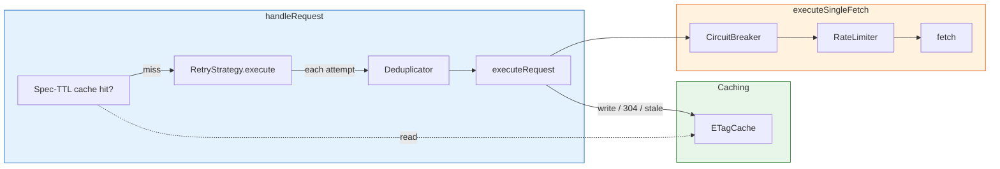
```mermaid
flowchart LR
    subgraph pipeline ["handleRequest"]
        spec["Spec-TTL cache hit?"]
        retry["RetryStrategy.execute"]
        dedup["Deduplicator"]
        execReq["executeRequest"]
    end

    subgraph fetch ["executeSingleFetch"]
        cb["CircuitBreaker"]
        rl["RateLimiter"]
        net["fetch"]
    end

    subgraph caching ["Caching"]
        etag["ETagCache"]
    end

    spec -- "miss" --> retry
    retry -- "each attempt" --> dedup
    dedup --> execReq
    execReq --> cb --> rl --> net
    execReq -- "write / 304 / stale" --> etag
    spec -. "read" .-> etag

    style pipeline fill:#e3f2fd,stroke:#1565c0
    style fetch fill:#fff3e0,stroke:#e65100
    style caching fill:#e8f5e9,stroke:#2e7d32
```

---

## 1. Layers

Dependency direction flows inward. Outer layers depend on inner layers, never the reverse.


```mermaid
graph TB
    subgraph External["External"]
        ESI["ESI API<br/>(esi.evetech.net)"]
        Consumer["Consumer Application"]
    end

    subgraph PublicAPI["Construction Layer"]
        EsiClient["EsiClient"]
        EsiClientBuilder["EsiClientBuilder"]
        EsiApiFactory["EsiApiFactory"]
        Index["index.ts exports"]
    end

    subgraph DomainClients["Domain Client Layer"]
        Alliance["AllianceClient"]
        Character["CharacterClient"]
        Market["MarketClient"]
        Universe["UniverseClient"]
        More["... one per ESI domain"]
    end

    subgraph EndpointLayer["Endpoint Definition Layer"]
        EndpointDef["EndpointDefinition<br/>(responseSchema + requestSchema)"]
        EndpointFiles["*Endpoints.ts (one per domain)"]
        CreateClient["createClient()<br/>→ InferEndpointResult&lt;D&gt;"]
        Registry["ClientRegistry"]
    end

    subgraph SchemaLayer["Schema Validation Layer (Zod)"]
        Schemas["src/schemas/ (hand-written)"]
        SchemaValidation["Runtime Validation"]
    end

    subgraph CoreLayer["Core Request Orchestration"]
        ConfigureClient["configureApiClient()"]
        Pipeline["src/core/requestPipeline/"]
        Handler["ApiRequestHandler<br/>(coordinator)"]
        SpecTtlCache["Spec-Aware Cache (TTL bypass)"]
        BatchHandler["BatchRequestHandler"]
        Middleware["MiddlewareManager"]
        RateLimiter["RateLimiter"]
        CircuitBreaker["CircuitBreaker"]
        Cache["ETagCacheManager"]
        Pagination["Offset pagination"]
        CursorPagination["CursorPaginationHandler"]
        AsyncPaginator["AsyncPaginationIterator"]
        TokenRefresh["Token Refresh"]
    end

    subgraph GeneratedLayer["Generated (from ESI OpenAPI Spec)"]
        GenTypes["esi-spec.generated.ts"]
        GenTtls["esi-cache-ttls.generated.ts"]
        GenRateLimits["esi-rate-limit-groups.generated.ts"]
        GenScopes["esi-scopes.generated.ts"]
        GenOps["operations.generated.ts<br/>(no client calls it yet; §1a)"]
    end

    subgraph Interfaces["Interface Contracts"]
        ICache["ICache"]
        IRateLimiter["IRateLimiter"]
        ICB["ICircuitBreaker"]
        IRetry["IRetryStrategy"]
        IDedup["IDeduplicator"]
        ILogger["ILogger"]
    end

    subgraph Infrastructure["Infrastructure Layer"]
        ApiClient["ApiClient"]
        HeadersUtil["parseHeaders()"]
        Validation["validation"]
        ErrorUtil["EsiError, EsiValidationError"]
        Logger["pino Logger"]
        Constants["constants"]
    end

    Consumer --> Index
    Index --> EsiClient
    Index --> EsiClientBuilder
    Index --> EsiApiFactory

    EsiClient --> Alliance
    EsiClient --> Character
    EsiClient --> Market
    EsiClient --> Universe
    EsiClient --> More

    Alliance --> CreateClient
    Character --> CreateClient
    Market --> CreateClient
    Universe --> CreateClient

    CreateClient --> EndpointDef
    CreateClient --> EndpointFiles
    CreateClient --> SchemaValidation
    CreateClient --> Handler

    SchemaValidation --> Schemas

    Registry --> Alliance
    Registry --> Character
    Registry --> Market
    Registry --> Universe

    EsiClient --> ConfigureClient
    EsiClientBuilder --> ConfigureClient
    EsiApiFactory --> ConfigureClient
    ConfigureClient --> ApiClient

    Handler --> Pipeline
    Pipeline --> SpecTtlCache
    SpecTtlCache --> Cache
    SpecTtlCache --> GenTtls
    Pipeline --> Middleware
    Pipeline --> RateLimiter
    RateLimiter --> GenRateLimits
    Pipeline --> CircuitBreaker
    Pipeline --> Cache
    Pipeline --> Pagination
    Pipeline --> CursorPagination
    Pipeline --> TokenRefresh
    AsyncPaginator --> Handler
    EsiClient --> BatchHandler

    Cache -.->|implements| ICache
    RateLimiter -.->|implements| IRateLimiter
    CircuitBreaker -.->|implements| ICB
    Logger -.->|implements| ILogger

    Handler --> ApiClient
    Handler --> HeadersUtil
    Handler --> Validation
    Handler --> ErrorUtil
    Handler --> Constants

    ApiClient --> ESI

    style External fill:#f5f5f5,stroke:#999
    style PublicAPI fill:#e3f2fd,stroke:#1565c0
    style DomainClients fill:#e8f5e9,stroke:#2e7d32
    style EndpointLayer fill:#fff3e0,stroke:#e65100
    style SchemaLayer fill:#e0f7fa,stroke:#00838f
    style CoreLayer fill:#fce4ec,stroke:#c62828
    style Interfaces fill:#f3e5f5,stroke:#6a1b9a
    style Infrastructure fill:#eceff1,stroke:#37474f
    style GeneratedLayer fill:#e8eaf6,stroke:#283593
```

**Design points:**

- **One wiring function.** `configureApiClient()` (`src/core/configureApiClient.ts`) is the single place configuration becomes middleware, for all three construction surfaces. The identity settings that vary by surface (base URL, client id, access token, datasource, language, compatibility date, token provider) are set by each surface before it calls `configureApiClient()`, and that is where the surfaces can drift (§9).
- **Typed returns from schemas.** `InferEndpointResult<D>` applies `z.infer<>` to the endpoint's `responseSchema`. An endpoint without a schema returns `unknown` (`DES-02`).
- **Strategies, not imports.** Cache, rate limiter, circuit breaker, deduplicator, retry strategy, transport and logger are all interfaces with a setter on `ApiClient` (`ARCH-04`).
- **Generated metadata, hand-written judgement.** Cache TTLs, rate-limit groups and scopes are generated; clients, endpoint maps and schemas are written by hand and diffed against the spec (`ARCH-01`).
- **Measured today.** 39 domain clients plus `BaseEsiClient` in `src/clients/`; 39 `*Endpoints.ts` maps wiring 235 endpoints; 36 domain schema modules plus `common.ts` and `esiEnum.ts` in `src/schemas/`; 233 generated operations. The endpoint and operation counts differ because the hand-written maps and the generated file are separate trees, reconciled by `schema:drift` and `spec:coverage`.

---

## 1a. Ports, adapters and the layer rule

Phase 2 of the 11.0 plan put seams under the pipeline so a new client can be built on it without touching the legacy surfaces. They are in the code today, covered by unit tests (`tests/tdd/adapters/`, `tests/tdd/spec-generate/`, `tests/tdd/layers/`), and exported from nothing. `EsiClient`, `CustomEsiClient` and `EsiApiFactory` do not use them.

### The ports

`src/core/ports/` holds six type-only declarations. A port imports nothing, packages included, so an adapter or a test double can implement one without pulling in the pipeline.

| Port                 | Shape                                                                                               | What implements it today                                                                                                     |
| -------------------- | --------------------------------------------------------------------------------------------------- | ---------------------------------------------------------------------------------------------------------------------------- |
| `CacheStore`         | `get`, `set(key, etag, data, headers, ttlMs?)`, `delete`, `clear`, `shutdown` over `CachedResponse` | Nothing declares it. `ETagCacheManager` implements the wider `ICache` (it adds `getETag`, `has`, `deleteByPath`, `getStats`) |
| `Clock`              | `now(): number`, `sleep(ms): Promise<void>`                                                         | `systemClock` in `src/core/clock.ts`. No pipeline class accepts a `Clock` yet                                                |
| `HttpTransport`      | `(input, init?) => Promise<Response>`                                                               | Structurally the same as `FetchLike`, so `ApiClient.setFetch()` accepts one                                                  |
| `Logger`             | `fatal`, `error`, `warn`, `info`, `debug`, `trace` with optional fields                             | Structurally the same as `ILogger`, so the pino default and any `ILogger` fit                                                |
| `OperationTransport` | `request<T>(meta, req)`, `paginate<T>(meta, req): AsyncIterable<T>`                                 | `PipelineTransport` in `src/adapters/`                                                                                       |
| `TokenProvider`      | `() => Promise<string>`                                                                             | The `onTokenRefresh` option and `EsiTokenManager.tokenProviderFor(characterId)` have this shape                              |

`OperationMeta` describes one spec operation: `operationId`, `method`, `path` template, `scopes` (empty for a public route), `pagination` (`'none' | 'page' | 'cursor'`), `deprecated`, and the header parameters the transport supplies. `OperationRequest` carries `path`, `query` and an optional `body`.

### Generated operations and the scope tree

`src/generated/operations.generated.ts` is written by `scripts/spec-generate.ts` from the vendored snapshot at compatibility date `2026-08-18` (`COMPATIBILITY_DATE` in `src/core/constants.ts`). For each of the spec's 233 operations it holds a `*Meta` constant and a function that takes an `OperationTransport` and typed parameters. `scripts/spec-scope-tree.ts` appends three more exports:

- `ScopeTree`: every operation arranged by path prefix, so `GET /characters/{character_id}/wallet/journal` is `tree.character(id).wallet.journal.get()`.
- `PublicScopeTree`: the same arrangement holding only the operations whose `scopes` are empty. An authenticated operation is absent from the type, so calling one does not compile.
- `createScopeTree(transport)`: builds a `ScopeTree` over one transport.

`npm run spec:generate:check` fails when the committed file differs from what the generator writes, and `npm run spec:coverage` fails when an operation in the snapshot has no generated function or the two disagree. Both run in the `lint-and-build` job of `ci.yml`.

### PipelineTransport

`src/adapters/PipelineTransport.ts` implements `OperationTransport` over an `ApiClient`. `request` fills the path template (each value validated and URL-encoded), joins array query values with commas as the hand-written clients do, appends `datasource` when one is set, sets `requiresAuth` from `meta.scopes.length > 0`, and calls `handleRequest` with the template as the TTL and rate-limit key. `paginate` walks `X-Pages` through `fetchPages` and yields one item at a time. It holds no state, so generated operations share the client's rate limiter, circuit breaker, deduplicator, retry strategy, ETag cache and identity headers with the hand-written clients.

Two differences from a domain method follow from that route:

- **No Zod validation.** Validation lives in `createClient`; `PipelineTransport` returns `response.body` typed from the spec, unvalidated.
- **Separate cache keys for 54 routes.** Generated paths follow the spec and have no trailing slash. The 54 hand-written routes whose paths end in `/` therefore cache under a different key from their generated operation.

<!-- doc-example: no-check the scope tree and PipelineTransport are not exported until ROADMAP Phase 2 PR 11 -->

```ts
import { PipelineTransport } from '../adapters/PipelineTransport';
import { createScopeTree } from '../generated/operations.generated';

const tree = createScopeTree(new PipelineTransport(apiClient));
const status = await tree.status.get(); // typed from the spec, unvalidated
```

### The layer rule

`npm run lint:layers` runs the local ESLint rule `layers/inward-imports` from `eslint.layers.rules.cjs` with `--no-inline-config`, so an `eslint-disable` comment cannot get round it. It runs in `ci-fast.yml` on every push, in `ci.yml` `lint-and-build`, and in `check:local`. The rule resolves each specifier against the importing file and reads static imports, re-exports, `import x = require()`, `import('...')` types and expressions, and `require()`.

| Importer                       | May not import                                                                                                                  |
| ------------------------------ | ------------------------------------------------------------------------------------------------------------------------------- |
| `src/core/ports/`              | Anything outside `src/core/ports/`, packages included                                                                           |
| `src/generated/`               | Anything except `src/core/ports/`                                                                                               |
| `src/core/`                    | `clients/`, `EsiClient`, `EsiClientBuilder`, `index`, `generated/`, `auth/`, `sde/`, `testing/`, `client/`, `adapters/`         |
| `src/client/`, `src/adapters/` | The legacy trees: `clients/`, `EsiClient`, `EsiClientBuilder`, `index`                                                          |
| `src/sde/`                     | Anything in `src/` outside `src/sde/` except the ports; any package but `node:*`, `zod`, `js-yaml`, `adm-zip`, `better-sqlite3` |
| Anything else in `src/`        | `src/sde/`, or the package's own `./sde` sub-paths (`ARCH-10`, [#462](https://github.com/lgriffin/ESI.ts/issues/462))           |

`src/client/` does not exist yet; the rule is in place for the builder that PR 11 adds. Two files break the core rule and are listed in `BASELINE`: `src/core/ClientRegistry.ts` (imports every domain client) and `src/core/configureApiClient.ts` (imports the `EsiClientConfig` type). The baseline only shrinks: `tests/tdd/layers/layers-lint.test.ts` fails when a listed file stops violating the rule. The authoring view of the same rule is [DESIGN-RULES.md §7](DESIGN-RULES.md#7--layers).

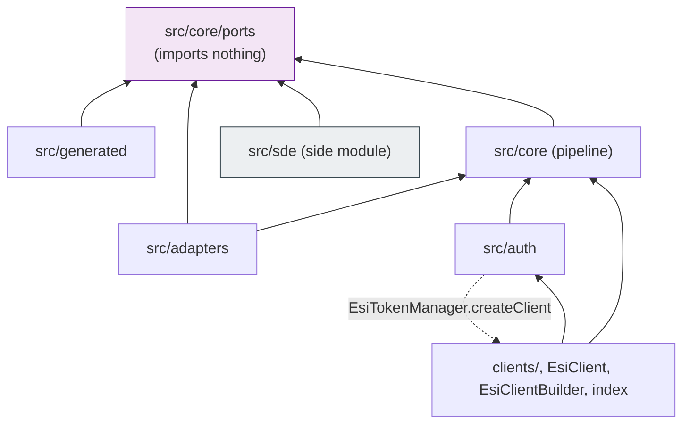
```mermaid
flowchart BT
    ports["src/core/ports<br/>(imports nothing)"]
    generated["src/generated"]
    core["src/core (pipeline)"]
    adapters["src/adapters"]
    legacy["clients/, EsiClient, EsiClientBuilder, index"]
    auth["src/auth"]
    sde["src/sde (side module)"]

    generated --> ports
    core --> ports
    adapters --> core
    adapters --> ports
    legacy --> core
    legacy --> auth
    auth --> core
    auth -. "EsiTokenManager.createClient" .-> legacy
    sde --> ports

    style ports fill:#f3e5f5,stroke:#6a1b9a
    style sde fill:#eceff1,stroke:#37474f
```

Solid arrows are the directions the rule permits for the ruled trees (ports, generated, core, adapters, SDE). Auth and the legacy tree have no rule between them: `index.ts` re-exports `src/auth`, and `EsiTokenManager.createClient` constructs an `EsiClient` (the dashed arrow), so the two import each other at the directory level. Phase 7 deprecates `EsiTokenManager.createClient` in favour of `as()`; removal is 12.0.0 at the earliest.

### What 11.0.0 still changes

Each item is one pull request in [ROADMAP.md](ROADMAP.md). None removes a legacy surface.

| Work                                        | What changes in this architecture                                                                                                                                                                                                                                                                                                                                                                                                                                                                                                                                    |
| ------------------------------------------- | -------------------------------------------------------------------------------------------------------------------------------------------------------------------------------------------------------------------------------------------------------------------------------------------------------------------------------------------------------------------------------------------------------------------------------------------------------------------------------------------------------------------------------------------------------------------- |
| Phase 2 PR 10b · identity-keyed cache       | `buildCacheKey` and `buildDedupeKey` hash the `Authorization` header today, so a token refresh changes every key for that character and empties its cache. 10b keys both by a stable identity (the character id when the token carries one, else the token hash), so ETags survive a refresh and two identities never share an entry.                                                                                                                                                                                                                                |
| Phase 2 PR 11 · builder and shared runtime  | A new entry exports the ports and builds one runtime holding the rate limiter, error budget, cache and transport. `esi.public` is a `PublicScopeTree`, so an authenticated call on it does not compile ([#183](https://github.com/lgriffin/ESI.ts/issues/183)). `esi.as(identity)` returns an immutable per-character view over the same runtime, taking an `EsiTokenManager` identity, a raw access token or a `TokenProvider`. The builder refuses to construct without a user agent. The new tree lives under `src/client/`, which the layer rule already covers. |
| Phase 2 PR 12 · mock transport              | `createMockTransport` in `./testing` implements `HttpTransport` for consumers' tests.                                                                                                                                                                                                                                                                                                                                                                                                                                                                                |
| Phase 3 · layer baseline to empty           | `ClientRegistry.ts` moves out of core and `EsiClientConfig` moves in; `BASELINE` becomes `{}`.                                                                                                                                                                                                                                                                                                                                                                                                                                                                       |
| Phase 4 · logging and import-time behaviour | URL sanitising moves to the logger boundary, the remaining call sites that bypass the per-client logger migrate to it (`ARCH-09`), no pino instance is built at import, and `package.json` declares `sideEffects: false` (`ARCH-06`).                                                                                                                                                                                                                                                                                                                                |
| Phase 7 · Node 22                           | `engines.node` becomes `>=22.0.0` in the one `feat!:` commit of the release (`REL-05`).                                                                                                                                                                                                                                                                                                                                                                                                                                                                              |

---

## 2. Request Lifecycle

Every domain method takes the same route. Order matters: a stage cannot see the effect of a later one.

1. **Domain method → `createClient` closure** (`src/core/endpoints/createClient.ts`). Logs a deprecation warning if the definition carries `deprecated`. `buildEndpointPath` assembles the path, query and body, and appends `datasource` when one is set. The request body is validated against `requestSchema` only when `validateRequest` is on; failure throws `EsiValidationError` with `direction: 'request'`.
2. **Spec-aware cache check** (`trySpecAwareCacheHit`). For a GET whose template has a generated TTL, a cached entry younger than that TTL is returned with no network call.
3. **Retry** (`RetryStrategy.execute`). Wraps everything below. Every attempt after the first checks the spec-TTL cache again before sending, because a concurrent call may have stored a fresh copy during the backoff. See [§5](#5-retry-and-deduplication).
4. **Deduplication.** Inside each attempt, an identical in-flight GET without a body joins the existing promise. The key is `buildDedupeKey(endpoint)`: the endpoint, prefixed by the same identity hash the cache uses when the endpoint requires auth.
5. **`executeSingleFetch`.** Build headers (below) → request interceptors → circuit breaker check → rate limiter check → fetch with timeout → parse headers → rate limiter learns from the response → circuit breaker records the outcome.
6. **Status handling** (`executeRequest`, then `statusHandling.ts`).
   - **201 or 204 on a non-GET** first runs `invalidateAfterWrite` (see [§4](#4-caching)).
   - **201** parses the body if there is one and returns it.
   - **`emptyWhenNoContent`.** On the two routes that opt in (`getPublicContractBids` and `getPublicContractItems`, where ESI answers an expired contract with a 200 and `Content-Length: 0`), such a 200 resolves with no body, and `createClient` turns that, or a 204, into `[]`. Elsewhere an empty 200 body is a `JSON_PARSE_ERROR`.
   - **304 with the entry gone.** When the request was sent as a revalidation but its cache entry was evicted while it was in flight (a write to its path, or expiry), `executeRequest` runs again; the repeat finds no entry, sends no `If-None-Match` and gets the current representation.
   - **304** otherwise serves the cached body and stores it again, restarting its TTL, or throws `EsiError(304)` if there is none. **204** returns `undefined`.
   - **5xx** with a cached copy serves it stale. Any other non-2xx throws `EsiError`; the message carries ESI's own `{ "error": "..." }` reason when the body has one (`readEsiErrorReason`, trimmed to 200 characters), and 401 and 403 add remediation text.
   - **2xx body.** An endpoint with `textResponse` (today only `meta.getOpenApiYaml`) reads the body as text; every other endpoint parses JSON.
7. **Cache write and pagination.** A successful GET with an ETag is cached, unless a write invalidated its path while it was in flight (the write generation, [§4](#4-caching)). A multi-page response is not cached here: `handleOffsetPagination` caches it once, after every page is merged. A non-GET that reaches this step invalidates the path. Cursor pagination reads `x-cursor-before` / `x-cursor-after`; offset pagination follows `x-pages` and merges the pages.
8. **Response interceptors → Zod validation → envelope.** Interceptors see the assembled response. When `validateResponse` is on (the default) the body is replaced by `safeParse().data`, or the cached copy is evicted (`evictRejectedResponse`) and `EsiValidationError` is thrown. `withMetadata()` and `withSafeMode()` wrap the result last.

**Request headers** (`buildRequestHeaders` in `requestPipeline/headers.ts`):

| Header                 | When                       | Value                                                                                                        |
| ---------------------- | -------------------------- | ------------------------------------------------------------------------------------------------------------ |
| `Accept`               | Always                     | `application/json`, or the endpoint's `textResponse.accept` (`meta.getOpenApiYaml` asks for YAML)            |
| `Accept-Encoding`      | Always                     | `gzip, deflate, br`                                                                                          |
| `User-Agent`           | Always                     | `<userAgent> @lgriffin/esi.ts/<version>` when a `userAgent` is configured, else the library identifier alone |
| `X-Compatibility-Date` | Always                     | The client's `compatibilityDate`, else `COMPATIBILITY_DATE` (`2026-08-18`) from `src/core/constants.ts`      |
| `X-User-Agent`         | When there is a value      | The configured `userAgent`, else the `clientId` if it is a legal header value                                |
| `X-Tenant`             | When `tenant` is set       | The tenant                                                                                                   |
| `Accept-Language`      | When `language` is set     | The language                                                                                                 |
| `Authorization`        | Only when `requiresAuth`   | `Bearer <token>`; with no token configured the call throws `NO_AUTH_TOKEN` before any network I/O            |
| `If-None-Match`        | GET, cache on, ETag stored | The stored ETag for this identity's cache key                                                                |
| `Content-Type`         | When there is a body       | `application/json`                                                                                           |

#### Happy Path

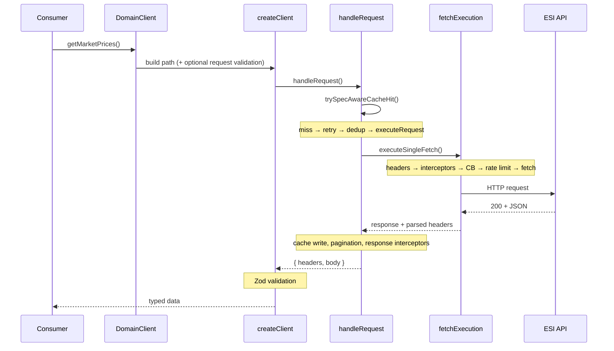
```mermaid
sequenceDiagram
    participant App as Consumer
    participant DC as DomainClient
    participant CC as createClient
    participant HR as handleRequest
    participant FE as fetchExecution
    participant ESI as ESI API

    App->>DC: getMarketPrices()
    DC->>CC: build path (+ optional request validation)
    CC->>HR: handleRequest()
    HR->>HR: trySpecAwareCacheHit()
    Note over HR: miss → retry → dedup → executeRequest
    HR->>FE: executeSingleFetch()
    Note over FE: headers → interceptors → CB → rate limit → fetch
    FE->>ESI: HTTP request
    ESI-->>FE: 200 + JSON
    FE-->>HR: response + parsed headers
    Note over HR: cache write, pagination, response interceptors
    HR-->>CC: { headers, body }
    Note over CC: Zod validation
    CC-->>App: typed data
```

#### Error and Edge-Case Handling

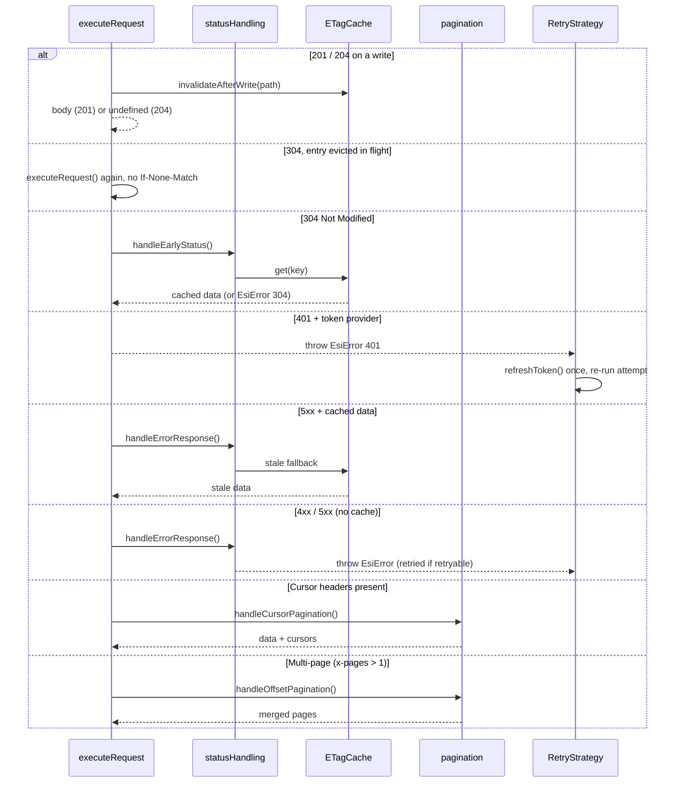
```mermaid
sequenceDiagram
    participant HR as executeRequest
    participant SH as statusHandling
    participant Cache as ETagCache
    participant PO as pagination
    participant RS as RetryStrategy

    alt 201 / 204 on a write
        HR->>Cache: invalidateAfterWrite(path)
        HR-->>HR: body (201) or undefined (204)
    else 304, entry evicted in flight
        HR->>HR: executeRequest() again, no If-None-Match
    else 304 Not Modified
        HR->>SH: handleEarlyStatus()
        SH->>Cache: get(key)
        Cache-->>HR: cached data (or EsiError 304)
    else 401 + token provider
        HR-->>RS: throw EsiError 401
        RS->>RS: refreshToken() once, re-run attempt
    else 5xx + cached data
        HR->>SH: handleErrorResponse()
        SH->>Cache: stale fallback
        Cache-->>HR: stale data
    else 4xx / 5xx (no cache)
        HR->>SH: handleErrorResponse()
        SH-->>RS: throw EsiError (retried if retryable)
    else Cursor headers present
        HR->>PO: handleCursorPagination()
        PO-->>HR: data + cursors
    else Multi-page (x-pages > 1)
        HR->>PO: handleOffsetPagination()
        PO-->>HR: merged pages
    end
```

---

## 3. Dependency Injection

Every resilience feature is behind an interface and scoped to one `ApiClient` instance; there are no shared singletons in the pipeline. A `null` dependency disables that feature for that client.

`configureApiClient()` builds the defaults from `EsiClientConfig`. At request time `requestPipeline/dependencies.ts` resolves each one:

| Dependency        | Setter on `ApiClient` | Default from `configureApiClient`                  | Resolution when absent                                              |
| ----------------- | --------------------- | -------------------------------------------------- | ------------------------------------------------------------------- |
| `ICache`          | `setCache()`          | `ETagCacheManager` unless `enableETagCache: false` | `resolveCache()` → `null`: no ETag, spec-TTL or stale caching       |
| `IRateLimiter`    | `setRateLimiter()`    | `RateLimiter`, always                              | `resolveRateLimiter()` **throws** `CONFIGURATION_ERROR`             |
| `ICircuitBreaker` | `setCircuitBreaker()` | `CircuitBreaker` only if `enableCircuitBreaker`    | `resolveCircuitBreaker()` → `null`: no circuit breaking             |
| `IRetryStrategy`  | `setRetryStrategy()`  | none; `retryConfig` of 3 retries, 1 s, 30 s        | `resolveRetryStrategy()` → `new RetryStrategy(retryConfig)`         |
| `IDeduplicator`   | `setDeduplicator()`   | `RequestDeduplicator` unless disabled              | read directly; `null` means no coalescing                           |
| `FetchLike`       | `setFetch()`          | none                                               | `globalThis.fetch`                                                  |
| `ILogger`         | `setLogger()`         | only when `logger` or `logLevel` is configured     | global logger, then the pino default (see [LOGGING.md](LOGGING.md)) |

Per-client settings are plain values with a setter each. `configureApiClient` or the construction surface sets them from `EsiClientConfig`:

| Setting                                | Setter                                           | Set by                                                   | Effect                                                              |
| -------------------------------------- | ------------------------------------------------ | -------------------------------------------------------- | ------------------------------------------------------------------- |
| `tenant`                               | `setTenant()`                                    | `configureApiClient`                                     | `X-Tenant`; refused when not a legal header value                   |
| `userAgent`                            | `setUserAgent()`                                 | `configureApiClient`                                     | Prefixes `User-Agent`, sets `X-User-Agent`; validated in the setter |
| `compatibilityDate`                    | `setCompatibilityDate()`                         | `EsiClient`, `CustomEsiClient` (not `EsiApiFactory`, §9) | `X-Compatibility-Date`                                              |
| `language`                             | `setLanguage()`                                  | each surface                                             | `Accept-Language`                                                   |
| `datasource`                           | `setDatasource()`                                | each surface                                             | `datasource` query parameter                                        |
| `onTokenRefresh`                       | `setTokenProvider()`                             | each surface                                             | 401 refresh (§5)                                                    |
| `accessToken`                          | `setAccessToken()`                               | the `ApiClient` constructor                              | `Authorization` on `requiresAuth` endpoints                         |
| `validateResponse` / `validateRequest` | `setValidateResponse()` / `setValidateRequest()` | `configureApiClient`                                     | Zod validation ([§10](#10-response-and-request-validation))         |
| `timeout`                              | `setTimeout()`                                   | `configureApiClient`                                     | Per-request `AbortController` timeout, default 30 s                 |

**Time is not injectable yet.** `src/core/clock.ts` exports `systemClock`, the `Clock` port's real implementation, and `npm run lint:determinism` blocks new direct reads of `Date.now()`, timers and `Math.random()` in `src/`. The existing sites in the rate limiter, cache, circuit breaker and request handler are listed in `scripts/determinism-baseline.json` and still read the wall clock directly; no pipeline class takes a `Clock`. `EsiTokenManager` takes a `now` function for tests.

**The ports are not the interfaces above.** The `ApiClient` setters take the `I*` interfaces. The Phase 2 ports in [§1a](#1a-ports-adapters-and-the-layer-rule) are the seams the 11.0 builder will accept; the existing classes match `HttpTransport`, `Logger` and `TokenProvider` structurally but none declares `implements` for a port.

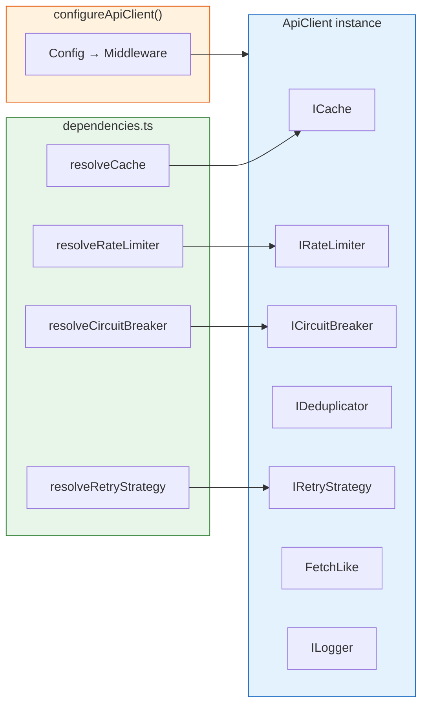
```mermaid
flowchart LR
    subgraph ConfigFactory ["configureApiClient()"]
        Wire["Config → Middleware"]
    end

    subgraph Client ["ApiClient instance"]
        cache["ICache"]
        rl["IRateLimiter"]
        cb["ICircuitBreaker"]
        dedup["IDeduplicator"]
        retry["IRetryStrategy"]
        fetch["FetchLike"]
        logger["ILogger"]
    end

    subgraph Resolution ["dependencies.ts"]
        rc["resolveCache"]
        rr["resolveRateLimiter"]
        rcb["resolveCircuitBreaker"]
        rrt["resolveRetryStrategy"]
    end

    Wire --> Client
    rc --> cache
    rr --> rl
    rcb --> cb
    rrt --> retry

    style ConfigFactory fill:#fff3e0,stroke:#e65100
    style Client fill:#e3f2fd,stroke:#1565c0
    style Resolution fill:#e8f5e9,stroke:#2e7d32
```

### Middleware inventory

| Concern         | Interface                                    | Default            | Key defaults                                                               |
| --------------- | -------------------------------------------- | ------------------ | -------------------------------------------------------------------------- |
| Rate limiter    | `IRateLimiter`                               | on, mandatory      | Buckets from generated groups; 420/429 → 60 s block; 50 ms minimum spacing |
| Circuit breaker | `ICircuitBreaker`                            | off, opt-in        | 5 failures, 30 s reset, 1 half-open probe, key by resolved path            |
| Deduplicator    | `IDeduplicator`                              | on                 | GET without body only                                                      |
| Retry           | `IRetryStrategy`                             | on                 | 3 retries, 1 s base, 30 s cap, GET only                                    |
| ETag cache      | `ICache`                                     | on                 | 1000 entries, 5 min default TTL, 60 s sweep                                |
| Interceptors    | `RequestInterceptor` / `ResponseInterceptor` | none               | Sequential, unsubscribe closure returned                                   |
| Transport       | `FetchLike`                                  | global fetch       | 30 s timeout                                                               |
| Logger          | `ILogger`                                    | pino, level `warn` | Per-client, falls back to global, then default                             |

---

## 4. Caching

Caching is on by default and has three tiers, checked in order.

```
Request (GET)
  │
  ▼
Tier 1  Spec TTL        entry younger than the generated TTL → return it, no HTTP call
  │ miss or expired
  ▼
Tier 2  ETag            send If-None-Match → 304 returns the cached body
  │ changed or no entry
  ▼
Tier 3  Full request    200 → cache it (if ESI sent an ETag)
```

**Spec TTL.** `esi-cache-ttls.generated.ts` maps `METHOD:template` to the `x-cache-age` value from the OpenAPI spec. Only GETs whose template has an entry are eligible. Within that window the stored body is returned with `cacheHitType: 'spec-ttl'`.

**Lifetime of a stored entry.** The freshness TTL is the generated spec TTL, else `Cache-Control: max-age`. An entry is kept for its freshness TTL plus one hour (`STALE_RETENTION_MS` in `cachePolicy.ts`), so after the spec-TTL window closes the entry still supplies `If-None-Match` and a stale body. An entry whose response gave no freshness TTL is kept for the cache's `defaultTtl` (5 minutes). Only responses that carry an `ETag` are stored. A 304 stores the entry again, which restarts both windows.

**Stale on error.** When ESI returns a 5xx and a cached entry exists, that entry is returned with `stale: true` and `cacheHitType: 'stale-on-error'` instead of throwing. Because nothing is thrown, the retry strategy does not retry that call. For a spec-TTL endpoint this applies from the end of the spec TTL until the retention hour runs out.

**Write invalidation.** Every successful non-GET, including the body-less 201 and 204 replies, runs `invalidateAfterWrite` (`cachePolicy.ts`) with the request path, query stripped. It does three things, in this order:

1. Detaches in-flight deduplicated reads under that path (`IDeduplicator.detachByPath`), so a read that starts after the write is not handed the response to one that started before it.
2. Deletes every cache entry whose key contains the path (`ICache.deleteByPath`).
3. Bumps the cache's write generation and records the path. A GET takes the generation before it is sent (`currentWriteGeneration`); `cacheResponse` declines to store its body if a write to the same path happened while it was in flight. The last 64 writes are kept; a read that outlived more is treated as overtaken.

**Multi-page responses** are cached once, by `handleOffsetPagination`, after every page is merged. Page 1 is not cached on its own, so a retried call cannot revalidate against page 1 and resolve with it after a 304.

**Validation failure evicts.** `executeRequest` caches a GET body before `createClient` validates it. When the body fails the schema, `evictRejectedResponse` deletes the entry, so the rejected body is not served again from the spec TTL or after a 304.

**Keys and isolation.** Public endpoints are keyed by URL and shared across callers of the same client. Authenticated endpoints prefix the key with the first 16 hex characters of a SHA-256 hash of the `Authorization` header (`buildCacheKey` in `src/core/cache/cacheKey.ts`), so two characters never share a cached body. The deduplication key (`buildDedupeKey`) is scoped the same way. See [SECURITY.md](SECURITY.md). Because the hash is of the token, a token refresh changes every key for that character and its cached entries are no longer found; ROADMAP Phase 2 PR 10b keys both by a stable identity instead.

**Eviction.** When `maxEntries` is reached, storing a new key evicts the oldest entry; replacing a stored key evicts nothing. Retention past the freshness TTL does not raise this bound. A timer removes expired entries every `cleanupInterval`; `shutdown()` stops it.

```typescript
const client = new EsiClient({
  enableETagCache: true, // default
  etagCacheConfig: {
    maxEntries: 1000, // default
    defaultTtl: 300_000, // ms, entry lifetime when neither spec nor Cache-Control gives a TTL
    cleanupInterval: 60_000, // ms
  },
});

const stats = client.getCacheStats(); // { totalEntries, maxEntries, hits, misses, hitRate, oldestEntry, newestEntry } or null
client.updateCacheConfig({ maxEntries: 2000 });
client.clearCache();

// See where a response came from
const result = await client.alliance.withMetadata().getAllianceById(99000001);
result.meta.fromCache; // boolean
result.meta.cacheHitType; // 'spec-ttl' | 'etag-304' | 'stale-on-error' | undefined
```

Set `enableETagCache: false` to disable all three tiers.

---

## 5. Retry and Deduplication

**Retry** (`src/core/RetryStrategy.ts`) wraps each call from `handleRequest` and each page from `handleSinglePageRequest`.

| Rule            | Behaviour                                                                                                                        |
| --------------- | -------------------------------------------------------------------------------------------------------------------------------- |
| What is retried | An `EsiError` whose `retryable` is true: status 0 (network or timeout), 420, 429, 502, 503, 504                                  |
| Which methods   | GET only, unless `retryMutations: true`                                                                                          |
| Delay           | `baseDelayMs × 2^attempt × jitter(0.75–1.25)`, capped at `maxDelayMs`                                                            |
| Defaults        | `configureApiClient` sets `maxRetries: 3`, `baseDelayMs: 1000`, `maxDelayMs: 30000`; `retryAttempts` overrides only the count    |
| Token refresh   | One refresh per call on a 401 when the endpoint requires auth and a token provider is set; the attempt is then re-run            |
| Cache re-check  | From the second attempt on, `handleRequest` checks the spec-TTL cache before sending; a copy stored during the backoff is served |
| Refresh failure | Rethrown as-is if it is an `EsiError` or `CircuitOpenError`, otherwise a `TOKEN_REFRESH_FAILED` error                            |
| Circuit open    | `CircuitOpenError` is rethrown immediately and never retried                                                                     |

Concurrent refreshes on one `ApiClient` share one in-flight provider call. Supply a custom `IRetryStrategy` through `retryStrategy` in the config or `ApiClient.setRetryStrategy()`.

**Deduplication** (`src/core/RequestDeduplicator.ts`) keys by `buildDedupeKey`: the resolved endpoint, prefixed with the caller's identity hash when the endpoint requires auth, so two concurrent GETs under different tokens are never answered from one response. It applies only to GETs without a body. Callers that arrive while a request is in flight receive the same promise, including its rejection. Because it sits inside the retry loop, each retry attempt re-enters the deduplicator. A successful write detaches in-flight reads under its path (§4). Disable it with `enableRequestDeduplication: false`.

---

## 6. Rate Limiting

ESI assigns most endpoints to a named rate-limit group with its own token bucket. The groups are extracted from the OpenAPI spec into `esi-rate-limit-groups.generated.ts`, so a burst against `market-order` does not throttle `char-notification`. Rate limiting is always on and needs no configuration.

**What the limiter does before each fetch** (`RateLimiter.checkRateLimit`):

1. **Blocked group.** If the group is blocked, sleep until the block ends and check again, up to ten times. If it is still blocked, throw a retryable `EsiError(429)` rather than send the request.
2. **Legacy error limit.** If `x-esi-error-limit-remain` is 10 or fewer, wait up to 5 s; if it is exhausted, wait for `x-esi-error-limit-reset`.
3. **Bucket pressure.** If the group's bucket is empty, wait 1 s. If remaining tokens are at or below `decelerationThreshold` (20%) of the limit, add a delay that grows to 1 s as the bucket drains.
4. **Minimum spacing.** Serialise requests so they are at least `minDelayMs` (50 ms) apart.

**What it learns after each fetch** (`updateFromResponse`): `x-ratelimit-remaining`, `-limit` and `-used` overwrite the bucket, and `x-ratelimit-group` selects the bucket when ESI names one. `Retry-After` blocks the group for that many seconds, or until that date when it is an HTTP date (an unreadable value is ignored); a 420 or 429 blocks it for 60 s if nothing longer is set. The limiter does not decrement tokens locally; ESI's headers are the source of truth. ESI's own charging table (2xx = 2, 3xx = 1, 4xx = 5, 5xx = 0) is exposed as `RateLimiter.getTokenCost(status)` for callers that want to budget.

**Endpoints without a group** share one fallback bucket that is only ever blocked by a 420/429.

```typescript
const client = new EsiClient({
  rateLimiterConfig: {
    minDelayMs: 50, // default
    decelerationThreshold: 0.2, // default
    // Multi-character apps: one set of group buckets and one error limit per key
    userKeyExtractor: (headers) => headers['Authorization'] ?? 'anon',
    // Tighter local budget for one endpoint (key uses snake_case params, no trailing slash)
    endpointOverrides: {
      'GET:markets/{region_id}/orders': {
        maxTokens: 100,
        windowSizeMs: 60_000,
      },
    },
  },
});
```

`userKeyExtractor` receives the outgoing request headers, after request interceptors have run. Idle user bucket sets are dropped after 15 minutes.

**Monitoring.** Per-response rate-limit state is available on `withMetadata()` results as `meta.rateLimit`. The `IRateLimiter` instance exposes `getStatus()` (worst bucket across all groups), `getGroupStatus(group)`, `getAllGroupStatuses()` and `isBlocked(group?)`; the last three read the shared buckets, not per-user ones. `EsiClient` does not expose the limiter directly; hold a reference by constructing an `ApiClient` yourself or by passing your own `IRateLimiter` to `ApiClient.setRateLimiter()`.

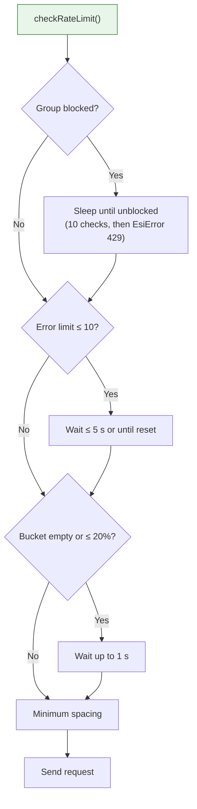
```mermaid
flowchart TB
    start["checkRateLimit()"] --> blocked{"Group blocked?"}
    blocked -->|Yes| wait["Sleep until unblocked<br/>(10 checks, then EsiError 429)"]
    blocked -->|No| legacy{"Error limit ≤ 10?"}
    wait --> legacy
    legacy -->|Yes| slow["Wait ≤ 5 s or until reset"]
    legacy -->|No| bucket{"Bucket empty or ≤ 20%?"}
    slow --> bucket
    bucket -->|Yes| decel["Wait up to 1 s"]
    bucket -->|No| spacing["Minimum spacing"]
    decel --> spacing
    spacing --> pass["Send request"]

    style start fill:#e8f5e9,stroke:#2e7d32
```

---

## 7. Circuit Breaker

The circuit breaker stops sending requests to a key that keeps failing. It is **off by default**; turn it on with `enableCircuitBreaker: true`. `circuitBreakerConfig` on its own does nothing.

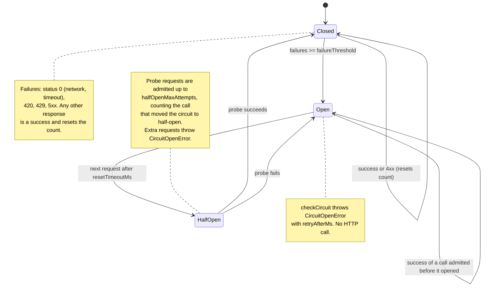
```mermaid
stateDiagram-v2
    [*] --> Closed

    Closed --> Closed: success or 4xx (resets count)
    Closed --> Open: failures >= failureThreshold

    Open --> Open: resetTimeoutMs not elapsed
    Open --> Open: success of a call admitted before it opened
    Open --> HalfOpen: next request after resetTimeoutMs

    HalfOpen --> Closed: probe succeeds
    HalfOpen --> Open: probe fails

    note right of Closed
        Failures: status 0 (network, timeout),
        420, 429, 5xx. Any other response
        is a success and resets the count.
    end note

    note right of Open
        checkCircuit throws CircuitOpenError
        with retryAfterMs. No HTTP call.
    end note

    note left of HalfOpen
        Probe requests are admitted up to
        halfOpenMaxAttempts, counting the call
        that moved the circuit to half-open.
        Extra requests throw CircuitOpenError.
    end note
```

**Where it runs.** In `executeSingleFetch`, after request interceptors and before the rate limiter. A `try/finally` with a `cbRecorded` flag records a failure if anything between the check and the response throws, including a rate-limiter abort, so a half-open probe slot is never leaked. The retry strategy rethrows `CircuitOpenError` without retrying.

**Configuration** (`CircuitBreakerConfig`):

| Option                | Default      | Description                                                                                   |
| --------------------- | ------------ | --------------------------------------------------------------------------------------------- |
| `failureThreshold`    | 5            | Consecutive failures before opening                                                           |
| `resetTimeoutMs`      | 30000        | Time after the last failure before a request may probe                                        |
| `halfOpenMaxAttempts` | 1            | Probe admissions counted in half-open                                                         |
| `keyStrategy`         | `'resolved'` | How requests map to circuits; see below                                                       |
| `staleThresholdMs`    | 3600000      | Age after which a closed, zero-failure circuit is removed by `cleanup()`                      |
| `cleanupIntervalMs`   | disabled     | Runs `cleanup()` on an unref'd timer when set above 0; `staleThresholdMs` is a sensible value |

**Keying.**

| Strategy     | Key                                                        | Effect                                                             |
| ------------ | ---------------------------------------------------------- | ------------------------------------------------------------------ |
| `'resolved'` | Resolved path without query, e.g. `characters/12345/`      | One failing character does not open the circuit for others         |
| `'template'` | Endpoint definition path, e.g. `characters/{characterId}/` | One circuit for the whole endpoint; detects a systemic ESI failure |

**Handling and diagnostics.**

```typescript
import { EsiClient, isCircuitOpen } from '@lgriffin/esi.ts';

const client = new EsiClient({
  enableCircuitBreaker: true,
  circuitBreakerConfig: { keyStrategy: 'template' },
});

try {
  await client.characters.getCharacterPublicInfo(12345);
} catch (err) {
  if (isCircuitOpen(err)) {
    console.log(`${err.endpoint} open, retry in ${err.retryAfterMs} ms`);
  }
}

const stats = client.getCircuitBreakerStats();
// { totalCircuits, openCircuits, circuits: { [key]: { state, failures } } } or null when disabled

client.resetCircuitBreaker('characters/{characterId}/'); // one key, in the format of the active strategy
client.resetCircuitBreaker(); // all circuits

client.shutdown(); // stops the cleanup timer and clears circuits
```

`CircuitOpenError` is not a subclass of `EsiError`. See [ERRORS.md](ERRORS.md).

---

## 8. Interceptors

Interceptors hook into the pipeline for logging, metrics, tracing headers or response transformation. `MiddlewareManager` (`src/core/middleware/Middleware.ts`) holds two ordered lists; `middlewareBridge.ts` applies them.

```typescript
interface RequestContext {
  url: string; // full URL
  endpoint: string; // resolved path
  method: string;
  headers: Record<string, string>; // a copy; return it to apply changes
  body?: unknown;
}

interface ResponseContext {
  url: string;
  endpoint: string;
  method: string;
  status: number;
  headers: Record<string, string>;
  body: unknown;
  durationMs: number;
  fromCache: boolean;
}

type RequestInterceptor = (
  ctx: RequestContext,
) => RequestContext | Promise<RequestContext>;
type ResponseInterceptor = (
  ctx: ResponseContext,
) => ResponseContext | Promise<ResponseContext>;
```

**Registration and removal.** Pass arrays as `requestInterceptors` / `responseInterceptors` in the config, or add them at runtime. Each `add*` returns an unsubscribe function that removes that interceptor.

```typescript
const client = new EsiClient({
  requestInterceptors: [
    (ctx) => ({
      ...ctx,
      headers: { ...ctx.headers, 'X-Trace-Id': crypto.randomUUID() },
    }),
  ],
});

const unsubscribe = client.addResponseInterceptor((ctx) => {
  metrics.histogram('esi.response_ms', ctx.durationMs, {
    status: ctx.status,
    cached: ctx.fromCache,
  });
  return ctx;
});
unsubscribe();
```

**Ordering and scope.**

| Rule                      | Behaviour                                                                                                                     |
| ------------------------- | ----------------------------------------------------------------------------------------------------------------------------- |
| Order                     | Registration order. Each interceptor is awaited and receives the previous one's return value                                  |
| Request interceptors run  | On every HTTP attempt: each retry and each page. After header construction, before the circuit breaker and rate limiter       |
| Request changes applied   | `url`, `headers` and `body`. `method` and `endpoint` are informational                                                        |
| Response interceptors run | Once per `handleRequest` call on the assembled result, including spec-TTL and stale cache hits, after offset pages are merged |
| Response changes applied  | `headers` and `body`. Zod validation runs after, on the modified body                                                         |
| Not run                   | Response interceptors do not run when the call throws, or on the per-page path used by `stream*` and `fetchAll*`              |
| Cost when unused          | Both bridges return immediately when no interceptor is registered                                                             |

An interceptor that throws fails the request with that error. Because request interceptors see the `Authorization` header, treat them as trusted code.

---

## 9. Client Creation Patterns

Three construction surfaces, all wired by `configureApiClient()`, so middleware is identical whichever one is used. `constructionParity.test.ts` checks that.

| Pattern              | Use case              | What you get                                                                 |
| -------------------- | --------------------- | ---------------------------------------------------------------------------- |
| **EsiClient**        | Most consumers        | Every domain client as a lazy getter (`client.market`, `client.alliance`, …) |
| **EsiClientBuilder** | Selective             | A `CustomEsiClient` with only the clients you add, and fluent configuration  |
| **EsiApiFactory**    | Single-domain scripts | One domain client on its own `ApiClient`                                     |

`ClientRegistry` maps each of the 39 `ApiClientType` names to its class. `ARCH-08` requires every surface to expose the same set. `CustomEsiClient` has a getter for every registered client, checked at compile time by `tests/tdd/core/customClientGetters.test.ts`. `EsiApiFactory` reaches all 39 through `createClient(type)` and has named methods for 9 (`createAllianceClient`, `createCharacterClient`, `createCorporationClient`, `createMarketClient`, `createUniverseClient`, `createFleetClient`, `createAssetsClient`, `createWalletClient`, `createMailClient`); nothing checks its client set.

**Known gap: `compatibilityDate` on `EsiApiFactory`.** `EsiClient` and `CustomEsiClient` call `setCompatibilityDate()` from the config before `configureApiClient()`. `EsiApiFactory.buildApiClient` sets language, token provider and datasource but not the compatibility date, so a factory-built client always sends the library's `COMPATIBILITY_DATE`. `constructionParity.test.ts` compares middleware, not these identity settings. This is an `ARCH-08` parity gap.

**`ApiClientBuilder`** (`src/core/ApiClientBuilder.ts`, exported from the root) is a fourth, lower-level way in. It builds a bare `ApiClient` with a rate limiter (the default `RateLimiter` unless one is given) and whatever cache, circuit breaker, timeout and fetch it is handed. It does not call `configureApiClient()`, so there is no deduplicator, no default cache, and no retry configuration: `resolveRetryStrategy` then builds a `RetryStrategy` with its own defaults, which retry nothing. Use it to hand-assemble a client for a test or an unusual host, not as a construction surface.

**`EsiTokenManager.createClient(characterId)`** returns an `EsiClient` bound to one character's token and refresh provider. ROADMAP Phase 7 deprecates it and `EsiApiFactory`'s named methods in favour of the 11.0 builder and `as()` ([§1a](#1a-ports-adapters-and-the-layer-rule)); removal is 12.0.0 at the earliest.

Timers are owned by the client: call `shutdown()` to stop the cache sweep and circuit-breaker cleanup and clear the deduplicator.

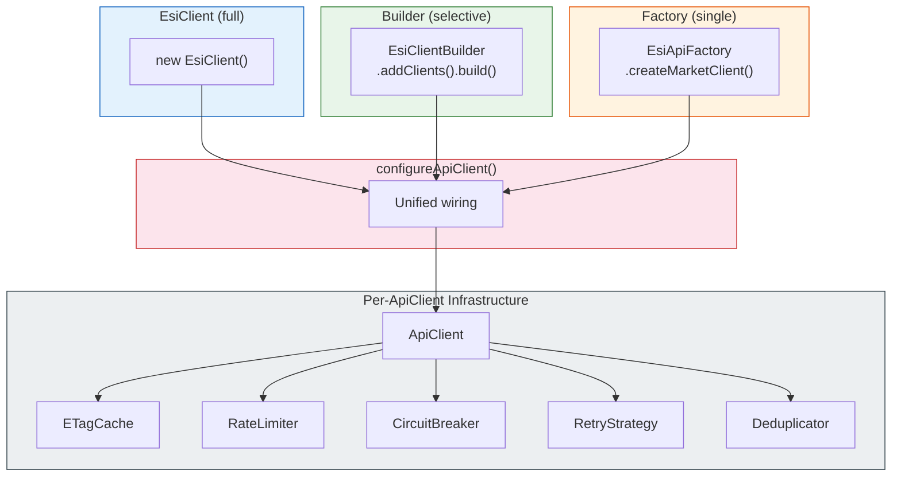
```mermaid
flowchart TB
    subgraph P1 ["EsiClient (full)"]
        p1["new EsiClient()"]
    end
    subgraph P2 ["Builder (selective)"]
        p2["EsiClientBuilder\n.addClients().build()"]
    end
    subgraph P3 ["Factory (single)"]
        p3["EsiApiFactory\n.createMarketClient()"]
    end

    subgraph CW ["configureApiClient()"]
        cw["Unified wiring"]
    end

    subgraph Infra ["Per-ApiClient Infrastructure"]
        ac["ApiClient"]
        cache["ETagCache"]
        rl["RateLimiter"]
        cb["CircuitBreaker"]
        retry["RetryStrategy"]
        dedup["Deduplicator"]
    end

    p1 --> cw
    p2 --> cw
    p3 --> cw
    cw --> ac
    ac --> cache
    ac --> rl
    ac --> cb
    ac --> retry
    ac --> dedup

    style P1 fill:#e3f2fd,stroke:#1565c0
    style P2 fill:#e8f5e9,stroke:#2e7d32
    style P3 fill:#fff3e0,stroke:#e65100
    style CW fill:#fce4ec,stroke:#c62828
    style Infra fill:#eceff1,stroke:#37474f
```

---

## 10. Response and Request Validation

Validation lives in `createClient()`, so it is centralised rather than repeated in each domain client. Response validation is on by default; request validation is opt-in. The full guide, including schema conventions and how to extend a schema, is [RUNTIME-VALIDATION.md](RUNTIME-VALIDATION.md).

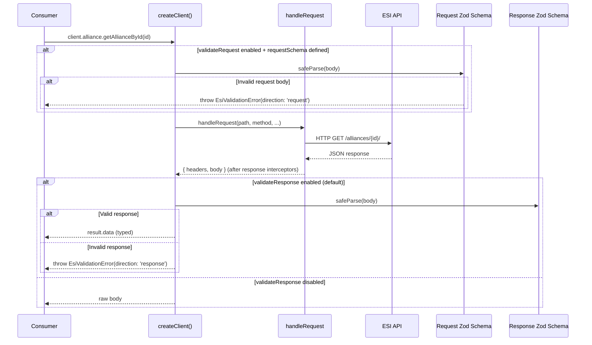
```mermaid
sequenceDiagram
    participant Consumer
    participant CreateClient as createClient()
    participant Handler as handleRequest
    participant ESI as ESI API
    participant ReqSchema as Request Zod Schema
    participant RespSchema as Response Zod Schema

    Consumer->>CreateClient: client.alliance.getAllianceById(id)

    alt validateRequest enabled + requestSchema defined
        CreateClient->>ReqSchema: safeParse(body)
        alt Invalid request body
            ReqSchema-->>Consumer: throw EsiValidationError(direction: 'request')
        end
    end

    CreateClient->>Handler: handleRequest(path, method, ...)
    Handler->>ESI: HTTP GET /alliances/{id}/
    ESI-->>Handler: JSON response
    Handler-->>CreateClient: { headers, body } (after response interceptors)

    alt validateResponse enabled (default)
        CreateClient->>RespSchema: safeParse(body)
        alt Valid response
            CreateClient-->>Consumer: result.data (typed)
        else Invalid response
            CreateClient-->>Consumer: throw EsiValidationError(direction: 'response')
        end
    else validateResponse disabled
        CreateClient-->>Consumer: raw body
    end
```

- **Loose objects.** Schemas use `z.looseObject()`, so fields ESI adds later survive `safeParse().data` (`DES-01`).
- **Typed returns.** `InferEndpointResult<D>` is `z.infer` of the response schema; cursor endpoints return `CursorResult<Element>`.
- **Drift.** `npm run schema:drift` compares the hand-written schemas with the live OpenAPI spec.

---

## 11. Pagination and Streaming

ESI pages data two ways, and the library exposes three styles on top. The full guide, with concurrency defaults and failure semantics, is [PAGINATION.md](PAGINATION.md).

| Style             | Entry point                                             | Path through the pipeline                                                                                |
| ----------------- | ------------------------------------------------------- | -------------------------------------------------------------------------------------------------------- |
| Eager offset      | Any paginated domain method                             | `executeRequest` reads `x-pages`, fetches the rest and returns one merged array                          |
| Streaming offset  | `stream*` methods, `BaseEsiClient.streamEndpoint()`     | `AsyncPaginationIterator.fetchPages()` yields one validated page at a time via `handleSinglePageRequest` |
| Concurrent offset | `fetchAll*` methods, `BaseEsiClient.fetchAllEndpoint()` | `fetchAllPages()` fetches page 1, then the rest in batches, via `handleSinglePageRequest`                |
| Cursor            | Endpoints with `cursorPagination`                       | `createClient` appends `before` / `after`; result is `CursorResult` with `cursors`                       |

`handleSinglePageRequest` applies retry, the circuit breaker, the rate limiter and request interceptors, but not the spec-TTL cache, deduplication, cache writes or response interceptors.

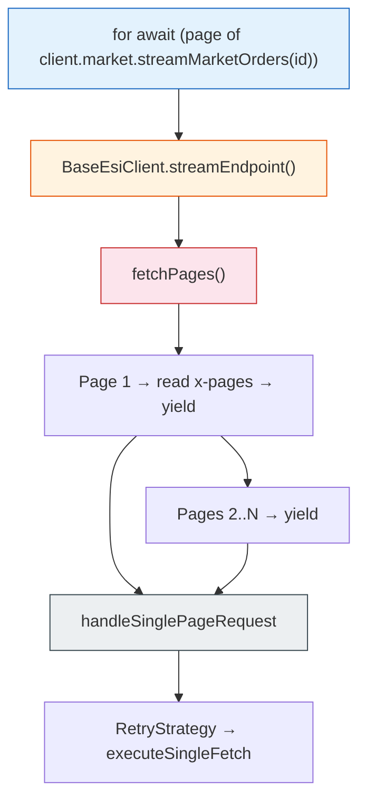
```mermaid
flowchart TB
    fa["for await (page of client.market.streamMarketOrders(id))"] --> se["BaseEsiClient.streamEndpoint()"]
    se --> fp["fetchPages()"]
    fp --> p1["Page 1 → read x-pages → yield"]
    p1 --> pn["Pages 2..N → yield"]
    p1 --> sp["handleSinglePageRequest"]
    pn --> sp
    sp --> retry["RetryStrategy → executeSingleFetch"]

    style fa fill:#e3f2fd,stroke:#1565c0
    style se fill:#fff3e0,stroke:#e65100
    style fp fill:#fce4ec,stroke:#c62828
    style sp fill:#eceff1,stroke:#37474f
```

---

## 12. Errors

```
Error
├── EsiError (statusCode, sanitised url, requestId)      .retryable ⇐ {0, 420, 429, 502, 503, 504}
│   ├── TimeoutError (+ timeoutMs)
│   └── EsiValidationError (+ ZodError, direction: request | response)
├── CircuitOpenError (endpoint, failures, retryAfterMs)   not an EsiError
├── AuthError
│   ├── SsoError (+ statusCode)                           .retryable ⇐ 429 or ≥ 500
│   ├── TokenRevokedError
│   ├── TokenDecodeError
│   └── CharacterNotFoundError
└── SdeError → SdeDatabaseError | SdeValidationError | SdeVersionMismatchError
```

The auth subtree lives in `src/auth/errors.ts` and is exported from the root and `./errors`, with guards `isAuthError`, `isSsoError`, `isTokenRevoked` and `isCharacterNotFound`.

Configuration and plumbing faults (`NO_AUTH_TOKEN`, `CONFIGURATION_ERROR`, `JSON_PARSE_ERROR`, `TOKEN_REFRESH_FAILED`, …) are still plain `Error`s with a type prefix; `ARCH-07` records that as a gap, and ROADMAP Phase 3 gives them a typed `EsiConfigurationError` family, a typed network fault, and a non-retryable `EsiValidationError`, each extending the existing classes so `instanceof EsiError` keeps working. Guards, safe mode and the full retryability rules are in [ERRORS.md](ERRORS.md).

---

## 13. Logging

Pipeline code logs through `logInfo` / `logWarn` / … in `src/core/logger/clientLog.ts`, which resolve the logger per call: the client's own logger, then the global logger from `setLogger()`, then the pino default at `ESI_LOG_LEVEL` (default `warn`). `ARCH-09` requires all pipeline logging to take the per-client route; the rate limiter still logs with no client handle and so reaches the global logger. ROADMAP Phase 4 migrates the remaining call sites, moves URL sanitising to the logger boundary, adds a lint that forbids the global logger import inside `src/core/requestPipeline`, and stops building a pino instance at import. The `Logger` port in `src/core/ports/` has the same six methods as `ILogger`. See [LOGGING.md](LOGGING.md).

---

## 14. Code Generation

Five generated artefacts come from two generators (`ARCH-01`). `npm run generate:types` (`scripts/generate-esi-types.ts`) fetches the ESI OpenAPI document at `COMPATIBILITY_DATE` (or `--latest`, `--compatibility-date=`, `--spec-file=`) and writes four:

| Artefact                                                | Consumed by                                                |
| ------------------------------------------------------- | ---------------------------------------------------------- |
| `src/types/generated/esi-spec.generated.ts`             | The `EsiSpec` type namespace and `spec-alignment.check.ts` |
| `src/core/endpoints/esi-cache-ttls.generated.ts`        | Spec-aware caching (`lookupSpecTtl`)                       |
| `src/core/endpoints/esi-rate-limit-groups.generated.ts` | `RateLimiter` group buckets                                |
| `src/core/endpoints/esi-scopes.generated.ts`            | `validate:auth-scopes`, scope lookups for consumers        |

`npm run spec:generate` (`scripts/spec-generate.ts`, with `scripts/spec-scope-tree.ts` for the tree) never touches the network. It reads the vendored snapshot `tests/contract/snapshots/esi-openapi.snapshot.json` and writes the fifth:

| Artefact                                | Consumed by                                                                                                                      |
| --------------------------------------- | -------------------------------------------------------------------------------------------------------------------------------- |
| `src/generated/operations.generated.ts` | `PipelineTransport` tests today; the 11.0 builder's public and per-identity trees ([§1a](#1a-ports-adapters-and-the-layer-rule)) |

The snapshot changes in one place: `spec-refresh.yml`, run by a push to a `spec-refresh/**` branch or by manual dispatch, re-vendors the document at `COMPATIBILITY_DATE`, runs `spec:generate` and `spec:coverage`, runs `generate:types` against the new snapshot, re-records the public payload fixtures, and commits the result for review.

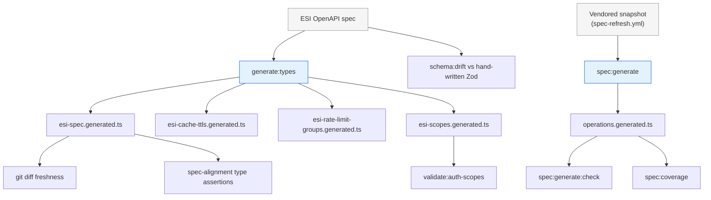
```mermaid
flowchart TB
    spec["ESI OpenAPI spec"] --> gen["generate:types"]
    gen --> types["esi-spec.generated.ts"]
    gen --> ttls["esi-cache-ttls.generated.ts"]
    gen --> rates["esi-rate-limit-groups.generated.ts"]
    gen --> scopes["esi-scopes.generated.ts"]

    snap["Vendored snapshot<br/>(spec-refresh.yml)"] --> specgen["spec:generate"]
    specgen --> ops["operations.generated.ts"]
    ops --> check["spec:generate:check"]
    ops --> cov["spec:coverage"]

    types --> fresh["git diff freshness"]
    types --> align["spec-alignment type assertions"]
    scopes --> auth["validate:auth-scopes"]
    spec --> drift["schema:drift vs hand-written Zod"]

    style spec fill:#f5f5f5,stroke:#999
    style gen fill:#e3f2fd,stroke:#1565c0
    style snap fill:#f5f5f5,stroke:#999
    style specgen fill:#e3f2fd,stroke:#1565c0
```

| Check                         | Mechanism                                                                                                                     | What it catches                                                                                     |
| ----------------------------- | ----------------------------------------------------------------------------------------------------------------------------- | --------------------------------------------------------------------------------------------------- |
| Generated freshness           | `git diff --exit-code` on `src/types/generated/` and the cache-TTL file after `generate:types`, in `ci.yml` and `release.yml` | Stale generated files after an ESI spec change. The rate-limit-group and scope files are not diffed |
| Generated operations          | `spec:generate:check` and `spec:coverage` in `ci.yml` `lint-and-build`                                                        | An edited or stale `operations.generated.ts`, or an operation missing from it                       |
| Auth / scope cross-validation | `scripts/validate-auth-scopes.ts`                                                                                             | `requiresAuth` disagreeing with the scope map (`DES-04`)                                            |
| Spec-alignment assertions     | `AssertTrue<HasAllSpecKeys<SpecType, ZodType>>` at compile time                                                               | A hand-written schema missing a field the spec defines                                              |
| Schema drift                  | `npm run schema:drift`                                                                                                        | Hand-written schemas diverging from the spec's field names and types                                |

Generated files are never edited by hand (`DES-03`). Where each check runs in CI is in [QUALITY-GATES.md](QUALITY-GATES.md); supply-chain controls such as SHA-pinned actions and npm provenance are in [SECURITY.md](SECURITY.md); the test tiers are in [TESTING.md](TESTING.md).
