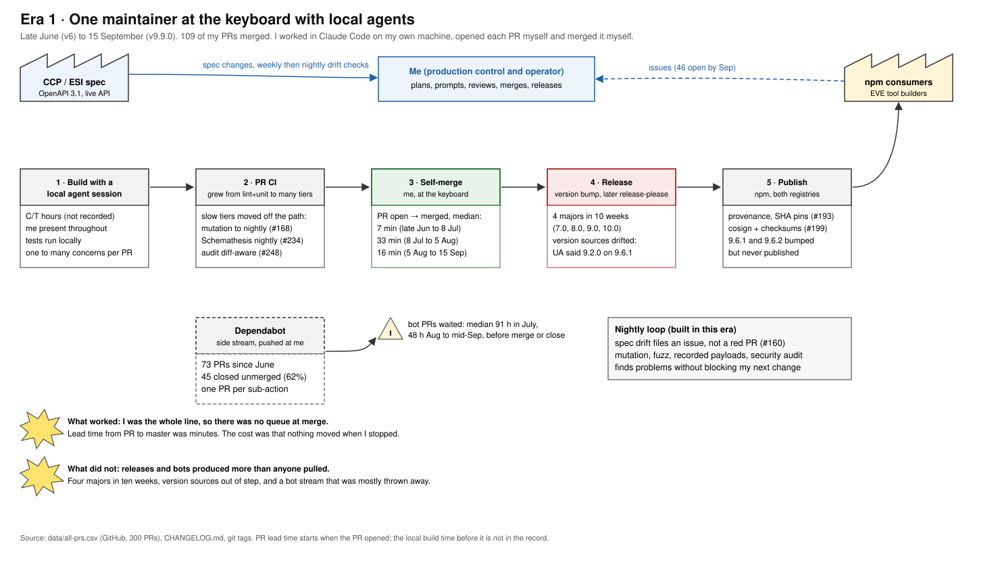
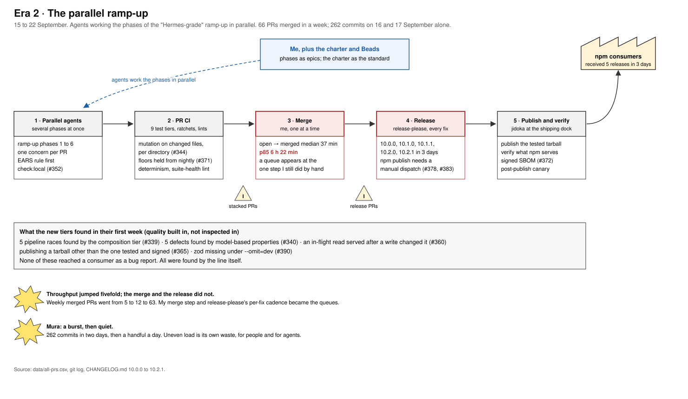
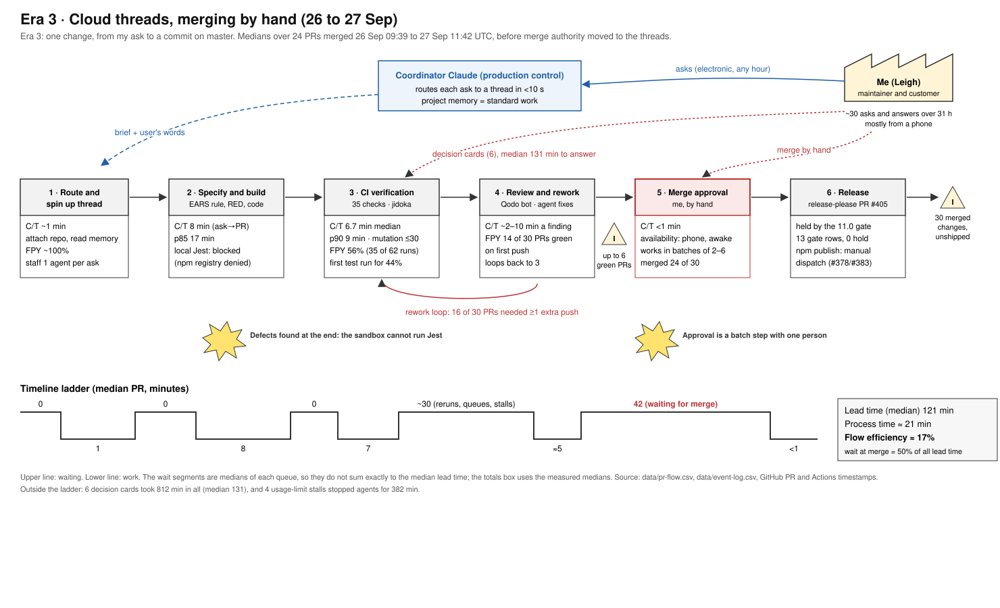
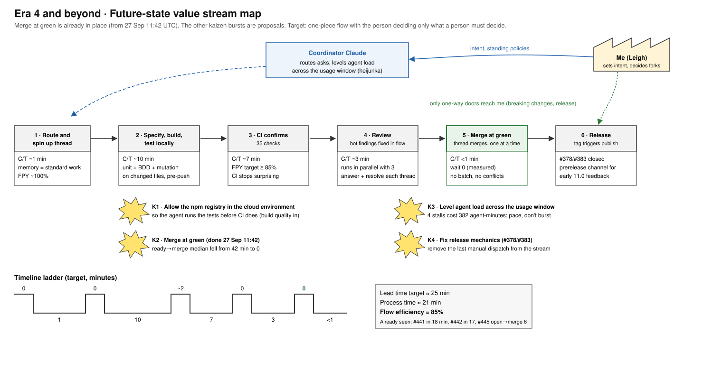

# Lean by Decision: the ESI.ts Decision Record, v7 to 11.0

**Leigh Griffin** · 27 September 2026 · a standalone record of how I built ESI.ts, and why

---

## Why this document exists

I am writing a book on Lean software development for Manning. ESI.ts, my TypeScript client for EVE Online's ESI API, is where I test the ideas on myself. From v7 onwards I built most of it with Claude as the engineer and myself as the maintainer, the customer and, for a long time, the only person who could press merge.

This document has two readers. The first is me: a record of the decisions I made and the Lean reasoning behind each one, measured against what actually happened. The second is Claude. I want any Claude session that works with me to understand how I think, not just what I decided, so that when it meets a situation I have not covered it reasons the way I would. Where a decision carries a lesson I want an agent to apply, I say so directly under **For Claude**.

It is standalone. Everything it cites is in the ESI.ts repository (`github.com/lgriffin/ESI.ts`) or in the data files beside it, under `guides/lean/`. Every number comes from a timestamp that already existed: GitHub pull requests and Actions runs, git tags, the changelog, and the project threads where I worked with Claude from 26 September. Nothing was measured with a stopwatch, and where a number is an estimate I say so.

---

## Part 1 · The lens I apply

I do not use Lean as a vocabulary. I use it as a small set of questions I ask of every change. In software terms they are:

1. **What does the customer actually receive?** For ESI.ts the customer is a developer building an EVE tool, and the thing they receive is whatever ESI sends, passed through my client. Value is defined there, at the wire, not in my types or my plans. My charter puts it as: _the OpenAPI spec is upstream._
2. **Where does the work wait?** Almost all lead time is waiting. Agents made building nearly free, which does not change that; it makes it the only thing left to improve.
3. **Does the line stop itself?** Quality is built in by machines that stop the line at the first abnormality (jidoka), not inspected in afterwards by a person. A check that can be ignored is not a check.
4. **Is anyone pulling this?** If nobody asked for it, it is overproduction, whether a person or a bot made it.
5. **Is the standard written down, and does it only move forward?** Standard work is what lets the next person, or the next agent, start where the last one stopped. Ratchets let quality move up and never down.
6. **Who has the information?** Decisions should sit with whoever has the information to make them. A person should decide only what a machine cannot.
7. **What did we learn, and is it in the system now?** Kaizen that lives in someone's head is gone the next morning. It has to be a PR, a rule, or a memory.

My engineering charter (`guides/CHARTER.md`) states the product side of this as seven positions, and I hold every change to them:

- The OpenAPI spec is upstream.
- Hand-write where judgement matters.
- Tolerate additive change.
- Resilience is pluggable.
- Secure by construction.
- The specification executes.
- Verifiable supply chain.

---

## Part 2 · The value stream

The unit of flow is **one change**: one pull request, carrying one concern. The stream runs from an ask (mine, or an issue, or a bot) to a commit on `master`, and on to a release that a consumer installs from npm.

The stream changed shape three times between v7 and 11.0, and each shape has its own value stream map below. The shapes matter more than any single number, because each one moved the constraint somewhere new.

| Era | When                               | How the work ran                                        | PRs merged | PR open → merged (median) | p85            |
| --- | ---------------------------------- | ------------------------------------------------------- | ---------- | ------------------------- | -------------- |
| 0   | Late June to 8 July                | Me at the keyboard with Claude Code, merging my own PRs | 25         | 7 min                     | 22 min         |
| 1a  | 8 July to 5 August (v7)            | Same                                                    | 19         | 33 min                    | 64 min         |
| 1b  | 5 August to 15 September (v8, v9)  | Same                                                    | 65         | 16 min                    | 52 min         |
| 2   | 15 to 22 September (v10 ramp-up)   | Many agents in parallel, me merging                     | 66         | 37 min                    | **6 h 22 min** |
| 3   | 26 September to 27 September 11:42 | Cloud threads, me merging from my phone                 | 24         | **1 h 54 min**            | 3 h 37 min     |
| 4   | From 27 September 11:42            | Cloud threads merging their own PRs at green            | 9          | **14 min**                | 45 min         |

_Human-authored PRs only. PR open to merged excludes the time spent building before the PR opened. Source: `lean/data/all-prs.csv`._

That table is the whole story in miniature. When I was the entire line, there was no queue at merge. When I multiplied the line with agents but kept the merge in my hands, a queue formed exactly there. When I handed the merge to the line, the queue disappeared and the parallelism stayed.

---

## Part 3 · The maps

### Era 1 · One maintainer at the keyboard with local agents

I worked in Claude Code on my own machine, opened each PR and merged it myself. Lead time from PR to `master` was minutes because I was present at every step. The waste in this era was not in the main line. It was in the side streams: Dependabot opened 73 PRs from June onwards and 45 of them (62%) were closed without merging; its PRs waited a median of 91 hours in July and 48 hours from August to mid-September before anyone touched them. And I released too often: four major versions in ten weeks (7.0.0 on 8 July, 8.0.0 on 5 August, 9.0.0 on 12 August, 10.0.0 on 17 September), with version sources that drifted so far that requests told CCP they came from `esi.ts/9.2.0` while `package.json` said 9.6.1.

### Era 2 · The parallel ramp-up

In mid-September I ran the "Hermes-grade" ramp-up: many agents working its phases in parallel against the charter. Weekly merged PRs went from 5 to 12 to 63; there were 262 commits on 16 and 17 September alone. The new test tiers found ten real defects in their first week without a single consumer bug report. But capacity rose and two steps did not: my merge (median 37 minutes, p85 over six hours) and release-please, which cut five releases (10.0.0, 10.1.0, 10.1.1, 10.2.0, 10.2.1) in three days. The burst itself was mura: 262 commits in two days, then a handful a day.

### Era 3 · Cloud threads, merging by hand

On 26 September I moved the work into a Claude project: a coordinator that routes my asks and a thread per ask that builds, tests and drives a PR green. I measured this era from my ask, not from the PR opening, because the threads timestamp everything. The median change took **8 minutes** from my ask to an open, tested PR and **121 minutes** to reach `master`. About 21 minutes of that was work, so flow efficiency was about **17%**. Half of all lead time was green PRs waiting for me. Because I merged from my phone when I could, I merged in batches of two to six, and the batches caused a merge conflict (#417 and #419), a red `master` (#420 merged minutes before its own fix, repaired by #426), and a change merged into a branch that had already landed (#431, redone as #439).

### Era 4 · Merge at green, and the future state

At 11:42 on 27 September I wrote "Please merge as needed". The gate did not change: the same 35 required checks, every review thread answered and resolved. Only the hand on the button changed. Ready-to-merged fell from a 42-minute median to zero. Clean changes went from my ask to `master` in 17 and 18 minutes (#441, #442), a flow efficiency of about 85%. The map shows the rest of the future state: tests running in the agent's own environment before CI (K1), agent load levelled across the usage window (K3), and the last manual step taken out of release (K4).

---

## Part 4 · The decisions

Each decision has the same shape: what I decided, the Lean reasoning, and the evidence of what happened. PR numbers are on `github.com/lgriffin/ESI.ts`.

### Foundations I inherited into v7

Three decisions made just before v7 shaped everything after it.

**Types come from the spec, not from me** (v5, #78, #81, June). Types, cache TTLs, rate-limit groups and scopes are generated from ESI's own OpenAPI document. _Lean reasoning:_ the supplier's specification is the definition of the part; copying it by hand is a second source of truth that will drift. _Evidence:_ it made every later drift check possible.

**Behaviour is written as requirements before code** (#88, #92, June and July). The BDD suite moved to Gherkin and then to EARS patterns. _Lean reasoning:_ standard work for requirements; a requirement you can execute is one you cannot quietly weaken.

**Validate every response at runtime, but tolerate additions** (v6, #93, 3 July). Every response passes a Zod schema; schemas use loose objects so a new field from CCP never breaks a consumer. _Lean reasoning:_ jidoka for data: stop on a real abnormality, not on harmless variation. A line that stops for everything gets its andon cord disconnected. _Evidence:_ live validation immediately found schemas that did not match ESI (#94, #101), which is the whole point.

### Era 1 · v7 to v9.9 (July to mid-September)

**1 · One spec, the newest one** (v7.0.0, #102, 8 July). I moved from Swagger 2.0 to OpenAPI 3.1 and fetched one spec instead of two. _Lean reasoning:_ two sources of the same truth is a waste and a defect generator. _Evidence:_ 161 generated interfaces instead of 147, and one fetch instead of two. It was a major version, and that is a cost I return to in decision 26.

**2 · Inspect the supplier's material on arrival** (v7.1.0, #103). Redocly lints ESI's own spec before I generate from it. _Lean reasoning:_ incoming inspection. If CCP ships a broken spec, I want to know before it becomes my broken types.

**3 · Move detection upstream** (v7.2 to v7.3, #104, #112, #113, July). Contract testing against the live spec, property-based fuzzing, and schema drift as a _blocking_ check, plus compile-time spec-to-Zod alignment. _Lean reasoning:_ find the defect at the station that makes it. _Evidence:_ the fuzzing alone added 601 tests on the path-parameter and query validators, and years later it is the tier that proved the `..` path fix (#430).

**4 · Make the consumer's mistakes impossible** (#115, #116, 14 July). Branded ID types and an `EsiResult<T>` safe mode. _Lean reasoning:_ poka-yoke for the customer. A `characterId` cannot be passed where an `allianceId` belongs.

**5 · An andon that does not stop the line is not an andon** (#117, 14 July). I removed `continue-on-error` from three CI jobs. _Lean reasoning:_ a check that can fail without consequence teaches everyone to ignore it. _For Claude:_ never make a failing check non-blocking to get green. If a check is wrong, fix the check in its own PR.

**6 · Put slow inspection where it is cheap, then ratchet it** (#126 on 27 July, #168 on 14 August, then #344, #359, #371 in September). Mutation testing started non-blocking, moved to nightly, and came back to the PR path only when it could run on the files a PR changes, gated per directory against floors the nightlies had earned. _Lean reasoning:_ inspection has a cost. Put the full inspection in a nightly loop that does not hold anyone's work, and put a right-sized version on the line. Ratchets make improvement one-way. _Evidence:_ by 19 September every logger, util and pagination mutant was killed (#374, #375).

**7 · 5S the codebase before building on it** (#136, 5 August). Dead code, duplicate schemas and docs drift removed as "phase 0". _Lean reasoning:_ sort, set in order, shine. You cannot see abnormality in a cluttered workplace.

**8 · Make resilience a port, not a product** (#141, #143, 5 August). The request handler became a pipeline of modules with an injectable retry strategy. _Lean reasoning:_ flexibility; a component that can be swapped without changing its neighbours is the software form of quick changeover.

**9 · Safe by default, and ship less surface** (v9.0.0, #145, #154, 12 August). Retries default to three with backoff; generated schemas left the public API; sub-path exports (`/schemas`, `/errors`, `/testing`) let a consumer pull only what they use. _Lean reasoning:_ the default is the standard; exported surface is inventory I must maintain forever.

**10 · Route the andon to the owner** (#160, 14 August). The nightly spec-drift check files an issue instead of turning someone's PR red. _Lean reasoning:_ stop the right line. A drift in ESI is not the fault of whoever happens to have a PR open. _For Claude:_ when a failure is not caused by the change under test, route it to where it belongs rather than blocking the change.

**11 · Tolerate what ESI adds, pin what it removes** (#156, #188, August). A configurable compatibility date and resilient enum validation. _Lean reasoning:_ value is what the customer receives today, and ESI changes by date.

**12 · Secure the shipping dock** (#176, #191, #192, #193, #199, 18 to 24 August). OSSF Scorecard, ETag cache isolated per token (a real cross-tenant leak, #191), workflows hardened against script injection, actions pinned by SHA, npm provenance, cosign signatures and checksums. _Lean reasoning:_ quality includes what the customer cannot see. A supply chain you cannot verify is a defect waiting for a trigger.

**13 · Make the work visible to agents** (#196, 24 August). I adopted Beads as the issue tracker agents read and write. _Lean reasoning:_ visual management. _Evidence and caveat:_ it worked while I ran agents locally; by late September my local Beads copy had drifted from GitHub, which cost a thread time to rediscover what was really open. A second board is a second source of truth.

**14 · Fail only on what this change introduced** (#234, #248, 9 September). Schemathesis moved to nightly; `npm audit` on the PR path became diff-aware, failing only on advisories the PR adds, with accepted risks in an allowlist that _must_ carry an expiry date. _Lean reasoning:_ don't stop one station for another station's defect; and a workaround without an expiry becomes permanent. _For Claude:_ any exception you record needs a reason and a date it stops being acceptable.

**15 · One version, one source** (#249, 9 September). Version sources realigned after the stale user agent. _Lean reasoning:_ if a number exists in three places, two of them are wrong.

**16 · Requirements that execute, derived from what the tests assert** (v9.8.0, #251, 10 September). All feature files rewritten as atomic EARS requirements, one per `Rule:`, with a CI-gated audit that rejects vague language. _Lean reasoning:_ standard work for specification. _Evidence:_ deriving each requirement from its assertions exposed scenarios whose titles claimed coverage their assertions never provided. False confidence is a hidden defect.

**17 · Write the charter** (v9.9.0, #288, 15 September). Every requirement numbered, in EARS form, with the script or CI job that enforces it, a status of Enforced, Practised, Partial or Gap, and a gap register. _Lean reasoning:_ the charter is my standard work, and the gap register is a visible problem board. A requirement without a mechanism says so rather than pretending.

### Era 2 · The v10 ramp-up (15 to 22 September)

**18 · Ramp up in parallel, against the charter** (#302, #309, #310, 16 September). Agents worked the ramp-up phases at the same time. _Lean reasoning:_ the standard was written, so the work could be distributed. _Evidence:_ 63 PRs merged that week. _What I would change:_ see decision 26 on mura.

**19 · Match the wire, even when it breaks** (v10.0.0, #317, #327, 16 and 17 September). Response schemas and test builders aligned with what ESI actually sends. Fields widened, some tightened, corporation and wallet types split. _Lean reasoning:_ a type that promises a field ESI never sends is a defect shipped to the customer.

**20 · Mistake-proofing designed for agents** (#323, #324, #325, #326, 17 September). Lints that ratchet wall-clock and `Math.random` use in `src/`; lints that reject focused, skipped, assertion-free or silenced tests; a check that fails when a public export has no test referencing it; documentation examples type-checked against the packed package. _Lean reasoning:_ agents write a lot of code quickly. The cheapest defect is the one a lint makes impossible. _For Claude:_ treat these lints as the standard. Never add to a baseline; baselines only shrink.

**21 · Add tiers that find what the others cannot** (#339, #340, #342, #343, #345, 17 September). A composition and concurrency tier with a deterministic interleaving scheduler, model-based properties with a vacuity check, a Node × TypeScript × resolution consumer matrix, a transport fault catalogue, statistical benchmarks and a heap soak. _Evidence:_ five pipeline races and five further defects (circuit breaker, pagination cache, backoff) found in the first run, all fixed before any consumer saw them.

**22 · Let the workstation run the whole line** (#352, 18 September). `check:local` runs every offline CI tier with one command. _Lean reasoning:_ jidoka belongs at the station. CI should confirm, not discover.

**23 · The thing shipped is the thing tested** (#364, #365, #372, #393, 18 to 21 September). Publish the tarball that was tested and signed; verify what npm actually serves; attach a signed CycloneDX SBOM; a post-publish canary checks the release assets. _Lean reasoning:_ inspect at the customer's receiving dock, because that is where value is judged.

**24 · Give agents the knowledge, not just the task** (#135, #311, #357, #387, #389). An OKF knowledge bundle, a SemVer guide enforced in CLAUDE.md and pinned against drift, a history deck, a knowledge graph of the architecture. _Lean reasoning:_ relearning is waste; standard work has to be readable by whoever does the work.

### Era 3 · The cloud project (26 and 27 September)

**25 · One place for all of it** (26 September 09:23). I moved all ESI work into a Claude project wired to GitHub. _Lean reasoning:_ visual management and a single source of truth. _Evidence:_ every ask, decision and merge since then is timestamped in one place; this document is built on that.

**26 · Green before new work** (26 September 09:39). Five red PRs had to go green before the 11.0 plan started. _Lean reasoning:_ stop the line and fix it before starting anything new. _Evidence:_ four merged by 15:11, three size-limit bumps combined into one; Phase 0 started on a green baseline.

**27 · Fix, don't drop** (26 September 12:02). The recommendation on size-limit 13 was to stay on v12 and close the PR. I said "Make the fix and I'll merge." _Lean reasoning:_ a workaround leaves the problem in the system. _Evidence:_ a one-fixture guard, green in nine minutes.

**28 · Keep the standard stable, and decide once** (26 September 15:37). "Go" to all four plan decisions: target 11.0.0 (npm was already at 10.x), keep pino and zod as runtime dependencies, keep Jest, npm, release-please and Dependabot rather than switching tools mid-programme, and make Node 22 the floor because Node 20 left support in April 2026. _Lean reasoning:_ changing tools mid-stream is mura and muri with no customer value. Decide the standard, then let the work flow against it. _Evidence:_ Phase 1 started within a minute and closed that afternoon; nothing has reopened any of the four. _Honest note:_ the four decisions waited 5 h 45 min for my answer, the longest wait in the programme. Ask for decisions like this early.

**29 · Docs last** (26 September 15:37). The comprehensive rewrite of READMEs, guides and examples is the final phase. _Lean reasoning:_ just-in-time. Documenting an API that three phases are about to change is inventory I would scrap.

**30 · Keep the beta routes** (26 September 16:06). SKINR, Paragon Hub and military campaign routes stay supported although they postdate the spec snapshot. _Lean reasoning:_ value is what ESI serves today. _Evidence:_ once the compatibility date moved, the spec carried all 14 routes and a planned PR was dropped. Keeping them removed work.

**31 · Make the backlog pull** (26 September 16:09). Triage the 46 open issues into 11.0, safely. _Lean reasoning:_ an untriaged backlog is invisible inventory; release and phase labels turn it into a pull system. _Evidence:_ 46 issues in 58 minutes; 35 in 11.0, each with one phase label; 8 closed with evidence after I approved.

**32 · Go and see, every night** (26 September 19:45). Every public example runs nightly against live ESI and opens an issue on failure. _Lean reasoning:_ genchi genbutsu, and an andon cord that pulls itself. _Evidence:_ the first live run passed 22 of 26. The four failures were real library bugs (three 404s from a stale compatibility date, a skyhooks schema that could never succeed), which drove the next decision.

**33 · Take the breaking fixes; match the wire** (27 September 03:48 and 06:53). Raise the default compatibility date to 2026-08-18, correct the skyhooks schema, return `getChangelog` as ESI sends it. _Lean reasoning:_ same as decision 19, and doing it inside 11.0 puts the migration cost into one major. _Evidence:_ #423, #424, #428 merged; every public example then passed against live ESI.

**34 · Stop producing what nobody pulls** (27 September 06:54). One Dependabot PR per ecosystem, no patch bumps, and release-please opens a release only after a feature, a breaking change or an explicit `Release-As`. _Lean reasoning:_ this closes the two overproduction streams from Eras 1 and 2 at their source. Three earlier attempts at grouping Dependabot (#72, #207, #318) had treated the symptom; this one changed the policy. _Evidence:_ #425 opened three minutes after I asked; eight bot PRs retired; no per-dependency PRs since. _For Claude:_ never propose a patch release or a single-dependency PR. An urgent fix uses `force-release`.

**35 · Keep the standard current, and give me feedback on requirements** (27 September 06:57). Charter revision 2 and a standalone EARS check. _Lean reasoning:_ a stale standard is worse than none because people follow it. _Evidence:_ #429 and #427 merged within two hours; the first EARS run verified all 402 requirements in about 40 seconds; re-checking the charter against the code found a real security gap, a `..` path parameter that redirected a request (#430).

**36 · Fix it now** (27 September 09:07). File and fix the public contracts failure the nightly surfaced. _Lean reasoning:_ a known defect left in place grows interest. _Evidence:_ cause found in two minutes, fixed the same day (#433, #434).

**37 · Never lower the gate; add capacity** (27 September 11:41). When the PR mutation step could not finish on the request handler, I chose to raise its time budget rather than merge with it red. _Lean reasoning:_ loosening a gate trades a visible wait for invisible defects. _Evidence:_ 20 then 30 minutes (#440, #434), and the thread also split its tests so existing mutant results were reused, which is the better fix: less work, not more time. _For Claude:_ no floor is ever lowered. If a gate cannot finish, make the work smaller or give the gate capacity, in that order.

**38 · Please merge as needed** (27 September 11:42). Merge authority moved from me to the threads. _Lean reasoning:_ decide where the information is. A thread knows better than anyone whether its PR is green, mergeable and fully reviewed; my confirming that by hand added a wait and no information. Because I was available intermittently, I batched, and the batches caused integration defects. _Evidence:_ ready-to-merged went from 42 minutes to zero; lead time for clean changes from about two hours to 17 minutes; no conflict, red `master` or lost change since. _For Claude:_ when a PR meets the gate, merge it. Bring me forks, breaking changes, naming, and anything that cannot be undone.

**39 · Fix the detector, not the alarm** (27 September 11:45). "Figure out a better way" for the recurring payload-drift PRs. _Lean reasoning:_ five whys. Processing false alarms faster is still waste. _Evidence:_ the bot flagged optional fields as drift; #441 stopped that and made it close a drift PR only after a clean run contradicts it. 18 minutes from ask to `master`.

**40 · No bridge between the core and the SDE** (27 September). The static data export stays isolated from the ESI core, enforced by a lint in both directions (#462). _Lean reasoning:_ coupling two products creates a changeover cost on every release of either. Anything that joins them belongs in a separate package above both.

**41 · Stop and reflect** (27 September 16:24). Status, a docs refresh, and this record. _Lean reasoning:_ hansei. Kaizen needs a measured current state to improve against.

---

## Part 5 · Where the evidence says I was wrong, or late

A record that only justifies is not credible. These are the places the data pushes back.

- **I kept the merge too long.** For the first 26 hours of Era 3, and through the ramp-up of Era 2, merging by hand was the constraint. It cost half of all lead time in Era 3 and caused three integration defects in one day. It was reasonable caution while the operation was new. The data says it could have gone sooner.
- **Four majors in ten weeks.** Each major is a migration for every consumer. 11.0.0 is the correction: one major, held until a 13-row release gate is true, with every breaking change batched into it. That is a deliberate batch, and I accept it as inventory in exchange for one migration instead of several.
- **Bursts.** 262 commits in two days in September, four threads started within three minutes on 27 September. Both are mura. The second drew down the shared usage budget and caused four stalls totalling 382 agent-minutes.
- **The release blockers.** Publishing to npm still needs a manual dispatch (#378, #383), and it needs my GitHub App token. It costs nothing while 11.0 is held. It will be the constraint on release day.
- **Tests did not run at the workstation in the cloud.** I built `check:local` in Era 2 so the line would stop at the station. In Era 3 the agents' environment could not install npm packages, so CI was the first test run and only 56% of CI runs passed first time. That is the next thing to fix.
- **Two boards.** Beads and GitHub drifted apart. One source of truth for work, not two.

---

## Part 6 · How I want Claude to work with me

These are the rules the record supports. When something is not covered here, apply the lens in Part 1.

1. **The wire is the truth.** If ESI sends it, the client must accept it; if ESI never sends it, the type must not promise it. Additions are tolerated, removals are breaking.
2. **Write the requirement first.** An EARS rule and a failing scenario come before the code.
3. **One concern per pull request.** Small batches are what make merge at green safe.
4. **The gate is the gate.** Never lower a floor, add to a baseline, skip a test, or make a check non-blocking to get green. If the gate is wrong, fix the gate in its own PR.
5. **Merge at green.** When a PR meets the gate and every review thread is answered and resolved, merge it. Don't wait for me.
6. **Bring me only the forks.** Breaking changes, public naming, anything that cannot be undone, and releases. Otherwise pick the sensible default, say which, and keep going.
7. **Ask early, with a recommendation.** A decision I can answer with one tap is a decision that does not wait five hours.
8. **Route failures to their owner.** A failure your change did not cause is not a reason to block your change; file it, fix it separately, or port the fix, and say so.
9. **Don't produce what nobody pulled.** No patch releases, no single-dependency bumps, no speculative features. If a planned item turns out unnecessary, drop it and say why.
10. **Fix the cause, not the symptom.** If the same problem comes back, ask why it keeps coming back.
11. **Keep the standard current in the same change.** If your change makes the charter, the roadmap or a guide untrue, fix the document in the same PR.
12. **Level the load.** Start the most valuable work first and pace the rest, rather than starting everything at once.
13. **Every exception expires.** Anything accepted as a known risk carries a reason and a date.
14. **Write down what you learned.** If the next session would have to rediscover it, it goes in memory or in the repository.

---

## Appendix A · Data and method

- `lean/data/all-prs.csv`: all 300 pull requests from #50 onwards (June to 27 September 2026) with author, branch, and created, merged and closed times, from the GitHub API.
- `lean/data/pr-flow.csv`: the 30 Era 3 and 4 pull requests with the time of my ask, PR open, ready and merged, and the derived intervals.
- `lean/data/event-log.csv`: every ask, decision card, usage-limit stall and merge batch in Era 3 and 4.
- Era 1 and 2 lead times run from PR open to merge, because the build time before a local PR opened was never recorded. Era 3 and 4 lead times run from my ask, because the project records it. The two are not directly comparable; the table in Part 2 uses PR open to merge for every era so they are.
- Flow efficiency in Era 3 takes about 21 minutes of work per change: roughly 1 to spin up, 8 to build, 7 for one clean CI run, 5 for review fixes. It counts a clean CI run as work, which a purist would not; counting only building, it was nearer 7%.
- CI first-pass yield comes from the 100 most recent `ci.yml` runs (26 September 19:44 to 27 September 16:25).

## Appendix B · The Lean terms as I use them in software

| Term            | In ESI.ts                                                                    |
| --------------- | ---------------------------------------------------------------------------- |
| Value           | What a consumer receives from ESI through the client, correct and verifiable |
| Value stream    | Ask → specify → build → CI → review → merge → release → npm                  |
| Jidoka          | The required checks behind `ci-success`; a line that stops itself            |
| Andon           | A failing check, a nightly that files an issue, a decision card              |
| Poka-yoke       | Generated-code checks, layer lint, shrink-only baselines, the EARS audit     |
| Standard work   | The charter, CLAUDE.md, AGENTS.md, SEMVER.md, project memory                 |
| Kaizen          | A process fix shipped as a PR, and never reversed (a ratchet)                |
| Inventory       | Green PRs waiting to merge, unreleased changes, unpulled bot PRs             |
| Overproduction  | Patch releases and bump PRs nobody asked for                                 |
| Mura            | Bursts of work followed by quiet                                             |
| Muri            | One person holding every approval                                            |
| Genchi genbutsu | Nightly runs against live ESI                                                |
| Hansei          | Stopping to measure, as this document does                                   |
