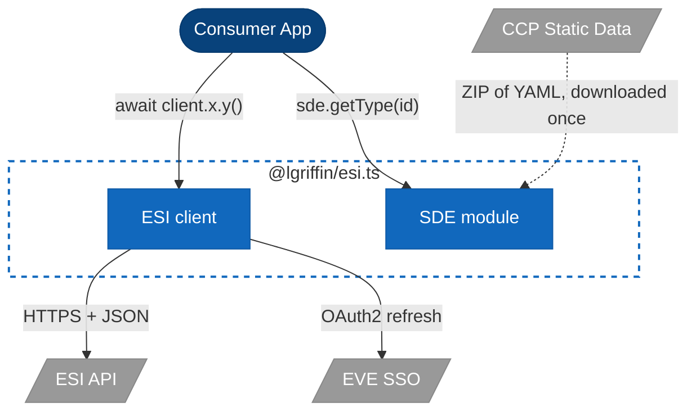
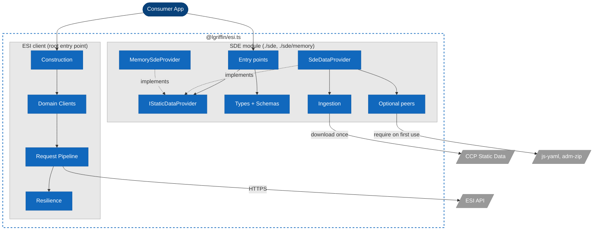
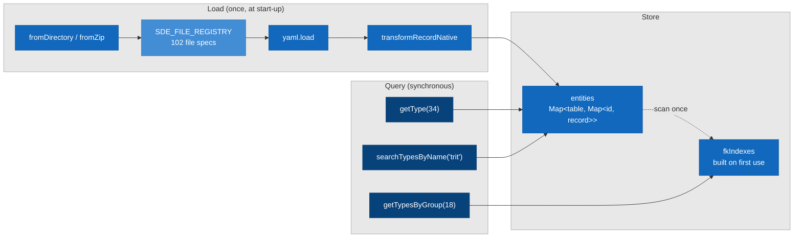

# The SDE and the ESI client

**Implements:** `ARCH-10` — see [CHARTER.md](CHARTER.md) Part 2. **Programme:** [ROADMAP.md](ROADMAP.md), Track S.

EVE Online has two sources of truth about the game. The **ESI API** says what is happening right now: who is online, what is for sale in Jita, which systems saw kills in the last hour. The **Static Data Export (SDE)** says what things are: that type `34` is Tritanium, that system `30000142` is Jita and sits in Caldari space at 0.95 security. ESI.ts ships both, as two independent parts of one package, and this guide explains the role each plays, why they are kept apart, and how a consumer joins them.

Topics with their own document are summarised here and linked:

| Topic                                                                    | Canonical document                                              |
| ------------------------------------------------------------------------ | --------------------------------------------------------------- |
| The HTTP client's layers, request path and middleware                    | [ARCHITECTURE.md](ARCHITECTURE.md)                              |
| The SDE module's internals: load pipeline, storage, entity relationships | [sde/ARCHITECTURE.md](sde/ARCHITECTURE.md)                      |
| Every `IStaticDataProvider` method, by family                            | [sde/REFERENCE.md](sde/REFERENCE.md#api-reference)              |
| Provider patterns and query examples                                     | [sde/USAGE.md](sde/USAGE.md)                                    |
| Adding an entity type or a YAML file to the registry                     | [sde/DEVELOPER_GUIDE.md](sde/DEVELOPER_GUIDE.md)                |
| Error classes on both sides and where to import the guards               | [ERRORS.md](ERRORS.md)                                          |
| The rule that keeps the two apart and the tests that hold it             | [CHARTER.md](CHARTER.md#arch-10--ubiquitous--enforced), ARCH-10 |
| The eleven overnight runs that bring the SDE up to the core's standard   | [ROADMAP.md](ROADMAP.md#track-s--the-sde-programme)             |

---

## Two sources of truth

| Property        | ESI (the client)                                                | SDE (the module)                                                          |
| --------------- | --------------------------------------------------------------- | ------------------------------------------------------------------------- |
| What it answers | State: prices, orders, assets, kills, skills, who is where      | Definitions: types, groups, systems, stargates, blueprints, dogma, lore   |
| Freshness       | Seconds to hours, governed by each endpoint's cache TTL         | One build per CCP release; the same build answers the same way for months |
| How it is read  | HTTPS to `esi.evetech.net`, one request per question, paginated | One load into memory at start-up, then synchronous `Map` lookups          |
| Authorisation   | Public or EVE SSO scopes per endpoint                           | None; the export is a public download                                     |
| Failure modes   | Network, rate limits, 4xx/5xx, token expiry, circuit open       | File missing, YAML malformed, peer not installed, build too old           |
| Errors          | `EsiError` family                                               | `SdeError` family, extending `Error` (not `EsiError`)                     |
| Cost            | Latency and error budget per call                               | Memory (the full export is hundreds of megabytes) and load time           |
| Identity        | Integer IDs in `snake_case` fields: `type_id`, `system_id`      | The same integer IDs in `camelCase` fields: `typeId`, `systemId`          |

The last row is the whole relationship. CCP assigns one ID space across both. An ESI market order carries `type_id: 34`; the SDE's `getType(34)` returns Tritanium. An ESI kill count carries `system_id: 30000142`; the SDE's `getSolarSystem(30000142)` returns Jita. The client tells you _that_ something happened to `34` in `30000142`; the SDE tells you what `34` and `30000142` are. Neither side needs to know the other exists for this to work, because the join key is CCP's, not ours.

## How they complement each other

A consumer holds one client and one provider, and joins them with the ID:

```typescript
import { EsiClient } from '@lgriffin/esi.ts';
import { SdeDataProvider } from '@lgriffin/esi.ts/sde';

const client = new EsiClient();
const sde = SdeDataProvider.fromDirectory('./sde-data');
```

Live orders, named:

```typescript
const orders = await client.market.getMarketOrders(regionId);

const named = orders.map((order) => ({
  ...order,
  name: sde.getType(order.type_id)?.name ?? `type ${order.type_id}`,
}));
```

Live kills, placed on the map:

```typescript
const kills = await client.universe.getSystemKills();

for (const kill of kills) {
  const system = sde.getSolarSystem(kill.system_id);
  if (!system) continue;
  const region = sde.getRegion(system.regionId);
  console.log(
    `${system.name} (${system.securityStatus.toFixed(1)}, ${region?.name}): ${kill.ship_kills} ship kills`,
  );
}
```

A character's assets, grouped by category:

```typescript
const assets = await client.assets.getCharacterAssets(characterId);

const byCategory = new Map<string, number>();
for (const asset of assets) {
  const type = sde.getType(asset.type_id);
  const group = type ? sde.getGroup(type.groupId) : null;
  const category = group ? sde.getCategory(group.categoryId) : null;
  const key = category?.name ?? 'Unknown';
  byCategory.set(key, (byCategory.get(key) ?? 0) + asset.quantity);
}
```

Three things to notice. The ESI call is the only `await`; the SDE side is synchronous, so a join over ten thousand orders costs ten thousand `Map` lookups and no I/O. Every SDE lookup returns `T | null` and every collection returns `[]`, so an ID the export does not know (a new type CCP shipped since the build you loaded) degrades to a fallback rather than a throw. And the join is written by the consumer, in the consumer's own terms, which is the deliberate design described next.

### What is not in the package

There is no bridge. No client method calls the SDE, no SDE method calls the client, and no `EsiClient` option accepts a provider. A `StaticDataResolver` port inside the client was considered on 2026-09-27 and cut. If an ESI-to-SDE shim is ever wanted (a `getMarketOrdersNamed()`, say) it is a separate package that depends on both, above both.

Why:

- **Release independence.** The SDE tracks CCP's export format, the client tracks CCP's API. Each moves on its own schedule. A wall between them means a new YAML file or a renamed field never forces a client release, and a new endpoint never forces an SDE one.
- **Dependency independence.** The SDE reads CCP's files with `js-yaml` and `adm-zip`, which are optional peers. A consumer who only wants the client must never be made to install them, and `@lgriffin/esi.ts/sde/memory` exists for a consumer who wants the SDE types and the in-memory provider without them either.
- **The join is one line.** `sde.getType(order.type_id)?.name` is as short as any helper could make it, and it composes with whatever the consumer already does. A bridge would have to guess which of the 99 provider methods to call for which of the more than 200 endpoints, and the guess would be wrong for someone.

The rule is [`ARCH-10`](CHARTER.md#arch-10--ubiquitous--enforced), and the [Isolation](#isolation) section below describes how it is held.

---

## C4 Model

The diagrams use the same conventions as [ARCHITECTURE.md](ARCHITECTURE.md): consumer in dark blue, this library in blue, generated artifacts in light blue, external systems in grey.

### C4 Level 1 — System Context

| Element                  | Description                                                                                                                     |
| ------------------------ | ------------------------------------------------------------------------------------------------------------------------------- |
| **Consumer Application** | Node.js (18 or newer) application that needs both what is happening in EVE and what the things involved are                     |
| **ESI.ts client**        | The HTTP SDK: auth, caching, rate limiting, circuit breaking, pagination, validation. Root entry point                          |
| **ESI.ts SDE module**    | The offline lookup layer: loads CCP's export into memory, answers typed queries. `./sde` and `./sde/memory` entry points        |
| **EVE Online ESI API**   | CCP's REST API at `esi.evetech.net`, secured by EVE SSO                                                                         |
| **EVE SSO**              | OAuth2 authorisation server                                                                                                     |
| **CCP Static Data**      | `developers.eveonline.com/static-data`: the latest export as a ZIP of YAML files, and a `latest.jsonl` naming the current build |



There is no arrow between `client` and `sde`. The consumer holds both and joins their results by ID.

### C4 Level 2 — Container Diagram

One package, two containers that share nothing but the `zod` dependency and the ports directory. The client's own containers are in [ARCHITECTURE.md](ARCHITECTURE.md#c4-level-2--container-diagram); here they are collapsed to show the boundary.

| Container          | Where                                           | Purpose                                                                                                                                                                                                                                                                  |
| ------------------ | ----------------------------------------------- | ------------------------------------------------------------------------------------------------------------------------------------------------------------------------------------------------------------------------------------------------------------------------ |
| **Entry points**   | `src/sde/index.ts`, `src/sde/memory.ts`         | `./sde` exports everything; `./sde/memory` exports the same types, errors, factory and `MemorySdeProvider`, but not `SdeDataProvider`, so it bundles none of the file code                                                                                               |
| **Port**           | `src/sde/ports/IStaticDataProvider.ts`          | The 99-method contract every provider implements. Consumers type against it, not against a class                                                                                                                                                                         |
| **File adapter**   | `src/sde/providers/yaml/SdeDataProvider.ts`     | `fromDirectory(path)` and `fromZip(path)`. Reads CCP's YAML through the optional peers, normalises each record, stores it in `Map`s, builds foreign-key indexes on first use                                                                                             |
| **Memory adapter** | `src/sde/providers/memory/MemorySdeProvider.ts` | Takes typed arrays (`MemorySdeData`), implements the full port with no I/O. The test double, and the provider for consumers who bring their own data                                                                                                                     |
| **Domain**         | `src/sde/domain/<domain>/{types,schemas}.ts`    | 109 entity interfaces and 110 `z.looseObject` schemas, one folder per SDE domain (universe, types, dogma, industry, market, characters, corporations, skins, content, ui), each schema beside the type it validates. Extra fields from a newer export survive validation |
| **Ingestion**      | `src/sde/ingestion/`                            | `SdeDownloader` (fetch the ZIP, check the latest build), `SdeExtractor` (ZIP to YAML), `transforms` (field and locale normalisation), `SDE_FILE_REGISTRY` (the 102 file specs)                                                                                           |
| **Optional peers** | `src/sde/optionalPeers.ts`                      | Loads `js-yaml` and `adm-zip` on first use, not at import, and turns a missing one into an `SdeError` naming the install command                                                                                                                                         |
| **Errors**         | `src/sde/errors.ts`                             | `SdeError`, `SdeDatabaseError`, `SdeValidationError`, `SdeVersionMismatchError` and their guards. Extends `Error`, not `EsiError`: these are local data faults, not HTTP ones                                                                                            |
| **Test data**      | `src/sde/testing/SdeTestDataFactory.ts`         | One `create*` method per entity with realistic defaults; `createHierarchicalTestData()` builds a connected universe                                                                                                                                                      |



Again, no edge crosses from `clientBox` to `sdeBox` or back. `npm run lint:layers` fails the build if one appears.

### C4 Level 3 — Component: the SDE module

What happens between `fromDirectory()` and `getType()`. The full component diagram, the load pipeline and the entity relationship diagram are in [sde/ARCHITECTURE.md](sde/ARCHITECTURE.md); this is the shape.

| Component                 | File                                                                         | Responsibility                                                                                                                                                                   |
| ------------------------- | ---------------------------------------------------------------------------- | -------------------------------------------------------------------------------------------------------------------------------------------------------------------------------- |
| **fromDirectory**         | `providers/yaml/SdeDataProvider.ts`                                          | Reads `_sde.yaml` for the build's version info, then walks `SDE_FILE_REGISTRY`; a file the directory lacks is skipped, so a partial extract loads                                |
| **fromZip**               | `providers/yaml/SdeDataProvider.ts`                                          | The same walk over the entries of the ZIP, through `SdeExtractor`, with no extraction to disk                                                                                    |
| **loadRecords**           | `providers/yaml/SdeDataProvider.ts`                                          | For one file: `yaml.load`, then for each `[key, record]` pair `transformRecordNative`, then `entities.set(tableName, Map<id, record>)`                                           |
| **transformRecordNative** | `ingestion/transforms.ts`                                                    | `groupID` to `groupId` (recursively, into nested objects and arrays), `{en: "Jita"}` to `"Jita"`, the YAML key injected as the primary key where the registry says so            |
| **entities**              | `providers/yaml/SdeDataProvider.ts`                                          | `Map<tableName, Map<id, record>>`. Every `getX(id)` is one `get` on the inner map                                                                                                |
| **fkIndexes**             | `providers/yaml/SdeDataProvider.ts`                                          | `Map<"table:field", Map<fkValue, record[]>>`, built on the first `getXByY` that needs it and cached. Tables never filtered by a foreign key never pay for its index              |
| **99 typed methods**      | `providers/yaml/SdeDataProvider.ts`, `providers/memory/MemorySdeProvider.ts` | Each is a one-line call to `getById`, `getByFk`, `getAllRecords`, `search` or `filterBy` with the table name and the entity type fixed                                           |
| **requireOptionalPeer**   | `optionalPeers.ts`                                                           | `createRequire(__filename)` so the peer resolves from wherever the package is installed; a `MODULE_NOT_FOUND` for the peer itself becomes an `SdeError` with the install command |



`SDE_FILE_REGISTRY` is shown in the generated colour although it is hand-written today: it is the one table that says which of CCP's files exist and what their keys are, and `nightly-sde.yml` checks it against the real export every night (`npm run sde:drift`).

---

## Entry points

| Entry point                   | Exports                                                                                                                   | Needs                                                            | For                                                                                             |
| ----------------------------- | ------------------------------------------------------------------------------------------------------------------------- | ---------------------------------------------------------------- | ----------------------------------------------------------------------------------------------- |
| `@lgriffin/esi.ts/sde`        | `SdeDataProvider`, `MemorySdeProvider`, `IStaticDataProvider`, every entity type, `SdeError` family, `SdeTestDataFactory` | `js-yaml` when a YAML file is read; `adm-zip` when a ZIP is read | An application that loads CCP's export                                                          |
| `@lgriffin/esi.ts/sde/memory` | The same, minus `SdeDataProvider`                                                                                         | Nothing beyond the package                                       | Tests, and applications that already have the data in another store and want the typed contract |

The peers are loaded on first use, not at import, so `import { SdeDataProvider } from '@lgriffin/esi.ts/sde'` succeeds in an install that has neither; the first `fromDirectory()` then throws an `SdeError` that names the package and the `npm install` command. `tests/tdd/sde/memory-entry-bundle.test.ts` bundles `src/sde/memory.ts` and the built `dist/sde/memory.{mjs,js}` and fails if `node:fs`, `js-yaml`, `adm-zip` or `better-sqlite3` reaches either.

### Getting the data

```bash
npm install js-yaml adm-zip
npx ts-node scripts/sde/sde-ingest.ts --output sde-data
```

The script resolves the current build, downloads the ZIP from CCP, extracts the YAML files to `./sde-data/` and deletes the ZIP. `sde-data/` is gitignored. `fromZip()` skips the extraction step and reads the archive directly.

---

## The port

Consumers hold an `IStaticDataProvider`, not a `SdeDataProvider`, so the adapter is a start-up decision rather than a type that spreads through the application:

```typescript
import type { IStaticDataProvider } from '@lgriffin/esi.ts/sde';

export function describeType(sde: IStaticDataProvider, typeId: number): string {
  const type = sde.getType(typeId);
  if (!type) return `Unknown type ${typeId}`;
  const group = sde.getGroup(type.groupId);
  return group ? `${type.name} (${group.name})` : type.name;
}
```

The 99 methods fall into families; each single-entity lookup returns `T | null`, each collection `T[]`, and each `search*` takes an optional `limit`:

| Family                | Examples                                                                                     | Joins to ESI on                                          |
| --------------------- | -------------------------------------------------------------------------------------------- | -------------------------------------------------------- |
| Types and groups      | `getType`, `getTypesByGroup`, `getGroup`, `getCategory`, `searchTypesByName`                 | `type_id` on orders, assets, killmails, fittings, skills |
| Geography             | `getRegion`, `getConstellation`, `getSolarSystem`, `getStargate`, `searchSolarSystemsByName` | `region_id`, `system_id` on orders, kills, jumps, routes |
| Universe bodies       | `getStar`, `getPlanet`, `getMoon`, `getAsteroidBelt`, `getLandmark`                          | `planet_id`, `moon_id` on structures and PI              |
| Character and lore    | `getFaction`, `getRace`, `getBloodline`, `getAncestry`, `getSchool`                          | `race_id`, `bloodline_id`, `faction_id` on characters    |
| NPC infrastructure    | `getNpcCorporation`, `getNpcStation`, `getNpcCharacter`, `getCorporationActivity`            | `corporation_id`, `station_id` on locations and agents   |
| Market                | `getMarketGroup`, `getRootMarketGroups`, `getTypesByMarketGroup`                             | `type_id` on orders and history                          |
| Dogma                 | `getDogmaAttribute`, `getDogmaEffect`, `getTypeDogma`, `getDogmaUnit`                        | `attribute_id`, `effect_id` on the dogma endpoints       |
| Industry              | `getBlueprint`, `getIndustryActivity`, `getPlanetSchematic`                                  | `blueprint_type_id`, `activity_id` on industry jobs      |
| Version and lifecycle | `getVersion`, `close`                                                                        | See [Freshness](#freshness-and-versions)                 |

The complete list, family by family, is in [sde/REFERENCE.md](sde/REFERENCE.md#api-reference).

---

## Errors

The two families do not share a base class, and that is the point. An `EsiError` carries HTTP semantics: a status, retryability, the error-limit headers. An `SdeError` is a local fault: the directory is missing, a YAML file did not parse, the build is older than the code expects, a peer is not installed. Nothing about retrying, rate limits or circuit breakers applies to it.

```typescript
import { isEsiError } from '@lgriffin/esi.ts/errors';
import { isSdeError } from '@lgriffin/esi.ts/sde';

try {
  const orders = await client.market.getMarketOrders(regionId);
  const named = orders.map((o) => sde.getType(o.type_id)?.name);
  console.log(named.length);
} catch (err) {
  if (isEsiError(err)) {
    // transient or not, per ERRORS.md; the pipeline has already retried what it should
  } else if (isSdeError(err)) {
    // the export is unusable: fix the install or the data, do not retry
  } else {
    throw err;
  }
}
```

In practice the SDE side throws at load time, not at query time: once `fromDirectory()` has returned, the query methods return `null` or `[]` for anything they cannot find and never throw. The hierarchy and the guards are in [ERRORS.md](ERRORS.md#sde-family).

---

## Testing with both

`MemorySdeProvider` takes the same typed arrays `SdeTestDataFactory` produces, and implements the same port, so a test builds the universe it needs in a few lines and the code under test cannot tell the difference:

```typescript
import {
  MemorySdeProvider,
  SdeTestDataFactory,
} from '@lgriffin/esi.ts/sde/memory';

const sde = new MemorySdeProvider({
  categories: [
    SdeTestDataFactory.createEveCategory({ categoryId: 4, name: 'Material' }),
  ],
  groups: [
    SdeTestDataFactory.createEveGroup({
      groupId: 18,
      categoryId: 4,
      name: 'Mineral',
    }),
  ],
  types: [
    SdeTestDataFactory.createEveType({
      typeId: 34,
      groupId: 18,
      name: 'Tritanium',
    }),
    SdeTestDataFactory.createEveType({
      typeId: 35,
      groupId: 18,
      name: 'Pyerite',
    }),
  ],
});

console.log(sde.getTypesByGroup(18).map((t) => t.name)); // ["Tritanium", "Pyerite"]
```

The ESI side is stubbed at the transport seam the same way it is in the library's own tests (`createMockTransport()` from `./testing`, see [TESTING.md](TESTING.md#testing-your-application)). A test of a join therefore has two doubles that know nothing of each other, mirroring production, and no third thing to mock.

The library's own SDE tests run at three tiers: unit tests against `MemorySdeProvider`, BDD scenarios under `tests/bdd/features/sde/`, and integration tests that load a real export from `sde-data/` when it is present. Track S adds the mutation, fuzz, type-test, benchmark and nightly-drift tiers the core already has; the plan and the current state of each are in [ROADMAP.md](ROADMAP.md#track-s--the-sde-programme).

---

## Isolation

`ARCH-10` states the rule. Three mechanisms hold it, and each has a test that proves it fires:

| Rule                                                                                                                                                             | Held by                                                                                                 | Proven by                                          |
| ---------------------------------------------------------------------------------------------------------------------------------------------------------------- | ------------------------------------------------------------------------------------------------------- | -------------------------------------------------- |
| `src/sde` imports only Node built-ins, its own files, `zod`, `js-yaml`, `adm-zip`, `better-sqlite3` and `src/core/ports`                                         | `npm run lint:layers`, the `sde` message of `layers/inward-imports` in `config/eslint/layers.rules.cjs` | `tests/tdd/layers/layers-lint.test.ts`             |
| No file under `src/` outside `src/sde` imports it, by relative path, by the package's own name or through any `sde/` segment                                     | `npm run lint:layers`, the `sideModule` message                                                         | `tests/tdd/layers/layers-lint.test.ts`             |
| The `./sde/memory` bundle contains no file-system, YAML, ZIP or SQLite code, in the esbuild graph and in the shipped `dist/sde/memory.{mjs,js}` and their chunks | `tests/tdd/sde/memory-entry-bundle.test.ts`                                                             | The same test checks itself against a known string |

`src/core/ports` is the one directory of `src/` the SDE reaches, and only for `Clock` (Track S Run 2): a port imports nothing itself, so taking one from there shares an interface without sharing the pipeline.

What the rule forbids in practice: a domain client that calls `sde.getType()` to name its results, an `EsiClient` option that accepts a provider, an SDE method that fetches from ESI to fill a gap in the export, and a shared error base class. Each was possible before 2026-09-27 and each is a lint failure now.

## Layers inside the module

Since Track S Run 12 the module has the shape the core has: a reader finds a port, a domain, a provider or an ingestion step by its folder, and the same ESLint rule (`sdeLayer` message of `layers/inward-imports`) keeps the folders pointing inward. The entry points `index.ts` and `memory.ts` import anything below and are imported by nothing inside the module.

```
src/sde/
  index.ts, memory.ts       Entry points (./sde, ./sde/memory)
  errors.ts, version.ts,    Root support files: import one another only
  clock.ts, optionalPeers.ts
  ports/                    IStaticDataProvider: imports domain/ and version
  domain/<domain>/          types.ts and schemas.ts per SDE domain: import domain/ and zod only
  providers/yaml/           SdeDataProvider: imports ports/, domain/, ingestion/ and the root files
  providers/memory/         MemorySdeProvider: the same allowance, uses none of ingestion/
  providers/order.ts        ID ordering shared by both providers
  ingestion/                Download, extract, transform: imports the root files, never a port or a provider
  testing/                  SdeTestDataFactory: imported by the entry points only
```

| Layer            | May import                                                      |
| ---------------- | --------------------------------------------------------------- |
| `domain/`        | `domain/`, `zod`                                                |
| `ports/`         | `domain/`, the root files                                       |
| `ingestion/`     | `ingestion/`, the root files                                    |
| `providers/`     | `ports/`, `domain/`, `ingestion/`, `providers/`, the root files |
| `testing/`       | `ports/`, `domain/`, `providers/`, the root files               |
| the root files   | the root files                                                  |
| the entry points | everything but each other                                       |

`tests/tdd/layers/layers-lint.test.ts` has a failing case for each row. The provider folder is `providers/yaml/`, not the roadmap's `providers/sqlite/`: the provider reads CCP's YAML and holds `Map`s, and nothing in it is SQLite.

---

## Freshness and versions

The two sides age differently, and a consumer should know which it is looking at.

The client pins a **compatibility date** on every request: CCP serves the API shape as it was on that date, and the generated types (`ARCH-01` in the charter) match the specification that date describes. The SDE has a **build number**: `SdeDownloader` reads `latest.jsonl` from CCP to find it, the ZIP's `_sde.yaml` records it, and `getVersion()` returns it:

```typescript
const version = sde.getVersion();
console.log(
  `SDE build ${version.version}, built ${version.buildDate}, loaded ${version.importedAt}`,
);
```

Nothing ties the two together, because nothing in CCP's data does: an ESI response from today can name a type that entered the game after your export was built, which is exactly the case the `T | null` returns exist for. Log the SDE build at start-up, refresh the export when CCP publishes a new one, and treat a `null` from the SDE for an ID ESI just returned as "newer than my export", not as an error.

`nightly-sde.yml` (Track S Run 9) downloads the current build every night, loads it, runs the integration tests and the SDE examples, and compares the export's file list and each file's keys with `SDE_FILE_REGISTRY` and the Zod schemas (`npm run sde:drift`), keeping one issue open while they disagree.

---

## Where this is going

Track S is twelve overnight runs, each a PR, that bring the SDE to the standard of the core: layer lint (done, Run 1), coverage ratchet, step-library BDD, per-method spec coverage, error contracts, property tests, type tests, real-data nightly, benchmarks and soak, security review, the documentation move, and last the restructuring. Run 11 (landed 2026-09-28) moved the module's doc set under `guides/sde/` with this file as the index and `src/sde/README.md` as a pointer, so the whole set is published on the documentation site. Run 12, after every other run, splits `src/sde/` into `ports/`, `domain/`, `providers/`, `ingestion/` and `testing/` with layer rules inside the module, keeping the `./sde` and `./sde/memory` exports as they are; the level 3 diagram above is redrawn then.
