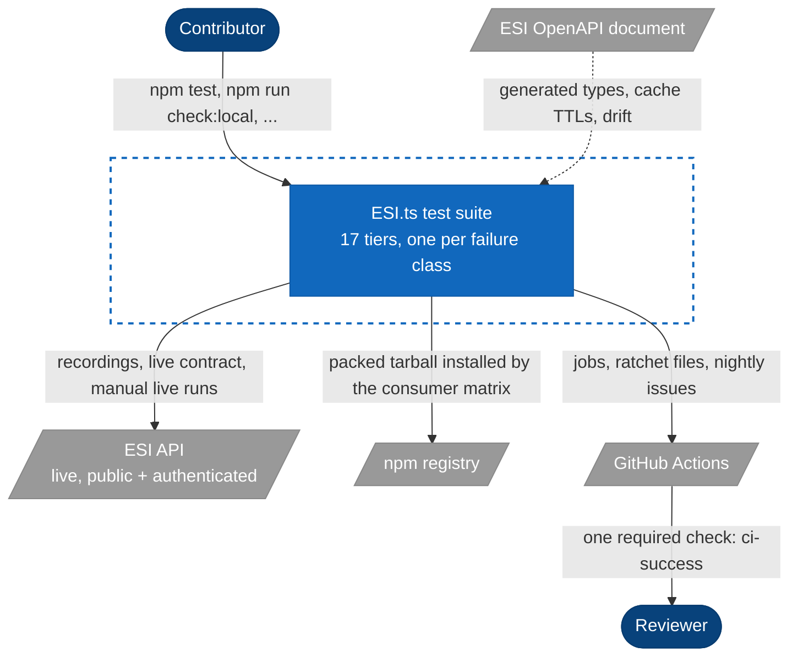
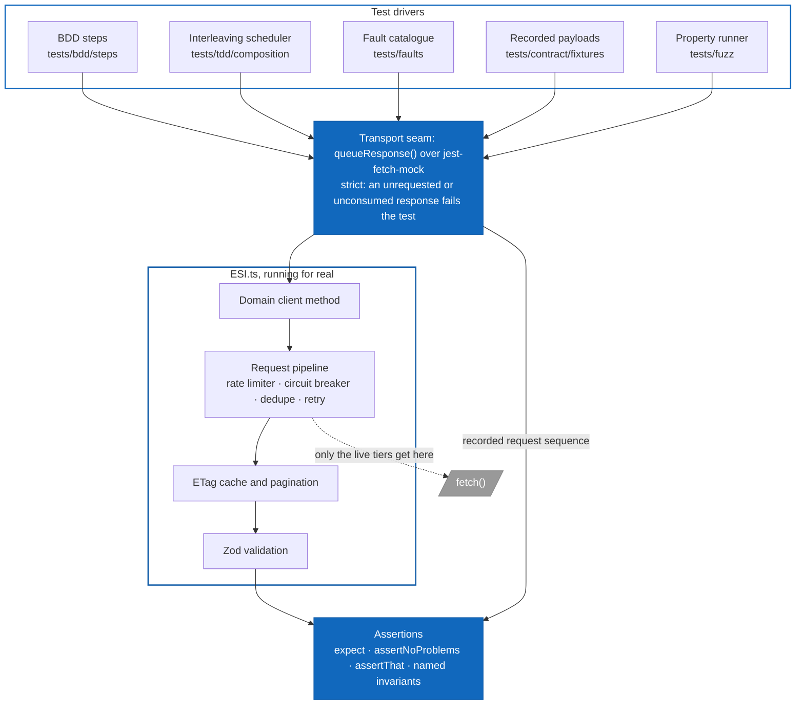

# Testing

**Implements:** `TEST-01`, `TEST-02`, `TEST-03`, `TEST-04`, `TEST-05`, `TEST-06`, `TEST-07`, `TEST-08`, `TEST-09` — see [CHARTER.md](CHARTER.md) Part 4 for the requirements and their status.

How ESI.ts is tested: what each tier owns, where it lives, how to run it, where CI runs it, and the signal that proves it can fail. This is the canonical testing guide. What blocks a merge, what runs nightly and what files an issue is in [QUALITY-GATES.md](QUALITY-GATES.md). Mutation testing, including the ratchet, the shards and how to kill a survivor, is in [Mutation testing](#mutation-testing). How to write a Rule is in [`tests/bdd/README.md`](../tests/bdd/README.md) (the rules) and [`tests/bdd/GUIDE.md`](../tests/bdd/GUIDE.md) (the walkthrough).

## The stance

Three positions explain every choice below.

1. **A tier that cannot fail manufactures confidence.** Each tier owns one class of failure and carries a signal that proves it can go red: a negative fixture, a killed mutant, an injected leak, a deliberately broken package. A green run from a tier with no such signal says nothing, so the one tier that has none today (API fuzz) is listed as such rather than counted as protection.
2. **Every gate is a one-way ratchet.** Floors, baselines and known-gap lists start at the value measured on the day they were introduced and move in one direction. Each shrink-only list fails when an entry is added, fails when a listed entry stops reproducing, and fails closed when the base ref it compares against cannot be read. A fix cannot leave a stale exception behind, and a pull request cannot exempt itself.
3. **The specification executes.** Behaviour is stated as EARS requirements, one `shall` per Gherkin `Rule:`, verified by scenarios that mock only the HTTP transport. `npm run spec:audit` fails a pull request that weakens the wording, `npm run bdd:report` fails one in which a scenario did not run, and the BDD-only mutation ratchet fails when the scenarios stop killing mutants (charter posture 6).

## Where the suite stands

Measured on 2026-09-28 on `master` at `9486fe2c` (v10.2.3; 11.0.0 in progress), on a 4-core machine. The command in the first column reproduces each row.

| Command                                       | Config                                   | Suites |  Tests | Result                                                                                         |
| --------------------------------------------- | ---------------------------------------- | -----: | -----: | ---------------------------------------------------------------------------------------------- |
| `npm test`                                    | `config/jest/unit.config.cjs`            |    291 |  8,308 | All pass, about 141 s                                                                          |
| of which unit, `tests/tdd` (not composition)  | same                                     |    210 |  7,524 |                                                                                                |
| of which specification, `tests/bdd`           | same                                     |     74 |    742 | 31 legacy `*.steps.ts` files and 43 `*.spec.ts` entries                                        |
| of which composition, `tests/tdd/composition` | same                                     |      7 |     42 |                                                                                                |
| `npm run fuzz`                                | `config/jest/fuzz.config.cjs`            |     15 |  1,240 | All pass, about 22 s with four workers                                                         |
| `npm run faults`                              | `config/jest/faults.config.cjs`          |      2 |    148 | All pass                                                                                       |
| `npm run contract:replay`                     | `config/jest/contract.replay.config.cjs` |      5 |    121 | All pass, over 86 recorded fixtures                                                            |
| `npm run test:integration`                    | `config/jest/integration.config.cjs`     |      6 |    228 | 20 mocked pass; 208 live tests skip without `ESI_LIVE_TESTS`, `ESI_GATED_TESTS` or `sde-data/` |
| **Offline total**                             |                                          |    319 | 10,045 | 9,837 run, 0 failures                                                                          |

| Coverage (`npm run coverage`) | Measured | Floor (`config/jest/unit.config.cjs`) |
| ----------------------------- | -------: | ------------------------------------: |
| Statements                    |   97.79% |                                   90% |
| Branches                      |   95.88% |                                   80% |
| Functions                     |   93.57% |                                   75% |
| Lines                         |   97.85% |                                   90% |

Coverage is collected from `src/**/*.ts`, excluding `.d.ts`, `src/types/`, `*.generated.ts` and `src/clients/generated/`. The floors sit well below the measured values on purpose (`TEST-04`): they catch an untested module without turning one bad week into a broken gate. Mutation, not coverage, is what says the tests assert anything.

| Specification (`npm run spec:audit:verbose`) | Count                                                                                                                                                                                                                                                                                                                   |
| -------------------------------------------- | ----------------------------------------------------------------------------------------------------------------------------------------------------------------------------------------------------------------------------------------------------------------------------------------------------------------------- |
| Feature files                                | <!-- metric:featureFiles -->76<!-- /metric --> (`core/` <!-- metric:featureFilesCore -->51<!-- /metric -->, `integration/` <!-- metric:featureFilesIntegration -->1<!-- /metric -->, `performance/` <!-- metric:featureFilesPerformance -->1<!-- /metric -->, `sde/` <!-- metric:featureFilesSde -->23<!-- /metric -->) |
| `Rule:` requirements                         | <!-- metric:requirements -->601<!-- /metric -->                                                                                                                                                                                                                                                                         |
| Scenarios                                    | <!-- metric:scenarios -->774<!-- /metric --> (<!-- metric:plainScenarios -->765<!-- /metric --> `Scenario`, <!-- metric:scenarioOutlines -->9<!-- /metric --> `Scenario Outline`)                                                                                                                                       |
| Audit result                                 | <!-- metric:featureFiles -->76<!-- /metric --> of <!-- metric:featureFiles -->76<!-- /metric --> pass                                                                                                                                                                                                                   |

Other counts, each reproducible with `ls` or `find`: <!-- metric:typeTestFiles -->12<!-- /metric --> tsd files in `tests/typetests/`, 9 Jest configs (`ls config/jest/*.config.cjs`), and 28 workflows in `.github/workflows/` (29 files including its `README.md`).

## The tiers

This is the canonical tier table. Every other file names tiers by these names; none of them uses a number. Seventeen tiers, each owning one class of failure.

| Tier                        | Location                                                                            | Files                                                                                                                 | Config · command                                                                                | Where CI runs it                                                                                     | Signal that it can fail                                                                              |
| --------------------------- | ----------------------------------------------------------------------------------- | --------------------------------------------------------------------------------------------------------------------- | ----------------------------------------------------------------------------------------------- | ---------------------------------------------------------------------------------------------------- | ---------------------------------------------------------------------------------------------------- |
| Static analysis             | `config/eslint/*.config.mjs`, `scripts/*/*-lint.ts`                                 | 4 lints and export coverage                                                                                           | `lint:suite-health`, `lint:bdd-seam`, `lint:determinism`, `lint:layers`, `test:export-coverage` | Push (`ci-fast`: seam, suite health, layers); PR (`lint-and-build`, `spec-audit`, `static-analysis`) | One negative fixture per rule, linted at its real path by a suite in `tests/tdd/`                    |
| Unit                        | `tests/tdd/`                                                                        | <!-- metric:unitSuites -->216<!-- /metric --> suites                                                                  | `config/jest/unit.config.cjs` · `npm test`                                                      | Push, Node 22 (`ci-fast`); PR, Node 22/24 (`unit-tests`), `coverage`, `full-test-suite`              | Stryker mutation, per-directory floors                                                               |
| Composition and concurrency | `tests/tdd/composition/`                                                            | <!-- metric:compositionSuites -->7<!-- /metric --> suites                                                             | `config/jest/unit.config.cjs` · `npm test`                                                      | Push; PR; `nightly-interleave.yml` (four calls, seeded random schedules)                             | Pinned schedule counts; `interleave.test.ts` finds and replays a planted race                        |
| Specification (EARS/BDD)    | `tests/bdd/`                                                                        | <!-- metric:featureFiles -->76<!-- /metric --> features, <!-- metric:bddSuites -->77<!-- /metric --> suites           | `config/jest/unit.config.cjs` · `npm run bdd`                                                   | Push (inside `npm test`); PR (`bdd-tests`, `spec-audit`); `ears.yml`, advisory                       | `bdd:report` fails on a scenario that did not execute; BDD-only mutation floors                      |
| Type tests                  | `tests/typetests/`                                                                  | <!-- metric:typeTestFiles -->12<!-- /metric -->                                                                       | tsd · `npm run test:types`                                                                      | PR (`full-test-suite`, through `test:all`)                                                           | Type mutation, nightly, per-entry-point floors                                                       |
| Properties and fuzz         | `tests/fuzz/`                                                                       | <!-- metric:fuzzSuites -->15<!-- /metric --> suites                                                                   | `config/jest/fuzz.config.cjs` · `npm run fuzz`                                                  | PR (`fuzz-tests`, 100 runs per property); `nightly-properties.yml` (10,000)                          | Each model-based property must fail against registered known-bad implementations                     |
| Fault injection             | `tests/faults/`                                                                     | <!-- metric:faultSuites -->2<!-- /metric --> suites, plus <!-- metric:faultNightlySuites -->1<!-- /metric --> nightly | `config/jest/faults.config.cjs` · `npm run faults`; `npm run faults:nightly`                    | PR (`fault-catalogue`); `nightly-faults.yml`                                                         | `fixtures/weak-fault.ts` must be rejected on every count                                             |
| Recorded replay             | `tests/contract/replay/`                                                            | <!-- metric:replaySuites -->5<!-- /metric --> suites, 86 fixtures                                                     | `config/jest/contract.replay.config.cjs` · `npm run contract:replay`                            | PR (`contract-replay`); `nightly-recorded-payloads.yml` re-records                                   | A recording edited to violate its schema must be rejected                                            |
| Live contract               | `tests/contract/`                                                                   | <!-- metric:contractSuites -->2<!-- /metric --> suites                                                                | `config/jest/contract.live.config.cjs` · `npm run contract:live`                                | PR (`contract-tests`, soft-skips on HTTP 503); weekly in `maintenance.yml`                           | An unknown spec mismatch hard-fails; known ones sit in named exception sets                          |
| Integration, mocked         | `tests/integration/full-stack.test.ts`                                              | 1                                                                                                                     | `config/jest/integration.config.cjs` · `npm run test:integration`                               | PR (`full-test-suite`, through `test:all`)                                                           | None of its own; it overlaps the unit and specification tiers, which are mutation-scored             |
| Integration, live           | `tests/integration/`: `live-esi`, `client-integration`, `esi-spec-contract`, `sde/` | 4                                                                                                                     | `ESI_LIVE_TESTS=true npm run test:integration`; `npm run test:integration:live`                 | `sde/` nightly in `nightly-sde.yml`; the other three by no workflow                                  | A live response of the wrong shape fails; `test:integration:live` fails when its variable is missing |
| Integration, gated auth     | `tests/integration/gated-auth.test.ts`                                              | 1                                                                                                                     | `npm run test:integration:gated` (reads `.env`)                                                 | Not run by any workflow                                                                              | Fails when `ESI_GATED_TESTS=true` and no token is set                                                |
| Consumer contract           | `tests/consumer/`                                                                   | 1 package                                                                                                             | `npm run test:consumer`                                                                         | PR (`consumer-contract`, four rows); `consumer-matrix-nightly.yml`; `release.yml`                    | Five broken packages must fail the matrix; a clean control must pass                                 |
| Documentation examples      | `tests/doc-examples/`                                                               | every `ts` block in the docs                                                                                          | `npm run test:docs-examples`                                                                    | PR (`doc-examples`)                                                                                  | Negative fixtures in `tests/tdd/doc-examples/`                                                       |
| Benchmarks and heap soak    | `tests/benchmark/`                                                                  | 18 tasks and the soak                                                                                                 | `npm run bench:ab`, `npm run bench:compare`, `npm run soak`                                     | PR (`benchmarks`, only when a hot path changes); `nightly-benchmarks.yml`                            | An injected slowdown and an injected leak must be flagged                                            |
| Mutation                    | `src/**`                                                                            | unit, BDD-only and type runs                                                                                          | Stryker · `npm run mutation:pr`, `mutation`, `mutation:bdd`; `npm run test:type-mutation`       | PR (`mutation-pr`, changed files); `nightly-mutation.yml`                                            | `tests/mutation-fixture/` must leave survivors and kill at least one mutant                          |
| API fuzz                    | Prism mock and Schemathesis                                                         | none                                                                                                                  | `npm run fuzz:api` (Docker)                                                                     | `nightly-schemathesis.yml`                                                                           | None. It uploads a report and files an `api-fuzz` issue on failure; count it as a probe, not a gate  |

The charter's Part 4 table groups the same ground as twelve rows. This table splits its contract row into recorded replay and live contract, and adds four the charter counts under gates: static analysis, composition, consumer contract and documentation examples.

The shrink-only lists that hold today's known gaps live beside the tier that owns them: `tests/faults/known-gaps.json` (empty), `tests/contract/fixtures/known-mismatches.json` (empty) and `unrecordable.json` (one entry), `scripts/spec/spec-audit-exceptions.json` (`unconverted` empty, `legacyStepFiles` 38), `scripts/*/*-baseline.json`, `config/mutation/unit-thresholds.json`, `config/mutation/bdd-thresholds.json` and `config/mutation/type-thresholds.json`.

## The test system in C4

Three views, in the notation of [`guides/ARCHITECTURE.md`](ARCHITECTURE.md): what the suite talks to, what runs when, and how a test reaches the code under test.

### Level 1: Context

Who runs the tests, and the outside things they depend on. Only the live contract, the live and gated integration suites, payload recording, the nightly examples and the post-publish canary reach ESI. The test tiers among them run only when their environment variable is set.



### Level 2: Containers

Each tier is a container with its own runner and trigger. A tier moves right as it gets slower: what cannot fit a pull request runs nightly and gates the next pull request through a ratchet file rather than by blocking.

```mermaid
flowchart LR
    subgraph local ["Local: pre-commit, pre-push, check:local"]
        direction TB
        staged["lint-staged<br/>ESLint + Prettier"]
        checklocal["npm run check:local<br/>every offline CI tier"]
    end

    subgraph pr ["Pull request, gate: ci-success"]
        direction TB
        unit["Unit + BDD + composition<br/>config/jest/unit.config.cjs"]
        props["Properties and fuzz<br/>config/jest/fuzz.config.cjs"]
        faults["Fault catalogue<br/>config/jest/faults.config.cjs"]
        replay["Recorded replay<br/>config/jest/contract.replay.config.cjs"]
        live["Live contract<br/>soft-skips on 503"]
        types["tsd · api-extractor · publint · attw · size-limit"]
        consumer["Consumer matrix<br/>ESM/CJS x node16/nodenext/bundler"]
        docs["Documentation examples"]
        mutpr["Mutation of changed files<br/>Stryker --incremental"]
        bench["Benchmarks base vs head<br/>only when hot paths change"]
        statics["Static analysis<br/>export coverage · determinism · layers · suite health · seam lint"]
    end

    subgraph night ["Nightly: reports and issues, never blocks directly"]
        direction TB
        nmut["Full mutation, unit + BDD + type"]
        nprops["Properties at 10 000 runs"]
        nfaults["Payload fuzz, every endpoint"]
        nrec["Re-record payloads, diff, open a PR"]
        nbench["Benchmarks vs pinned reference + heap soak"]
        nex["Examples against live ESI"]
        nflake["No-retry run · interleavings · audit · spec drift · Schemathesis"]
    end

    subgraph weekly ["Weekly"]
        direction TB
        wlive["Live contract + oasdiff<br/>maintenance.yml"]
    end

    subgraph release ["Release"]
        direction TB
        rmatrix["Consumer matrix against the signed tarball"]
        rcanary["Post-publish canary"]
    end

    contributor(["Contributor"]) --> local
    local --> pr
    pr --> release
    night -- "updates ratchet files, opens one issue per tier" --> pr

    style contributor fill:#08427b,color:#fff,stroke:#073b6f
    style local fill:none,stroke:#1168bd,stroke-width:2px
    style pr fill:none,stroke:#1168bd,stroke-width:2px
    style night fill:none,stroke:#999,stroke-width:2px,stroke-dasharray:5
    style weekly fill:none,stroke:#999,stroke-width:2px,stroke-dasharray:5
    style release fill:none,stroke:#999,stroke-width:2px
```



### Level 3: Components of a test run

How a test reaches the code. Everything above the seam is test-owned; everything below it is the real library. Nothing between a public client method and `fetch` is stubbed, which is what lets a scenario fail for a bug anywhere in `src/`.



## Test layout

```text
tests/
  tdd/                 unit tests: one directory per domain client or core area,
                       plus the self-tests of every gate (spec-audit, bdd-seam,
                       suite-health, determinism-lint, layers, mutation-ratchet,
                       type-mutation, consumer-contract, doc-examples,
                       package-lint, export-coverage, benchmark, verify-local, scripts)
    composition/       pipeline stages under overlapping calls, interleaving scheduler
    helpers/           describeClientErrors and shared test utilities
  bdd/
    features/          the .feature files: core/, integration/, performance/, sde/
    specs/             43 spec entries: 42 converted domains, plus step-library.spec.ts (the dry run)
    steps/             given/ when/ then/, one step per file
    step-definitions/  31 legacy defineFeature files, shrink-only (legacyStepFiles)
    support/           binder, transport seam, World, per-domain fixtures
  fuzz/                15 fast-check suites; 7 model-based *.property.test.ts (two for the SDE)
  faults/              fault catalogue, its self-test, nightly payload fuzz
  contract/            live deep contract and snapshot, recorder, shape diff
    replay/            5 replay suites
    fixtures/          recorded/ (86), recorded-negative/, unrecordable.json, known-mismatches.json
  integration/         full-stack (mocked), live-esi, client-integration,
                       esi-spec-contract, gated-auth, sde/sde-real-data
  typetests/           7 tsd files
  consumer/            a private downstream package for the consumer contract
  doc-examples/        prelude and stub fetch for test:docs-examples
  benchmark/           mitata harness, 18 tasks, heap soak
  mutation-fixture/    the known-weak clamp for Stryker's self-test
  setup/               requireLiveTests.ts, the global setup of the live configs
  support/             shared assertions
```

Each of the tier directories `tests/fuzz`, `tests/faults`, `tests/contract`, `tests/benchmark`, `tests/bdd` and `tests/tdd/composition` has an `AGENTS.md` with its rules. Read it before changing the tier.

## Running tests

```bash
npm test                     # unit + BDD + composition (config/jest/unit.config.cjs)
npm run test:watch           # the same, in watch mode
npm run coverage             # the same, with coverage and the floors
npm run bdd                  # the BDD suites only
npm run bdd:<domain>         # one BDD suite: bdd:market, bdd:resilience, bdd:sde, ... (npm run help -- bdd)
npm run bdd:steps            # BDD dry run: every step matches one definition, none unused
npm run spec:audit           # EARS and Gherkin audit of the feature files
npm run ears                 # one PASS/FAIL/NOT RUN verdict per Rule
npm run fuzz                 # properties and fuzz
npm run fuzz:properties      # the model-based properties and the SDE schema fuzz
npm run faults               # fault catalogue
npm run faults:nightly       # seeded payload fuzz over every endpoint
npm run contract:replay      # recorded payloads through the pipeline, no network
npm run test:integration     # mocked integration; live suites skip
npm run test:types           # tsd
npm run test:all             # test, bdd, test:integration, fuzz, test:types (what full-test-suite runs)
npm run check:local          # every offline CI tier in one run (below)
```

Tiers that need a build, a tarball, Docker, the network or minutes of CPU:

```bash
npm run test:consumer        # pack, install into a clean consumer, type-check and run
npm run test:docs-examples   # type-check every ts block in the docs against the tarball
npm run test:type-mutation   # after npm run build; -- --ratchet gates
npm run mutation:pr          # Stryker over your changed src/ files
npm run bench:ab -- --base ../base-worktree --head . && npm run bench:compare
npm run soak                 # heap soak, 100 000 requests
ESI_LIVE_TESTS=true npm run contract:live
ESI_LIVE_TESTS=true npm run contract:record
npm run fuzz:api             # Schemathesis against a Prism mock (Docker)
```

### Running the gates locally

`npm run check:local` runs every tier `ci.yml` gates on that works offline, and keeps going after a failure so the answer is the whole list. `check:local:fast` skips the build and the tiers that need `dist/`; `check:local:all` adds type mutation. The tier list is `TIERS` in `scripts/quality/verify-local-core.ts`, and `tests/tdd/verify-local/verify-local.test.ts` fails when `ci.yml` gains an `npm run` or a directly invoked tool that is neither in the list nor excluded with a written reason. What it leaves out and why is in [QUALITY-GATES.md](QUALITY-GATES.md#running-the-gates-locally).

## Static analysis

The lints in this tier read tests or source without running them. Each has a Jest suite in `tests/tdd/` that lints negative fixtures at their real paths and requires exactly the expected findings, so a rule that stops firing fails `npm test`.

| Command                        | What it rejects                                                                                                                                                                               | Baseline                                                     | Self-test                     |
| ------------------------------ | --------------------------------------------------------------------------------------------------------------------------------------------------------------------------------------------- | ------------------------------------------------------------ | ----------------------------- |
| `npm run lint:suite-health`    | `.only`, `.skip`, `.todo`, assertion-free tests and Then steps, swallowed assertions, unrestored console mocks, in `tests/`                                                                   | None; every finding fails                                    | `tests/tdd/suite-health/`     |
| `npm run lint:bdd-seam`        | Any `spyOn` of an ESI client, domain client, client prototype or `ApiClient`, and reassigned client methods, in `tests/bdd/`                                                                  | None                                                         | `tests/tdd/bdd-seam/`         |
| `npm run lint:determinism`     | `Date.now()`, timers, `performance.now()`, `Math.random()` in `src/` outside the clock modules (`src/core/clock.ts`; `src/sde/clock.ts` for the SDE, which may import only the ports)         | `scripts/quality/determinism-baseline.json`, shrink-only     | `tests/tdd/determinism-lint/` |
| `npm run lint:layers`          | Imports in `src/` that point outward: core into the layers above it, ports importing anything, generated code importing anything but the ports, the SDE and the pipeline importing each other | `BASELINE` in `config/eslint/layers.rules.cjs`, shrink-only  | `tests/tdd/layers/`           |
| `npm run test:export-coverage` | A public export no file under `tests/` references                                                                                                                                             | `scripts/package/export-coverage-baseline.json`, shrink-only | `tests/tdd/export-coverage/`  |

The rule tables and reasoning are in [QUALITY-GATES.md](QUALITY-GATES.md#suite-health-lint) and [QUALITY-GATES.md](QUALITY-GATES.md#export-coverage). `npm run lint` also covers `tests/` with the `src/` rule set, under the relaxations the `tests/**` block of `eslint.config.mjs` declares; `no-floating-promises`, `no-misused-promises` and `await-thenable` stay errors there (`TEST-09`, [#271](https://github.com/lgriffin/ESI.ts/issues/271)). `lint:suite-health` and `lint:bdd-seam` add the test-only rules.

### Time and randomness

An assertion about `Expires`, retry backoff or circuit half-open timing is only deterministic if the code under test takes its time from something the test controls. `npm run lint:determinism` (`config/eslint/determinism.rules.cjs`, driven by `scripts/quality/determinism-lint.ts`) restricts these in `src/`: `Date.now()`, `new Date()` and `Date()` with no arguments, `performance.now()`, `process.hrtime`, `Math.random()`, `setTimeout`, `setInterval`, `setImmediate`, `queueMicrotask` (bare or through `globalThis`, `global`, `window`, `self`) and imports of `timers` / `timers/promises`. Parsing a date (`new Date(header)`, `Date.parse`) is allowed. The one allow-listed path is the clock module, `src/core/clock.ts`; inline `eslint-disable` comments are ignored.

The sites that exist today are counted per file and construct in `scripts/quality/determinism-baseline.json`. The baseline only shrinks: a count above its entry fails (a new site), a count below its entry fails until the entry is lowered (`npm run lint:determinism -- --update`, which never raises one), and an entry above `origin/master`'s fails. With no base ref resolvable (set `DETERMINISM_BASE_REF`, or fetch master) the check fails closed. Until call sites move to an injected clock, tests of existing timing code keep using `jest.useFakeTimers()`. They assert the exact delay or boundary (fresh at the TTL, expired one millisecond later) rather than sleeping for real and bounding `Date.now()`: a test that waits on the wall clock kills a boundary mutant on one runner and not another, which is how 43 mutants came to flip between nightlies ([#382](https://github.com/lgriffin/ESI.ts/issues/382), "Timing tests made deterministic" under [The ratchet](#the-ratchet)). A test that drives the whole request pipeline and needs only `Date` frozen uses `useFakeDate()` from `tests/tdd/helpers/fakeDate.ts`.

Each restricted construct has a negative fixture in `tests/tdd/determinism-lint/fixtures/violations/`, linted through ESLint's Node API by `tests/tdd/determinism-lint/determinism-lint.test.ts`, alongside compliant fixtures that must produce no findings and the ratchet's added, stale and no-base-ref cases.

### Package lint and size budgets

**Run:** `npm run lint:package` (publint and Are The Types Wrong on the `npm pack` tarball) and `npm run size` (size-limit, after a build)
**CI:** `package-lint` in `ci.yml`, inside `ci-success`. Negative fixtures: `tests/tdd/package-lint/`, part of `npm test`.

The consumer contract installs and runs the tarball; these check it statically. The linters block on any finding outside `scripts/package/package-lint-baseline.json` under node16 CJS, node16 ESM and bundler resolution, and `.size-limit.cjs` sets a ceiling for the ESM and CJS build of every `exports` sub-path. The unit suite runs both tools against a package with a broken `exports` map and a clean control, and runs size-limit against a budget set below its fixture's size, so a check that stops firing fails `npm test`. Rules, the baseline ratchet and how to raise a budget: [QUALITY-GATES.md](QUALITY-GATES.md#package-lint-and-size-budgets).

## Unit

**Location:** `tests/tdd/`
**Config:** `config/jest/unit.config.cjs`
**Run:** `npm test`

182 suites and 6,648 tests (`npm test`, 2026-09-27). One directory per domain client, one per core area (`core/`, `schemas/`, `auth/`, `sde/`, `ports/`, `adapters/`, `config/`), and one per gate self-test. The groups that matter most:

- **Domain clients.** One test file per client. Each mocks `fetch` and checks URL construction, response parsing and the result type. The shared `describeClientErrors` helper adds the five HTTP error paths (401, 403, 404, 429, 500) to every non-trivial client.
- **Core infrastructure.** Circuit breaker, rate limiter, offset and cursor pagination, the ETag cache, request deduplication, retry with backoff, the middleware pipeline, endpoint definitions, validation, timeout, diagnostics and configuration.
- **Public API surface.** `publicApiSurface.test.ts` and `apiSurfaceSnapshots.test.ts` snapshot the public exports and the shapes of `EsiError`, `RateLimiter` status and `CircuitBreaker` stats. A rename or removal fails here before it ships under the wrong SemVer.
- **Schemas.** `schemaRejection.test.ts` is table-driven over every schema file: valid data is accepted, a wrong type is rejected, an extra field is preserved (`looseObject`). `tests/tdd/testing/TestDataFactory.schemas.test.ts` checks every factory default passes the schema its endpoint is validated with.
- **Security and resilience.** Token scoping, HTTPS and the host allowlist, path injection, query length and non-finite numbers (`security.test.ts`); 429/420 handling, malformed and truncated bodies, stale-on-error, retry and deduplication under load (`resilience.test.ts`).
- **Gate self-tests.** `spec-audit/`, `bdd-seam/`, `suite-health/`, `determinism-lint/`, `layers/`, `mutation-ratchet/`, `type-mutation/`, `consumer-contract/`, `doc-examples/`, `package-lint/`, `export-coverage/`, `benchmark/`, `verify-local/` and `scripts/`. These are what make the other tiers' signals real.

### The TDD pattern

Each domain client test builds an `ApiClient`, mocks the fetch response, calls the method and asserts the result.

<!-- doc-example: no-check contributor example: a test inside this repository, importing src/ -->

```typescript
import { AllianceClient } from '../../../src/clients/AllianceClient';
import { ApiClientBuilder } from '../../../src/core/ApiClientBuilder';
import { getBody } from '../../../src/core/util/testHelpers';
import fetchMock from 'jest-fetch-mock';

describe('AllianceClient', () => {
  let allianceClient: AllianceClient;

  beforeEach(() => {
    fetchMock.resetMocks();
    const client = new ApiClientBuilder()
      .setClientId('test')
      .setLink('https://esi.evetech.net')
      .build();
    allianceClient = new AllianceClient(client);
  });

  it('returns alliance info', async () => {
    fetchMock.mockResponseOnce(
      JSON.stringify({
        alliance_id: 99005338,
        name: 'Goonswarm Federation',
        ticker: 'CONDI',
      }),
    );

    const result = await getBody(() =>
      allianceClient.getAllianceById(99005338),
    );
    expect(result.name).toBe('Goonswarm Federation');
  });

  it('throws on 404', async () => {
    fetchMock.mockResponseOnce('Not Found', { status: 404 });
    await expect(allianceClient.getAllianceById(99999999)).rejects.toThrow(
      'Resource not found',
    );
  });
});
```

### The shared error helper

`describeClientErrors` (`tests/tdd/helpers/clientErrorTests.ts`) generates a `describe` block that tests the five HTTP error codes against the exact messages in `ApiRequestHandler.STATUS_MESSAGES` and checks the thrown error carries the status code. Each case builds a fresh `ApiClient` and passes it to the callback, which must construct the domain client from it: a 429 blocks the endpoint's rate-limit group for 60 seconds on the client that received it, and a shared client would make every later test in the file time out once `jest --randomize` puts the 429 case first.

<!-- doc-example: no-check contributor example: a test inside this repository, importing src/ -->

```typescript
import { describeClientErrors } from '../helpers/clientErrorTests';

describe('MarketClient', () => {
  describeClientErrors('MarketClient', (apiClient) =>
    new MarketClient(apiClient).getMarketPrices(),
  );
});
```

## Composition and concurrency

**Location:** `tests/tdd/composition/` (agent notes in its `AGENTS.md`)
**Config:** `config/jest/unit.config.cjs`, so it runs in `npm test` and Stryker covers it
**Run:** `npx jest --config config/jest/unit.config.cjs --testPathPatterns=composition`
**Nightly:** `nightly-interleave.yml`

Owns one failure class: request pipeline stages that are each correct alone but wrong together when calls overlap. Each scenario drives a real `EsiClient` with every stage on (rate limiter out of test mode, circuit breaker, deduplication, retry, ETag cache, Zod validation) and mocks only HTTP, at the BDD transport seam. The interleaving scheduler (`support/interleave.ts`) holds each request at the seam and chooses step by step which call starts, which response arrives and when fake time advances, then checks named invariants over the sequence of requests (method, path, If-None-Match) and outcomes.

| Scenario                    | Interaction                                              |
| --------------------------- | -------------------------------------------------------- |
| `retryCircuit.test.ts`      | Retry inside a circuit that has just opened              |
| `staleRefresh.test.ts`      | Stale-on-error while the stale entry is being refreshed  |
| `dedupeRejection.test.ts`   | Deduplication when the shared in-flight request fails    |
| `etagOrdering.test.ts`      | A 304 for an old ETag arriving after a 200 for a new one |
| `errorLimit.test.ts`        | The ESI error-limit back-off holding back every endpoint |
| `writeInvalidation.test.ts` | A write invalidating the cache while a read is in flight |

On every PR each scenario runs every schedule of two and three calls; the schedule counts are pinned, so a change that stops calls overlapping fails instead of silently testing less. Nightly, four calls run in seeded random order (`ESI_INTERLEAVE_RUNS` schedules, 5,000 by default). A failure prints the broken invariant, the event log and the command that replays the schedule (`ESI_INTERLEAVE_REPLAY=...`, plus `ESI_INTERLEAVE_MODE=random` for a nightly failure). The scheduler's own tests (`interleave.test.ts`) show it enumerating exactly the schedules that exist, finding and replaying a planted race, and failing closed on deadlock, nondeterminism and malformed environment variables.

## Specification (EARS/BDD)

**Location:** `tests/bdd/`
**Config:** `config/jest/unit.config.cjs` (its `testMatch` includes `tests/bdd/step-definitions/**/*.steps.ts` and `tests/bdd/specs/**/*.spec.ts`)
**Run:** `npm run bdd`, or `npm test`, which includes it

The <!-- metric:featureFiles -->76<!-- /metric --> feature files state <!-- metric:requirements -->601<!-- /metric --> requirements, one per `Rule:`, verified by <!-- metric:scenarios -->774<!-- /metric --> scenarios (`npm run spec:audit:verbose`). Every scenario mocks at the transport seam (`TEST-03`), so the rate limiter, retry, deduplication, ETag cache, JSON parsing and Zod validation all execute. Coverage by area:

- **Core** (`features/core/`, 45 files): one feature per domain client, plus the cross-cutting ones numbered from 0050: ETag caching, resilience, response headers, runtime validation, token management and request headers.
- **Integration** (`features/integration/`): cross-domain workflows such as character profile assembly and fleet operations.
- **Performance** (`features/performance/`): smoke checks that responses are waited for, concurrent calls overlap rather than queue, and large or repeated payloads come back complete and in order. These scenarios state no latency or throughput budget. The only time bounds they keep separate overlapping requests from serial dispatch; how fast a path is, and whether a change slowed it, is the [benchmark tier's](#benchmarks-and-the-heap-soak) job.
- **SDE** (`features/sde/`, <!-- metric:featureFilesSde -->23<!-- /metric --> files): the Static Data Export module, every family of the provider port, loading, the optional peers, the memory entry and ingestion. [sde/TESTING.md](sde/TESTING.md) is the module's scorecard.

### Three gates decide whether a Rule protects anything

A Rule is protection only when all three hold (`tests/bdd/README.md`, "When a Rule is protection"):

- **Well-formed:** `npm run spec:audit` holds every Rule to one `shall`, one of the five EARS patterns, a named system, no vague language, at least one Scenario under it, no Scenario outside a Rule, and a tracker tag (`@esi-<bead>` or `@gh-<issue>`) beside every `@bug` (`TEST-02`).
- **Executed:** `mkdir -p reports/bdd`, `npm run bdd -- --json --outputFile=reports/bdd/jest-results.json`, then `npm run bdd:report` joins the run to the feature files. It fails when any scenario did not execute (`feature-not-run`, `scenario-not-executed`), and writes `reports/bdd/junit.xml` with each test case named `Feature › Rule › Scenario`. The `bdd-tests` job in `ci.yml` runs both and uploads the `bdd-junit` artifact.
- **Able to fail:** `npm run mutation:bdd:ratchet` floors the BDD-only mutation score per source directory in `config/mutation/bdd-thresholds.json`: 19 floors, from 0% (`src/schemas`) to 66.6% (`src/adapters`). Every scored directory has one, and a directory without one fails the ratchet. See [Where the scores stand](#where-the-scores-stand).

`npm run validate:spec-consistency` (`scripts/spec/rule-schema-check.ts`) adds a fourth, narrower check in the `spec-audit` job: a Rule that names a response field the schema marks optional must say so.

`npm run charter:audit` (`scripts/quality/charter-audit.ts`) holds `guides/CHARTER.md` to the same form (`PROC-06`): every `####` requirement block has one `shall`, names its system, follows one of the five EARS patterns with the header's pattern matching its leading keyword, and contains no vague language; a block whose status is Enforced must name, in backticks, a script (`npm run <script>`), a job or workflow under `.github/workflows/`, or a file in the repository that exists (branch protection is the one mechanism accepted by name, since it lives in GitHub's settings). It runs in the same `spec-audit` job, in `check:all` and in `check:local`, and its checks in `scripts/quality/charter-audit-core.ts` are unit-tested against fixtures in `tests/tdd/scripts/charter-audit.test.ts`.

#### The standalone EARS check

`npm run ears` runs the first two gates on their own, outside `npm test`, and answers per requirement rather than per scenario. It runs the spec audit, runs the BDD scenarios with Jest's JSON output, joins the run to the feature files, and gives every `Rule:` one verdict:

- **PASS** (verified): every scenario under the Rule ran and passed.
- **FAIL** (failing): at least one scenario under it ran and failed.
- **NOT RUN** (unverified): nothing failed, but a scenario under it did not execute, so the Rule is documentation, not protection.

It exits 1 when the audit fails or any requirement is not PASS, and writes `reports/ears/`:

- `ears-report.md`: the totals, the requirements not verified and why, the exclusion register, advisory feedback on the specification (the EARS pattern mix, how many requirements rest on a single scenario, and which features state no `If …, then … shall` unwanted-behaviour requirement), then every requirement by feature;
- `ears-report.json`: the same data for tooling;
- `junit.xml`: the scenario-level JUnit report `bdd:report` writes.

Each requirement has an id, `<feature file stem>#R<n>` (for example `0023-market#R4`), counting Rules from 1 in file order, so a verdict can be quoted and found.

**The exclusion register.** What the client deliberately does not do is a requirement too (CHARTER `TEST-11`): an exclusion is written as an unwanted-behaviour Rule whose response is negated, `If <condition>, then the <system> shall not <response>.`, with a scenario that proves the absence. The report's "Exclusion register" section lists every such Rule with its id, verdict and the scenarios under it, and the console totals count them (`Exclusions (shall not)`); `ears-report.json` carries `exclusion: true` on each. The register is a listing, not a gate: it cannot know what the client should ignore, so its completeness is a review question. An exclusion stated only in prose (a guide, a code comment) does not appear and protects nothing. `tests/bdd/GUIDE.md` has a worked example of writing one.

```bash
npm run ears                          # everything
npm run ears -- --only=market         # features whose path contains "market"
npm run ears -- --results=<jest json> # report an existing run without re-running it
npm run ears -- --skip-audit          # verdicts only
```

`.github/workflows/ears.yml` runs the same command on pull requests that touch `src/`, `tests/bdd/` or the EARS scripts, and on demand from the Actions tab; the report is the `ears-report` artifact and the job summary. It is advisory: `bdd-tests` and `spec-audit` in `ci.yml` already gate the same ground.

### The BDD pattern

A Rule states the requirement; the scenario under it describes one case as an HTTP exchange. From `tests/bdd/features/core/0023-market.feature`:

```gherkin
Rule: When current market prices are requested, the Market client shall return each entry with a type_id, and a numeric average_price and an adjusted_price when present.
  The price endpoint is the cheapest way to value an arbitrary item. The two
  prices differ in meaning, so both are carried through rather than collapsed
  into one figure.

  Scenario: Price list returns average and adjusted prices per type
    Given the market system is operational
    When the client requests current market prices
    Then the client shall return price data for all tradeable items
```

The feature is bound by a spec entry at the same path under `tests/bdd/specs/`, whose whole content is `bindFeature(__filename)`. Each step is one file under `tests/bdd/steps/<keyword>/`, named after its pattern, and found by its text from any feature:

<!-- doc-example: no-check contributor example: BDD step files inside this repository, importing tests/bdd/support -->

```typescript
// tests/bdd/steps/given/the-market-system-is-operational.ts
import { marketFixtures, marketPaths } from '../../support/market';
import { queueResponse } from '../../support/transport';
import { Given } from '../../support/steps';

Given('the market system is operational', function () {
  queueResponse({
    match: marketPaths.prices,
    body: marketFixtures.priceList(),
  });
});

// tests/bdd/steps/when/the-client-requests-current-market-prices.ts
import { When } from '../../support/steps';

When('the client requests current market prices', async function () {
  this.result = await this.client.market.getMarketPrices();
});

// tests/bdd/steps/then/the-client-shall-return-price-data-for-all-tradeable-items.ts
import { lastRequest } from '../../support/transport';
import { Then } from '../../support/steps';

Then('the client shall return price data for all tradeable items', function () {
  expect(lastRequest().method).toBe('GET');
  expect(this.result).toEqual([
    { type_id: 34, average_price: 5000000.0, adjusted_price: 5100000.0 },
    { type_id: 35, average_price: 15000000.0, adjusted_price: 15200000.0 },
  ]);
});
```

The Given queues what ESI sends back; the When calls the real client method; the Then asserts on the result and on what went over the wire. The transport is strict: a request with no queued response fails the scenario, and so does a queued response nobody requested. `jest.spyOn` on a client method is rejected by `npm run lint:bdd-seam`, because a scenario that mocks the method it exists to exercise cannot fail for any bug in it. The rules are in [`tests/bdd/README.md`](../tests/bdd/README.md); the long-form walkthrough, including how to choose an EARS pattern, is [`tests/bdd/GUIDE.md`](../tests/bdd/GUIDE.md). Agents follow the `ears-gherkin-dev` skill, which enforces Red before Green (`TEST-01`).

### The legacy step-file migration

Each feature file is run by exactly one of two things, and the audit fails a feature with neither or both. Sixteen domains are converted to spec entries and the global step library (`tests/bdd/specs/core/`, 16 files, plus `step-library.spec.ts`, the dry run). The other 38 features still run through legacy `defineFeature` files in `tests/bdd/step-definitions/`, each listed in `legacyStepFiles` in `scripts/spec/spec-audit-exceptions.json`. That list ratchets against the integration branch: it gains no entry, every entry must exist, and a legacy file not on it fails the audit. Converting a domain moves each step into its own file, moves fixtures and paths into `tests/bdd/support/<domain>.ts`, adds the spec entry, deletes the legacy file and removes its line from the list. The `unconverted` list in the same file, for features not yet in Rule form, is empty.

## Type tests

**Location:** `tests/typetests/` (7 files: `index`, `createClient`, `endpoint-args`, `branded-ids`, `error-guards`, `result-type`, `domain-responses`)
**Run:** `npm run test:types` (tsd)
**CI:** `full-test-suite` in `ci.yml`, through `npm run test:all`

Compile-time assertions on the consumer-facing type surface (`TEST-06`): endpoint argument inference, branded IDs, error guards, the result envelope and domain response types. Half the value of the library is at the type level, and a refactor can break inference without failing a runtime test. The tier's own signal is [type mutation](#type-mutation).

## Properties and fuzz

**Location:** `tests/fuzz/` (read `tests/fuzz/AGENTS.md` first)
**Config:** `config/jest/fuzz.config.cjs`
**Run:** `npm run fuzz` (12 suites, 957 tests, 2026-09-27); `npm run fuzz:properties` for the model-based ones and the SDE schema fuzz
**CI:** `fuzz-tests` in `ci.yml`; `nightly-properties.yml` at 10,000 runs per property

Unit tests check the inputs someone thought of. Properties check invariants across every input fast-check generates, including the ones nobody would write by hand: an object whose `toString` returns an array, a string with an embedded null byte, an integer at `MAX_SAFE_INTEGER`. The first fuzz run found that `validatePathParam` throws a raw `TypeError` rather than an `EsiError` for such an object; that is still open (see [Known gaps](#known-gaps)).

The model-based properties (`*.property.test.ts`) register through `describeProperty` in `support/property.ts`, drive real domain clients against a fake ESI at the fetch seam (`support/fakeEsi.ts`), and must fail against known-bad implementations registered beside them:

| File                                     | Invariant                                                                                                                   |
| ---------------------------------------- | --------------------------------------------------------------------------------------------------------------------------- |
| `circuit-breaker-model.property.test.ts` | `CircuitBreaker` matches a closed/open/half-open reference model under any command sequence, including overlapping calls    |
| `pagination-assembly.property.test.ts`   | Eager, `fetchAll*` and cursor walks return every page once, in order, for any page count, failure pattern and arrival order |
| `cache-key.property.test.ts`             | Cache keys are deterministic, injective, in canonical query order, and scoped to the access token                           |
| `etag-cache-model.property.test.ts`      | The ETag cache predicts every request, If-None-Match, result and stored entry across calls, identities, faults and time     |
| `backoff.property.test.ts`               | `retryDelay` is finite, in `[0, maxDelayMs]` and monotonic in attempt for any jitter value                                  |

The older fuzz files are plain fast-check tests:

| File                                          | Invariant                                                                                                                                                                                                                                                                                                                                                         |
| --------------------------------------------- | ----------------------------------------------------------------------------------------------------------------------------------------------------------------------------------------------------------------------------------------------------------------------------------------------------------------------------------------------------------------- |
| `parameter-fuzz.test.ts`                      | `validatePathParam()` and `validateQueryParam()`: positive integers pass and return their string form; null, undefined and empty strings are rejected; strings with an unsafe path character (``/\?#@!$&'()*+,;=<>{}\|^` ``) are rejected; NaN and ±Infinity are rejected; objects and arrays never pass                                                          |
| `url-construction-fuzz.test.ts`               | `buildEndpointPath()`: no `{param}` placeholder survives substitution; slashes and the dot segments `.` and `..` are rejected; other special characters are percent-encoded; the body is extracted                                                                                                                                                                |
| `schema-fuzz.test.ts`                         | Every Zod schema in `src/schemas/`: `safeParse()` never throws for any input from `fc.anything()`, and non-object primitives are rejected where an object is expected                                                                                                                                                                                             |
| `pagination-fuzz.test.ts`                     | The page parameter: zero, negative, float, NaN, Infinity, large and numeric-string values are accepted or rejected as the validator says                                                                                                                                                                                                                          |
| `domain-property-fuzz.test.ts`                | Generated military-campaign and corporation-project bodies parse under their schemas                                                                                                                                                                                                                                                                              |
| `response-validation-fault-injection.test.ts` | A body that violates an endpoint's `responseSchema`, served through the BDD transport seam, rejects with an `EsiValidationError` (`direction: 'response'`, status `0`, the request URL) whose Zod issues match the schema's own verdict, after exactly one request; safe mode returns it as `{ ok: false }`; `validateResponse: false` returns the body unchanged |
| `run-settings.test.ts`                        | `FC_NUM_RUNS`, `FC_SEED` and `FC_PATH` fail closed: a malformed value stops the run instead of falling back to the defaults                                                                                                                                                                                                                                       |

A failing property prints the shrunk counter-example, the violated invariant, the seed, the path and the exact replay command (`FC_SEED=... FC_PATH=... npx jest --config config/jest/fuzz.config.cjs --testPathPatterns ...`). A counter-example is committed as a named example test in the same file before the fix; a generator or invariant is never weakened to make one go away.

## Fault injection

**Location:** `tests/faults/` (read `tests/faults/AGENTS.md` first)
**Config:** `config/jest/faults.config.cjs`, `config/jest/faults.nightly.config.cjs`
**Run:** `npm run faults` (2 suites, 148 tests, 2026-09-27), `npm run faults:nightly`
**CI:** `fault-catalogue` in `ci.yml`; `nightly-faults.yml`

This tier owns what the client does when the network misbehaves. It serves faults through the BDD transport seam, so the whole pipeline runs: rate limiter, retry, deduplication, ETag cache, JSON parsing and validation. Timers and `Date` run on Jest's fake clock, driven by the runner, so a 60-second rate-limit block costs nothing and elapsed time is exact.

**The catalogue** (`catalogue.ts`) is a list of named faults, each a transformation of a target's good exchange: truncated, empty or HTML bodies on a 200; the wrong Content-Type; Expires in the past or unparseable; a 304 with no ETag or no cached entry; a reset before the headers, a reset part way through the body, a stalled body, no response before the timeout; 5xx with an HTML body with and without a cached entry; 502 without a reason phrase; 400 and 500 with ESI's error JSON; 420 with and without `X-ESI-Error-Limit-*`; 429 with Retry-After in seconds, as an HTTP date and absent; X-Pages that grows or shrinks between pages; schema violations, `null`, unknown fields and schema-valid absurd values.

Every fault cites the `Rule:` (or guide section) that specifies the answer and asserts the whole outcome: the error class, status or code and an anchored message, or the resolved value and `meta.stale`; the exact request count; what the cache holds afterwards, probed through the transport; the elapsed virtual time; and every warn/error log entry. `npm run faults` applies the catalogue to five targets: `status.getStatus` (public GET), `location.getCharacterLocation` (authenticated GET), `market.getMarketOrders` (X-Pages), `freelanceJobs.getFreelanceJobs` (cursor) and `universe.postNamesAndCategories` (POST).

**The signal.** `catalogue.selftest.test.ts` holds the tier's ratchet: the number of faults without a resolvable Rule or a fully specified outcome stays **0**. It proves the gate with `fixtures/weak-fault.ts`, which must be rejected on every count, and proves the runner by running a real fault with wrong expectations and requiring every broken invariant to be reported. Faults that expose an unfixed bug sit in `known-gaps.json` with their bead; the list only shrinks against `origin/master` (it fails closed without the ref), a listed fault that starts passing fails the run, and the list is empty today.

**Nightly payload fuzz** (`payload-fuzz.nightly.test.ts`) covers every endpoint definition with a `responseSchema`. `zodArbitrary.ts` derives fast-check arbitraries from the Zod schema; each generated body must come back unchanged, and each single-point mutation must either reject with an `EsiValidationError` carrying one Zod issue at the mutated path (a dropped required field, a wrong type, a `null`) or, for an unknown field, resolve with the field preserved. The seed is printed; `FAULTS_SEED` replays it and `FAULTS_RUNS` sets cases per endpoint (default 100). `nightly-faults.yml` runs it with the catalogue and keeps one issue, "Nightly fault tier failing", open while it fails.

Decisions the tier pins, so a change to them is deliberate: Content-Type is not trusted (the body decides); Expires is ignored for freshness; page 1's X-Pages is authoritative; and schema-valid but absurd values (a negative `volume_remain`) pass through unchanged and unlogged, because schemas check shape and ESI is the source of truth. Each is also an exclusion Rule in the register (`0052-response-headers`, `0050-etag-caching`, `0053-runtime-validation`).

## Recorded replay

**Location:** `tests/contract/replay/`, fixtures in `tests/contract/fixtures/recorded/`, agent notes in [`tests/contract/AGENTS.md`](../tests/contract/AGENTS.md)
**Config:** `config/jest/contract.replay.config.cjs`
**Run:** `npm run contract:replay` (5 suites, 121 tests, 2026-09-27; no network). One endpoint: `npm run contract:replay -- -t "market.getMarketOrders"`.
**Record:** `ESI_LIVE_TESTS=true npm run contract:record [-- --only=<endpoint key>]` (refuses to run without `ESI_LIVE_TESTS=true`)
**CI:** `contract-replay` in `ci.yml`; `nightly-recorded-payloads.yml` re-records

The live contract checks the spec against the endpoint definitions. This tier checks the other truth: the bodies ESI actually sends. `tests/contract/record.ts` records one sanitised response per public (unauthenticated) GET endpoint definition, calling the real client method with a capturing `fetch` so the URL, `User-Agent` and `X-Compatibility-Date` are the client's own, then sending that request itself one at a time (stopping on a 420, waiting out a 429 once, pausing when the error limit runs low). Each fixture keeps the `ETag`, `Expires`, `Last-Modified`, `Cache-Control`, `Content-Type` and `X-Pages` headers, the compatibility date, the hash of the OpenAPI document served for it and the operation's `x-cache-age`. Arrays, maps and long strings are truncated, every cut is listed in `truncated`, paginated endpoints keep two pages with `X-Pages` rewritten to match and the upstream count kept in `upstreamPages`. Fixtures are capped at 24 KiB each and 256 KiB together (`tests/contract/recorded/policy.ts`); the 86 fixtures take 166 KiB (`cat tests/contract/fixtures/recorded/*.json | wc -c`).

Each replay goes through the BDD transport seam, so the whole pipeline runs, and checks that:

- the endpoint's Zod schema accepts the recorded body;
- the returned value keeps every key path of the recording, and a field added to the body survives validation;
- offset pagination sends one request per recorded page;
- within the recorded `x-cache-age` a second call is served from the cache, and after it the client revalidates with `If-None-Match` set to the recorded ETag.

`coverage.test.ts` fails when a public GET endpoint has neither a fixture nor an entry in `tests/contract/fixtures/unrecordable.json`, when an entry or fixture is stale, when a fixture was recorded under a different compatibility date than the client sends, and when the size budget is exceeded. `unrecordable.json` (one entry: `dogma.getDynamicItemInfo`, which needs a mutated item ID no public endpoint lists) and `known-mismatches.json` (empty) only shrink against `origin/master`, and the check fails closed when no base ref can be read. The failure signal is `tests/contract/fixtures/recorded-negative/status.getStatus.json`, a recording with `players` edited to a string, which the replay must reject with an `EsiValidationError` naming `players`.

`nightly-recorded-payloads.yml` re-records every night, restores fixtures whose shape did not change (`npm run contract:shape-diff -- --revert-unchanged`: status, which cache headers are sent, and the JSON type at each key path; values such as prices, IDs and ETags are ignored), replays the rest and opens a pull request with the shape diff and the replay result. Nothing merges automatically. A failed run keeps an issue labelled `recorded-payloads-check-failed` open.

## Live contract

**Location:** `tests/contract/esi-contract.test.ts`, `tests/contract/esi-snapshot.test.ts`, helpers in `tests/contract/helpers.ts`
**Config:** `config/jest/contract.live.config.cjs` (extends `config/jest/contract.config.cjs` with a global setup that fails unless `ESI_LIVE_TESTS=true`)
**Run:** `ESI_LIVE_TESTS=true npm run contract:live`
**CI:** `contract-tests` in `ci.yml`, soft-skipping on HTTP 503 (`TEST-08`); weekly in `maintenance.yml`

`npm run contract` uses the base config, whose suites skip without `ESI_LIVE_TESTS`; CI runs `contract:live` so that a dropped variable fails instead of passing an empty run. This is the tier that tells the project CCP moved something (`TEST-05`).

**Deep contract** (`esi-contract.test.ts`) extracts every endpoint definition from the `*Endpoints.ts` files and validates it against the live ESI OpenAPI 3.1 document in eight dimensions:

- **Path parameters:** `{param}` names in the spec path match the definition's `pathParams`.
- **Query parameters:** the spec's `required: true` query parameters appear in `queryParams`.
- **Request body:** spec `requestBody` presence matches `hasBody` / `bodyBuilder`.
- **Auth:** spec OAuth security matches `requiresAuth`.
- **HTTP method:** the definition's method matches the spec operation.
- **Response schema coverage** (advisory): GET endpoints with JSON responses have a Zod `responseSchema`.
- **Pagination contract** (advisory): spec `X-Pages` headers align with the pagination metadata.
- **Deprecation sync** (advisory): spec `deprecated: true` matches the definition's `deprecated`.

Known deviations sit in three named exception sets at the top of the file, each entry with its reason. An unknown mismatch hard-fails. The four deviations the first run found are all still listed:

| Endpoint                       | Exception set                  | Mismatch                                                                            |
| ------------------------------ | ------------------------------ | ----------------------------------------------------------------------------------- |
| `getCorporationStarbaseDetail` | `KNOWN_QUERY_PARAM_EXCEPTIONS` | The spec requires query parameter `system_id`; the definition passes it in the path |
| `createFleetWing`              | `KNOWN_BODY_EXCEPTIONS`        | The definition sends an empty body; the spec has no `requestBody`                   |
| `getCorporationHistory`        | `KNOWN_AUTH_EXCEPTIONS`        | The definition sets `requiresAuth: true`; the spec is public                        |
| `getMarketOrdersInStructure`   | `KNOWN_AUTH_EXCEPTIONS`        | The spec requires auth; the definition sets `requiresAuth: false`                   |

**Snapshot comparison** (`esi-snapshot.test.ts`) compares `tests/contract/snapshots/esi-openapi.snapshot.json` with the live spec and reports path additions and removals, schema count changes and cache TTL drift as advisory warnings.

### Spec-drift tools

| Tool         | Command                                                          | What it does                                                                                                                     | Where it runs                                 |
| ------------ | ---------------------------------------------------------------- | -------------------------------------------------------------------------------------------------------------------------------- | --------------------------------------------- |
| oasdiff      | `npm run contract:diff` (Docker)                                 | Breaking changes between the committed snapshot and the live spec                                                                | Weekly, `maintenance.yml`                     |
| Snapshot     | `npm run contract:snapshot` (`scripts/spec/snapshot-openapi.ts`) | Refreshes the committed spec baseline                                                                                            | Weekly, `maintenance.yml`, before oasdiff     |
| Prism        | `npm run mock:esi` (Docker)                                      | A spec-conformant ESI mock on port 4010                                                                                          | Locally, and under Schemathesis               |
| Schemathesis | `npm run fuzz:api` (`scripts/spec/run-schemathesis.sh`, Docker)  | Downloads the spec, strips security requirements, serves it with Prism and fuzzes it; fails only on failures in its JUnit report | Nightly 01:00 UTC, `nightly-schemathesis.yml` |

Schemathesis is the API fuzz tier. It fuzzes a mock generated from the spec, so it finds contradictions inside the spec, not bugs in this client, and it has no negative fixture proving it can fail. It uploads `schemathesis-report`, and a failed night opens or comments on the issue titled "api-fuzz: nightly Schemathesis run failed", which the next green night closes. Missing endpoints, stale generated types and schema drift are checked nightly by `nightly-spec-drift.yml`, described in [QUALITY-GATES.md](QUALITY-GATES.md#nightly-spec-drift).

## Integration

Integration tests live in `tests/integration/` and run with `config/jest/integration.config.cjs`, outside `npm test`. `npm run test:integration` runs all six files: the mocked suite passes and the live ones skip unless their environment is present (6 suites, 177 tests: 20 pass, 157 skip, 2026-09-27).

| File                         | Tests | Needs                              | What it covers                                                                                                                                                                                                                                         |
| ---------------------------- | ----: | ---------------------------------- | ------------------------------------------------------------------------------------------------------------------------------------------------------------------------------------------------------------------------------------------------------ |
| `full-stack.test.ts`         |    20 | nothing                            | The full request lifecycle with mocked fetch: ETag round trip, circuit breaker trip and recovery, middleware order, 401 refresh and retry, pagination assembly, error propagation, construction patterns, per-client cache isolation                   |
| `live-esi.test.ts`           |    40 | `ESI_LIVE_TESTS=true`              | Real HTTP to 42 public endpoints across status, alliances, market, universe, dogma, wars, industry, insurance, incursions, sovereignty, route, faction warfare and killmails, plus the rate-limit headers; each checks HTTP 200 and the response shape |
| `client-integration.test.ts` |    11 | `ESI_LIVE_TESTS=true`              | The real `EsiClient` against live ESI: ETag round trip, rate-limit tracking, multi-page assembly of `universe/types`, a 404, route calculation, diagnostics                                                                                            |
| `esi-spec-contract.test.ts`  |    10 | `ESI_LIVE_TESTS=true`              | Surface drift against the live spec. Phantom endpoints, method mismatches and type drift warn; cache TTL and scope drift hard-fail, because they mean the generated files need `npm run generate:types`                                                |
| `gated-auth.test.ts`         |    33 | `ESI_GATED_TESTS=true` and a token | Authenticated endpoints with a real OAuth token: location, skills, wallet, assets, characters, clones, contacts, killmails, mail, fittings, industry, market, loyalty, contracts, calendar, search, faction warfare                                    |
| `sde/sde-real-data.test.ts`  |   114 | `sde-data/` on disk                | The SDE provider against a real extracted Static Data Export; `nightly-sde.yml` runs it against CCP's current build                                                                                                                                    |

```bash
npm run test:integration                                  # mocked passes, live skips
ESI_LIVE_TESTS=true npm run test:integration              # live smoke, client integration, spec contract
npm run test:integration:live                             # live-esi.test.ts only; fails without ESI_LIVE_TESTS=true
ESI_GATED_TESTS=true ESI_ACCESS_TOKEN=<token> npm run test:integration:gated
npx cross-env ESI_LIVE_TESTS=true npm run test:integration   # Windows (PowerShell)

# One suite
npx jest --config config/jest/integration.config.cjs --testPathPatterns=full-stack
npx jest --config config/jest/integration.config.cjs --testPathPatterns=live-esi
npx jest --config config/jest/integration.config.cjs --testPathPatterns=client-integration
npx jest --config config/jest/integration.config.cjs --testPathPatterns=esi-spec-contract
```

`npm run token:create` writes a PKCE token to `.env`, which `test:integration:gated` reads. Live tests have 30-second timeouts and fail when ESI is down.

**Where they run.** The mocked suite runs on every pull request, inside `full-test-suite` (`npm run test:all`). No workflow runs the live smoke, client integration, spec contract, gated auth or real-SDE suites; they are for a contributor to run by hand. The live checks CI does run are `contract-tests` on pull requests, `maintenance.yml` weekly, and the public examples in `nightly-examples.yml`.

### Why three integration tiers

- **Mocked** (`full-stack.test.ts`) runs on every pull request. It is fast and deterministic and catches orchestration bugs between the client, the pipeline and the cache.
- **Live** (`live-esi`, `client-integration`, `esi-spec-contract`) catches what no mock can: URL construction against the real router, response shapes CCP changed, and real HTTP behaviour such as rate-limit headers.
- **Gated auth** (`gated-auth`) is the only tier that exercises token scoping against real authenticated endpoints. It needs a personal token, so it can never run unattended.

### Why a deep contract as well as a spec contract

`esi-spec-contract.test.ts` checks surface drift: endpoint counts, type field names, and whether the generated TTL and scope files are stale. The deep contract checks each endpoint definition structurally: does `pathParams` match the `{param}` names in the spec path, does the definition require auth where the spec does. Those are harder failures that catch real bugs; the first run found the four mismatches in the table above.

### Examples against live ESI

`examples/` holds runnable scripts against the real API (`npm run example:<name>`; `npm run help -- example` lists them). `nightly-examples.yml` type-checks every example and runs each one tagged `@nightly public` or `@nightly mixed` against live ESI at 04:15 UTC, opening one issue per failing example. A failure Tranquility being down explains (a gateway 5xx, or a service still starting after the 11:00 UTC downtime) is a warning, not an issue, and the runner first waits for `/status` to answer, because GitHub can delay the schedule into the downtime. `tests/tdd/scripts/examples-nightly.test.ts` fails `npm test` when a public endpoint has no example calling it. Details in [QUALITY-GATES.md](QUALITY-GATES.md#nightly-examples).

## Consumer contract

**Location:** `tests/consumer/` (a private downstream package), driven by `scripts/quality/consumer-contract.ts`, with the matrix checks in `scripts/quality/consumer-contract-core.ts`
**Run:** `npm run test:consumer` (`-- --skip-build` packs the existing `dist/`, `-- --tarball <path>` tests a tarball already packed, `-- --typescript oldest|repo|latest|next|<version>` picks the compiler, `-- --keep` keeps the workspace)
**CI:** `consumer-tarball` packs once, then `consumer-contract` in `ci.yml` installs that tarball on four rows: Node 22 with the oldest supported TypeScript and with npm `latest`, Node 24 with the repository's TypeScript and with `latest`. Both jobs are inside `ci-success`. `consumer-matrix-nightly.yml` adds TypeScript `next` and current Node, `release.yml` runs the four rows against the tarball it signs before anything is published, and `post-publish-canary.yml` installs what the registry serves after a release. Negative fixtures: `tests/tdd/consumer-contract/`, part of `npm test`.

Every other tier imports from `src/`, so none of them sees the package a consumer installs. This one does:

1. Installs the tarball, plus `typescript` at the chosen version, a matching `@types/node` and `esbuild`, into a copy of `tests/consumer/` in a temporary directory outside the repository, so resolution cannot fall back to the repo's `node_modules`.
2. Fails if the packed `exports` map does not list exactly the documented sub-paths (`DOCUMENTED_SUBPATHS`, the list in [SEMVER.md](SEMVER.md)), or if one is not imported by each consumer source (`src/require.cts`, `src/import.mts`, `bundler/index.mts`).
3. Type-checks six cells with `skipLibCheck: false`, so the shipped declarations are checked too. Each cell pairs an ES module or CommonJS consumer with `node16`, `nodenext` or `bundler` resolution, and each one includes a generated probe that imports every documented sub-path. The ES module probe also fails if a namespace type has a `default` member, which is what CommonJS declarations behind the `import` condition produce (esi-23g.29). Every cell runs, and the step summary shows the table.
4. Loads every documented sub-path through `require` and `import` on the running Node, then runs the emitted CommonJS and ES module consumers: a real `EsiClient` against a stubbed `fetch`, a malformed body rejected with `EsiValidationError`, and a 404, both recognised by the classes and guards imported from `./errors`. It also runs schemas, `TestDataFactory` and the SDE providers.
5. `runtime/parity.mjs` loads every sub-path under both `require` and `import`. It fails if the CJS and ESM builds export different names, or if two sub-paths in one build export the same name as different values. A class exported from `.` and `./errors` must be one class, and the root `schemas` namespace is compared with `./schemas`.
6. Bundles `import { isEsiError } from '@lgriffin/esi.ts/errors'` with esbuild. The bundle must not contain an endpoint path from the root entry, must not include `dist/index.mjs`, and must stay under 1,600 B. A bundle of `EsiClient` from `.` is the control and must contain both.
7. `runtime/sde-optional-peers.mjs` covers `js-yaml` and `adm-zip`, the optional peer dependencies of `./sde`. Steps 2 to 6 run without them installed. Before that step, `absent` checks that `./sde` loads and that `fromDirectory` and `fromZip` throw an `SdeError` naming the missing package. At the end the runner installs both, and `present` loads real YAML and ZIP files through the CJS and ESM builds.

The fixture suite writes small dual packages into a temporary `node_modules` and runs the same cell, runtime and tree-shaking checks against them with the repository's TypeScript and esbuild. The correct package must pass every check. Each broken package must be rejected by the check that owns its defect:

- A documented sub-path missing from `exports`: the exports check, every cell and the runtime probe.
- A `.d.mts` with an extensionless relative specifier: the `node16` and `nodenext` ES module cells.
- `import` types pointing at `.d.ts` in a `"type": "commonjs"` package: every ES module cell.
- `require` types pointing at `.d.mts`: the `node16` CommonJS cell.
- A light entry re-exported through the heavy one: the tree-shaking check.

Defects the contract finds are recorded as known issues against their beads: each logs while it reproduces and fails the run once it stops, so the fix has to remove the workaround. There are none open; `esi-v2s.15` (error class identity across sub-paths) and `esi-v2s.16` (`./sde` peer dependencies) were the last two.

## Documentation examples

**Location:** `scripts/docs/doc-examples.ts` and `scripts/docs/doc-examples-core.ts`; prelude and stub fetch in `tests/doc-examples/`; self-tests and fixtures in `tests/tdd/doc-examples/`
**Run:** `npm run test:docs-examples` (`-- --skip-build` packs the existing `dist/`, `-- --keep` keeps the workspace)
**CI:** `doc-examples` in `ci.yml`, Node 22, inside `ci-success`. Not part of `npm test`; the unit suite checks the annotations, the baseline and the fixtures against a stub package.

Packs the library as the consumer contract does and type-checks every fenced `ts`/`typescript` block in `README.md`, `guides/*.md`, `guides/sde/*.md` and `src/sde/README.md` as its own module under nodenext and bundler resolution, then runs the blocks marked `runnable` against a stubbed `fetch`. A contributor snippet that imports from `src/` or `tests/`, like the ones in this guide, carries `<!-- doc-example: no-check <reason> -->` on the line above its fence. The convention, the prelude and the shrink-only known-broken baseline (`scripts/docs/doc-examples-baseline.json`, empty) are in [DOCUMENTATION.md](DOCUMENTATION.md#documentation-examples-are-checked).

## Benchmarks and the heap soak

**Location:** `tests/benchmark/` (see [`tests/benchmark/AGENTS.md`](../tests/benchmark/AGENTS.md))
**Run:** `npm run benchmark`, `npm run bench:ab`, `npm run bench:compare`, `npm run soak`
**CI:** `benchmarks` in `ci.yml` (only when a hot path changes); `nightly-benchmarks.yml`

This tier owns one failure class: the client got slower, or started holding memory. Bundle size is owned by the size-limit budgets.

The Jest benchmark suites that used to live here asserted raw wall-clock upper bounds (`expect(elapsed).toBeLessThan(500)`) that sat 10 to 100 times above the real cost. A bound that loose cannot see a 30% regression, and a tighter one flakes on a shared runner, so they were retired rather than converted. No test asserts a latency budget. The specification's performance feature keeps only the time bounds that separate overlapping requests from serial dispatch, each at or above half the serial figure.

**Micro-benchmarks.** `tests/benchmark/tasks.ts` holds 24 tasks: 18 over the paths a client pays for on every call, and six SDE tasks from `tests/benchmark/sde.bench.ts` (below). The client tasks: parse and Zod-validate a small object, a 1000-order market page and a nested colony layout; ETag cache hit, miss, write and write-at-capacity; cache-key derivation; the spec TTL lookup; response-header parsing (`ETag`, `Expires`, `X-Pages`, rate-limit headers); the rate limiter's acquire; the circuit breaker's check; `batchFetch`; and two whole-pipeline requests against an instant transport. `harness.ts` runs them with [mitata](https://github.com/evanwashere/mitata), which batches fast operations so a 50 ns call is not lost in timer resolution, forces a collection before each task, and reports per-sample nanoseconds.

**Comparison.** A benchmark number alone means nothing; the question is "slower than what". `npm run bench:ab` bundles the harness for two trees, typically a pull request's base tip and its head, and runs them in alternating processes on one machine, so runner-to-runner noise cancels. The observation per task is one per-process median; `npm run bench:compare` applies a one-sided Mann-Whitney U test per task, Holm-adjusted across tasks at alpha = 0.05, and calls a task regressed only if the ratio of medians is also at least 1.10 and the absolute difference at least 2 ns/op. Improvements are reported. A missing baseline, too few rounds or a dropped task fails closed. The decision logic is unit-tested against synthetic distributions in `tests/tdd/benchmark/`.

**SDE tasks.** `tests/benchmark/sde.bench.ts` writes a seeded export of 50,000 types (`SDE_BENCH_TYPES` changes the count; `SDE_BENCH_DIR` points at a real export instead) as CCP-shaped YAML once per process and times `SdeDataProvider.fromDirectory`, `getType` by ID, `getTypesByGroup` with the foreign-key index built and cold (the index cleared before each call), and `searchTypesByName` with a fragment many names share (stops at the limit) and with one whole name (scans the table). Task names carry the data set's label, so the synthetic series and the real export never share a name in a comparison.

**Heap soak.** `tests/benchmark/soak.ts` drives 100,000 requests through a real `EsiClient` against an in-process transport, with a bounded ETag cache and a distinct key per request. Under `--expose-gc` it forces a full collection at 50 sample points and fails when a least-squares fit over the second half projects growth beyond the threshold, when the cache exceeds its bound, or when timers or process listeners survive `shutdown()`. `npm run soak -- --inject-leak --expect-fail` runs the same soak with a response interceptor that retains every response and passes only if the leak is flagged; the unit suite runs that fixture too, so the detector is checked on every pull request.

**SDE soak.** `tests/benchmark/sde-soak.ts` (`npm run soak -- --sde`) loads the export, answers 100,000 lookups in a fixed mix (eight in ten `getType`, one in ten a group or category, one in ten a foreign-key list, one in a hundred a name search), closes the provider and repeats, three cycles by default. After each `close()` and two full collections the heap must be back within the larger of 8 MiB and 5% of the loaded heap of the baseline measured before the first load, and the last cycle's loaded heap must not sit above the first's by more than that, so a provider that keeps a previous export alive across reloads fails. The table records load time, heap and RSS after load, peak heap during the lookups and heap after close per cycle; the verdict is unit-tested on synthetic runs and the driver on a small generated set in `tests/tdd/benchmark/sde-bench.test.ts`.

**Where it runs.** The `benchmarks` job in `ci.yml` runs the A/B comparison (10 rounds) only when `src/core/`, `src/schemas/`, the harness, the bench scripts or the lockfile change, and otherwise reports success with a summary line. `nightly-benchmarks.yml` compares master with a pinned reference commit (15 rounds), runs the soak, publishes the trend to the `bench-data` branch, and keeps one `performance-nightly` issue open while either fails. The SDE tasks ride both, on the generated set; `nightly-sde.yml`'s `performance` job runs them and the SDE soak against CCP's current export (two rounds) and publishes both tables to the step summary, without a comparison, because those numbers describe a build rather than a commit.

## Mutation testing

Coverage says a line ran. Mutation says a test would notice if the line were wrong. [Stryker](https://stryker-mutator.io/) makes small changes ("mutants") to the source and checks whether any test fails. A test that fails kills the mutant. A mutant every test passes survived: a bug the suite would ship. A suite can reach 100% line coverage without asserting anything; mutation is the signal that it asserts, and the tier that proves the others can fail. Three runs, each held by a one-way ratchet:

| Run      | Command                                                  | Scope                                                                         | Floors                                                 | Where                                               |
| -------- | -------------------------------------------------------- | ----------------------------------------------------------------------------- | ------------------------------------------------------ | --------------------------------------------------- |
| Unit     | `npm run mutation:pr` (PR), `npm run mutation` (nightly) | `src/core/**` and `src/sde/**`, minus endpoints, interfaces and test fixtures | `config/mutation/unit-thresholds.json`, 11 directories | PR `mutation-pr` (changed files); nightly, 6 shards |
| BDD-only | `npm run mutation:bdd`                                   | all of `src/`, step definitions as the only tests                             | `config/mutation/bdd-thresholds.json`, 16 directories  | Nightly, 32 shards                                  |
| Type     | `npm run test:type-mutation -- --ratchet`                | the built `dist/**/*.d.ts`                                                    | `config/mutation/type-thresholds.json`, 6 entry points | Nightly                                             |

Every pull request first runs `npm run mutation:fixture`, which must see the known-weak fixture in `tests/mutation-fixture/` leave survivors and lose at least one mutant, so the gate can still go red on a run that measures nothing. A floor may only rise; lowering one fails `mutation-pr` in the pull request that tries. [Type mutation](#type-mutation) is described at the end of this section; the rest covers the two Stryker runs: how the pull request run picks its files and baseline, why the nightly is sharded, how the floors were seeded, where the scores stand, and how to kill a survivor.

### Running it

```bash
npm run mutation             # Full unit-suite run over the mutate scope
npm run mutation:ratchet     # Score reports/mutation/mutation.json per directory
npm run mutation:pr          # What CI runs on a pull request: only your changed src/ files
npm run mutation:fixture     # The tier's self-test on a known-weak fixture
npm run mutation:bdd         # BDD-only run (see below); one shard with BDD_MUTATION_SHARD=<name>
npm run mutation:bdd:merge   # Put the shard reports back together for the ratchet
npm run mutation:bdd:ratchet # Score the BDD-only report per directory
```

Reports are written to `reports/mutation/` (`mutation.html`, `mutation.json` and, with `--incremental`, `stryker-incremental.json`).

### Where mutation testing runs

| Where                            | What                                                                                                   | Gate                                                                                                                                                                                                           |
| -------------------------------- | ------------------------------------------------------------------------------------------------------ | -------------------------------------------------------------------------------------------------------------------------------------------------------------------------------------------------------------- |
| Pull request (`mutation-pr.yml`) | Known-weak fixture, then the changed `src/` files in scope, incrementally                              | Advisory since 2026-09-27 (its own check, outside `ci-success`, until the target floors hold, after 11.0.0; ROADMAP.md): touched directories vs their floors, and the fixture. A cold run that times out warns |
| Nightly (`nightly-mutation.yml`) | Every file in scope (`--incremental --force`), one job per shard in `config/mutation/unit-shards.json` | Fails the run: every directory vs its floor, scored on the merged report                                                                                                                                       |
| Nightly, BDD-only matrix         | All of `src/`, BDD step definitions only, one job per shard in `config/mutation/bdd-shards.json`       | Fails the run: every scored directory vs its floor in `config/mutation/bdd-thresholds.json`                                                                                                                    |

The pull request job owns "this change weakened the tests of the code it touched". The nightly owns everything a pull request cannot see: test-only changes, merges that interact, and directories no pull request touched.

### Pull requests

`npm run mutation:pr` (`scripts/mutation/mutation-pr.ts`) does, in order:

1. **Base.** `MUTATION_BASE_REF` (CI sets `HEAD^1`, the base tip of the pull request merge commit, with `fetch-depth: 2`), otherwise the merge base with `origin/master` or `master`. If none resolves, it fails closed (exit 2).
2. **Ratchet direction.** `config/mutation/unit-thresholds.json` is compared with the base copy. Raising or adding a floor passes; lowering or removing one fails (exit 1). A missing or unparsable head file, or an unparsable base copy, fails closed. The only case with nothing to compare is a base commit that predates the file.
3. **Plan.** `git diff --name-only --diff-filter=d <base> -- src/`, intersected with the `mutate` patterns in `config/mutation/stryker.config.mjs`. If nothing is left, the job summary says "Skipped" with the reason (no `src/` change, or only files outside the scope) and the step exits 0. The job still ran the thresholds check and the fixture, so it reports `success` honestly rather than being `skipped`, which `ci-success` counted as a failure while the job was inside it and will again once the release gate moves it back.
4. **Run.** `stryker run config/mutation/stryker.config.mjs --incremental --mutate <files>`. The files are the changed ones plus any file in the same score directories that the restored nightly report cannot vouch for: absent from it, or with a source that has changed since. Stryker drops (rather than re-runs) stale mutants in files outside `--mutate`, so without this a directory score would silently shrink. With no restored report, every file in the touched directories is mutated from scratch: slower, never wrong. When the pull request changes or deletes a test file (`*.test.ts`), the run drops from the restored report every mutant whose verdict rests on that file: killed by one of its tests, or covered by one and survived or timed out. Stryker runs exactly those again and reuses every other result, so a weakened or deleted test lowers a score and a strengthened one raises it from the pull request, and a one-test change to a hot-path file no longer re-runs the whole file ([#380](https://github.com/lgriffin/ESI.ts/issues/380), [#571](https://github.com/lgriffin/ESI.ts/issues/571)). When it changes any other file under `tests/` (a helper, setup file or fixture, which can change what any test does), or the report records no per-test results, every reused file whose mutants a changed test covered is mutated again with `--force`, as before. A test the report does not know (a new file, or coverage it newly gained) can only raise a score, and the next nightly records that; re-mutating whole directories for it does not fit the job's time budget. A report without per-test coverage retests every reused file of the touched directories. A test-only pull request mutates the directories its tests reach: those the restored report shows the test covering, and for a test under `tests/tdd/` the directory its path mirrors; one the run can tie to no directory, or whose tests covered nothing in the report, is reported and skipped.
5. **Gate.** Each touched directory is scored from the merged report (fresh results for changed code, nightly results for the rest) and fails if it is below its floor, or has no floor at all. The job summary lists the directory table, per-file scores for the changed files, and every surviving or uncovered mutant in them with its line, mutator and replacement. The HTML and JSON reports are uploaded as `mutation-pr-report`.

Run it locally the same way; it diffs your working tree (committed or not) against the merge base with master:

```bash
npm run mutation:pr -- --concurrency 4
```

To reuse a nightly baseline locally, download the `mutation-report` artifact from the latest nightly and put its `stryker-incremental.json` in `reports/mutation/`. Stryker's incremental mode keys a mutant's result on the source and the covering tests' names, so a test you strengthen under the same name would reuse the old Survived verdict on a plain `--incremental` run; `mutation:pr` passes `--force` for you when the diff touches `tests/`, and a direct `npm run mutation -- --incremental --force --mutate <file>` does the same by hand.

#### When there is no baseline

`npm run mutation:pr:gate` runs the check under a deadline and decides what the outcome means, because two very different things look alike from outside: a run that measured a regression, and a run that measured nothing.

| Outcome                                          | With the nightly baseline | Without it |
| :----------------------------------------------- | :------------------------ | :--------- |
| A directory below its floor                      | blocks                    | blocks     |
| The check cannot read its thresholds or base ref | blocks                    | blocks     |
| The run does not finish in time                  | blocks                    | **warns**  |

A cold run mutates every file in the touched directories, not just the changed ones. #355 hit an eight-minute wall at 48% of 589 mutants, having killed every one it reached. Nothing was wrong with the change, and failing the pull request for it teaches people to read a red mutation job as noise. A timeout _with_ the baseline restored still blocks: that run should only have had the changed files to mutate, so it is broken rather than slow.

The tier keeps a hard signal either way. `npm run mutation:fixture` runs first in the same job and fails when the known-weak fixture stops leaving survivors, so the gate can still fail even on a run that measures nothing. The policy is `classifyPrMutationRun` in `scripts/mutation/mutation-ratchet-core.ts`, pinned by `tests/tdd/mutation-ratchet/mutation-pr.test.ts`; `esi-23g.52` covers why a baseline can be missing in the first place.

#### When a runner is reclaimed

GitHub-hosted runners intermittently drop a long job with `The runner has received a shutdown signal` and exit 143. On this repository: the unsharded BDD run at 30 minutes, the `core-pipeline` shard at 36, the `core-rest` shard at 45, while `core-rest` had itself finished at 59 minutes earlier the same day. (`core-pipeline` and `core-rest` are the names of BDD shards on 17 and 18 September 2026; they have since been split into the shards `config/mutation/bdd-shards.json` lists today.) It is random rather than a length limit, and nothing inside the job can defend against it: the runner goes, not the process.

Because the merge refuses an incomplete set, one reclaim costs every shard's score. Two things blunt that:

- **Shorter shards.** A reclaim is roughly proportional to how long a job runs, so splitting the longest ones makes each loss smaller and each re-run cheaper. Between 4 and 7 October 2026 a 37 to 138 minute shard was reclaimed on both attempts most nights, so on 7 October the BDD run was re-balanced to 32 shards that each aim to finish inside 30 minutes, packed by mutant count weighted by each area's observed minutes per mutant (the method is in the `$balance` note of `config/mutation/bdd-shards.json`). A shard may name single files as well as directories; each area keeps a catch-all shard under its old name that excludes the files split out of it, so a new file is still mutated. `src/core/rateLimiter/RateLimiter.ts` alone is about 400 mutants and stays one longer shard.
- **`nightly-mutation-retry.yml`.** On `workflow_run`, if the nightly finished as a failure on its first attempt, it re-runs the failed jobs once. `gh run rerun --failed` re-runs their dependents too, so the merge and the ratchet run again with the artifacts the surviving shards already uploaded, which persist across attempts of one run.

It has to be a separate workflow: a job inside a run cannot re-run its own run. It is bounded to one extra attempt, because a shard that fails twice is not a reclaimed runner and the second failure should be read.

#### Why the unit run is sharded

A single job over all of `src/core` took almost exactly two hours on 14, 15 and 16 September 2026 (119m40s, 120m08s, 119m26s) and then stopped finishing inside its 240-minute timeout. Nothing about the mutants changed: the unit suite grew from ~4,957 tests to 6,468, and with `coverageAnalysis: perTest` every added test slows every mutant. A nightly that never completes scores nothing and publishes no baseline, which is how the pull request gate came to mutate from scratch and time out as well (`esi-23g.52`).

`config/mutation/unit-shards.json` splits `src/core` five ways, balanced by mutant count, and gives `src/sde` a shard of its own (Track S Run 2), so the SDE is scored, ratcheted and restored on its own. Counts are a property of the source and the mutator config rather than of the test suite, so these are the same numbers the BDD shards use:

| Shard                   | Directories                                                   | Mutants |
| :---------------------- | :------------------------------------------------------------ | ------: |
| `core-backoff`          | rateLimiter, circuitBreaker                                   |     594 |
| `core-request-pipeline` | requestPipeline                                               |     503 |
| `core-root`             | `src/core` itself, and endpoints, which the globs exclude     |     453 |
| `core-cache`            | cache, pagination, middleware                                 |     448 |
| `core-support`          | logger, util                                                  |     387 |
| `sde`                   | `src/sde`, ingestion included; the test-data factory excluded |   1,317 |

The core shards sum to 2,385, which is what the unsharded run over `src/core` instrumented when they were balanced; with `sde` the unsharded run instruments 3,702. The arithmetic is the check that nothing fell between them.

`UNIT_MUTATION_SHARD=<name> npm run mutation` runs one, writing to `reports/mutation/shards/<name>/`. `npm run mutation:unit:merge` puts them back together for the ratchet and refuses a run with a shard missing, empty or overlapping another. `tests/tdd/mutation-ratchet/unitShards.test.ts` asserts the shards partition `src/core`, so a regrouping cannot drop a directory: orphaning `src/core/endpoints` fails 46 of its cases.

Each shard saves its own incremental file under `stryker-unit-shard-<name>-…`. A shard's file is a whole baseline for its own directories and knows nothing about the others, so the pull request job restores one only when it covers every file the run may mutate: `npm run mutation:pr:shard` plans the run before any baseline exists, names the one shard that claims all of those files (`baselineShardFor` in `scripts/mutation/mutation-merge-core.ts`), and `mutation-pr.yml` restores that shard's cache and copies it to `reports/mutation/stryker-incremental.json`. The common pull request touches one directory and gets a warm run whose timeout fails the job. A change that spans shards (say `src/core/RetryStrategy.ts` and `src/core/cache/`) restores nothing and runs cold, which warns rather than blocks on a timeout: restoring one shard there would claim a baseline the run only half has (`esi-23g.55`).

#### The incremental baseline

Each nightly shard runs `npm run mutation -- --incremental --force`: every mutant runs, and Stryker also writes an incremental file, which the job saves with `actions/cache/save` under `stryker-unit-shard-<name>-<sha>-<run id>`.

`mutation-pr` restores the one shard's file that covers every file it will mutate, preferring the entry saved for the pull request's base commit, then the newest for that shard (see [Why the unit run is sharded](#why-the-unit-run-is-sharded) for how the shard is chosen). When no single shard covers the run, nothing is restored and the run is cold.

Caches written on `master` are readable by pull requests into `master`. Pull requests never save one.

Stryker reuses a result only when the mutant's code is unchanged and, for a killed mutant, its killing test is unchanged, or, for a survivor, no test was added. The older the baseline, the more mutants re-run: a one-day-old baseline on an active branch reused 51 of 169 mutants in `ETagCacheManager.ts`.

That rule has a blind spot in the local loop. Stryker treats a test as new only by its name, so strengthening an existing test (same name, a sharper assertion) does not invalidate a survivor it now kills: the next `--incremental` run still reports the mutant as Survived. In #375, `AsyncPaginationIterator.ts:17` (`body !== undefined` becoming `true`) stayed Survived after `toEqual([])` became `toHaveLength(0)`, although applying the mutant by hand showed the edited test killed it. It fails safe (the score reads low, never high), but it sends people after mutants that are already dead. Before you chase a survivor you believe a strengthened test kills, re-run that file with `--force`, which runs every mutant in the `--mutate` files and ignores the incremental results for them ([#380](https://github.com/lgriffin/ESI.ts/issues/380)):

```bash
npm run mutation -- --incremental --force --mutate src/core/pagination/AsyncPaginationIterator.ts
```

The nightly always runs with `--force`, so it clears such stale survivors every night. A pull request that only strengthens tests can still see its directory score read low until then, the same fail-safe way.

#### The ratchet

The unit floors live in `config/mutation/unit-thresholds.json`, one per score directory: `src/core` for files directly in core, `src/core/<sub>` below it (the same `directoryOf` as the BDD ratchet in `scripts/mutation/mutation-ratchet-core.ts`). Values are Stryker's mutation score (detected / (detected + undetected)), rounded down to one decimal.

- A pull request that raises a directory's score leaves its floor alone; a follow-up raises it once two nightlies have measured the new tests (`npm run mutation:ratchet -- --update --also <earlier report>`, see "Re-seeding" below). The pull request gate cannot prove the raise itself: it re-mutates only the changed `src/` files and keeps the nightly's results for the rest, so a directory improved by new tests alone is still scored on the survivors those tests kill. Re-mutating the whole directory instead does not fit the pull request budget for code that everything imports: on #374, `src/core/logger`'s mutants are each covered by thousands of tests and the run timed out. State the new score in the follow-up's body in one line; ratchet bumps without a reason are how ratchet fatigue starts.
- A floor never goes down. If a change truly has to lower one (for example, deleting dead code that only had killed mutants), that is a reviewed exception in its own pull request, and it fails `mutation-pr` there on purpose.
- A new directory in scope must arrive with its floor; the failure message says which value to add.
- `npm run mutation:ratchet -- --update` (after a full `npm run mutation`) raises every floor to today's score and adds missing ones. It never lowers a floor.

**Seeding.** Each floor is the lower of two real runs: a full local run of this branch's base (`npm run mutation -- --incremental --force`, concurrency 4, 54 minutes) and the last nightly that produced a report (16 September 2026, `bc563d4d`, run 35067980626). They agree within two points for most directories but not all: `src/core/logger` scored 55.5% on the nightly and 33.3% locally, and `src/core/rateLimiter` 73% against 70.9%, mostly because a mutant that times out counts as detected, and how many time out depends on the machine. Taking the lower value means the first pull request to touch a directory is not failed by that spread. The nightly raises nothing on its own; floors move up only in reviewed pull requests.

**Re-seeding, 19 September 2026.** The floors were raised from the first two complete sharded nightlies (runs 35352679266 and 35428381994), which differ only in a two-line change to `src/core/constants.ts`. Taking the lower of the two scores was not enough: 43 mutants changed status between the runs on the same code, 14 of them in `src/core/cache`, mostly a mutant that timed out on one runner and survived on the other. So each floor is the score of a report in which a mutant counts as detected only if _both_ runs detected it. That is below either run's own score, which is the point: a third run on the same code cannot score below it unless a mutant neither run left alive survives. No floor was lowered; `src/core` stays at 81.8% where that rule gave 81.7%.

**Timing tests made deterministic ([#382](https://github.com/lgriffin/ESI.ts/issues/382)).** The flips traced back to unit tests that measured real time: `setTimeout` sleeps before checking a cache entry had expired, circuit breaker cleanup that passed or not depending on whether a millisecond ticked between two calls, and retry and rate-limit waits that were slept through for real and then bounded loosely (`toBeGreaterThanOrEqual(40)` for a 50ms delay). Those tests in `tests/tdd/core` now run on Jest's fake clock (`jest.useFakeTimers()`, or `useFakeDate()` from `tests/tdd/helpers/fakeDate.ts` where the whole request pipeline runs and only `Date` should be frozen) or record `sleep()` calls with `Math.random` pinned, and each asserts the exact delay or boundary: an entry is fresh at its TTL and expired one millisecond later, a circuit is open at `resetTimeoutMs - 1` and half-open at `resetTimeoutMs`, a back-off is `[10, 20, 40]`, not "positive". A mutant of one of those comparisons or delays is now killed by an assertion on every machine rather than by a timeout on a slow one. New tests of timing code follow the same rule (see [Time and randomness](#time-and-randomness)): no real sleeps, no `Date.now()` bounds.

**Re-seeding once the timing tests have landed.** This step needs real nightlies and has not been done yet; the floors above are still the 19 September both-runs values. With the time-dependent mutants deterministic, two nightlies on the same `src/core` should agree mutant for mutant, and then `detectedByEveryRun` stops being what holds a floor down: seeding from one run with `npm run mutation:ratchet -- --update` gives the same floor as seeding from two with `--also`. To confirm that before relying on it:

1. Wait for two complete sharded unit nightlies after the change, with no `src/core` change between them. Download each run's shard reports and merge them (`npm run mutation:unit:merge`) into two `mutation.json` files.
2. Run `npm run mutation:ratchet -- --update --also <earlier report>` against the later report, as on 19 September. Count the mutants whose status differs between the two reports; the issue's 43 is the number to beat, per directory as in the table below.
3. If the gap between each directory's score and its new floor is near zero, record the new floors and the flip count here in one line, and later re-seeds may use a single complete nightly without `--also`. Directories that still flip keep the two-run rule, and their flipping mutants are the next tests to make deterministic.

#### Where the scores stand

The SDE directories were seeded from local runs rather than a nightly. Track S Run 2 (2026-09-27) measured `src/sde` 87.6% and `src/sde/ingestion` 73.8% on the unit suite (1,317 mutants) and 22.6% / 0% BDD-only. Run 12 (2026-09-28) moved the files into `ports/`, `domain/`, `providers/`, `ingestion/` and `testing/`, and re-measured: unit `src/sde` 93.7% (15/16), `src/sde/ingestion` 73.8% (161/218) and `src/sde/providers` 89.5% (86/96) over 838 mutants; BDD-only, once #523 let the dry run find the step-library scenarios, `src/sde` 31.2% (5/16), `src/sde/ingestion` 58.0% (133/229) and `src/sde/providers` 58.5% (58/99) over 1,007 mutants. `src/sde/domain` holds only type declarations and schemas and yields no valid mutants; `src/sde/testing` is excluded from both runs like `src/testing`. Those seeds sat two points under the measured scores: unit 85.6 / 71.8 / 87.5, BDD 29.2 / 56.0 / 56.5. Track S Run M ([#458](https://github.com/lgriffin/ESI.ts/issues/458), 2026-10-07 and 08) then took every SDE directory past 90 on both runs, one directory per pull request, with a verdict for every survivor: killed by a new test or scenario, or marked `// Stryker disable next-line` with the reason it is equivalent. Unit: `src/sde/providers` 100% (92/92, #607), `src/sde/ingestion` 100% (184/184, #608), `src/sde` already 93.8% (15/16). BDD-only: `src/sde/providers` 90.5% (86/95, #610), `src/sde` 100% (15/15, #611), `src/sde/ingestion` 97.6% (162/166, #612). The floors now stand at unit 85.6 / 98 / 98 and BDD 93 / 97 / 90 (`src/sde`, `ingestion`, `providers`); the unit `src/sde` floor keeps its seed until a nightly raises it, because Run M changed no unit test there. Those scores were measured locally with the nightly's own configs, and the table below, which lists the nightly-measured core, does not carry them; [sde/TESTING.md](sde/TESTING.md#where-the-scores-stand) does.

The first two complete runs of the sharded unit matrix: 18 September 2026 (run 35352679266) and 19 September 2026 (run 35428381994). Five shards, 38 to 82 minutes each, merged into one report of 37 mutated files. The 18 September run was the first time `src/core` had been scored since 16 September: the unsharded job stopped finishing inside its 240-minute timeout as the suite grew.

| Directory                  | 18 Sept | 19 Sept | Detected / valid (19 Sept) | Floor | Floor before |
| :------------------------- | ------: | ------: | -------------------------: | ----: | -----------: |
| `src/core`                 |   83.3% |   83.3% |                    215/258 | 81.8% |        81.8% |
| `src/core/cache`           |   73.3% |   70.1% |                     87/124 | 65.3% |        53.3% |
| `src/core/circuitBreaker`  |   77.7% |   79.3% |                    100/126 | 77.7% |        75.2% |
| `src/core/logger`          |   59.2% |   62.9% |                      17/27 | 55.5% |        33.3% |
| `src/core/middleware`      |    100% |    100% |                      26/26 |  100% |        92.3% |
| `src/core/pagination`      |   73.9% |   73.9% |                     88/119 | 73.9% |        72.2% |
| `src/core/rateLimiter`     |   78.3% |   79.4% |                    213/268 | 77.9% |        70.9% |
| `src/core/requestPipeline` |   77.6% |   76.0% |                    184/242 | 75.2% |        67.5% |
| `src/core/util`            |   96.1% |   95.4% |                    148/155 | 95.4% |        95.3% |

A snapshot, not a source of truth: the live numbers are whatever the last nightly published, and this table is here to say where the floors sat relative to reality when the matrix first worked.

**The gap between a directory's score and its floor is now the flakiness of its mutants, not slack.** Before the re-seeding, four directories sat 7 to 26 points above their floors, a measurement the ratchet was not holding: a change could have given back twenty points of `src/core/cache` and no gate would have noticed. What is left between score and floor is the mutants that are detected on one runner and not another. Killing those deterministically (fake timers and an exact assertion, rather than a timeout that depends on machine speed) is what lets a floor rise to the score. The timing tests named in #382 have moved to fake timers (see "Timing tests made deterministic" above); the re-seed that measures the effect is still to run.

Two caveats on comparing this table with an earlier one. A mutant that times out counts as detected, and how many time out depends on the machine, so a local run and a nightly disagree by a point or two on the same code (the seeding note above records `src/core/logger` at 55.5% nightly against 33.3% locally for exactly that reason), and two nightlies disagree too. And these are five separate shards merged, so each directory's score comes from the one shard that owns it rather than from a single process.

The BDD-only floors in `config/mutation/bdd-thresholds.json` come from the same two nights by the same rule. 19 September was the first run in which every BDD shard finished; on 18 September the `core-rest` shard (since split into `core-support` and `core-root`) lost a runner and the merge refused the incomplete set, but the seven shards that did finish still count, so a mutant any of them left alive counts as undetected. Most directories were therefore measured once, and BDD-only scores are low by design: the scenarios exercise behaviour through the transport seam, not every branch. The 19 floors today run from 0% (`src/schemas`, where a schema declaration has little for a scenario to kill) and 11.7% (`src/core/rateLimiter`) to 42.8% (`src/core/util`) on the core; the SDE's three run from 90% to 97% since Run M, because its scenarios drive the providers and the ingestion pipeline directly rather than through a transport. `src/adapters` (66.6%) and `src/client` (40.9%) were added at the scores the 29 September nightly measured; `cat config/mutation/bdd-thresholds.json` lists them.

#### The known-weak fixture

`tests/mutation-fixture/weakClamp.ts` is a `clamp` function whose fixture test only checks an in-range value. `npm run mutation:fixture` mutates it with `config/mutation/stryker.fixture.config.mjs` and fails unless the report shows at least one killed mutant (the run can detect a fault), at least one survivor (a weak test is visible), and a ratchet failure for it against a 100% floor. `mutation-pr` runs it before the real run, so every pull request proves the pipeline can still go red. Do not strengthen that test. The last local run: 5 killed, 4 survived, 2 without coverage, score 45.4%, 15 seconds. Pointing the fixture's Jest `roots` at the original tree instead of the sandbox, the same mistake the module mapper used to make, turns that into 0 killed and 11 survived, and the check exits 1 with "no fixture mutant was killed".

`tests/tdd/mutation-ratchet/` holds the unit tests for the ratchet itself: a directory below its floor fails, a missing or unreadable thresholds file or base ref fails closed, a lowered or removed floor is rejected, a pull request with no in-scope `src/` change skips, and the plan widens to whole directories when the baseline cannot vouch for a file.

#### Sharding the BDD-only run

One job mutating all of `src/` against the BDD suite alone does not finish: 4,495 mutants, and the only attempt was killed at 30 minutes, which is why `config/mutation/bdd-thresholds.json` was empty for as long as it was. `nightly-mutation.yml` therefore runs one job per shard in `config/mutation/bdd-shards.json`; `BDD_MUTATION_SHARD=<name> npm run mutation:bdd` mutates that shard alone and writes `reports/mutation-bdd/shards/<name>/`.

A split run only means the same thing as the single run it replaces if nothing falls between the shards, so two checks hold it together:

- `tests/tdd/mutation-ratchet/bddShards.test.ts` asserts the shards partition `src/`: every TypeScript file belongs to exactly one. `src/sde` has a shard of its own since Track S Run 2 (1,536 mutants), so the SDE's BDD scenarios are scored, ratcheted and restored apart from `rest`. A file claimed by none is never mutated and its directory's score quietly improves; a file claimed by two is counted twice. The exclusions in `config/mutation/stryker.bdd.config.mjs` are shared by every shard, so the union of the shards mutates exactly what the unsharded glob did.
- `npm run mutation:bdd:merge` (`scripts/mutation/mutation-merge-core.ts`) refuses to merge a run with a shard missing, a shard that mutated nothing, or two shards reporting one file. Without that, a shard whose job died would leave its directories scored on whatever else ran, which reads as a pass.

Seed the floors from a completed run: dispatch the workflow with `seed_bdd_thresholds`, which prints and uploads `config/mutation/bdd-thresholds.json` raised to that run's scores. Nothing commits it; `--update` never lowers a floor.

#### Why the BDD-only run is not on pull requests

Running the step definitions as the dry run for a `src/core/requestPipeline` change would take most of the 12-minute pull request budget on its own, and there is no incremental baseline to restore until the nightly matrix has published one. Once it has, a pull request run scoped to `src/core/requestPipeline` is the natural next step.

### How it works

1. **Instrumentation**: Stryker parses all files matching the `mutate` glob and identifies possible mutations (2,385 in the unit scope when the shards were balanced on 18 September 2026; see [Why the unit run is sharded](#why-the-unit-run-is-sharded)).
2. **Dry run**: Stryker runs the tests once to establish a baseline and map which tests cover which code. The unit run narrows the dry run to the tests Jest's module graph relates to the mutated files (`enableFindRelatedTests`); the BDD run cannot, because the step-library specs bind their steps at run time through `bindFeature(__filename)` and relate to nothing statically (the `sde` shard found no tests at all once Run 3 converted the SDE steps), so it runs every BDD spec and lets per-test coverage do the narrowing.
3. **Mutation**: For each mutant, Stryker modifies the source and runs only the tests that cover the changed code (`perTest` coverage analysis). The TypeScript checker discards mutants that do not compile first.
4. **Scoring**: Each mutant is classified:

| Status           | Meaning                                                        |
| ---------------- | -------------------------------------------------------------- |
| **Killed**       | A test failed: the mutation was detected                       |
| **Survived**     | All tests passed: a potential blind spot                       |
| **Timeout**      | A test timed out, likely an infinite loop; counts as detected  |
| **NoCoverage**   | No test executes this code path                                |
| **CompileError** | The TypeScript checker rejected it; not counted                |
| **Ignored**      | Excluded mutator (`StringLiteral`) or static code; not counted |

### Configuration

Config files: `config/mutation/stryker.config.mjs` (unit suite, nightly and pull requests), `config/mutation/stryker.bdd.config.mjs` (BDD-only), `config/mutation/stryker.fixture.config.mjs` (known-weak fixture).

#### Scope

The unit run mutates `src/core/**/*.ts` and `src/sde/**/*.ts` with these exclusions:

- `src/core/endpoints/**`: endpoint definitions are data declarations, not logic
- Interface-only files (`ILogger.ts`, `ICache.ts`, `IRateLimiter.ts`, `IRetryStrategy.ts`, `ICircuitBreaker.ts`, `IDeduplicator.ts`) and the `requestPipeline` barrel and dependency wiring
- `src/sde/testing/**`: `SdeTestDataFactory`, a test fixture shipped for consumers' tests; mutating it would score the fixture, not the module

Files NOT in scope (and why):

| Excluded                                      | Reason                                                |
| --------------------------------------------- | ----------------------------------------------------- |
| `src/clients/**`                              | Thin delegation layers tested via BDD scenarios       |
| `src/schemas/**`                              | Zod schema declarations, no branching logic           |
| `src/types/**`                                | Type-only files, no runtime code                      |
| `src/config/**`                               | Configuration setup, not core logic                   |
| `src/EsiClient.ts`, `src/EsiClientBuilder.ts` | High-level orchestration tested via integration tests |
| `*.generated.ts`                              | Auto-generated from OpenAPI spec                      |

A pull request that changes only out-of-scope `src/` files skips the mutation step and names those files in the summary.

#### Thresholds

The unit config has no global `break`; the per-directory floors in `config/mutation/unit-thresholds.json` are the gate. `high: 80` and `low: 60` only colour the HTML report.

A directory is `src/<area>` for most of the tree and `src/core/<sub>` or `src/sde/<sub>` inside the core and the SDE, whose parts differ enough that one number would hide a weak one (`directoryOf` in `scripts/mutation/mutation-ratchet-core.ts`). The SDE floors were seeded from local runs (2026-09-27, Track S Run 2) and raised by Track S Run M (2026-10-08) to just under the local scores its pull requests measured with the nightly's configs; the nightly ratchet raises them further and never lowers one. Fifteen SDE mutants crash the test runner rather than fail a test (a missing-file check removed, a transform recursing on itself) and count as `RuntimeError`, which no score counts.

#### Sandbox and module resolution

Stryker runs tests in an isolated sandbox (`.stryker-tmp/sandbox-XXX/`) containing mutated source files. Since tests live outside the sandbox at `tests/`, a `moduleNameMapper` redirects relative imports like `../../../src/core/...`, and a bare `../../../src` (the package root), to the sandbox's mutated source:

```js
moduleNameMapper: {
  '^(?:\\.\\./)+src(/.*)?$': '<rootDir>/src$1',
}
```

Without this, tests would import the original (un-mutated) source and every mutant would survive or show as "NoCoverage". Before the root import was mapped, `tests/tdd/auth/index.test.ts` compared classes loaded from the sandbox with classes loaded from the original tree, and the nightly's dry run failed on it (17 September 2026).

Stryker links the project's `node_modules` into the sandbox only when it is a real directory: in a git worktree whose `node_modules` is a symlink to the main checkout's, the sandbox gets none, and every test file fails to compile with `Cannot find name 'jest'`. Make the worktree's `node_modules` a directory of per-package symlinks instead (Track S Run 12, 28 September 2026).

#### Static mutants

`ignoreStatic: true` is enabled. Static mutants are mutations in module-level code (e.g., default values, constant expressions) that are only executed once during module initialization. These are expensive to test (they require re-running ALL tests since every test loads the module) and represent only ~1% of mutants. They are reported as "Ignored" in the output.

### Reading the report

The HTML report at `reports/mutation/mutation.html` shows:

- **Per-file scores** with color coding (green ≥ 80%, yellow ≥ 60%, red < 60%)
- **Individual mutants** with their status, the original code, and the mutation applied
- **Covering tests** for each mutant (which tests would need to kill it)

Current per-directory floors are in `config/mutation/unit-thresholds.json`; `npm run mutation:ratchet` prints today's scores next to them.

### Killing a survivor

When a mutant survives, it means changing that line doesn't break any test. To kill it:

1. Open the HTML report (or the `mutation-pr` job summary) and find the survived mutant
2. Read what the mutation does (e.g., `a > b` changed to `a >= b`)
3. Write a test case where the original behavior and mutated behavior produce different results
4. Re-run the file with `--force` to confirm the mutant is killed (an `--incremental` run can keep reporting it as Survived when you strengthened an existing test rather than adding one; see [The incremental baseline](#the-incremental-baseline))
5. Raise the directory's floor in `config/mutation/unit-thresholds.json` to the new score, with a one-line reason in the pull request

The weakest directories at seeding were `src/core/cache` (`ETagCacheManager.ts`), `src/core/logger` and `src/core/requestPipeline` (`statusHandling.ts`, `cachePolicy.ts`).

### Runtime

| Run                                                                                                        | Wall time                                                      |
| ---------------------------------------------------------------------------------------------------------- | -------------------------------------------------------------- |
| Pull request, one-function change to `ETagCacheManager.ts`, local, concurrency 4, same-day baseline        | 1 min 9 s (169 mutants instrumented, 1 of 1,845 files mutated) |
| The same change against a one-day-old baseline (51 of 169 mutants reused)                                  | 2 min 22 s                                                     |
| Known-weak fixture, local                                                                                  | 15 s                                                           |
| Known-weak fixture, GitHub runner                                                                          | 9 s                                                            |
| Pull request job on a GitHub runner with no cached baseline (the whole `src/core/cache` directory mutated) | 5 min 12 s for the job, 4 min 41 s for the mutation step       |
| Full unit run, local, concurrency 4 (1,907 mutants, the seeding run of 16 September 2026)                  | 54 min                                                         |
| Full unit run, nightly, unsharded (GitHub runner, concurrency 6), until 16 September 2026                  | about 2 h, then no longer finished inside 240 min              |
| Full unit run, nightly, five shards (18 and 19 September 2026)                                             | 38 to 82 min per shard                                         |

The pull request step has a 30-minute deadline inside a 37-minute job. It was 8 minutes until #434: `src/core/ApiRequestHandler.ts` has 110 mutants, and a change to it re-tests about 70 of them even with a fresh baseline, because every test that covers a changed line invalidates the mutants it reaches. At about 7 s a mutant on two test runners, plus 30 s per timeout, one such run reached 54 of 69 at a 15-minute deadline and 59 of 69 at 20, slowed further by test runners running out of memory and restarting. A change that invalidates most of a large directory (for example, a rewrite of `RateLimiter.ts` with no baseline) can still exceed 30; that fails the job rather than passing it.

### Type mutation

**Location:** `scripts/mutation/type-mutation.ts` (CLI), `scripts/mutation/type-mutation-core.ts` (operators, sampling, ratchet), `scripts/mutation/type-mutation-run.ts` (workspaces, tsd)
**Run:** `npm run build && npm run test:type-mutation` (`-- --ratchet` gates, `-- --update` raises floors, `--max`, `--seed`, `--workers`)
**CI:** `type-mutation-testing` in `nightly-mutation.yml`. Not a pull request job.

The tsd suite is only as good as the promises it pins. Type mutation checks that the way Stryker checks the unit suite: it makes one deliberate edit to a copy of the built declarations and runs the tsd tests against it, with their `../../src` imports pointed at the copy. Mutants come from the declarations the `package.json` `exports` entries reach, found with the TypeScript compiler API:

| Operator               | Edit                                                                                 |
| ---------------------- | ------------------------------------------------------------------------------------ |
| `return-unknown`       | A function, method, accessor or call signature returns `unknown`                     |
| `drop-readonly`        | A `readonly` modifier or `readonly T[]` loses `readonly`                             |
| `optional-to-required` | `x?:` becomes `x:` (properties and parameters)                                       |
| `required-to-optional` | `x:` becomes `x?:` (parameters only when nothing required follows)                   |
| `union-drop-member`    | The first, last or a nullish member of a union is dropped                            |
| `widen-literal`        | A literal, or a union of same-kind literals, becomes `string`, `number` or `boolean` |
| `remove-overload`      | One signature of an overload group is removed                                        |
| `constraint-unknown`   | `T extends X` becomes `T extends unknown`                                            |

A mutant is **killed** when tsd reports a failure in a type test, **invalid** when the mutated declarations themselves no longer compile (excluded from the score), and **survives** when tsd passes. A survivor is a missing tsd case. The score per entry point is killed / (killed + survived); the floors in `config/mutation/type-thresholds.json` run from 0 (`./testing`) to 32 (`./sde`), with `./errors` at 24 and `./sde/memory` at 25, which is the honest measure of how much of the type surface the tsd suite pins today.

About eight thousand candidates exist, so at most 500 run. Entry points take turns picking their next mutant in order of a seeded hash of the mutant's id (built from file, symbol, operator and the mutated text, not offsets), so the same seed and surface always give the same sample, and each mutant a change adds displaces at most one sampled mutant instead of reshuffling the rest. `--ratchet` refuses a non-default `--seed` or `--max`, because the floors were measured on the default sample. The report is `reports/type-mutation/type-mutation.{json,md}`.

`tests/tdd/type-mutation/` holds the negative fixture: a one-interface package whose tsd test pins `Widget.id` and never mentions `Widget.label`. The suite runs the real mutation against it and fails unless making `id` optional is killed and making `label` optional survives.

## How the tests are wired

### Jest configurations

Nine Jest configs (`ls config/jest/*.config.cjs`):

| Config                                    | `testMatch`                                                | Timeout | Notes                                                                   |
| ----------------------------------------- | ---------------------------------------------------------- | ------: | ----------------------------------------------------------------------- |
| `config/jest/unit.config.cjs`             | `tests/tdd/**/*.test.ts`, BDD `*.steps.ts` and `*.spec.ts` | default | `npm test`; coverage floors; setup enables `jest-fetch-mock`            |
| `config/jest/fuzz.config.cjs`             | `tests/fuzz/**/*.test.ts`                                  |    30 s |                                                                         |
| `config/jest/faults.config.cjs`           | `tests/faults/**/*.test.ts` except `*.nightly.test.ts`     |    30 s |                                                                         |
| `config/jest/faults.nightly.config.cjs`   | `tests/faults/**/*.nightly.test.ts`                        |   600 s |                                                                         |
| `config/jest/contract.replay.config.cjs`  | `tests/contract/replay/**/*.test.ts`                       |    30 s | No network                                                              |
| `config/jest/contract.config.cjs`         | `tests/contract/**/*.test.ts` except `replay/`             |    60 s | Suites skip without `ESI_LIVE_TESTS`                                    |
| `config/jest/contract.live.config.cjs`    | as `config/jest/contract.config.cjs`                       |    60 s | Global setup fails unless `ESI_LIVE_TESTS=true`; what CI runs           |
| `config/jest/integration.config.cjs`      | `tests/integration/**/*.test.ts`                           |    30 s | Mocked suite runs; live and gated suites skip without their environment |
| `config/jest/integration.live.config.cjs` | `tests/integration/live-esi.test.ts`                       |    30 s | Global setup fails unless `ESI_LIVE_TESTS=true`                         |

`config/jest/unit.config.cjs` loads `tests/setup/jest.setup.ts` (enables `jest-fetch-mock`, builds a shared `ApiClient` with the rate limiter in test mode, resets both before each test) and the global setup and teardown beside it.

### Mocking

Unit tests mock `fetch` directly with [jest-fetch-mock](https://github.com/jefflau/jest-fetch-mock). The specification, composition, fault, replay and property tiers mock at the transport seam instead: `tests/bdd/support/transport.ts` (and `tests/fuzz/support/fakeEsi.ts` for properties) install a handler on `jest-fetch-mock` that serves queued or computed responses and records every request. No test outside the live tiers makes a real HTTP request.

<!-- doc-example: no-check contributor example: a test inside this repository, importing src/ -->

```typescript
import fetchMock from 'jest-fetch-mock';

fetchMock.mockResponseOnce(JSON.stringify({ name: 'Jita' }));
const result = await universeClient.getSystemById(30000142);
expect(result.name).toBe('Jita');

fetchMock.mockResponseOnce('Not Found', { status: 404 });
await expect(client.getAllianceById(99999999)).rejects.toThrow(
  'Resource not found',
);
```

### Test helpers

**`src/core/util/testHelpers.ts`** provides `getBody()`, which unwraps a client result in TDD tests.

**`src/testing/TestDataFactory.ts`** (the `./testing` sub-path) builds mock data with sensible defaults and optional overrides:

<!-- doc-example: no-check contributor example: a test inside this repository, importing src/ -->

```typescript
import { TestDataFactory } from '../../../src/testing/TestDataFactory';

const alliance = TestDataFactory.createAllianceInfo();
// => { alliance_id: 99005338, name: 'Goonswarm Federation', ticker: 'CONDI', ... }

const custom = TestDataFactory.createAllianceInfo({
  name: 'My Alliance',
  ticker: 'TEST',
});

const notFound = TestDataFactory.createError(404);
// => EsiError { statusCode: 404, message: 'Resource not found' }
```

Available factory methods:

| Method                                 | Returns                        |
| -------------------------------------- | ------------------------------ |
| `createAllianceInfo()`                 | `AllianceInfo`                 |
| `createAllianceContact()`              | `AllianceContact`              |
| `createAllianceContactLabel()`         | `AllianceContactLabel`         |
| `createCharacterInfo()`                | `CharacterInfo`                |
| `createCharacterPortrait()`            | `CharacterPortrait`            |
| `createCharacterAttributes()`          | `CharacterAttributes`          |
| `createCharacterSkill()`               | `CharacterSkill`               |
| `createCharacterRoles()`               | Roles object                   |
| `createCharacterLocation()`            | Location object                |
| `createCharacterSkills()`              | Skills summary                 |
| `createCharacterAsset()`               | Asset object                   |
| `createCharacterMarketOrder()`         | Character market order         |
| `createCharacterOrderHistory()`        | Order history entry            |
| `createCharacterMedal()`               | Medal object                   |
| `createCharacterNotification()`        | Notification object            |
| `createCorporationInfo()`              | `CorporationInfo`              |
| `createCorporationHistoryEntry()`      | Corp history entry             |
| `createCorporationMemberRoles()`       | Member roles object            |
| `createCorporationAsset()`             | Corp asset object              |
| `createCorporationStructure()`         | Structure object               |
| `createCorporationWallet()`            | Wallet division                |
| `createMarketOrder()`                  | `MarketOrder`                  |
| `createMarketPrice()`                  | Price object                   |
| `createMarketHistory()`                | History entry                  |
| `createWalletTransaction()`            | `WalletTransaction`            |
| `createCorporationWalletTransaction()` | `CorporationWalletTransaction` |
| `createWalletJournalEntry()`           | Journal entry                  |
| `createContract()`                     | `Contract`                     |
| `createPublicContract()`               | `PublicContract`               |
| `createFleetInfo()`                    | Fleet object                   |
| `createFleetMember()`                  | Fleet member                   |
| `createFleetWing()`                    | Fleet wing                     |
| `createIndustryJob()`                  | Industry job                   |
| `createCorporationIndustryJob()`       | Corporation industry job       |
| `createBlueprint()`                    | Blueprint object               |
| `createSolarSystem()`                  | System object                  |
| `createStation()`                      | Station object                 |
| `createStructure()`                    | Structure object               |
| `createItemType()`                     | Type object                    |
| `createItemGroup()`                    | Group object                   |
| `createStar()`                         | Star object                    |
| `createPlanet()`                       | Planet object                  |
| `createSearchResults()`                | Search result set              |
| `createEntityName()`                   | Named entity                   |
| `createSovereigntySystem()`            | Sovereignty system (combined)  |
| `createSovereigntyHub()`               | Sovereignty hub                |
| `createOrbitalSkyhook()`               | Orbital skyhook                |
| `createRaidableSkyhook()`              | Raidable skyhook               |
| `createMercenaryDen()`                 | Mercenary den                  |
| `createMercenaryTacticalOperation()`   | Mercenary tactical operation   |
| `createAccessListEntry()`              | Access list entry              |
| `createError(statusCode)`              | `EsiError`                     |
| `createTestScenarios()`                | Full test scenario set         |
| `createPerformanceTestData(size)`      | Bulk test data                 |
| `createRealisticTestData()`            | Linked alliance/corp/character |

Every payload builder's default output passes the Zod schema its endpoint is validated with. `tests/tdd/testing/TestDataFactory.schemas.test.ts` enforces this, so a new builder must be added to its map. The same test checks that builders leave out fields ESI never sends (an entity's own ID on its detail route, for example) and include the fields its spec marks required.

## Schema validation, level by level

Zod validation is tested at four levels, each owning a different question:

| Level       | Where                                                                                          | Question                                                                                              |
| ----------- | ---------------------------------------------------------------------------------------------- | ----------------------------------------------------------------------------------------------------- |
| Schema      | `tests/tdd/schemas/` (`schemaRejection.test.ts` and others)                                    | Does each schema accept a valid body, reject a wrong type and preserve an extra field?                |
| Property    | `tests/fuzz/schema-fuzz.test.ts`                                                               | Does `safeParse()` never throw, whatever it is given?                                                 |
| Pipeline    | `tests/fuzz/response-validation-fault-injection.test.ts`, the fault catalogue, recorded replay | What does a consumer receive when ESI sends a body the schema rejects, or a real body it must accept? |
| Requirement | `tests/bdd/features/core/0053-runtime-validation.feature`, `npm run validate:spec-consistency` | What does the specification promise, and does every Rule agree with the schema about optional fields? |

## Testing your application

An application's own tests run without ESI by handing the runtime a mock transport. `createMockTransport()` from `@lgriffin/esi.ts/testing` is an `HttpTransport`: it answers requests from a table of routes and records every request it saw. Everything between the application's call and the transport is the SDK's real pipeline (URL building, headers, retries, the cache, pagination, response validation), so a test written against it can fail for a bug in the SDK as well as in the application. The specification is [`0057-mock-transport.feature`](../tests/bdd/features/core/0057-mock-transport.feature).

```typescript
import { createEsi, identityFromToken } from '@lgriffin/esi.ts/client';
import { createMockTransport } from '@lgriffin/esi.ts/testing';

const transport = createMockTransport()
  .respond({
    method: 'GET',
    path: '/status',
    body: {
      players: 12,
      server_version: '1',
      start_time: '2026-09-16T11:00:00Z',
      vip: false,
    },
  })
  .respond({
    method: 'GET',
    path: '/characters/{character_id}/wallet',
    body: 1234567.89,
    times: 1,
  })
  .respond({
    method: 'POST',
    path: /\/universe\/names/,
    status: 200,
    body: [],
  });

const esi = createEsi({ userAgent: 'my-app/1.0 (you@example.com)', transport });
const wallet = await esi
  .as(identityFromToken(token))
  .character(characterId)
  .wallet.get();

transport.sent[0]?.headers['authorization']; // "Bearer <token>"
transport.unrouted; // [] when every request had a route
transport.reset(); // forget the routes and the record, keep the runtime
```

A route is one `respond()` call:

| Field     | Meaning                                                                                                                                                                                                     |
| --------- | ----------------------------------------------------------------------------------------------------------------------------------------------------------------------------------------------------------- |
| `method`  | The HTTP method, compared without regard to case. Omitted, any method.                                                                                                                                      |
| `path`    | The ESI path template as the spec writes it (`{character_id}` stands for one segment, a trailing slash is ignored, the query string is not compared), or a regular expression tested against the whole URL. |
| `status`  | 200 to 599. Default 200.                                                                                                                                                                                    |
| `headers` | Response headers, such as `x-pages` for a paginated route or `etag`.                                                                                                                                        |
| `body`    | An object, array, number or boolean is JSON-encoded as `application/json`; a string is sent verbatim; omitted, no body.                                                                                     |
| `times`   | How many matching requests the route answers before it is retired. Omitted, every one.                                                                                                                      |

Routes are tried in the order added and the first match answers. A request no route answers is rejected with an `EsiConfigurationError` (code `CONFIGURATION_ERROR`) naming the request and the route table. The pipeline passes an `EsiError` a transport throws through unchanged, so the call fails at once under that name, without a retry and without falling back to a stale cache entry as an HTTP 5xx would; the transport lists the request under `unrouted`. `sent` holds every request in order, header names in lower case, the body as a string or `undefined`.

`reset()` empties the route table and the record, not the runtime built over the transport: once a route answered with an `etag` header, the runtime's response cache serves that request again without reaching the transport. A test file that repeats a request across a reset builds a runtime per test, or passes `enableETagCache: false` to `createEsi`.

`TestDataFactory`, from the same entry, builds response bodies the schemas accept ([Test helpers](#test-helpers)).

## Adding tests

1. **A behaviour change** starts with an EARS Rule and a scenario that fails before the implementation exists (`TEST-01`). Add the Rule to the right feature under `tests/bdd/features/`, bind a new feature with a spec entry under `tests/bdd/specs/`, and add one file per new step under `tests/bdd/steps/<keyword>/`. Queue HTTP at the transport seam. Confirm red, implement, confirm green, run `npm run spec:audit`. Never add a legacy step file.
2. **A unit test** goes in `tests/tdd/<area>/`. Mock fetch, call the method, assert the result; add `describeClientErrors` to a new client's file.
3. **An invariant** that no example can cover goes in `tests/fuzz/` as a `*.property.test.ts`, with a known-bad implementation it must fail against.
4. **A network fault** goes in the catalogue in `tests/faults/`, citing the Rule that specifies the outcome.
5. **A new public GET endpoint** needs a recorded fixture (`ESI_LIVE_TESTS=true npm run contract:record -- --only=<key>`) or an `unrecordable.json` entry with a reason, and a `public` or `mixed` example that calls it.
6. **Test data** goes in `src/testing/TestDataFactory.ts` and in the schema map of `TestDataFactory.schemas.test.ts`.
7. **A live test** goes in `tests/integration/`, gated with `LIVE ? describe : describe.skip` (never a committed `.skip`), idempotent and read-only against ESI (`TEST-08`).

Before pushing, `npm run check:local` runs every offline tier CI will.

## CI schedule

Every pull request to `master` runs `ci.yml`, whose single required check is `ci-success`. Every push to any branch runs `ci-fast.yml`. The scheduled runs, in UTC:

| Workflow                        | When                                                       | What it runs                                                                                                                                                         | On failure                                                                 |
| ------------------------------- | ---------------------------------------------------------- | -------------------------------------------------------------------------------------------------------------------------------------------------------------------- | -------------------------------------------------------------------------- |
| `ci-fast.yml`                   | Every push                                                 | `lint`, `lint:layers`, `lint:bdd-seam`, `lint:suite-health`, `format:check`, `build`, `typecheck`, `typecheck:examples`, `typecheck:isolated`, `npm test` on Node 22 | Status only                                                                |
| `ci.yml`                        | Every pull request                                         | Every tier marked PR in [the tier table](#the-tiers); `ci-success` fans in all of its jobs                                                                           | Blocks the merge                                                           |
| `ears.yml`                      | Pull requests touching the specification or `src/`; manual | `npm run ears`                                                                                                                                                       | Status; advisory                                                           |
| `nightly-schemathesis.yml`      | Daily 01:00                                                | `npm run fuzz:api` equivalent against a Prism mock                                                                                                                   | Artifact; issue "api-fuzz: nightly Schemathesis run failed"                |
| `nightly-mutation.yml`          | Daily 02:00                                                | Unit mutation (6 shards), BDD-only mutation (32 shards), type mutation; each ratcheted                                                                               | Fails the run; issue "mutation: nightly run failed"                        |
| `nightly-mutation-retry.yml`    | When `nightly-mutation.yml` fails on its first attempt     | Re-runs the failed shards once                                                                                                                                       | Status only                                                                |
| `nightly-no-retry.yml`          | Daily 03:00                                                | `npm test` in random order with a fresh seed; fails if any test ran more than once                                                                                   | Fails the run; `no-retry-report` artifact                                  |
| `nightly-properties.yml`        | Daily 03:30                                                | `npm run fuzz:properties` with `FC_NUM_RUNS=10000` and a seed per night                                                                                              | Issue "Nightly property run failed"                                        |
| `nightly-interleave.yml`        | Daily 03:30                                                | The composition tier with four calls in seeded random order                                                                                                          | Fails the run                                                              |
| `nightly-faults.yml`            | Daily 03:30                                                | `npm run faults:nightly` and `npm run faults`                                                                                                                        | Issue "Nightly fault tier failing"                                         |
| `nightly-examples.yml`          | Daily 04:15; PRs touching `examples/`                      | Type-checks every example; runs the `public` and `mixed` ones against live ESI                                                                                       | One issue per failing example                                              |
| `nightly-benchmarks.yml`        | Daily 04:30                                                | Benchmarks against a pinned reference; the heap soak and its injected leak                                                                                           | `performance-nightly` issue                                                |
| `consumer-matrix-nightly.yml`   | Daily 04:45                                                | The consumer contract on TypeScript `next`/`latest` and current Node                                                                                                 | Fails the run                                                              |
| `nightly-audit.yml`             | Daily 05:00                                                | `npm audit` against the accepted-advisory list                                                                                                                       | `security-audit` issue                                                     |
| `nightly-live-health.yml`       | Daily 05:45                                                | `npm run health:live`: refresh the maintained SSO token, call `/status` and `/characters/{id}/online` through the real client                                        | Issue "Live health: the Tranquility smoke failed"; an outage only warns    |
| `nightly-sde.yml`               | Daily 05:15                                                | CCP's current SDE export: `tests/integration/sde` with `SDE_REQUIRE_DATA=1`, `sde:drift`, the `sde` examples, the `sde/` benchmarks and the SDE soak                 | Issue "sde: nightly real-data run failed or the export drifted"            |
| `nightly-spec-drift.yml`        | Daily 06:00                                                | Missing endpoints, generated-type freshness, schema drift, against the newest compatibility date                                                                     | `spec-drift` issue                                                         |
| `nightly-recorded-payloads.yml` | Daily 06:30                                                | `contract:record`, `contract:shape-diff -- --revert-unchanged`, `contract:replay`                                                                                    | A pull request with the shape diff; `recorded-payloads-check-failed` issue |
| `maintenance.yml`               | Mondays 09:00                                              | `contract:snapshot`, `contract:live`, `contract:diff` (oasdiff), outdated, audit, coverage                                                                           | Artifacts only                                                             |
| `post-publish-canary.yml`       | A GitHub release is published                              | Installs the published version from the registry, verifies provenance, loads every sub-path, calls ESI once                                                          | `release-verification` issue                                               |

Nothing runs the live smoke, client integration, spec contract or gated auth suites on a schedule; the real-SDE integration suite runs nightly in `nightly-sde.yml`. Every workflow, its jobs and what blocks where are in [QUALITY-GATES.md](QUALITY-GATES.md).

## Known gaps

| Gap                          | Severity | Notes                                                                                                                                                                                                                                                                                                                                                                                                |
| ---------------------------- | -------- | ---------------------------------------------------------------------------------------------------------------------------------------------------------------------------------------------------------------------------------------------------------------------------------------------------------------------------------------------------------------------------------------------------- |
| Contract deviations          | Medium   | Four SDK-to-spec mismatches in the deep contract's exception sets ([Live contract](#live-contract)), unfixed since the first run                                                                                                                                                                                                                                                                     |
| Non-primitive path parameter | Low      | `validatePathParam` throws a raw `TypeError`, not an `EsiError`, for an object whose `toString` returns a non-primitive (the template literal in `src/core/util/validation.ts`), and accepts other non-primitives by their string form (a plain object as `[object Object]`); the fuzz properties in `tests/fuzz/parameter-fuzz.test.ts` hold only that what it returns is a safe, non-empty segment |
| Type drift                   | Medium   | Fields in the spec not yet in hand-written types, reported as warnings by `esi-spec-contract.test.ts`; schema drift is ratcheted in `scripts/spec/schema-drift-baseline.json`                                                                                                                                                                                                                        |
| Live suites unscheduled      | Medium   | No workflow runs `live-esi`, `client-integration`, `esi-spec-contract`, `gated-auth` or `sde-real-data`; the last skips wherever `sde-data/` is absent                                                                                                                                                                                                                                               |
| Corporate auth endpoints     | Medium   | Gated tests cover character-level auth, not corporation director endpoints                                                                                                                                                                                                                                                                                                                           |
| DNS and TLS failures         | Low      | The fault tier covers resets, stalls and timeouts; DNS and TLS failures reach the client as the same `fetch failed` and are not told apart                                                                                                                                                                                                                                                           |
| Mutation flakiness           | Medium   | Mutants that time out on one runner and survive on another ([#382](https://github.com/lgriffin/ESI.ts/issues/382)); stale incremental results ([#380](https://github.com/lgriffin/ESI.ts/issues/380))                                                                                                                                                                                                |
| API fuzz has no signal       | Low      | Schemathesis has no negative fixture, so a green night does not prove it can fail                                                                                                                                                                                                                                                                                                                    |

## Debugging

```bash
# One test file
npx jest --config config/jest/unit.config.cjs tests/tdd/alliances/AllianceClient.test.ts

# Tests matching a name
npx jest --config config/jest/unit.config.cjs --testNamePattern="should return valid alliance"

# One path pattern (Jest 30 spells it --testPathPatterns)
npx jest --config config/jest/unit.config.cjs --testPathPatterns=composition

# Replay a nightly no-retry order
npx jest --config config/jest/unit.config.cjs --randomize --seed=<seed>

# Node inspector
node --inspect-brk node_modules/.bin/jest --config config/jest/unit.config.cjs --runInBand
```

## File reference

| Path                                                                                                                         | Purpose                                                           |
| ---------------------------------------------------------------------------------------------------------------------------- | ----------------------------------------------------------------- |
| `config/jest/*.config.cjs`                                                                                                   | The nine Jest configs ([table](#jest-configurations))             |
| `tests/setup/jest.setup.ts`                                                                                                  | Enables `jest-fetch-mock`, shared `ApiClient`, rate-limiter reset |
| `tests/tdd/helpers/clientErrorTests.ts`                                                                                      | `describeClientErrors`, the five HTTP error cases                 |
| `tests/bdd/support/transport.ts`                                                                                             | The transport seam: `queueResponse`, `queueError`, `sentRequests` |
| `tests/bdd/support/binder.ts`                                                                                                | Binds a feature to the step library under Jest                    |
| `scripts/spec/spec-audit.ts`                                                                                                 | The EARS and Gherkin audit                                        |
| `scripts/spec/spec-audit-exceptions.json`                                                                                    | `unconverted` (empty) and `legacyStepFiles` (38), shrink-only     |
| `scripts/quality/bdd-report.ts`                                                                                              | The execution check and the JUnit report                          |
| `scripts/quality/ears.ts`                                                                                                    | The standalone EARS check                                         |
| `tests/fuzz/support/property.ts`                                                                                             | `describeProperty`, run settings and known-bad registration       |
| `tests/faults/catalogue.ts`                                                                                                  | The named transport faults                                        |
| `tests/contract/record.ts`                                                                                                   | The payload recorder                                              |
| `tests/contract/esi-contract.test.ts`                                                                                        | Deep contract, with the known exception sets                      |
| `tests/contract/snapshots/esi-openapi.snapshot.json`                                                                         | The committed spec baseline                                       |
| `scripts/spec/run-schemathesis.sh`                                                                                           | Prism and Schemathesis runner                                     |
| `scripts/quality/consumer-contract.ts`                                                                                       | The consumer contract driver                                      |
| `scripts/docs/doc-examples.ts`                                                                                               | The documentation example checker                                 |
| `scripts/bench/bench-ab.ts`, `scripts/bench/bench-compare-core.ts`                                                           | Alternating runs; Mann-Whitney U, Holm, the verdict               |
| `scripts/bench/soak-core.ts`                                                                                                 | Heap trend, cache bound, timer and listener checks                |
| `scripts/quality/verify-local-core.ts`                                                                                       | The `check:local` tier list and its written exclusions            |
| `config/mutation/stryker.config.mjs`, `config/mutation/stryker.bdd.config.mjs`, `config/mutation/stryker.fixture.config.mjs` | Unit, BDD-only and fixture mutation configs                       |
| `src/testing/TestDataFactory.ts`                                                                                             | Mock data factory                                                 |
