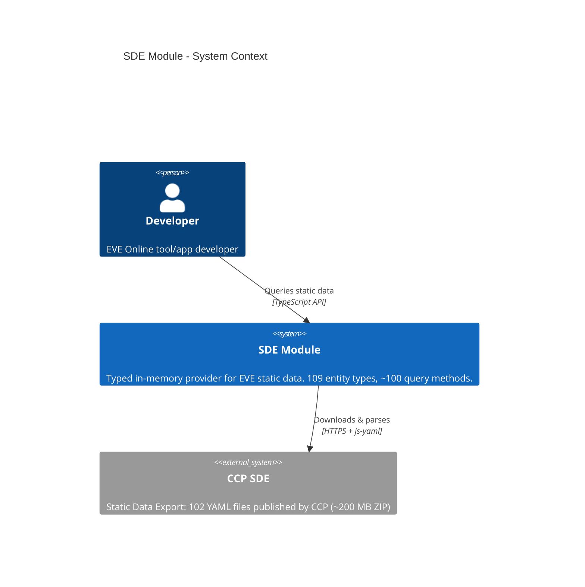
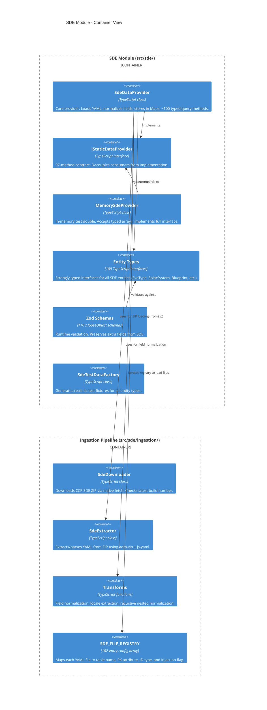
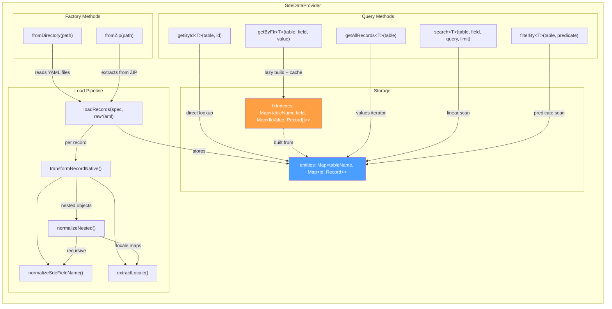
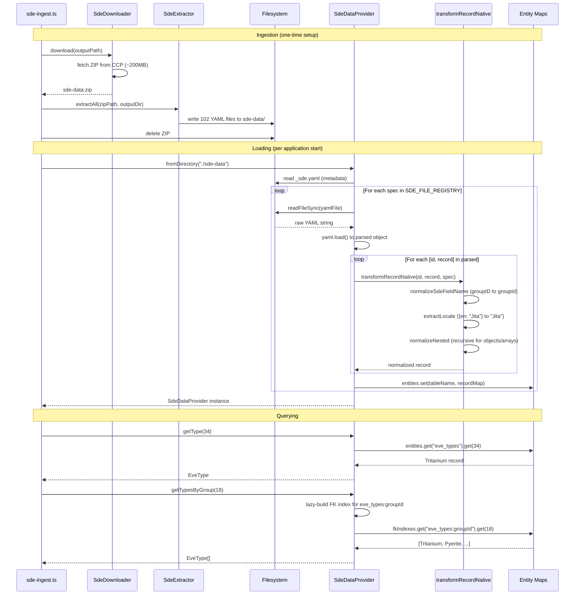
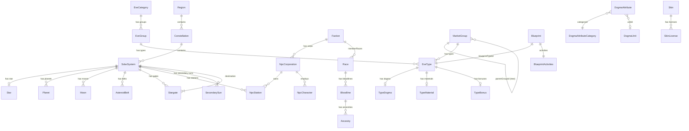
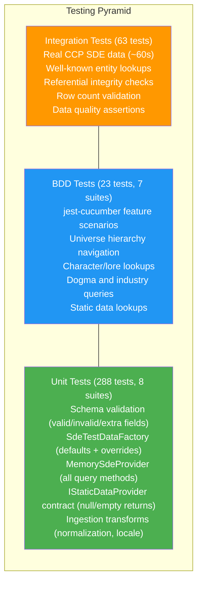

# SDE Module Architecture

The SDE (Static Data Export) module provides typed, in-memory access to CCP's EVE Online static game data. It reads YAML files natively from disk into `Map`-based storage with no database intermediary. 109 entity types, 110 Zod schemas, ~100 typed query methods covering all 102 SDE YAML files.

## 1. System Context (C4 Level 1)



## 2. Container Diagram (C4 Level 2)



## 3. Component Diagram (C4 Level 3) - SdeDataProvider Internals



## 4. Data Flow



## 5. Entity Relationship Diagram



## 6. Key Design Decisions

### YAML-Native, No SQLite

The original design used better-sqlite3 to import SDE YAML into an SQLite database. This was replaced with direct YAML-to-Map loading because:

- **Simpler dependency tree**: No native binary dependency (better-sqlite3 requires node-gyp)
- **No build/import step**: No separate database build required before querying
- **Native JS types**: Objects, arrays, booleans stay as-is instead of being serialized to JSON text columns
- **Acceptable performance**: Full SDE (~500K records) loads in ~60 seconds and fits comfortably in memory (~200MB)
- **Nested structures preserved**: Stargate `destination`, star `statistics`, blueprint `activities` remain native objects

### `z.looseObject()` for All Schemas

CCP may add new fields to SDE YAML at any time. Using `z.looseObject({})` instead of `z.object({})` means:

- Extra/unknown fields pass validation and are preserved on the output
- Consumers can access new CCP fields immediately without waiting for a schema update
- Matches the main ESI SDK's established pattern

### Lazy FK Index Building

Foreign key indexes are built on first query, not at load time:

```
getByFk("eve_types", "groupId", 18)
  -> checks fkIndexes for "eve_types:groupId"
  -> if missing: scans all eve_types, builds Map<groupId, Type[]>, caches it
  -> returns cached result
```

This avoids building indexes for FK relationships that are never queried. Many of the 102 entity tables have FK columns that most consumers never filter by.

### `transformRecordNative` vs `transformRecord`

Two transform functions exist:

| Function | Output types | Use case |
|----------|-------------|----------|
| `transformRecord` | `Record<string, SqliteValue>` | Legacy SQLite path (booleans to 0/1, objects to JSON strings) |
| `transformRecordNative` | `Record<string, unknown>` | YAML-native path (preserves JS types as-is) |

`transformRecordNative` is used by `SdeDataProvider`. Both share field normalization (`groupID` to `groupId`) and locale extraction (`{en: "Jita"}` to `"Jita"`).

### Recursive Nested Normalization

CCP's YAML uses `PascalCaseID` field names at all levels. The `normalizeNested()` function recursively normalizes keys in nested objects and arrays:

```
Raw YAML:    { destination: { solarSystemID: 30000140, stargateID: 50000802 } }
Normalized:  { destination: { solarSystemId: 30000140, stargateId: 50000802 } }
```

This ensures that typed interfaces (e.g., `StargateDestination.solarSystemId`) match the runtime data regardless of nesting depth.

### SDE_FILE_REGISTRY as Single Source of Truth

All 102 YAML files are registered in one array:

```typescript
interface SdeFileSpec {
  yamlFile: string;      // "mapRegions.yaml"
  tableName: string;     // "eve_regions"
  idAttribute: string;   // "regionId"
  idType: 'number' | 'string';
  injectId: boolean;     // true = YAML key becomes the PK field
}
```

`SdeDataProvider.fromDirectory()` iterates this registry and skips missing files silently. This means the provider works with partial SDE extracts and is forward-compatible with new CCP YAML files (add a registry entry and interface).

### Port/Adapter Pattern

`IStaticDataProvider` is the port (97 typed methods). Implementations are adapters:

- **SdeDataProvider** — production adapter, reads YAML from disk or ZIP
- **MemorySdeProvider** — test adapter, accepts typed arrays, no I/O

### Error Taxonomy

SDE errors extend `Error` directly, not `EsiError`. They are local data access errors with no HTTP semantics:

```
Error
  +-- SdeError (base)
        +-- SdeDatabaseError (open/query failures)
        +-- SdeValidationError (Zod validation failures)
        +-- SdeVersionMismatchError (schema incompatibility)
```

Each error class has a corresponding type guard function (`isSdeError`, `isSdeDatabaseError`, etc.).

## 7. Testing Architecture



### Test Infrastructure

| Component | Purpose |
|-----------|---------|
| `SdeTestDataFactory` | Creates realistic test fixtures matching real CCP data structures. One factory method per entity type. `createHierarchicalTestData()` builds a connected graph of entities. |
| `MemorySdeProvider` | Accepts typed arrays via `MemorySdeData`, implements `IStaticDataProvider`. Used in all unit and BDD tests. No file I/O. |
| `IStaticDataProvider` contract tests | Verify null returns for missing IDs, empty arrays for missing FK values, and correct typing on all 97 methods. |
| Integration tests | Load real CCP SDE data via `SdeDataProvider.fromDirectory()`. Skipped automatically when `sde-data/` directory is absent (CI-safe). |

### Running Tests

```bash
npm test -- tests/tdd/sde/                                               # Unit (288 tests, ~1s)
npm test -- tests/bdd/step-definitions/sde/                              # BDD (23 tests, ~1s)
npx jest --config jest.integration.config.cjs -- tests/integration/sde/  # Integration (63 tests, ~60s)
```

## 8. Module File Layout

```
src/sde/
  IStaticDataProvider.ts    # 97-method interface contract
  SdeDataProvider.ts        # Core YAML-backed provider (fromDirectory, fromZip)
  MemorySdeProvider.ts      # In-memory test double
  SdeTestDataFactory.ts     # Test fixture factory
  types.ts                  # 109 entity interfaces
  schemas.ts                # 110 Zod validation schemas
  version.ts                # SdeVersionInfo type
  errors.ts                 # SdeError hierarchy (4 error classes + type guards)
  index.ts                  # Barrel exports
  ingestion/
    constants.ts            # SDE_FILE_REGISTRY (102 entries), CCP URLs
    SdeDownloader.ts        # HTTP download with progress callback
    SdeExtractor.ts         # ZIP extraction and YAML parsing
    transforms.ts           # Field normalization, locale extraction
    index.ts                # Barrel exports
  docs/
    ARCHITECTURE.md         # This file
    API_CONTRACTS.md        # Complete API method reference
    DEVELOPER_GUIDE.md      # Developer guide for contributors
    USAGE.md                # End-user usage guide
```
